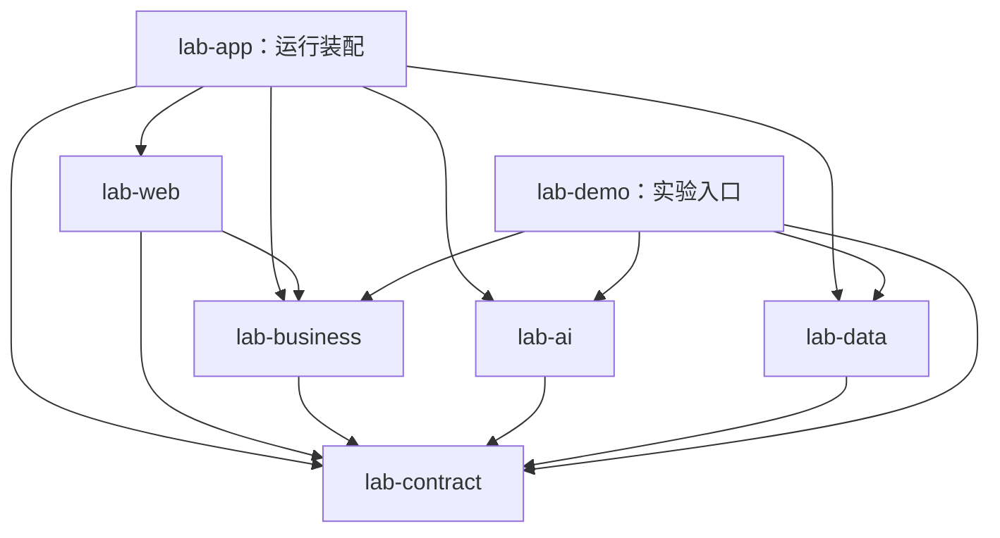
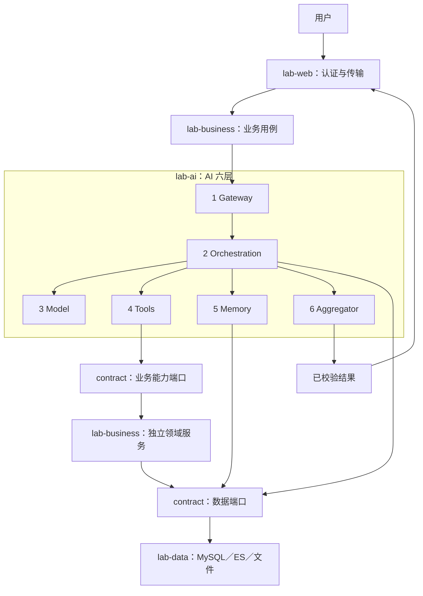
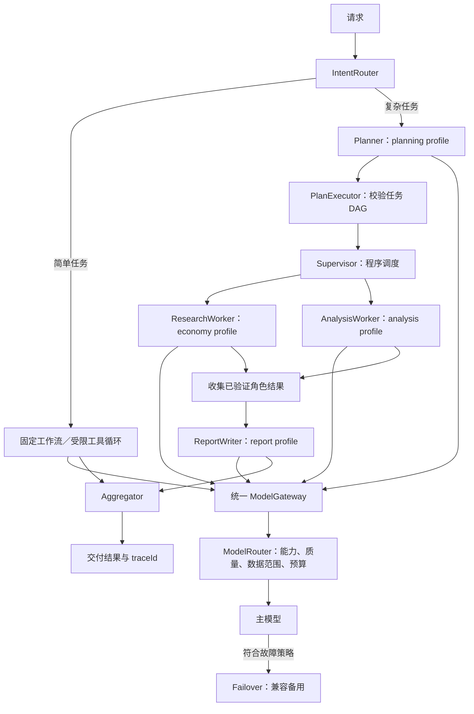
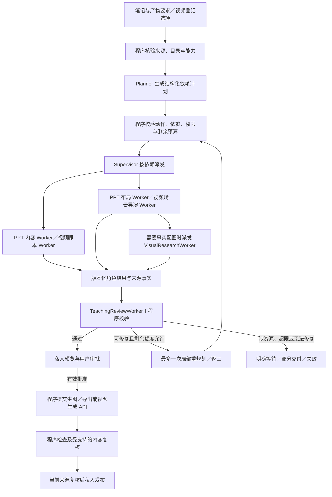

# 多用户个人知识库与 AI 助手：学习验证项目架构与开发约束

> 文档用途：作为后续模型实施开发、验证与交付的依据。参考《AI模型应用开发学习指南（零基础到实践）》。
>
> 修订日期：2026-10-02。当前状态：架构设计，尚未生成项目、完成依赖解析或运行集成测试。
>
> 实施补充（2026-10-04，S02）：章节详情／最新入库元数据、块与原文映射、实际参数策略及逐页报告覆盖已交付；报告受六轮硬预算约束，明确完整或未读范围，不能保证任意长文全读。词元为UTF-8字节保守估计，迁移最新V6；实施事实、限制及下阶段S03交接以[项目开发进展](docs/项目开发进展.md)和[验收报告](docs/测试验证与验收报告.md)为准，原架构P0～P4未全部完成。
>
> 产物规划补充（2026-10-04，仅文档）：S09／S10 改为以复杂 Agent 架构生成笔记 PPT，配图支持生图 API 与事实图片网络搜索；教学视频按预登记角色／配音／场景＋脚本审批＋视频生成 API 预留，与 PPT 同级，暂不阻塞核心交付。当前实现与测试历史不因此改变。
>
> 最终方案：多用户个人知识库与 AI 助手；Java 17 + Spring Boot 3 + LangChain4j + MyBatis-Plus + MySQL 8.4 LTS + Elasticsearch；六个核心 Maven 模块 + 一个实验模块；业务架构与 AI 六层架构分别表达。

> AI 执行方案：固定工作流为主；复杂任务采用受限 Plan-and-Execute，需要分工时使用 Supervisor／Worker 多 Agent，Worker 内可使用受限 ReAct 类工具循环；所有角色统一使用按任务路由、主备故障切换的模型层。

## 0. 开发模型先读：约束等级与不可变边界

- **【必须】**：实施和验收都要满足；不能用提示词、注释或 Mock 结果代替程序约束。
- **【默认】**：本文确定的第一版选择。遇到真实兼容性问题可以做最小调整，但要记录原因、替代方案和验证结果。
- **【扩展】**：后续学习实验，不阻塞核心应用交付；未完成要明确标记。
- **【注意】**：容易误实现的边界或故障条件。

**【必须】以下约束优先于框架示例和自动生成代码：**

1. 使用 Java 17、Spring Boot 大版本 3；不自行升级 Boot 4，不使用 Java 21 虚拟线程。
2. 保持本文七个子模块；父工程仅聚合与依赖管理。新增模块、数据库、中间件或外部写能力属于架构范围变化，应先说明必要性再调整。
3. MySQL 8.4 LTS 是用户、知识库所有权、文档、权限、任务和原文的权威来源；ES 是可重建的全文／向量索引。
4. 持久化 PO、Mapper、SQL、ES Client 都留在 `lab-data`；其他模块通过公共端口访问。禁止返回 PO、Mapper 或 MyBatis-Plus Wrapper。
5. 业务规则不依赖 AI SDK；模型调用统一经过模型层；工具调用经过执行控制；用户可见 AI 内容和产物经过汇聚校验。
6. 用户身份与 ADMIN／USER 角色来自服务端认证上下文。模型输出、客户端提交的 userId／ownerUserId／role 均不能覆盖身份和权限；知识库范围只能由服务端授权生成。
7. AI 保存笔记必须绑定具体目标知识库、参数和来源的用户确认，并通过事务和稳定操作 ID 控制幂等；普通手工 CRUD 按明确用户命令执行，不强制套 AI 确认流程。
8. 不在 MySQL 写事务中调用模型、ES 或其他远程服务。不以跨库写入成功假装存在分布式原子事务。
9. Mock、真实模型、真实数据库、真实协议分开报告；跳过和未运行不能算通过。
10. 本文要求的是完整学习应用，不要求一开始引入微服务、独立网关、Redis、消息队列或大型前端工程。
11. 模型注册、任务选型和主备切换是核心能力，不只存在于 Demo。备用模型必须满足能力、质量、预算和数据范围；不能用切换重新执行已成功的写工具。
12. 主模型负责生成计划或汇总，不直接调用“子模型”。编排器调度步骤／Agent，模型层选择实际模型；同一角色可换模型，不因换模型就新建 Agent。
13. 管理员可读取所有未删除且启用的知识库资料，普通用户只读自己的；管理员修改资料默认也限于自己的知识库。管理员知识检索权不能扩展为读取他人会话、记忆、任务、生成报告或追踪详情。
14. 第一版使用单应用的用户与知识库所有权隔离，不引入组织 tenantId、共享成员或任意文档 ACL。普通用户之间不共享知识库，权限不足默认拒绝。
15. 笔记 PPT 与教学视频是同级的本人私有衍生产物，继承全部来源约束；共用七模块、可靠任务与审批。付费生成绑定预览批准，状态不明不盲目重提；本地取消不等于远程取消／退款。PPT 为本轮交付项，视频为 API 预留项。
16. 切片归属由结构解析和版本化 ID 决定；只检索小片、再受控扩展父段／邻片。当前处理批次、所有实际交付原文范围、权限与总上下文预算必须复核，不能让模型自行猜章节或用 Top-k 冒充整章覆盖。

**阅读／实施顺序：**先读 0／3／5 的边界，知识库入库与检索以 8 章为准，媒体以 6.10 为准；12～14 是表／接口／配置，15～17 是验收与阶段。默认值以对应参数表为唯一来源，概要章节只引用；候选依赖版本不等于兼容性已通过。

**实施默认值：**单 Boot 应用 + MySQL 8.4 LTS 单节点 + 单节点 ES；Worker 可同进程运行。管理员邀请／创建用户，各用户维护独立个人知识库；先完成可运行闭环，再补学习 Demo。没有已有项目代码或数据库，本次属于设计基线调整，不执行真实数据库降级／迁移。


## 1. 项目目标与功能范围

### 1.1 产品定位与核心功能

项目是“多人使用、各自维护、管理员统一检索”的个人知识库平台。一个用户可以建立多个知识库，如学习笔记、技术资料、项目文档；一个知识库第一版只有一个所有者，不允许所有权转移。不是多人共同编辑一个共享知识库；成员／共享授权为后续明确扩展。

| 功能 | 用户操作示例 | 最终行为 |
|---|---|---|
| 账号与用户管理 | 管理员创建普通用户，用户登录 | 正式身份认证；被禁用账号无法发起新请求 |
| 知识库管理 | 建立“Java 学习”“AI 学习”知识库 | 设置名称／描述，管理自己的库；普通用户不看他人列表 |
| 文档管理 | 上传笔记、查看原文、目录或切片、修订或删除 | 第一版 TXT／Markdown；绑定目标知识库，原文／结构／处理批次可追溯，异步入库有明确状态 |
| 知识问答 | “这些笔记里的 RAG 注意事项有哪些？” | 授权小片召回＋父段／邻片补背景；有效引用可定位原文；整章总结另走覆盖读取 |
| 管理员跨库检索 | 选择全部或指定用户／知识库 | 管理员只读检索他人资料；结果标明知识库、来源和版本 |
| 多轮对话 | “再解释刚才第二篇文档” | 使用本人会话，重新检查文档／来源权限；不能伪造知识库范围 |
| AI 保存笔记 | “把这次总结存到我的 AI 学习库” | 展示目标、内容和来源，确认后保存，重复请求只产生一份文档 |
| FAQ／研究报告 | “对比这几个库，生成专题报告” | 持久化任务，暂停／恢复／取消／重启继续，校验后由请求者下载 |
| 笔记生成 PPT | “把我的 RAG 笔记做成教学演示文稿” | 大纲／内容／版式与混合来源配图，审批后生图并导出可编辑 PPTX，私人下载 |
| 笔记生成教学视频（预留） | 选择已登记角色、配音和场景，把笔记生成教学视频 | 根据选择和笔记生成脚本，审批后调用真正的视频生成 API；当前未接 API |
| 数据分析 | “统计我的资料入库情况” | 程序统计授权范围，模型解释；分析质量不由模型价格直接证明 |
| 个人记忆 | “以后回答简洁些” | 用户授权保存偏好，可查看、更正、删除，不跨用户使用 |
| 模型路由／主备 | 检索摘要选经济模型，复杂分析选强模型 | 统一路由与有限主备切换，保留每次选择原因与费用 |
| 运行检查／实验 | 查看执行图或运行 Demo | 树／时间线／流程图、用量／错误及固定输入的验收报告 |

**【默认】**轻量 HTML + 原生 JavaScript，至少有登录、知识库／文档、聊天、任务／确认（含 PPT 页面／配图与预留视频脚本／登记项／费用预览）、个人记忆、运行检查；管理员额外看到用户管理和检索范围选择。界面权限来自服务端，隐藏按钮不能代替后端授权。

### 1.2 角色与操作权限矩阵

| 资源／操作 | 普通用户 USER | 管理员 ADMIN |
|---|---|---|
| 知识库列表、检索、文档详情／原文／引用 | 本人的知识库 | 所有启用且未删除的知识库 |
| 文档统计／资料对比 | 本人的范围 | 可以选本人／指定库／全部 |
| 新建知识库 | 自己所有 | 自己所有，不能代他人直接建库 |
| 上传、修订、删除文档／库、保存 AI 笔记 | 自己所有 | 默认也仅自己所有 |
| 会话、个人记忆、任务、确认、生成报告／产物、运行详情 | 本人的资源 | 默认也仅本人的资源 |
| 创建用户、禁用／恢复用户 | 不允许 | 允许；普通账号不得自行提升角色 |
| 模型价格、服务配置、系统汇总指标 | 不允许 | 服务端管理配置；汇总不暴露他人聊天与资料内容 |

管理员跨知识库的权限是**资料读取与检索权限**，不是所有资源的全局旁路。读取原文／引用／源文件下载同属知识读取；生成报告、聊天历史、追踪摘要不属于源知识库。未知角色、缺身份、禁用账号默认拒绝。[授权设计依据](https://cheatsheetseries.owasp.org/cheatsheets/Authorization_Cheat_Sheet.html)

管理员禁用某用户不删除其资料；该用户不能登录或继续任务，管理员仍可读取其启用且未删除的知识库。知识库禁用／删除则对所有角色停止读取。第一版角色提升／降级只能由受控管理入口执行，不得禁用／降级最后一个有效管理员；同样使权限版本、已有登录与后续请求及时失效。

### 1.3 统一授权范围：KnowledgeAccessPolicy

`KnowledgeAccessPolicy` 放 business/domain；通过 `KnowledgeCapabilityPort` 向 AI 暴露窄能力。AI、数据、API、文件和 Demo 均使用同一规则，不各写一套 `isAdmin`。

输入是可信 UserContext + 请求的 scopeMode／knowledgeBaseIds／owner 筛选；输出是服务端生成的 `AuthorizedKnowledgeScope`：

- `SELF`：当前用户所有启用知识库，所有角色默认。
- `SELECTED`：指定有限知识库，逐项校验；普通用户全部属于本人，管理员可选任意启用库。
- `ALL`：仅管理员可请求所有启用库；普通用户请求直接 ACCESS_DENIED。
- 管理员 owner 筛选只能缩小已授权范围；普通用户不能提供他人 ownerUserId 扩大范围。
- 混合合法／越权 ID 的请求整体拒绝，不悄悄只留下合法部分；缺省 SELF，空集合明确表示零范围，不得解释成全部。
- Scope 记录 actorUserId、mode、选择条件、权限版本／生成时刻，不把用户输入原样当授权证明；范围过大要限制选择数量／分页。
- 管理员 ALL 使用受控范围标识，由 data 生成启用／删除等查询条件，避免一次枚举无限知识库 ID；SELECTED 则明确限定 ID。

RAG 两路召回、文档列表／详情、原文下载、引用、统计、FAQ／报告／PPT／视频、保存笔记及恢复步骤都复核当前身份与范围。用户禁用／角色改变、知识库状态或资料版本改变后，历史 Scope 不再是永久授权。写权限单独按知识库 owner 校验，不复用管理员 ALL 读取范围。

### 1.4 衍生内容和来源权限

管理员基于他人资料生成的答案、报告和 AI 笔记属于管理员本人的输出，不自动公开给源知识库所有者或其他用户。AI 笔记只能保存到管理员自己的库，普通用户同理；记录 `sourceDependencies`（知识库、文档、版本）用于后续授权复核。引用其他衍生内容时，服务端合并、去重其原始来源依赖；设置来源数量与递归深度上限并拒绝依赖环，不能通过多次生成笔记隐藏他人的来源。

读取／再次检索衍生内容、加载相关对话摘要或预览／下载报告、PPT、图片、视频、脚本时，重新检查当前用户对必要来源的访问；角色降级、来源禁用／删除后，不能仅因为输出归本人就继续自动返回他人资料。无法复核则标记 RESTRICTED、过滤该内容／通知不可用；缓存同步失效。手工笔记与 AI 衍生笔记区分，用户编辑不能自行清除服务端来源约束。

这项规则防止后续系统继续暴露已撤销内容，不能撤回此前已合法下载／看到的资料。直接知识读取和衍生来源校验共同构成完整权限边界。

### 1.5 正式登录与管理员创建用户

固定教学令牌仅在 dev／demo 使用；实际多人应用必须提供登录、退出、修改密码和管理员创建用户，默认不开放匿名注册。

**【默认】**使用密码登录 + 有期限的服务端随机 Bearer token。密码使用 Spring Security PasswordEncoder 单向哈希；token 高强度随机生成，只在签发时返回，服务端保存 token 哈希、用户 ID、到期与撤销状态；不放 URL／日志。第一版前端 token 只保存在内存，刷新后重新登录；后续若改 Cookie 会话必须同时启用 CSRF 与适当 Cookie 策略。[密码存储](https://docs.spring.io/spring-security/reference/servlet/authentication/passwords/password-encoder.html)

UserContext 由当前有效登录与数据库用户状态／角色生成；每次请求重新核验启用状态与权限版本。禁用／改密码／角色改变撤销已有登录；后台任务在每步及最终交付重新检查请求者，禁用后停止新模型／工具操作，按安全边界终止，不撤销已提交副作用。

首个管理员通过显式一次性 bootstrap 配置从环境变量创建，只允许空系统初始化；不得在迁移中保存默认明文密码。管理员创建普通用户时只返回一次临时密码并要求首次修改，列表／详情不返回密码哈希或 token。防止登录无限尝试，使用现有有界限流，不增加独立认证服务。

### 1.6 范围划分

- 核心：七模块、正式认证／用户管理、自有知识库 CRUD（TXT／Markdown）、管理员只读跨库、章节树／父段／小片、授权上下文扩展 RAG／来源、模型注册／任务路由／主备、工具、确认保存笔记、可靠任务、个人记忆、可视化、评测。
- 复杂任务：最小受限规划与检索／分析两角色；分析数值来自程序。PPT 内容／布局 Worker 共享稳定页标识，配图用生图 API 或受控网络搜索；每任务最多两个 Worker 并行。视频另按登记角色／配音／场景与批准脚本对接视频生成 API，当前预留。
- 扩展：共享知识库成员与 ACL、所有权转移、更多 Agent／编排、质量升级、MCP、PDF／DOCX／CSV／XLSX／OCR／其他多模态／训练／本地推理，以及额外媒体提供方对照。PPT 的生图／事实图片搜索属于 P4 本轮交付；同级教学视频为预留功能，不作为 PPT 子能力或仅归 P6。
- 不建设企业工单／订单业务，不因管理员权限引入一个用户一个数据库／ES 索引，也不新增组织租户模块。

## 2. 技术基线、版本管理与部署形态

### 2.1 技术基线

以下是本次核对公开资料后选定的候选基线，**不是已经构建通过的版本组合**。第一次实施必须实际解析依赖、拉取镜像并完成联调。

| 项目 | 默认选择 | 说明 |
|---|---|---|
| Java／构建 | Java 17、Maven Wrapper 3.9.x | 编译 `release=17`；父工程 `packaging=pom` |
| 应用框架 | Spring Boot 3.5.16、Spring MVC | Boot 3、Spring Security 6、`jakarta.*`、Jackson 2；使用 `SseEmitter` |
| AI | LangChain4j BOM 1.20.2 | 核心与所需模型提供方；支持多个注册模型，同一供应商也可提供主备；部分扩展为 1.20.2-beta30，由 BOM 决定 |
| SQL 数据库 | **MySQL 8.4 LTS，候选补丁 8.4.12** | 用户明确选定 8.4；Compose／Testcontainers 固定同一补丁，驱动／Flyway 实际验证后记录 digest；不默认改回 9.x 或 8.0 |
| 数据访问 | MyBatis-Plus 3.5.17 Boot 3 Starter | 常规 CRUD；并发领取、版本比较、幂等提交用明确 SQL |
| 迁移 | Flyway Core + MySQL 数据库模块 | 驱动、Flyway 两模块与目标 MySQL 版本成套验证 |
| 搜索 | Elasticsearch 9.5.4 + Java API Client 9.5.4 | 显式配置官方客户端；BM25、dense_vector、kNN；Java 实现 RRF |
| 缓存／任务 | Caffeine、有界线程池、MySQL 队列与 Outbox | 单实例默认；Java 17 平台线程，禁止无限线程或无界队列 |
| 观测 | Actuator、Micrometer Observation、OpenTelemetry | 模型监听 + 自定义步骤埋点；可配置导出至 Langfuse |
| 可视化 | 本地运行检查页；可选 Langfuse 后端 | 本地无需新增数据库；外部观测接入按 11 章验收 |
| API／测试 | springdoc-openapi 2.9.1；JUnit 5、MockMvc、Mockito、Testcontainers、ArchUnit | 程序行为、真实存储、模块边界和模型效果分别验收 |
| 演示文稿 | Java 受控可编辑 PPTX 导出、中文字体、IMAGE_GENERATION 与网络图片搜索 | 库与 Java 17 兼容性在实施时核对；真实可编辑文件和两类配图分别验收 |
| 教学视频（预留） | VIDEO_GENERATION API、登记角色／配音／场景目录 | 脚本审批后调用 API；暂缺服务，明确不可用，不替换为本地合成 |
| 扩展 | LangGraph4j、LangChain4j MCP、PDFBox 3.x | LangGraph4j 原候选 1.9.2，按 Java 17 兼容性独立验证 |

版本来源：[Boot 3.5 要求](https://docs.spring.io/spring-boot/3.5/system-requirements.html)、[LangChain4j 发布](https://github.com/langchain4j/langchain4j/releases)、[MyBatis-Plus 安装](https://baomidou.com/getting-started/)、[MySQL 8.4 发布记录](https://dev.mysql.com/doc/relnotes/mysql/8.4/en/)与[LTS 策略](https://dev.mysql.com/doc/refman/8.4/en/mysql-releases.html)、[ES 下载版本](https://www.elastic.co/downloads/elasticsearch)、[ES Java Client 发布](https://github.com/elastic/elasticsearch-java/releases)、[springdoc v2](https://springdoc.org/v2/)。

### 2.2 Maven 与依赖约束

**【必须】**

- 父 POM 使用 Boot 3 Parent 或等价 BOM 管理，集中管理版本与插件，导入 LangChain4j BOM；子模块只声明自身需要的依赖。
- 只在 `lab-ai` 引入 LangChain4j SDK；只在 `lab-data` 引入 MyBatis-Plus、MySQL 驱动、Flyway、ES Client。
- `lab-contract` 保持纯 Java 契约。HTTP Bean Validation 注解放 `lab-web` 的请求对象；不在契约中放 Spring、SDK、ORM 类型。
- 不同时引入普通 MyBatis Starter 和 MyBatis-Plus Starter；不引入 Boot 4 Starter；不引入 Spring Data Elasticsearch 作为第二套数据访问。
- 不强制将所有 LangChain4j 模块版本设为 1.20.2。基础版使用手工 Bean 装配，避免 Starter 隐式绕过统一入口。
- ES Client／transport 与 Jackson 组合必须查看实际依赖树并验证序列化；不能只因下载成功就认定兼容。9.x 默认采用 Rest5Client，显式使用与 Boot 3 Jackson 2 兼容的 JsonpMapper；不照搬旧 RestClient 隐式依赖的 8.x 示例，也不为了 SDK 自动改成 Boot 4／Jackson 3。[客户端安装](https://www.elastic.co/docs/reference/elasticsearch/clients/java/setup/installation)、[Transport／Mapper](https://www.elastic.co/docs/reference/elasticsearch/clients/java/transport)
- 普通库模块产生普通 JAR；只有 `lab-app` 和 `lab-demo` 执行 Boot repackage，互不依赖可执行 JAR。
- 明确注册跨模块配置、Mapper 扫描和资源位置；每模块资源使用独立路径，避免多个同名 `application.yml` 或扫描不完整。

最小依赖分布：`lab-web` 使用 Web／Validation／Security／OpenAPI；`lab-business` 仅必要的 Spring 组件支持；`lab-ai` 使用 LangChain4j、观测 API 与必要 Spring 支持；`lab-data` 使用数据库／迁移／搜索依赖；`lab-app` 管理 Actuator、观测桥接与运行装配；`lab-demo` 管理 CLI、数据样本与评测。Caffeine 放到实际缓存实现所属模块，不能成为数据库访问旁路。

**【注意】**基础版由应用统一创建一个 ObservationRegistry／Tracer 与一次导出管线。不要同时启用 Java Agent、框架自动埋点和手写同层埋点，导致模型调用重复计数。OpenTelemetry／Micrometer 的实际版本优先由 Boot 管理并联调；SDK、桥接器、导出器固定验证后的版本。

### 2.3 部署与运行边界

```text
浏览器／CLI
    → lab-app（装配 web + business + ai + data）
    → MySQL：业务／状态／原文
    → ES：全文／向量索引
    → 外部模型提供方（real 模式）
    → 演示文稿：受控 PPTX 导出＋生图 API／网络图片搜索；教学视频：预留 VIDEO_GENERATION API
    → 可选观测后端 Langfuse

lab-demo：独立 CLI 入口，复用 business + ai + data，不依赖 lab-app
```

API 与 Worker 默认同进程；后续可以同一应用 JAR 用 `api / worker` Profile 分开运行，任务可靠性仍来自数据库。单实例 Caffeine 限流不宣称支持分布式额度；多实例时需要共享额度与并发验收，不能直接扩大部署。

外部观测后端是独立支撑系统，不改变业务数据库选型。Langfuse 自托管还涉及 PostgreSQL、ClickHouse、Redis／Valkey、S3 兼容存储等组件，因此不纳入默认两数据库 Compose；可接已有实例，或单独配置可选部署。[Langfuse 架构](https://langfuse.com/handbook/product-engineering/architecture)

## 3. 七个 Maven 模块：职责、对象归属和依赖方向

### 3.1 总览

| 模块 | 主要职责 | 可以包含 | 禁止包含 |
|---|---|---|---|
| `lab-contract` | 跨模块契约与端口 | 公共 DTO／VO、枚举、错误码、身份上下文、窄能力接口、存储接口、数据快照 | PO、Mapper、SDK 类型、业务实现、Spring 装配 |
| `lab-data` | 统一数据与文件访问 | PO、Mapper／XML、SQL、端口实现、Flyway、ES 索引／检索、受控文件／图片资产与可编辑 PPTX 导出 | 业务用例编排、提示词、模型调用、Controller |
| `lab-business` | 业务用例与领域规则 | Account／KnowledgeBase／Document／Video 用例、KnowledgeAccessPolicy、领域服务、业务能力适配器 | AI SDK、Mapper、ES Client、模型工具循环 |
| `lab-ai` | AI 六层能力 | Gateway／Orchestration／Model／Tools／Memory／Aggregator、提示词、工具注册、AI 埋点 | Controller、PO、Mapper、直接 SQL／ES、业务规则实现 |
| `lab-web` | HTTP 与页面接入 | Controller、HTTP DTO、认证过滤器、异常映射、SSE、静态页面 | 业务规则、提示词、模型 SDK、数据查询实现 |
| `lab-app` | 运行装配与配置 | Boot 主类、配置属性、Bean 装配、线程池、Profile、Actuator、导出器 | 核心业务算法、AI 编排实现、Mapper 方法 |
| `lab-demo` | 独立学习实验与评测 | CLI 主类、Demo Registry、教学数据、故障注入、JSONL、报告 | 第二套正式业务实现、生产应用对它的依赖 |

父工程是聚合 POM，**七个子模块不包括父工程**。不额外设置 entity、common、gateway、tool 或 integration-test 模块。

### 3.2 对象放在哪里

| 对象 | 归属 | 例子 |
|---|---|---|
| 持久化对象 PO | `lab-data`，不对外返回 | KnowledgeBasePO、MessagePO、TaskPO |
| 领域对象 | `lab-business` | KnowledgeBase、KnowledgeAccessPolicy、DocumentPolicy |
| 跨模块输入／输出 | `lab-contract` | AiRequest、AiResult、KnowledgeBaseSnapshot、TaskSnapshot |
| HTTP 参数与展示对象 | `lab-web`；真正共享才提升到 contract | ChatHttpRequest、ApprovalDecisionHttpRequest |
| AI 内部状态 | `lab-ai` | Plan、ToolDescriptor、CandidateAnswer、ExecutionBudget、ModelTurn（含内部 SDK 续轮状态） |
| LangChain4j 模型消息与工具类型 | `lab-ai.model / tools` 内部 | ChatRequest、ToolSpecification 的适配实现 |
| SDK 外的共享结果 | `lab-contract` | UsageSummary、ToolOutcome、EvidenceBundle／结构快照，仅确需跨模块时；不含 SDK 消息 |
| 数据转换 | 各边界所属模块 | data：PO → Snapshot；business：Snapshot → Domain；web：HTTP DTO → Command |

**【注意】**contract 不是所有类的集中仓库。只有多个模块需要共同理解的契约放进去；不为纯内部 DTO 制造公共依赖。PO 不继承公共 DTO，VO 不直接复用 PO；暂不引入 MapStruct／Lombok 也能完成转换。

公共端口保持窄而明确：`AiGatewayPort`、`KnowledgeCapabilityPort`、`MediaCapabilityPort`、`MediaRenderPort`、`MediaJobStorePort`、`KnowledgeBaseRepository`、`DocumentStorePort`、`DocumentContextPort`、`DocumentIngestionStorePort`、`KnowledgeSearchPort`、`KnowledgeIndexPort`、`UserStorePort`、`AuthTokenStorePort`、`MemoryStorePort`、`TaskStorePort`、`OperationStorePort`、`ArtifactStorePort`、`TraceRecordPort`。按实际用例增加，禁止万能 `BaseService`、`Map<String,Object>` 贯穿全部边界或通用远程执行接口。

### 3.3 编译期依赖：唯一允许的方向

```text
lab-contract → 无内部模块
lab-data     → lab-contract
lab-business → lab-contract
lab-ai       → lab-contract
lab-web      → lab-business、lab-contract
lab-app      → lab-web、lab-business、lab-ai、lab-data、lab-contract
lab-demo     → lab-business、lab-ai、lab-data、lab-contract
```



**图中箭头表示 Maven 编译依赖，不是运行调用顺序。**业务与 AI、业务与数据都通过 contract 接口在运行时衔接，不互相依赖实现模块。

示例装配：`AssistantApplicationService` 注入 `AiGatewayPort`，实际对象来自 ai；`KnowledgeTool` 注入 `KnowledgeCapabilityPort`，实际对象是 business 的 `KnowledgeCapabilityAdapter`；后者只调用独立的 `KnowledgeBaseService`，不能回调 `AssistantApplicationService`。KnowledgeBaseService 注入 KnowledgeBaseRepository，实际对象来自 data。

**【必须】**验证编译依赖无环，禁止 Spring 循环引用开关和 `@Lazy` 掩盖错误依赖。用 ArchUnit 检查 SDK／PO／Mapper 不越界，并检查 data／business／ai 不反向依赖 app、web、demo。

### 3.4 各模块实施细则

- **contract**：稳定、不可变、框架无关。端口中的身份与范围不可缺省；日期、分页、错误语义清晰，集合不可随意修改。
- **data**：PO 转为 Snapshot，资源查询应用用户／知识范围；原文映射、入库持久事实与确认消费均通过窄端口和短事务保存。媒体目录／预览／操作／资产仍存 data；MediaRenderPort 负责受控 PPTX 导出、文件检查／存储与网络图片取回，不调用生成模型。
- **business**：账户、资料和统一授权策略负责身份／所有权／版本／来源；PresentationApplicationService 与预留 VideoApplicationService 分别管理同级用例、预览和归属，独立 MediaCapabilityAdapter 核验导出／产物命令，不回调发起 AI 的 Application。教学角色不参与 ADMIN／USER 权限判断。
- **ai**：六层遵循 5.2；RAG、PPT 内容／布局及预留视频脚本编排在 orchestration，搜索经受控 tools；生图及预留视频生成 API 在 model，经 ModelGateway 的媒体入口管理能力、数据策略与费用，不假定提供方都有 SDK 原生适配。
- **web**：认证过滤器调用 Account 用例读取当前登录／用户状态并建立可信 SecurityContext；提供登录／管理员用户管理／知识库页面。既不注入 AI 实现也不调 data；普通 CRUD 和 AI 请求分别传输。密码哈希实现由受控 PasswordEncoder 组件提供，不回传 HTTP。
- **app**：装配认证／授权、模型与工具、Worker／追踪、媒体提供方和目录；校验受控主题／布局／中文字体、搜索／网络地址策略及有限导出池。各模块维护自身配置属性，短事务仍在 data，不把核心业务写在启动模块。
- **demo**：复用正式模块的接口与实现，独立入口和数据集。纯单元测试仍放各模块的 `src/test`；跨模块端到端测试放 app／demo 的测试目录，无须再建测试模块。

## 4. 工程目录与资源布局

```text
ai-learning-lab/
├─ pom.xml                         # 父 POM、七模块、版本／插件管理
├─ mvnw / mvnw.cmd / .mvn/
├─ README.md                       # 中文文档导航
├─ compose.yaml                    # 仅 MySQL + ES，固定版本
├─ .env.example                    # 无真实密钥，数据库／容器样例
├─ docs/
│  ├─ 项目说明与使用介绍.md        # 定位、模块、业务流程与使用方式
│  ├─ 项目开发进展.md              # 阶段、能力状态、验收与新会话交接
│  ├─ 前端接口与联调说明.md        # 已实现协议、状态和客户端示例
│  ├─ 部署配置与运行维护.md        # 环境、版本、启动和恢复
│  ├─ 测试验证与验收报告.md        # 实际结果、历史证据与限制
│  └─ 缺陷修复与变更记录.md        # 集中的发现、修复与关闭
├─ lab-contract/src/main/java/com/example/ailab/contract/
│  ├─ context/                     # UserContext、RequestContext
│  ├─ dto/                         # 库／文档快照、AuthorizedKnowledgeScope、AI 请求／结果
│  ├─ port/                        # AI／业务能力／存储端口
│  └─ error/                       # 错误码、枚举、无框架异常
├─ lab-data/src/main/
│  ├─ java/com/example/ailab/data/
│  │  ├─ persistence/po/           # PO
│  │  ├─ persistence/mapper/       # Mapper、明确事务 SQL
│  │  ├─ repository/               # contract 数据端口实现
│  │  ├─ transaction/              # 原子提交、领取／CAS／幂等
│  │  ├─ search/                   # ES 查询、索引、RRF
│  │  ├─ storage/                  # 上传／产物文件访问
│  │  ├─ media/                    # 受控 PPTX 导出／资产文件／图片取回，MediaRenderPort
│  │  └─ config/
│  └─ resources/
│     ├─ db/migration/             # 唯一生产迁移路径
│     ├─ mapper/                   # Mapper XML
│     └─ es/                      # 索引 mapping／模板
├─ lab-business/src/main/java/com/example/ailab/business/
│  ├─ application/                # Account／KnowledgeBase／Assistant／Document／Task／Video 用例
│  ├─ domain/                     # KnowledgeAccessPolicy、库／文档规则、领域服务
│  └─ capability/                 # KnowledgeCapabilityAdapter、独立 MediaCapabilityAdapter
├─ lab-ai/src/main/
│  ├─ java/com/example/ailab/ai/
│  │  ├─ gateway/
│  │  ├─ orchestration/            # workflow／planner／executor／supervisor／agents／worker；rag 解析／切片／扩展
│  │  ├─ model/                    # registry／routing／failover／LangChain4j、媒体 provider 与 Mock 适配
│  │  ├─ tools/                    # registry／policy／executor／adapter
│  │  ├─ memory/
│  │  ├─ aggregator/
│  │  └─ observability/            # AI 步骤与模型监听
│  └─ resources/ai/
│     ├─ prompts/                 # 带版本提示词
│     └─ skills/faq/SKILL.md
├─ lab-web/src/main/
│  ├─ java/com/example/ailab/web/
│  │  ├─ controller/
│  │  ├─ dto/
│  │  ├─ security/
│  │  ├─ exception/
│  │  └─ sse/
│  └─ resources/static/            # 登录、用户管理、知识库／文档、聊天、任务／PPT与预留视频预览／运行页
├─ lab-app/src/main/
│  ├─ java/com/example/ailab/app/   # 主类、装配、Properties、Exporter
│  └─ resources/application*.yml   # api／worker、mock／real 等配置
├─ lab-demo/src/main/
│  ├─ java/com/example/ailab/demo/  # 主类、Registry、Demo、Evaluator
│  └─ resources/demo/              # demos.yml、fixtures、eval JSONL
├─ 每模块/src/test/                # 本模块测试；app 包含装配与集成测试
└─ var/                            # uploads、artifacts、runs，不提交
```

目录是实施边界，不要求为每个名词生成空接口／工厂／实现。启动类不能仅扫描 app 包而漏掉其余模块；推荐各模块提供明确配置，由 app／demo 导入，Mapper 只扫描 data。

**【必须】**普通启动不自动插入教学用户或删除表；固定教学数据只在显式 demo／dev 配置导入。迁移默认只创建结构，索引模板由受控初始化命令建立，不在每次启动时销毁重建。


## 5. 两套架构：业务分层与 AI 六层

### 5.1 业务架构

| 层 | 模块 | 职责 |
|---|---|---|
| 接入 Controller | lab-web | HTTP、参数格式、认证入口、错误映射和 SSE 传输 |
| Application | lab-business/application | 组织业务用例；需要 AI 时调用 AiGatewayPort |
| Domain | lab-business/domain | 用户角色、库所有权、只读管理员范围、AI 笔记／来源规则、资料有效性与状态不变量 |
| Infrastructure | lab-data | 实现存储、索引、文件与原子提交端口 |
| Composition Root | lab-app | 将上述接口与实现装配成应用 |

业务层是逻辑分层，不等同于一层一个 Maven 模块。普通文档查询可以直接由业务用例执行，无须启动模型。Domain 依据程序状态作决定，不能信任模型自行声称的资源归属和执行成功。

### 5.2 AI 能力六层

| AI 层 | 必要组件 | 职责与边界 |
|---|---|---|
| 1. Gateway | AiGateway、AiAccessPolicy、AiRateLimiter、SessionRouter | 校验 AI 能力权限、限流／预算、会话归属；接收可信身份，不定义知识库访问／写入规则 |
| 2. Orchestration | IntentRouter、Planner、PlanExecutor、Supervisor、AgentRegistry、BoundedToolLoop、TaskWorker | 按任务选择固定流程或受限规划，调度角色／步骤，等待确认、持久恢复和全局预算 |
| 3. Model | ModelGateway、ModelRegistry、ModelRouter、ModelFailoverPolicy、ModelHealthTracker、LangChain4jAdapter、MockAdapter | 统一 chat／stream／embedding；按角色／任务选模型，能力／质量／数据范围筛选，有限重试、主备切换、冷却与计量 |
| 4. Tools | ToolRegistry、ToolExposurePolicy、ToolExecutionService、业务／检索工具 | 定义注册、按请求暴露、校验和执行；通过端口调用业务，不直接访问数据库 |
| 5. Memory | ConversationMemoryService、ProfileMemoryService | 短期历史、摘要、长期偏好；隔离、来源、授权、过期、删除 |
| 6. Aggregator | ResultAggregator、CitationValidator、BusinessResultValidator、OutputSafetyPolicy、FallbackAssembler | 校验候选结果、引用、执行事实、敏感内容；交付或返回有限修复指令 |

**【必须】**六层是职责划分，不是六个 Maven 模块，也不是固定按 1→2→3→4→5→6 顺序执行。Model、Tools、Memory 是编排按需调用的并列能力；Aggregator 是 AI 结果交付出口。Gateway 初版是进程内组件，无需 Spring Cloud Gateway。



Model、Tools、Memory 的结果返回编排层；图中省略返回箭头。模型供应商、观测、配置等支撑能力不算第七个 AI 层。

**【注意】**SessionRouter 定位会话；IntentRouter 选择任务；ModelRouter 选择模型。PlanExecutor 决定执行顺序；ToolExecutionService 执行一个具体工具。知识文档不是长期画像；检查点不是聊天历史。Domain 检查业务合法性；Aggregator 检查生成结果可交付性。

### 5.3 关键端口与结果约定

以下是逻辑契约，不承诺框架中存在同名 API；实施时以当前 SDK 实际接口适配。

| 接口 | 归属 | 输入／输出与强制约束 |
|---|---|---|
| AiGatewayPort | contract，由 ai 实现 | AiRequest + UserContext → AiResult／应用事件；能力权限与会话校验先行 |
| KnowledgeCapabilityPort | contract，由 business 实现 | 计算／复核授权 Scope、读取文档／统计、准备／提交 AI 笔记；返回业务事实；不回调智能问答用例 |
| KnowledgeSearchPort | contract，由 data 实现 | 问题／查询向量＋AuthorizedKnowledgeScope → 小片候选；两路 ES 过滤，MySQL 复核当前权限／资料版本／activeProcessingRevision，不自行调用模型 |
| DocumentContextPort | contract，由 data 实现 | 授权文档／章节／父段／邻片／范围 → 原文和位置映射；同文档／版本／处理批次，返回真实 included 范围 |
| DocumentIngestionStorePort | contract，由 data 实现 | 处理批次／结构／块的短事务、状态／租约／CAS 激活；不在内部解析或调用 embedding |
| KnowledgeIndexPort | contract，由 data 实现 | 版本化块与向量 → 索引写入结果；幂等与旧事件处理 |
| MemoryStorePort | contract，由 data 实现 | 按知识库／用户／会话读写；不能缺少隔离范围 |
| TaskStorePort | contract，由 data 实现 | 创建、领取、续租、CAS 更新、检查点；明确原子状态变更 |
| OperationStorePort | contract，由 data 实现 | 具体写命令的原子提交，合并确认消费／权限条件／幂等结果 |
| TraceRecordPort | contract，由 data 实现 | 脱敏运行摘要／节点记录；供本地检查页使用 |
| ArtifactStorePort | contract，由 data 实现 | 临时产物、发布、读取；归属与任务状态校验 |
| MediaCapabilityPort | contract，由 business 实现 | 校验当前用户、任务／预览版本／确认／来源后的导出与私人产物命令；不回调发起 AI 的 PPT／视频 ApplicationService |
| MediaRenderPort | contract，由 data 实现 | 可编辑 PPTX 导出、资产／文件检查；仅服务端布局、素材 ID 与 storageKey，不接命令或任意路径 |
| MediaJobStorePort | contract，由 data 实现 | 外部媒体子操作／提交意图／providerJobId／用量／状态的 CAS 与查询；不是媒体模型调用接口 |
| ModelGateway | ai 内部 | ModelCallContext＋输入 → generate／stream／embed，含媒体能力入口；按策略选择，返回续轮消息／用量／结束原因，能力分开验收 |
| ResultAggregator | ai 内部 | 候选 + 证据 + 执行事实 → 已校验结果／修复请求／安全失败 |
| Evaluator | demo 内部 | 固定样本 + 版本化配置 → PASS／FAIL／SKIPPED 与证据 |

**共享上下文：**UserContext 包含服务端确认的 userId、ADMIN／USER 角色、启用状态、能力摘要和 permissionVersion；RequestContext 包含 requestId、traceId、sessionId／taskId。AiRequest 携带请求范围，已授权范围由 KnowledgeAccessPolicy 生成。权限变更后重读当前授权，不只信任历史角色。第一版没有 tenantId。

**默认错误码：**AUTH_REQUIRED、ACCESS_DENIED、RESOURCE_NOT_FOUND、RATE_LIMITED、INVALID_ARGUMENTS、UNKNOWN_TOOL、TOOL_DISABLED、APPROVAL_EXPIRED、APPROVAL_CONFLICT、OPERATION_CONFLICT、MODEL_TIMEOUT、MODEL_UNAVAILABLE、MODEL_ROUTE_NOT_FOUND、MODEL_CAPABILITY_MISMATCH、NO_COMPATIBLE_FALLBACK、SEARCH_UNAVAILABLE、BUDGET_EXCEEDED、STALE_EXECUTION。对外是否区分“资源不存在”和“无权访问”由统一策略决定，避免通过错误泄露他人资源是否存在。传输错误采用适当 4xx／5xx；正常澄清／等待确认使用业务 status，不伪装成 HTTP 故障。

**统一业务 AI 结果：**status、answer、citations、artifacts、taskId、approvalId、error、usage、traceId；Java／JSON 默认 camelCase。AiResultStatus、TaskStatus、IngestionStatus、MediaOperationStatus 使用各自枚举，不能共用一个 status 枚举；任务创建返回 taskId／当前状态，不假装已获得最终结果。status 区分 SUCCESS、PARTIAL、NEEDS_INPUT、WAITING_APPROVAL、REFUSED、FAILED。拒绝与缺证据不等同于基础设施故障。错误包含稳定 code、可理解 message、retryable；不要暴露堆栈或密钥。

Citation 至少含 evidenceId、knowledgeBaseId、knowledgeBaseName、owner 展示标识、documentId、documentVersion、processingRevision、sectionId／headingPath、matchedChunkIds、实际 includedChunkIds／sourceRanges 及页码／位置；不把检索命中片和模型实际看到的扩展范围混为一个 chunkId。Artifact 只返回产物 ID 和受控下载地址，不返回磁盘绝对路径。诊断详情仅向有权身份展示。

## 6. 编排、模型调用、预算与结果交付

### 6.1 默认执行策略

- **【默认】采用混合编排：简单任务走固定 Workflow；复杂任务走受限 Plan-and-Execute；有明确独立职责时使用 Supervisor／Worker 多 Agent；Worker 内允许受限 ReAct 类工具循环。不是全系统一个无限 ReAct Agent，也不是所有请求都拆为多个 Agent。**
- IntentRouter 先用明确规则和小范围结构化意图识别选择执行策略；未知意图澄清或拒绝。
- 问答：读取合法历史 → 授权小片检索／必要改写 → 父段／邻片扩展与去重／预算 → 生成 → 汇聚校验；背景缺失不靠模型补编。
- 文档查询：抽取 docId／知识库选择 → KnowledgeAccessPolicy → 读取文档工具 → 依据真实结果生成／程序组装 → 汇聚。普通 UI 的文档 CRUD 不必调用 AI。
- FAQ：按目标读取授权资料／章节并记录覆盖 → 有界分段生成／汇总 → 校验／来源复核 → 请求者私人导出；步骤持久化，不把少量 Top-k 当全部知识。
- 综合研究／示例数据分析：Planner 生成结构化依赖计划 → PlanExecutor 校验 → Supervisor 按程序规则分派检索／分析角色 → 结果核验 → 汇总／Aggregator。第一版 Supervisor 是可预测的调度组件，不额外依赖另一个自主规划 LLM。
- Planner 只能选择白名单动作／Agent，验证参数、依赖、步骤数、循环、工具权限和写入确认；自由文本计划不能直接执行。无效计划最多修复一次，仍失败则澄清或终止。
- 多 Agent 使用有界线程池和独立消息，不同 Agent 不共享可变 ChatMemory；共享全局预算与任务取消信号。第一版最多两个 Worker 并行，不为每个 Agent 建 Maven 模块或独立服务。编排协调、远程 I/O 与媒体渲染使用受限资源池；Supervisor 不得占满同一线程池后同步等待该池中的子任务，以免发生线程饥饿或死锁。
- 更自由的 Supervisor、多轮重新规划、Blackboard／反思和框架 Agentic API 对比属于进阶实验；不能绕过核心执行约束。

### 6.2 统一模型层

**【必须】**所有真实 chat、stream、embedding、模型重排、摘要和修复都通过 ModelGateway。工具或 Memory 需要模型计算时，由 Orchestration 调度模型并传入结果，不自行创建模型客户端。

模型配置声明可验证的能力：工具调用、流式、结构化输出、embedding、vision、上下文／输出上限。能力不满足则明确失败或 SKIPPED，不能偷偷换 Mock。**核心真实模式至少配置两个满足实际路由要求的聊天模型目标，支持正式主备调用；可以同供应商不同模型，不要求增加第二供应商。**同一 endpoint + 同一实际模型仅换别名不算两个备用目标。若只有一个可用模型，可以运行单模型受限模式，但必须报告主备真实验收未完成，不宣称核心能力全部通过。

所有 Agent 持有受控模型入口和逻辑 profile，不直接持有绕过路由的提供方客户端。模型客户端由 lab-ai/model 创建，app 只装配配置；可采用 LangChain4j 适配，但本项目路由／切换策略是应用规则，不能假设框架默认全部实现。

ModelTurn 是 AI 内部类型，保留继续工具循环所需的原始消息及工具调用对应关系。不能只把文本抽出来，再丢弃 toolCallId、结束原因或提供方要求的续轮内容。拒绝、截断、无效 JSON、空响应均独立处理。

**AI Services 与手写循环：**核心主路径使用受限手写循环，便于清楚控制确认、轮数和预算；AI Services 是对比 Demo。即使采用 AI Services，也要通过受控 ChatModel 适配与工具执行器，并验证每次内部模型调用均经过统一计量和策略。不能因声明了 `@Tool` 就允许框架直接写业务数据。

### 6.3 有界预算与重试

| 配置 | 初始默认值 | 行为 |
|---|---|---|
| onlineDeadline | 60 秒 | 整次在线执行期限，子调用不能超出剩余时间 |
| modelTimeout | 30 秒 | 单次模型调用，实际取与剩余期限的较小值 |
| maxModelTurns | 6 | 包含工具续轮；不是最多六个工具 |
| maxModelAttempts | 10 | 整次在线请求的真实模型尝试数，包含重试、备用、修复和所有 Agent；超限停止 |
| maxToolCalls | 8 | 整次请求共享，多个 Agent 合并计数 |
| maxRetriesPerCall | 1 | 一次初始调用 + 最多一次重试，仅瞬时故障 |
| maxFallbackHops | 1 | 一个逻辑模型调用最多切换一个备用目标，不能循环回主模型 |
| maxAttemptsPerLogicalCall | 3 | 初次 + 重试／备用共最多三次，仍受全局限制；不按每个备用重新获得完整重试额度 |
| maxRepairAttempts | 1 | 结构／结果修复共享次数，计入模型预算 |
| maxPlannedSteps | 8 | 计划长度；超出直接拒绝执行 |
| RAG 候选／证据预算 | 引用 8.3 | lab.rag 参数唯一来源；区分候选小片、扩展证据包和总 Token |
| currencyCostLimit | real 模式显式配置 | 金额上限及币种；不可报价时依靠硬调用／Token 限额并标记未知 |
| threadPool／queue | 配置固定有限值 | 拒绝超载，记录错误，不无限排队 |

数值是教学默认值，不是生产最优参数。模型输出上限须按能力配置；上下文不得超出模型窗口。后台任务单独配置有限总期限、步骤预算与输入大小。PPT 与预留视频采用 6.10 的独立有限任务预算，不修改普通在线请求默认值；外部轮询不计 LLM 轮数，但有自己的次数／期限／并发与费用约束。

重试和模型故障切换只有一个责任主体，默认模型层；禁用或显式核对 SDK 隐式重试，避免 SDK × Orchestration × Worker 乘法放大。429 尊重提供方限流范围与 Retry-After；等待、同模型重试或可用独立备用均受期限／预算约束，不能用备用规避同一账号额度。权限错误、参数错误和未确认写入不重试。写操作重试只复用同一稳定 operationId。

maxModelTurns 汇总所有 Agent 的逻辑 chat／工具续轮／改写／摘要／修复，不含仅轮询或本地程序步骤；maxModelAttempts 按当前执行预算统计真实生成尝试，并分列 chat／embedding／rerank／media。在线 embedding 及模型重排也消费共享额度，入库批量 embedding 采用 8.6 的独立有限 IngestionBudget，不能无限调用也不套十批在线上限；模型故障重试不凭空产生新用户轮，但仍消耗 attempts 和费用。一次修复产生新逻辑调用，同时消耗修复、turn、attempt 与预算。对编排步骤另记 stepId，避免混用三种次数。

生成调用前按实际选中目标重新计算系统／历史／问题／证据 Token 与预留输出；证据最多 4,000 Token 的唯一默认值见 8.3。剩余上下文不足时先按规则缩减合法历史／证据或澄清，不截断系统权限和当前问题。故障切备用后重新计数和组装证据，不能将较大主模型输入直接送较小备用。

成本预算包含所有模型／Agent 的实际尝试和修复。并行调用需原子预留预算；使用与提供方计费规则相符的保守估算，后续按实际用量结算。失败响应无用量时成本未知，不能视为免费。估算和取消不能保证精确阻止外部最终账单，报告应说明差异。

### 6.4 Aggregator 与 SSE

Aggregator 依次检查结构／状态、引用是否合法、业务结果是否对应已执行事实、敏感内容与输出格式。引用属于候选集合不代表结论被支持；关键事实使用固定评测集核验，模型裁判只能作为经人工校准的补充。敏感词过滤不能替代权限控制。

需要修复时 Aggregator 只返回修复指令，Orchestration 在统一预算内最多修复一次；失败使用固定澄清、拒答或部分完成响应。Aggregator 不调用模型、不写业务数据、不创造工具成功状态。

**【必须】流式事件：**progress、delta、citation、approval_required、done、error；不推送未经校验的模型草稿。完整引用／隐私检查默认“缓存全文 → 校验 → 分段发送”。只有经过独立验收的场景才允许逐段放行，并累计检查跨块敏感内容。已发送内容无法可靠撤回，不得先泄露再补救。

progress 使用程序生成的阶段说明，不输出内部思维链。SSE 记录顺序号，done／error 终态只交付一种且最多一次；断线重连不重新执行写操作。浏览器原生 EventSource 不支持 POST／自定义 Authorization 时，聊天流使用 fetch 读取 SSE，不将令牌放 URL。断线默认停止可取消的在线计算；已持久化任务按状态继续，调用方通过 taskId 查询，已经提交的写操作不自动撤销。

### 6.5 编排模式、Agent 角色与模型是不同概念

| 概念 | 控制什么 | 本项目选择 |
|---|---|---|
| Workflow | 程序定义步骤／分支 | 简单问答、查询、确认和 FAQ 的默认入口 |
| Plan-and-Execute | 模型提出任务依赖计划，程序校验执行 | 复杂综合任务的核心最小实现，非任意代码计划 |
| Supervisor／Worker | 角色分工、输入输出与汇总 | 检索和分析两个 Worker 的最小协作，程序 Supervisor 调度 |
| ReAct 类工具循环 | 根据模型工具请求与真实结果继续选择行动 | Worker 内受限循环，使用结构化工具调用，不保存或展示隐藏思维链 |
| Model Routing／Failover | 每次模型调用选目标及可用备用 | 横向作用于所有模式，不等于增加一个 Agent |

**【注意】**多个 Agent 可以使用同一模型，一个 Agent 也可以在不同合法步骤选择不同模型。模型路由不能修改 Agent 权限和工具白名单；故障切换不能自行改变任务目标。

LangChain4j 支持工作流和 Agent 组合，但 `langchain4j-agentic` 仍是实验性模块；核心可用普通 Java 调度和 LangChain4j 模型／工具 API 完成，框架 Agentic API 作为对比，不作为完成主路径的前置条件。[官方 Agent 文档](https://docs.langchain4j.dev/tutorials/agents/)

AgentDefinition 至少包含 agentId、version、职责、允许 taskTypes、输入／输出约定、默认 modelProfile、工具白名单、最大轮数／调用数。AgentRegistry 只登记已实现角色；不能由 Planner 动态生成 Java Agent／线程／可执行代码。

| 角色 | 默认职责 | 逻辑模型 profile | 限制 |
|---|---|---|---|
| Planner | 生成结构化任务 DAG | planning | 只能选择已注册动作／角色，不能直接调用写工具 |
| ResearchWorker | 搜索、筛选、引用与简单摘要 | economy | 限定 search 工具／授权知识，来源可追溯 |
| PresentationContentWorker | PPT 逐页要点、示例与讲者备注 | report | 已授权证据／大纲与稳定 slideId，不提交付费媒体 |
| PresentationLayoutWorker | PPT 受控版式、配图用途与来源策略 | economy | 同一 slideId，仅布局枚举／资产引用，不输出可执行模板 |
| VisualResearchWorker | 真实配图搜索、结果筛选与出处核验 | economy | 受控关键词与只读工具，最多三轮续轮，不购买图片 |
| SceneDirectorWorker（视频预留） | 登记人物／声音／场景下的动作、镜头与教学视觉安排 | report | 稳定shotId、已授权证据，不改变用户选项、不提交视频 |
| TeachingReviewWorker | 结构化教学质检、来源／图文／脚本一致性问题与修复建议 | analysis | 独立结果上下文、意见需程序核验，无自动批准或付费生成权 |
| VideoScriptWorker（预留） | 结合登记人物／配音／场景与笔记生成脚本 | report | 按目录版本和 API 能力，不提交视频，不改变教学人物选择 |
| AnalysisWorker | 使用受控数据工具分析并解释 | analysis | 数值来自程序计算，不执行任意 SQL／脚本 |
| ReportWriter | 根据已验证结果组织报告 | report | 不新增未经检索的事实；最终再过 Aggregator |
| Supervisor／PlanExecutor | 校验计划、按依赖调度、收集结果 | 默认不需要模型 | 汇总格式化需要模型时调用 report，不能绕过 Gateway／预算 |

Planner 产出 stepId、taskType、agentId／action、dependsOn、结构化 input、qualityRequirement。权限、模型配置、预算、operationId 和实际执行状态由服务端补齐。Planner 的 routeHint 只作建议；不得携带真实 endpoint、API key 或自行批准 modelId。计划节点最多八个、初版禁止依赖环；局部工具循环另受轮数限制。

**核心复杂用例：**对固定教学数据，ResearchWorker 检索所选授权知识库／可选公开来源，AnalysisWorker 查询同一授权范围的文档类型／入库状态统计或对比资料，两者独立时并行；ReportWriter 使用带来源的结构化结果写报告。每个角色继承相同 actor 与受控范围，只能缩小，不能因拆分扩大为 ALL。明确展示检索用经济模型、分析用能力较强模型的路由决定；价格档位不代替质量评测。

### 6.6 模型注册、角色 profile 与路由优先级

ModelRegistry 位于 `lab-ai/model/registry`。每个 ModelDefinition 至少声明：modelId、providerId、adapterType、endpoint 引用、实际 modelName、credentialRef、enabled、能力集合、上下文／输出限制、质量评测标签、允许数据分类／知识库范围、价格引用、默认超时与并发限制。密钥不进入定义输出或 trace。

ModelProfile 是一个服务端逻辑别名，包含有序 candidateModelIds、硬性 requiredCapabilities、最低 qualityTags、数据策略、成本／期限限制、是否允许备用及 failoverPolicy。初版配置文件启动时校验并形成不可变快照；不要求数据库动态热切换。缺 modelId、候选环／重复、无有效能力和不合法价格单位在配置检查中明确失败。

| 任务类型 | 默认 profile | 必要能力／质量规则 |
|---|---|---|
| INTENT／EXTRACT | economy | 当前结构化输出约定可通过测试 |
| WEB_RESEARCH／SIMPLE_SUMMARY | economy | 工具调用、引用与注入防护基线 |
| KNOWLEDGE_QA | knowledge | 当前证据长度、引用质量与工具能力 |
| PLAN | planning | 结构化计划、依赖校验、任务分解基线 |
| DATA_ANALYSIS | analysis | 分析基线、工具调用、所需上下文 |
| REPORT／FAQ | report | 长度、结构、知识要点与引用支持基线 |
| PPT_OUTLINE | planning | STRUCTURED_OUTPUT、稳定 slideId、大纲及来源覆盖 |
| PPT_CONTENT | report | STRUCTURED_OUTPUT、slideId、正文／备注及知识引用 |
| PPT_LAYOUT | economy | STRUCTURED_OUTPUT、slideId、受控布局及配图来源策略 |
| VISUAL_RESEARCH | economy | CHAT／TOOLS／STRUCTURED_OUTPUT，真实来源核验及受限工具续轮 |
| TEACHING_REVIEW | analysis | STRUCTURED_OUTPUT，问题定位与引用支持；图像／视频理解须另声明实际能力 |
| VIDEO_DIRECTION（预留） | report | STRUCTURED_OUTPUT，shotId与登记人物／声音／场景兼容规则 |
| VIDEO_SCRIPT（预留） | report | STRUCTURED_OUTPUT、shotId、登记 characterId／voiceId／sceneId 及来源对应 |
| IMAGE_GENERATION／VIDEO_GENERATION（预留） | 独立媒体 provider profile | 能力、输入限制、数据策略、计费与异步模式明确；网络搜索是工具，不能套用 CHAT／Embedding 候选 |
| EMBEDDING | embedding | 指定向量空间，不套聊天模型候选规则 |

多个 profile 可引用同一真实模型；角色并不要求各有独立供应商。经济模型、分析模型与其备用以真实模型评测确定，不把“贵”作为质量通过条件。最低配置可先验证一个 profile 的两目标故障切换；若要同时验证经济／分析差异以及各自主备，必须配置足够的合格目标，不能把同一模型的两个别名作为证据。

**路由优先级：**服务端明确指定 EXACT 模型 → 步骤的已批准 PROFILE → taskType 对应 profile → 角色允许的默认 profile。无匹配返回 MODEL_ROUTE_NOT_FOUND；禁止未知任务静默落到最便宜模型。选择顺序先满足硬约束／授权与健康，再在 profile 有序候选中按策略选择。

- EXACT：指定已批准 modelId，只有该模型，默认不自动换；仅服务端允许的用例使用。
- PROFILE：固定逻辑 profile，首选与备用均来自该配置；用于 Agent 角色、明确指定的步骤。
- AUTO：根据受控 taskType 选择 profile，适合普通请求；任务分类不可信时先校验／澄清。
- 用户若有模型选择入口，只能选本人允许的逻辑 profile；普通 HTTP 请求不能覆盖后台真实模型、数据策略或预算。
- 成本／延迟优化在满足质量和能力后进行。初版确定性规则与候选优先级足够，LLM 辅助模型路由留作进阶，仍要做相同硬约束检查。

ModelCallContext 至少含 requestId／taskId／stepId、agentId、taskType、routingMode、approvedProfile／modelId、requiredCapabilities、dataClassification、deadline 和共享 ExecutionBudget。调用时返回 RouteDecision：policyVersion、profile、selectedModelId、selectionReason、fallbackCandidates；不存在兼容候选则明确 MODEL_CAPABILITY_MISMATCH／NO_COMPATIBLE_FALLBACK。

### 6.7 主备故障切换、冷却和质量升级

**【必须】故障切换是正式调用功能。**ModelFailoverPolicy 处理故障分类并控制尝试；ModelHealthTracker 只记录可用性／冷却，不代替请求超时。第一版采用轻量进程内状态，无需新增中间件。

| 触发／情况 | 默认处理 |
|---|---|
| 连接失败、超时、可重试 5xx | 在剩余期限内有限重试；按策略切兼容备用 |
| 429 | 尊重模型／账号／供应商限流范围；冷却当前目标或该共享额度组；合法独立候选可切换 |
| EXACT 目标不可用 | 明确失败；不违反明确指定悄悄切换 |
| 认证配置错误、无效 modelName | 当前配置标记不可用并给出配置错误；不循环重试；其他独立有效目标仅在 profile 策略允许时使用 |
| 业务越权、非法工具参数、用户未确认 | 在相应业务层终止／等待，换模型不能解决 |
| 模型拒绝、无效计划／结构、答案质量不足 | 不当作服务故障；按已有澄清／有限修复规则处理 |
| 候选能力、质量、数据范围或预算不满足 | 不切换，返回明确原因，禁止无声降低质量门槛 |
| 备用也失败 | 结束当前调用，返回失败或真实部分结果；不循环切回主模型 |

初始健康策略：同一目标连续三次可重试服务故障后 OPEN 冷却 30 秒；HALF_OPEN 仅允许一个受控真实请求试探，成功关闭、失败继续冷却。429 按 Retry-After 冷却及其实际共享额度范围，不仅凭模型 ID 隔离。同一供应商／账号主备可能一起故障，不能声称提供供应商独立容灾。

一次逻辑调用最多一个 fallback hop、最多三次实际尝试；每次都先获取目标并发许可和原子预算，目标切换后不重置总期限。预算不足、没有兼容备用或剩余时间不足，直接终止。初版不做同时请求多个模型的竞速／hedging，也不做后台无限健康探测。

**质量升级与故障切换分开。**`qualityEscalation.enabled=false` 为默认；进阶可在客观校验失败后升级到满足约束的强模型，最多一次，消耗共同修复／turn／attempt／金额预算。不能为了得到更有利的安全拒绝结果反复换模型，也不能重复写工具。模型贵不保证分析正确，应先查看数据／工具／提示词及评测失败原因。

### 6.8 切换时的上下文、流式与 Embedding 边界

- 同一步骤的工具循环默认固定当前模型，后续独立步骤重新选型。故障时才请求合法备用，不在每次工具续轮随机换模型。
- 提供方消息格式、工具 Schema 和续轮状态不一定可互换。保留 SDK 原始消息供原目标续轮；跨模型以可移植的程序事实／工具结果重建上下文，并在安全边界切换，并复核新目标 Token 计数／上下文和证据预算。不能把提供方专属内部字段直接转发给另一模型。
- 尚未形成合法工具结果配对、依赖不可移植状态且无法安全重建时，停止并报告，不靠丢弃部分历史继续。已成功的工具结果与 operationId 保留，不重复业务副作用。
- 交付前缓存模式：可以丢弃未交付草稿，在预算内用备用重新生成并重新校验，所有尝试计费。已发送 delta 后：默认中止当前响应并返回应用错误／部分结果，不拼接另一模型文本；新尝试建立明确的执行记录。
- 用户确认、检查点、权限、全局预算与任务目标是程序事实，不因为换模型改变；恢复可重新选择合法模型，但记录旧／新 modelId 和路由原因，已完成步骤不重跑。
- Embedding 备用必须输出同一已验证向量空间，且适配目标模型版本／维度／归一化／距离规则。维度相同不证明可比；不同 embedding 模型要新建索引、重算并验收后切换别名，禁止直接作为故障备用继续查询旧索引。

### 6.9 路由执行示意与模块归属



图省略模型和工具返回箭头，表示调用关系，实际执行由任务依赖决定；并行不是所有复杂任务的固定要求。每个模型调用无论来自哪个角色，都经过同一 ModelGateway。

模型注册／路由／健康／切换属于 lab-ai/model；Agent 定义／注册／调度属于 lab-ai/orchestration；app 管理类型化配置和生命周期；data 只保存任务／脱敏观测，不能决定模型路由；contract 只放确实跨模块的请求、结果和策略摘要。七模块依赖方向不变，不新增模型、Agent 或容灾 Maven 模块。

S04实施说明（2026-10-04）：正式入口已增加服务端EXACT白名单、HTTP逻辑PROFILE、脱敏路由、客户端缓存与当前剩余期限、共享配额429冷却、单探针半开、QA按备用窗口重装合法历史／证据、结构Schema与一次有界修复。摘要／报告固定输入不足明确失败，每次重试／备用前重核来源；原始AiMessage只留AI内部。真实双目标／完整质量以[验收报告](docs/测试验证与验收报告.md)为准，不将本机协议计真实主备。价格UNKNOWN与执行内用量快照不替代S06持久追踪或S07可靠结算；未开发S05工具续轮／动态计划，无新增迁移。


### 6.10 同级衍生产物：笔记生成 PPT 与教学视频

#### 6.10.1 产品层级与当前实施范围

**【必须】**`NOTES_PPT` 与 `NOTES_VIDEO` 是任务类型的同级功能，分别生成演示文稿和教学视频。PPT 不是视频的中间产物，视频也不是 PPT 导出的附属格式。两者共享本人权限、来源复核、持久任务、预览审批、可靠费用和私人产物管理，分别使用类型化输入、工作流和能力检查。

**【默认／P4 本轮交付】**根据笔记生成可编辑 `.pptx`，由生图 API 生成概念／装饰配图，通过搜索工具寻找适合客观事实的真实网络配图。**【预留】**教学视频因暂缺视频生成 API，当前不实施实际生成，不阻塞本轮核心交付；保留下面完整方案和能力不可用语义。不得改用聊天脚本、独立 TTS 配音与本地视频合成作为实现或降级方案。

输入继承可信请求者、授权 SELF／SELECTED／ALL、有限 documentIds、主题、受众和语言。PPT 追加页数、服务端主题、配图策略及费用上限；视频追加已登记 characterId／voiceId／sceneId、目标时长及费用上限。客户端不能指定提供方地址、凭证、存储路径或提升系统预算。DTO／端口保持框架无关；本节为规划，实际已交付接口以接口文档的“已实现”清单为准。

#### 6.10.2 共同架构：持久状态图＋受限规划＋Supervisor／Worker

**【必须】**PPT 与教学视频同时用于验证复杂 Agent 能力，采用同一编排架构：持久状态图控制生命周期，Planner 生成受限任务 DAG，程序 Supervisor／PlanExecutor 校验并调度已注册 Worker；研究型 Worker 使用有界 ReAct 类工具续轮，TeachingReviewWorker 提交结构化质量意见，经程序核验后最多一次局部重规划／语义返工。计划与角色结果保存为类型化、版本化事实。全部模型调用经过统一 ModelGateway，工具经过 ToolExecutionService；审批和付费提交由程序执行。

固定生命周期负责准备／规划、角色执行、质检、预览审批、素材执行、导出或外部等待、发布与终态；**具体 Agent 动作、依赖、并行条件和工具选择来自经校验的真实模型计划**。不能只生成教学大纲，随后执行写死的角色顺序，却声称 Plan-and-Execute 已验证。生命周期状态与计划步骤分开，不建立八层嵌套计划来放大额度。



图中并行仅在 Planner 声明的依赖允许且程序核验通过时发生，同时运行的 Worker 最多两个；同一模型可服务不同角色，角色数不等于供应商数。搜索、PPT 导出器和视频生成 API 是工具／外部能力，不作为 Agent。

| 职责 | PPT 所用角色与动作 | 视频所用角色与动作 |
|---|---|---|
| 任务规划 | Planner 根据笔记范围／页数／受众决定内容、布局、事实图研究和质检依赖 | Planner 根据笔记及登记人物／声音／场景决定脚本、镜头方案、兼容核验与质检依赖 |
| 知识研究 | ResearchWorker 按受控章节／范围补证据，保存覆盖与未读范围 | 复用同一角色与来源规则，补脚本知识依据 |
| 教学表达 | PresentationContentWorker 生成逐页正文／示例／备注与引用 | VideoScriptWorker 生成台词、教学节奏与知识引用 |
| 视觉组织 | PresentationLayoutWorker 选择受控版式、图片用途与生成／搜索策略 | SceneDirectorWorker 依据所选登记项设计 shotId、动作、镜头及场景安排，不更换用户人物／声音／场景 |
| 配图研究 | VisualResearchWorker 按真实搜索结果调整关键词、筛选原图、核验事实来源；最多三轮工具续轮 | 仅视频 API 支持参考素材且计划确有需求时调用；能力缺失不强行加入参考图 |
| 教学质检 | TeachingReviewWorker 检查要点遗漏、引用支持、图文／布局约定和事实图片出处 | 同一质检角色检查脚本／镜头对应、目录选择、时长和知识一致性 |
| 副作用执行 | 有效审批后的生图、受控取图／文件导出与发布由程序负责 | 有效审批后的真正 VIDEO_GENERATION 提交／查询／回调／发布由程序负责 |

Planner 在一次计划中仅选本任务真正需要的角色，不为增加角色数强制额外模型调用。ResearchWorker 可以作为准备阶段的已登记动作；PPT 内容／布局能否并行由输入引用是否齐备决定，视频脚本／导演依据共同教学大纲及稳定 shotId 协作，必要依赖不得为了展示并行而删除。角色之间通过类型化结果引用通信，不共享可变聊天历史。

S09 交付计划生成／校验、内容／布局／配图研究／质检、有限返工、预览与有效批准意图；S10 交付批准后的图片／导出、实际文件检查和持久恢复。R01 对视频独立验收同一复杂编排能力及真实视频 API，当前仍为预留，不阻塞 PPT。每阶段具体证据与跨会话交接见开发进展。

#### 6.10.3 PPT 两类配图及来源事实

- `GENERATED`：概念示意、情境插画、封面与装饰等，经注册的 IMAGE_GENERATION 能力生成；保存提示词摘要、模型／参数版本、生成事实及图片 checksum，标明 AI 生成。
- `WEB_SEARCH`：真实人物／历史事件照片、客观设备外观、产品界面、地理场景等事实配图，通过受控搜索工具查找原始网页和图片。数据图表优先依据可核验数据绘制或使用有来源的原图，不能让生图模型编造真实数值。
- 每个网络图片资产记录 searchQuery、sourcePageUrl、imageUrl、标题／作者（可得时）、使用许可信息、retrievedAt、checksum 和适用对象／时间说明。核验图片与笔记事实、对象和时期一致，优先原始／权威来源和使用条件清晰的图片；不能只保存搜索缩略图地址或把搜索排名当作真实性证明。
- 无法核验、下载失败或无法确认适合使用时，显示缺图及原因，允许省略或用户重新选择；不得用生成图冒充客观事实配图。批准后候选内容改变需重新预览／审批。
- 网络图片来源单独保存于资产来源记录，并在幻灯片备注／来源页展示；不伪造知识库 documentId，也不替代笔记原始 sourceDependencies。搜索只发送必要关键词，不默认外发整篇私人笔记；页面文字和搜索结果按不可信资料处理。

**【默认预算】**PPT 默认 8 页、最多 12 页（含封面和来源页），最多 8 张配图；每张图片最多 10 MB／1600 万像素，单任务总文件空间 200 MB。每版计划最多8个逻辑节点、共享模型最多24轮／36次真实尝试、最多一次结构修复／一次局部重规划／一次语义返工；研究型Worker含首次调用最多三轮工具续轮；总执行期限 20 分钟（不含用户审批等待），审批有效期 30 分钟。工具最多 40 次，搜索最多 6 次／每次最多 5 个候选，网络读取最多 16 次，单次网络操作 30 秒、单次导出 120 秒；全部与任务剩余期限取较小值，失败不无限重试。每个付费生成操作最多两次有明确未受理证据的合法提交，未知结果不自动重提。异步查询初始 5 秒、退避至 30 秒、最多 60 次并受总期限限制；查询单独计数。数量上限不意味着保证每页配图，超限先调整预览并说明缺项。费用上限按币种与价格配置绑定用户批准，用户只能缩小服务端限制。供应商的更严格限制优先。

#### 6.10.4 预览审批、费用与可编辑产物

预览展示逐页内容／讲者备注、布局、配图用途／方式、已核验网络候选、生成图提示词摘要、来源、覆盖和未读范围、provider profile、估价／币种／价格版本。批准绑定 taskId、outputKind、previewVersion、页面／配图计划 hash、笔记来源版本、网络资产选择／checksum、主题和模型配置版本、金额上限及有效期。网络候选在预览阶段受控取图核验并保存 checksum；批准后复用该资产，需重新下载时必须匹配原 checksum。内容改变不能继续使用旧批准。

付费生图只在有效本人批准、数据外发许可和预算预留后提交；预览阶段的聊天／搜索也计入任务额度，若搜索服务收费需在请求前展示并确认相应费用。拒绝、过期、来源撤销或配置变化不开始新付费生成。确认消费、稳定操作意图、预算预留在短事务内提交，远程调用在事务外。聊天按词元、生图按提供方单位、搜索按实际收费规则分别记录，网络下载和本地导出不伪装成生图费用；未知价格不填零。

PPTX 正文为可编辑文本／形状，配图为嵌入图片，附讲者备注和来源页／清单；不能把每页整张截图装入 PPTX 冒充可编辑。产物记录 MIME、大小、checksum、相对 storageKey 和发布状态，通过本人认证下载并复核全部笔记来源。真实验收要实际打开文件、抽查中文字体、布局／溢出、图文一致性、备注／引用；结构检查成功不等于教学质量通过。当前文本型产物及一任务一产物约束需追加迁移扩展为二进制描述与多类产物，不修改旧成功迁移。

#### 6.10.5 教学视频 API 预留方案

视频入口先让用户选择服务端提前登记的教学角色、配音和场景，再结合授权笔记生成教学脚本。注册目录保存稳定 ID、类型、展示元数据、版本／启用状态及受控 provider 映射；所选组合须由目标视频 API 实际支持。教学角色是视频人物 characterId，配音是 voiceId，场景是 sceneId；分别区别于 ADMIN／USER 权限角色和 Agent 的 agentId／role。

流程：选择登记项 → 来源准备 → 生成含人物台词、动作、场景、镜头、时长与知识引用的脚本 → 用户查看／修改脚本和估价 → 审批 → 视频生成 API 提交 → 持久查询／可验证回调 → 校验与私人发布。脚本编辑保留原始来源约束，改变脚本或登记项必须重新审批。默认目标 60～90 秒、最多六个脚本镜头；场景目录 sceneId 与脚本镜头 shotId 分开，不能把目录 ID 当作媒体操作唯一单元。实际提供方的角色／声音／场景／时长限制需接入时核对，不支持所选组合则明确不可用，不悄悄忽略用户选择。

**【预留默认预算】**总执行20分钟（不含用户审批等待），确认有效期30分钟；每版计划节点8、Worker并行2、共享模型24轮／36次真实尝试、结构修复1次／局部重规划1次／语义返工1次，研究型Worker含首次调用最多三轮，工具24次、单任务文件200 MB。默认按批准的整份脚本提交一个视频生成操作，至多两次有明确未受理证据的合法提交；UNKNOWN不重提。查询初始5秒、退避至30秒、最多60次且不超剩余期限；提交超时／时长／文件限制在接入时与提供方更严格约束取较小值，重启不清零。更长异步生成如需调整有限总期限，须在R01记录必要性及新预算，不能默认无限等待。

批准同时绑定脚本 hash、characterId／voiceId／sceneId 及目录版本、来源版本、视频模型／参数、时长和费用。ModelGateway 的媒体入口适配真正 VIDEO_GENERATION API，并把批准的脚本及登记项映射到其支持字段。没有真实服务时明确 MEDIA_CAPABILITY_UNAVAILABLE，不返回假 providerJobId 或视频，不以独立配音和本地拼接代替。只生成脚本可作为明确的部分交付，不能标完整视频成功。

预留 submit／query／cancel／callback 的类型化契约与能力声明：同步／异步、任务标识、幂等／查询／取消支持、鉴权、用量与计费单位均依提供方事实决定。只在未来 R01 会话接入、验证与开发；视频缺 API 不阻塞 S09／S10／S11，视频阶段本身始终记录未实现／未验收，不能记已完成。

#### 6.10.6 操作恢复、模块边界与观测

付费生图或视频先登记稳定 operationId／输入 hash 和预留，再发送；保存 ACCEPTED／RUNNING／SUCCEEDED／FAILED／UNKNOWN 等实际外部事实。响应丢失进入 UNKNOWN，使用原任务标识、供应商幂等键或可验证回调对账；无查询及幂等能力时停止并人工核对，不自动重购。暂停／重启不重置预算，迟到响应不能越过租约、取消、审批版本或来源撤销发布；本地取消不等于远程取消／退款。

图片下载后保存受控文件与 checksum，恢复复用已完成资产；PPT 导出可有限重建，付费素材损坏优先找回原结果。ai 负责内容／布局编排、搜索工具执行控制及模型适配；business 负责权限、审批、用例与状态规则；data 负责目录／操作／资产持久化、受控联网取图／文件保存及 PPT 导出；app 负责注册、白名单、主题／中文字体和有限运行时装配，web 不直接调用模型。

验收记录 taskId → stepId → agentId → model／tool attempt → mediaOperationId → assetId／artifactId，区分搜索、下载、生成、审批等待、外部查询、本地导出。PPT 必须有真实生图与事实检索图两类样例、可编辑成品、来源清单和恢复证据；视频只有 R01 获得真实 API 后才补实际人物／声音／场景一致性及视频质量证据。

#### 6.10.7 复杂 Agent 的计划契约、返工和验收证据

**计划与角色结果：**planVersion／planHash、稳定 stepId、action／agentId、dependsOn、inputRefs、outputSchema／完成条件、来源及角色定义版本；可选when仅引用服务端已注册的类型化条件，如“存在WEB_SEARCH配图需求”，由程序依据实际结果判断，不执行模型表达式或代码。服务端补充可信身份／Scope、允许工具／profile、预算、稳定操作 ID 和执行权，模型不能自批费用、生成角色实现或提交任意提供方地址。每份计划最多8个逻辑节点；逐页／逐镜头内容批量作为节点输入和结果，不另造无限节点。准备／审批／付费及发布等固定生命周期关卡不得由Planner省略。

**有限重规划：**初始计划及最多一次局部重规划保存为不可变版本，替换失败或尚未开始的动作，计划节点始终不超过8。成功且输入／来源版本未变的结果复用；若内容变化影响布局／配图／引用，下游结果标失效，仅重做受影响动作。所有尝试、工具、费用和时间仍消费同一任务累计预算，不能因新计划版本重置。结构修复、语义返工、提供方重试与用户编辑分别记录，不将模型审查意见等同远程失败重提许可。用户修改增加previewVersion，需要模型重新组织或改变依赖时同样消费剩余调用／返工／重规划额度；额度不足明确要求缩减修改或由用户另发新任务，不后台偷偷清零。

TeachingReviewWorker 返回 ACCEPT／REPAIR／NEEDS_USER／FAIL、问题代码、受影响 stepId／slideId／shotId、证据引用和可执行修复建议；程序核验其合法性、客观结构／来源／目录条件与剩余额度后决定返工或停止。最多一次语义返工，不能 Reviewer 与生成角色无限互相评价。付费素材更换、脚本或登记项变化须形成新预览和本人批准，不自动再次购买。提供方 UNKNOWN 独立走对账，不经 Planner 重新生成掩盖未知事实。

模型质量意见仅覆盖它实际读到的证据；没有已注册的视觉／视频理解能力时，不宣称 Agent 已看过图片或视频。程序负责文件／尺寸／版式检查，最终图文及人物／声音／场景效果按可用模型能力或人工抽查记录；待人工项目不伪称自动质检通过。TeachingReviewWorker和注册视频人物分别表示执行职责与画面人物，绝不混作权限角色。

**【必须验收】**

1. 两份内容／需求不同的固定资料产生有意义的不同任务计划，例如事实图片型增加配图研究及其依赖，概念型采用生图方案；必须来自真实 Planner 输出，程序记录校验后的计划及差异。角色数量变化不是唯一标准，依赖／行动／输入选择变化也需具体证明。
2. 实际工具申请→程序执行→真实结果→模型续轮的调用标识配对；固定首次搜索无可靠结果案例触发有限关键词调整／重新筛选，搜索上限停止，不能以程序固定轮询冒充 ReAct。
3. 独立角色输入输出、合法并行／依赖汇合和逐页／镜头一致性有证据；未就绪依赖禁止派发。模拟延迟证明调度，真实调用证明角色执行，两种证据分列。
4. 注入引用遗漏或脚本／镜头冲突后，质检产生可定位问题，局部修复后通过；不变的成功步骤不重跑，预算耗尽或第二次仍失败则明确结束，不无限反思。
5. 计划未知动作／角色／依赖环、工具错参／越权／恶意结果、目录选择不兼容被程序拒绝；模型输出不能代替权限、数据库或外部生成事实。
6. 人工修改、拒绝／过期、价格／来源／目录变化使原批准失效；审批前付费图片或视频生成提交次数为零。API 结果未知、迟到／重复回调、取消与恢复不盲目重购／越权发布。
7. 运行图由真实事件重建，关联 taskId→planVersion→stepId→agentId→toolCallId／attempt→reviewIssue→mediaOperationId→artifactId；显示派发、工具续轮、返工、审批、恢复及已知／未知费用，不展示隐藏思维链。

上述必须成为 S09／S10／S11 和未来 R01 的具体退出条件。只生成最终 PPT／视频或只画静态多 Agent 图，不表示复杂 Agent 能力已通过。

## 7. Tools 注册、动态暴露和安全执行

### 7.1 工具元数据与注册表

工具注册是核心功能，位于 `lab-ai/tools`，不新建 Maven 模块。

ToolDescriptor 至少包含：唯一 name、version、description、参数 Schema、结果约定、READ／WRITE 类型、所需能力、enabled、timeout、是否允许重试。需持久恢复的步骤记录工具版本。定义与真实执行器绑定，不允许模型提交 Java 类名、Bean 名、SQL 或 URL 来选择执行目标。

注册表默认在启动时构建为不可变快照，显式装配白名单工具。重名／缺执行器／非法定义／无效 Schema 在启动验收中失败；工具升级若改变参数语义，提供版本兼容或新名字。HTTP 工具开关初版只影响下一次调用的暴露与执行；执行前始终检查当前状态。

**【注意】**Spring Bean 被发现不等于向模型注册；不能扫描所有 Service 公共方法暴露。第一版不做数据库发布任意脚本、热加载 JAR 或可执行代码。

### 7.2 注册方式与框架边界

LangChain4j 支持 AI Services 的 `@Tool` 方法及程序化工具定义，也支持 `ToolProvider` 按每次 AI Service 调用提供工具。低层工具调用通过 ToolSpecification 声明，由应用执行并回传结果。[官方工具说明](https://docs.langchain4j.dev/tutorials/tools/)

本项目分成：

1. 全局注册：描述、Schema、执行器和受控策略建立映射。
2. 请求暴露：ToolExposurePolicy 根据可信身份、任务、工具状态选择子集；手写循环传入 ToolSpecification 子集，AI Services Demo 用 ToolProvider。
3. 受控分发：模型申请工具后，ToolExecutionService 再次检查本次可用范围与当前授权。
4. 真实执行：通过窄业务能力端口执行；内部基础设施步骤用受控存储端口，生成程序事实结果，不让模型工具直接绕过业务授权访问 data。
5. 续轮／交付：成功、拒绝、失败、等待确认分别回传，不把失败序列化成成功。

ToolProvider 提供工具集合，并不自动实现资源授权。已注册、已暴露、模型已选择，仍不等于可以执行。MCP 工具也进入相同策略，不因来自协议服务就全部开放。

### 7.3 执行检查顺序

```text
ToolCallRequest
 → 工具名与版本存在
 → 本次允许集合／当前 enabled
 → JSON Schema 与语义校验
 → 可信身份／资源权限复核
 → 写操作确认／幂等／当前任务租约检查
 → 超时与全局调用预算检查
 → 调用窄业务能力端口
 → 统一 ToolOutcome + 脱敏执行记录
```

ToolOutcome 区分 SUCCESS、DENIED、INVALID_ARGUMENTS、WAITING_APPROVAL、FAILED、TIMEOUT，包含 toolCallId、工具版本、operationId、结果摘要和可重试标记。未知工具和错参不能触发任意反射调用。提供方若无 toolCallId，应用生成稳定的本轮关联标识，保持消息对应，不能用它替代业务 operationId。

默认串行执行工具；纯只读互不依赖时可增加受限并发。写操作串行且确认后执行；超时不能证明外部操作未发生。重复执行回传既有 operation 结果。


### 7.4 核心工具与受控联网工具

| 工具 | 类型 | 能力与验收 |
|---|---|---|
| `search_knowledge` | READ | query／有限检索参数；范围由当前服务端授权 Scope 注入，普通用户自有库，管理员 SELF／SELECTED／ALL |
| `get_document` | READ | documentId／可选历史版本／sectionId／分页范围；授权、版本／处理批次和输出大小受限，返回真实覆盖范围；无版本默认当前，不整篇无限塞模型 |
| `get_knowledge_statistics` | READ | 当前授权范围的类型计数／入库状态等固定统计；字段／分组白名单，data 用明确 SQL 计算 |
| `save_generated_note` | WRITE | 目标 knowledgeBaseId、标题、内容、来源；目标必须属于当前用户，先待确认，再原子保存文档与 Outbox |
| `web_search` | READ／显式启用 | query、有限结果数；调用已配置搜索服务，返回 URL／标题／时间／摘要，不接收任意 URL 抓取 |

前四项是核心工具；web_search 缺服务配置则 SKIPPED，ResearchWorker 使用授权本地资料，不把模型记忆冒充实时搜索。搜索服务适配在 ai/tools，密钥由 app 装配，持久来源通过数据端口；限制查询、结果、超时。公开搜索不发送其他用户／敏感资料作为查询词，外部网页是低信任证据。

统计和复杂数值由受控 Java／SQL 工具产生，禁止执行模型生成的任意 SQL、Shell、Python 或代码。管理员 ALL 统计可以跨库；保存笔记仍按写权限只限自己的库。

向量由编排经过 ModelGateway 准备，再注入内部检索命令；工具可见参数不能提供 userId／ownerUserId／role／权限 Scope 来扩大范围。模型提出 knowledgeBaseIds 也要先校验；不能直接改写已经批准的 Scope。

工具只调用独立 KnowledgeCapabilityAdapter／领域服务，不回调 AssistantApplicationService。WAITING_APPROVAL 表示尚未保存；成功事实至少返回 operationId、documentId、documentVersion、入库状态和所属知识库，不能把数据库已保存称为 ES 已可搜索。

等待确认保存原工具请求、关联、目标、规范化参数／来源、operationId 与恢复上下文。拒绝／过期也返回明确结果；消息必须保持工具请求／结果配对，初版每轮最多一个待确认写操作。恢复时重新检查来源读权限与目标 owner，不靠历史模型消息证明已批准。

### 7.5 用户确认与幂等

服务器持久化 approvalId、operationId、actorUserId、operationType、目标类型／ID／版本、工具／工作流版本、规范化参数／sourceDependencies 摘要、确认者、有效期和决定。NOTE_SAVE 的目标为 knowledgeBaseId／版本，参数含标题／内容；VIDEO_RENDER 的目标为 taskId／previewVersion，参数和费用规则见 6.10，不能假设所有确认均指向知识库。规范化必须稳定，不能对未排序 JSON 直接做不稳定哈希。

用户确认 API 只提交 approvalId 和决定；待执行参数从服务端批准记录读取。更改参数、目标版本、过期、资源权限撤销或工具禁用时失效，重新确认。确认页显示真实目标和完整待写文本，不能只显示模型的一句“确认吗”。

确认消费、新笔记文档／版本、Outbox 入库事件、operation 结果放同一 MySQL 原子事务；重放已成功的相同 operationId 返回既有结果，同 operationId 不同参数冲突拒绝。授权／状态／任务执行权在事务提交前再次检查。对当前数据操作，data 接收业务计算出的约束并以原子条件落实，不能只在事务外做一次检查。


### 7.6 PPT 与预留视频的受控工具

工具仍显式注册、校验参数、授权、限额和记录；Worker 只准备内容／版式，不持支付凭证。付费生成只能由编排器在有效审批后提交，统一通过模型层的媒体能力入口，不能在导出器或取图工具中另建模型客户端。

| 工具／能力 | 用途 | 执行边界 |
|---|---|---|
| search_web_images | 搜索真实事实配图候选 | 必要关键词、有限候选，返回原网页与图片来源；不把缩略图当成已核验素材 |
| fetch_image_asset | 核验并保存已选择的网络图片 | 服务端搜索候选 ID，校验地址／重定向、媒体类型、字节／像素上限；拒绝内部网络地址和任意磁盘路径 |
| MediaModelGateway.generateImage | 根据批准的配图计划生图 | IMAGE_GENERATION profile、有效批准、稳定 operationId、预算与 UNKNOWN 控制 |
| build_pptx／inspect_pptx | 导出和检查可编辑文稿 | 仅受控布局、已登记资产与storageKey，不执行模型生成的模板／脚本 |
| MediaModelGateway.submitVideo／queryJob／cancelJob | 预留真正视频生成 API | 仅批准的脚本和登记角色／配音／场景；实际能力声明，未配置不调用 |
| inspect_video | 预留视频文件与内容抽查 | 技术可用性和人工教学质量分别记录；不代替来源和人物／声音／场景一致性核验 |

本地文件／导出经 MediaCapabilityAdapter → MediaRenderPort，不能回调发起 AI 的业务 Application。只接稳定资产 ID 与受控参数；所有读写素材检查 requester／来源，不能开放模型任意 URL、文件路径或 Shell。真实成功返回 operationId、assetId／artifactId、checksum、状态与已知用量；ACCEPTED／RUNNING 不是产物完成。受同一有效预览批准覆盖的素材不逐个弹确认，恢复保持操作 ID。生成提交和内部工具执行纳入任务工具预算，外部查询单独限次且不冒充新生成。

## 8. RAG、文件解析、结构切片与索引一致性

### 8.1 入库与检索：先建立结构，再检索小片／补全上下文

```text
登录用户 → 校验目标知识库写权限、上传格式／配额
 → 保存受控原文件（TXT／MD 可直接保存小文本）
 → MySQL 文档版本／原文引用／处理批次 + Outbox（短事务）
 → 入库 Worker 领取 → 解析／清洗／位置映射
 → 章节树 → 受限父段 → 小切片，保存 MySQL 处理批次
 → 编排经 ModelGateway 批量 embedding → KnowledgeIndexPort 写 ES
 → 验证完整性／搜索可见 → CAS 激活 processingRevision → READY

请求者 + SELF／SELECTED／ALL
 → 生成 AuthorizedKnowledgeScope → 准备问题／查询 embedding
 → BM25 + kNN 各自权限预过滤召回 → Java RRF
 → MySQL 复核当前文档／有效处理版本／权限与来源 → 可选模型重排
 → ContextExpander 按父段或相邻片补全 → 合并去重／证据预算
 → 复核最终全部来源 → 模型回答 → Aggregator 校验／引用交付
```

文件上传完成不等于可检索。POST 返回 documentId、documentVersion、ingestionId 和入库状态；首版单次 multipart 上传，不实现传输分片／断点续传。本文 chunk 是 RAG 文本切片，与文件上传分片、ES shard 不同。

### 8.2 文件格式白名单、解析和原文保存

| 格式 | 实施范围 | 解析和切片要点 |
|---|---|---|
| .txt | P2 核心 | UTF-8，允许 BOM；其他编码仅在显式白名单配置后支持，无法确定拒绝；段落／中文句子与虚拟根章节 |
| .md／.markdown | P2 核心 | Markdown 结构解析，标题树／列表／围栏代码／表格，不只用正则扫描所有井号 |
| .pdf | P6 扩展 | PDFBox 提取有文本层 PDF，保留页码／位置；扫描 PDF 需真实 OCR，不伪造识别成功 |
| .docx | P6 扩展 | 受控 POI／Tika 或对应解析器，保留可识别标题／段落／表格；复杂版式和图片另验收 |
| .csv／.xlsx | P6 扩展 | 正确解析引号／工作表／表头，按行组切；公式／宏不执行，数值统计由程序计算 |
| .png／.jpg／.jpeg | P6 OCR 扩展 | 真实 OCR＋位置／置信度，再走结构流程；图表含义识别与 OCR 分开 |
| 音频／视频 | P6 ASR 扩展 | 实际转写后按时间段切，保留时间戳；生成视频功能不自动等于支持视频上传入库 |

第一版拒绝未启用格式、可执行文件、压缩包、加密／需密码文档及无有效文本的输入；扩展未接解析器返回 UNSUPPORTED_DOCUMENT_TYPE／DOCUMENT_PARSER_UNAVAILABLE，不静默改用 TXT。标题、作者等文件内字段不决定身份或所有权。

默认上传上限 10 MB／文件，单请求一个文件；解析最长 30 秒、规范化文本最多 100 万 Unicode 码点、单处理批次最多 5,000 个 chunk。扩展另设页数、单元格／图片像素、解压总量／比率、临时空间等限额；实际启用前核对资源。扩展名、内容类型和真实内容组合验证；纯文本没有通用魔数，需解码／内容检查，不能只信浏览器 Content-Type。解析失败保留清晰状态和有限重试，不让无限输入耗尽进程。

原始二进制由 data 的受控存储保存，MySQL 保存 owner 关系、版本、hash／checksum、storageKey 和解析事实；首版 TXT／MD 的有限原文可存 MySQL。大二进制不直接塞数据库，也不声称文件与数据库是一个事务：先临时落盘／校验／原子移动，再在短事务登记引用与 Outbox；崩溃产生的未引用文件不公开并定期清理。批次原文、清洗后的 canonicalText 和 sourceMap 保留可追溯关系，不能清洗后丢失引用位置。

**模块边界：**上传／授权／文档管理在 business；存储、PO、SQL、ES、批次原子提交在 data；DocumentIngestionPipeline、结构／切片策略、ContextExpander 在 ai/orchestration/rag，LangChain4j DocumentParser／Splitter 适配仅 ai 内部。解析只接 data 提供的受限内容句柄或有界流／数据，不让 ai 私建磁盘访问或从模型任意 URL 下载。结构化解析结果／证据契约纯 Java；data 不反向依赖 AI SDK。不新增 parser、chunk 或 RAG Maven 模块。[LangChain4j 解析／切分 API](https://docs.langchain4j.dev/tutorials/rag/)

### 8.3 切片参数：唯一默认值与计数语义

以下字段属于 lab.rag，数值是教学起点，不是所有资料的最优值；6.3／14.2 引用本表，不另外定义同名默认值。

| 参数 | 默认 | 明确语义 |
|---|---|---|
| splitStrategy | STRUCTURE_RECURSIVE | 标题／块结构优先，超长再递归拆 |
| maxChunkTokens | 500 | embeddingText 的上限，含标题前缀和重叠正文 |
| overlapTokens | 50 | 相邻正文最多重叠，包含在 500 内；不能跨文档／版本／章节 |
| minChunkTokens | 100 | 软下限；同章节且合并不超上限时合并，尾段／短事实不能丢弃 |
| preserveCodeBlocks／preserveTableRows | true／true | 能容纳则完整保留；超长时按规则再拆，不允许绕过硬长度限制 |
| includeHeadingPath | true | 文档标题＋章节路径进入检索文本与模型证据 |
| headingPrefixMaxTokens | 64 | 有界检索前缀，先分配给标题，再给正文；完整路径另存元数据 |
| parserVersion／splitPolicyVersion | parser-v1／chunk-v1 | 带实际解析器／规则／配置 hash，变化生成新处理批次 |
| tokenizerRef | 与 embedding 目标匹配 | 不把字符数当 Token；不可精确计数时使用验证过的保守估计＋输入硬限额，并标记 ESTIMATED |
| parentMaxTokens | 2,000 | 入库父段按上述计数器受限分组；交付时按回答模型再检查，不合格走局部窗口 |
| retrievalPerRoute | 20 | BM25／kNN 每路最多 20 个小切片候选，不是返回 20 个大章节 |
| candidateChunks | 6 | 融合／重排与授权复核后最多 6 个命中小片，作为扩展种子 |
| finalEvidence | 6 | 扩展、合并和去重后的证据包最多 6 个，不等于最多 6 个原始 chunk |
| contextExpansion | PARENT_THEN_NEIGHBORS | 合法且适当大小的父段优先，否则同章节局部邻片 |
| neighborWindow | 1 | 前后各最多 1 片，仍受全部证据预算 |
| maxEvidenceTokens | 4,000 | 回答模型收到的全部证据文本／标题／引用标记总上限，不是每个父段额度 |
| maxSupplementalRetrievals | 1 | 背景仍不足时最多一次受控补检索，消费现有期限／工具／模型预算 |
| retrievalPolicyVersion | retrieval-v1 | 融合、扩展、去重、预算规则版本，影响缓存和评测 |

**结构规则：**Markdown 用能识别围栏／列表等语法的结构解析器建树；TXT 无可靠标题时建立虚拟根，不调用模型凭空“确认”标题归属。按标题章节 → 内容块 → 段落 → 中文句子 → 安全的更小文本单元兜底；Unicode 码点边界不能截坏代理对。小段只在相同最深 sectionId 中合并，不为凑长度跨章节。代码保留缩进与语言；超长代码按函数／逻辑段或受限文本段拆，并记 blockId／partIndex。表格按完整行组拆并重复表头／单位；超长单行需特殊分段／关联标记，不能无限增大片。

清洗只去明确重复页眉页脚／无意义空白，保留语义、代码缩进、表格关系和原文定位；格式化结果与来源映射一起保存。每块区分 rawText（可引用的正文）、embeddingText（有界标题＋正文）；向量针对后者，引用对应前者与 sourceMap。模型生成章节摘要不是默认必需背景，也不能取代原文证据。

### 8.4 章节树、父段和小切片：标题相同不等于同一章节

```text
document D1 / documentVersion=3 / processingRevision=2
└─ section S1：混合检索
   ├─ contextParent P1（受限原文范围）
   │  ├─ C1：BM25 的作用
   │  ├─ C2：向量检索的作用
   │  └─ C3：RRF 融合
   └─ contextParent P2
      ├─ C4：重排
      ├─ C5：权限过滤
      └─ C6：评测
```

section 表达文档目录归属，contextParent 表达可返回的有界原文单元，两者不同。大标题可有多层子标题、多个父段和很多小片；不把整个超长章节当一个父段。入库先确定章节树与父段范围，再在父段内切小片；跨父段重叠只允许同一最深章节且有显式范围映射，默认不跨父段。

| 元数据 | 必须用途 |
|---|---|
| knowledgeBaseId／ownerUserId | 服务端从父库推导，检索预过滤，不信客户端／文件 |
| documentId／documentVersion／processingRevision | 精确绑定原文版本和一次处理产物，禁止混用 |
| sectionId／parentSectionId／ancestorSectionIds | 最深章节及祖先链；用祖先 S1 可确认各子标题均属于大标题 |
| headingPath／sectionOrdinal | 完整目录展示与原文顺序；headingPath 不是唯一 ID |
| contextParentId／parentOrdinal | 父段与章节内顺序，展开不能跳到其他文档／批次 |
| chunkId／chunkIndexInSection／chunkIndexInParent | 小片 ID 与有界邻片读取 |
| previousChunkId／nextChunkId | 同章节、同批次有效邻接；实现可按序号查询代替冗余列 |
| blockType／blockId／partIndex | 正文／列表／代码／表格及拆开后的关联 |
| sourceLocation／sourceMap | canonicalText 范围映射至原始行号／页码／表格行／时间戳 |
| chunkHash／tokenCount／countSource | 内容完整性与计数口径；hash 不代替授权 |
| parserVersion／splitPolicyVersion／embeddingModelVersion | 复现处理、重建与评测 |

sectionId 由文档／内容版本／处理批次及结构位置确定，重复标题仍有不同 ID；正文切片的章节和祖先来自解析树。chunkId 纳入 documentId＋documentVersion＋processingRevision＋parent／序号的稳定规则，同批次重试保持一致；不能仅以标题或 chunkHash 合并不同用户资料。

MySQL 保存原文／canonicalText、document_sections、context_parents、chunks 和关系；父段可引用 canonicalText 范围，不必重复存多份正文。ES 默认只索引小片的 embeddingText／向量和必要元数据，父段／整章从受控 MySQL 端口读取；不用 ES parent-child join 或每用户索引来实现此关系。LangChain4j Metadata 的值类型有约束，路径／祖先数组在应用纯 Java 契约中保存，适配时按实际 SDK 表达，不把任意树强塞 Metadata。

### 8.5 命中小片后的上下文补全、引用与整章任务

ContextExpander 是 ai 编排组件，数据读取通过 DocumentContextPort；不需要另一个自主 Agent。扩展前后均使用当前 Scope 与来源规则：

1. ES 两路先权限过滤，Java RRF 按名次融合；对当前候选先批量 MySQL 复核 documentVersion／activeProcessingRevision、库状态和衍生来源，仅合法候选可以送可选模型重排，再选最多 candidateChunks 个种子。重排经统一模型层，并在提交前复核授权和输入预算，规则排序不能冒充真实模型重排；失效候选过滤并在有界候选内补足，不无限反复召回。
2. 对 C3 根据其可信 contextParentId 取 P1 原始范围，核对当前授权、来源依赖和同一处理批次；父段标题／长度合法就补 C1／C2／C3。多个命中同 P1 时合成一个包，排序分数仅来自检索／重排，不假装 C1／C2 也被向量命中。
3. 父段过长、预算不够或当前回答模型计数超限时，使用命中片＋前后最多各一个合法邻片；只在同一章节／文档／内容版本／批次内读取，不沿不可信邻接 ID 跨库。父段映射缺失／损坏则记录降级，合法小片尚可用时可局部返回；原文／版本无法验证则过滤。
4. 按原文范围去重重叠内容、保持片段顺序；不把两个不连续范围伪装成连续原文。每个 EvidenceBundle 保存 matchedChunkIds（检索命中）、includedChunkIds／实际 sourceRanges（模型看到的扩展资料）、section／parent／标题与来源。邻片即使未命中也可成为证据，必须真实可读并记录位置。
5. 最终最多 finalEvidence 个包，全部正文／标题／引用标记合计不超过 maxEvidenceTokens 与实际模型剩余上下文的较小值。剩余额度按实际目标模型重新计数，同时满足提供方输入上限及 contextWindow 减去输出预留、系统提示、问题、历史、工具定义和安全余量后的上限。优先保留命中事实和必要定义，按完整单元裁剪；预算不足不能截断关键否定／条件后宣称原文支持。做一次有限补检索仍缺背景则澄清／拒答，不能凭标题补编定义。
6. 将证据包转换成带 evidenceId 的受控模型输入；Aggregator 只允许引用实际交付范围，结论支持核验针对整份合法包。回答使用 C2 的定义时，引用包含 C2／其真实位置，不能只挂最初命中的 C3。
7. 发模型前和交付前再次核验当前用户／来源可读性；后台 PPT／视频／报告 checkpoint 也保存 EvidenceBundle 来源／版本。数据在此前已合法送模型不能撤回，撤销后停止后续新操作／交付。

模型真正收到的是“文档标题＋RAG→混合检索路径＋P1 正文＋来源位置”，不是孤立的“使用 RRF 合并两路结果”。前缀增强有助于检索，但原文补全才解释“两路是什么”；标题／重叠不能证明上下文已完整。[父文档／相邻窗口思路](https://docs.langchain4j.dev/tutorials/rag/#text-segment)

整章总结／FAQ 全章／完整笔记 PPT 或视频另走覆盖读取：按授权目录分页读取必要原文，分段提取再汇总，登记覆盖／未读范围；不得以 Top-k 冒充全文，超出预算明确部分完成。6.10 的 prepare 共用此路径，分页不变成无限新顶层节点。

### 8.6 处理版本、更新、删除与 MySQL → ES 一致性

**【必须】版本分开：**documentVersion 表示用户资料内容修订；processingRevision 表示同一内容的解析／清洗／切片／embedding 配置处理代次，单调递增；parserVersion／splitPolicyVersion／mappingVersion 等是实际策略版本，不互相代替。文档版本对应的 activeProcessingRevision 指向完整验证的可搜索批次；当前默认搜索还需匹配 documents.currentVersion。改变切片参数不伪造用户修订，也不能仅改 chunkId 让旧／新片混检。默认 RAG 成对读取当前内容版本和该版本的 activeProcessingRevision；新版本尚未就绪时，不借用旧版本原文冒充当前版本。

- MySQL 保存资料版本／批次配置 hash／原文引用／章节与块关系／状态，资料登记与 Outbox 在短事务内；远程模型／ES 不在其中。
- document_ingestions 状态 RECEIVED → PARSING → CHUNKING → EMBEDDING → INDEXING → VERIFYING → READY，失败 FAILED／有限重试；保存失败阶段、attempt、lease／fencing、expectedChunkCount、indexedChunkCount、nextAttemptAt。零有效块明确失败，不空 READY。
- embedding 按已验证 batchSize／单项和总输入上限提交；每个真实批次／重试记实际用量，入库有独立有限次数／Token／金额预算，不受在线 maxModelAttempts=10 错误地限制成只能处理十批。先完成解析、块计数与费用预估检查，再调用 embedding；显式提供方／数据策略与硬上限缺失时不付费提交。
- ES 小片用含处理批次的版本化 ID 幂等写，旧事件不能覆盖新代次；维护端口核对当前批次执行权，迟到响应只记录真实已发生外部费用，不激活旧批次。
- 以期望 chunkId／内容 hash／向量维度／模型版本核对全部必要索引项与批次搜索可见性，再在 MySQL CAS 激活批次；不只看 ES bulk HTTP 200／成功数量，不每块强制 refresh。部分失败保持非 READY，只重试确定未完成项。
- 搜索时 ES 批次预过滤能表达则尽量用，当前有效性最终由 MySQL activeProcessingRevision 决定；旧批次仍在 ES 时不可送模型或与新父段拼接。过多旧块影响召回时标记不足并调度清理，不无限扩大 Top-k。
- 同一内容重处理期间可继续使用已验证旧 active 批次；激活后立即失效相关缓存并有界清理旧 ES 块；已有报告／消息引用的历史原文和 sourceMap 需保留，或显式使依赖对象不可用，不能删除定位关系后仍展示“可核验引用”。用户内容变为新 documentVersion 时，默认只检索最新已验证内容；新内容未 READY 返回 INDEX_NOT_READY／缺证据，不能默默用旧内容回答“最新笔记”。
- 删除／禁用先在 MySQL 生效并写版本化清理事件；即使 ES／缓存滞后，命中、父段、邻片、引用都复核，旧事件不能复活。减少切片／重新建树时清理旧批次及不可用关系。
- 角色降级、来源禁用／删除使相关衍生对象 RESTRICTED；历史来源版本若仍保留且当前可读，可用于说明历史报告，不能仅因新内容版本产生就把历史全部认定越权。普通无版本 RAG 只用当前内容；显式历史读取另做授权／保留／版本校验，不能混入默认当前证据。
- 提供失败列表、受控 retry／reprocess／重建别名命令与可见性检查。reprocess 是已有内容的技术维护，不授予 ADMIN 修改他人知识内容；手工改内容仍仅 owner。内部 Worker 不向模型暴露全库权限。
- ES 不可用时资料 CRUD／元数据仍可工作，RAG 返回 SEARCH_UNAVAILABLE；embedding 模型／维度／归一化／距离变化要新索引、重算与评测后切别名。同维度不等于同向量空间，维护版本化索引和查询目标映射。

S03实施记录（2026-10-04）：上述入库当前已按V7持久保存稳定批次、成功向量、索引事实及累计尝试／已知和未知用量。单代次32项／16000保守词元、5000片、160次尝试／2500000保守输入预留、三次领取，首次执行十分钟绝对期限包含停机与等待。ES不确定结果用已保存向量逐项核验补缺；embedding无可用提供方查询协议时UNKNOWN停止自动重购，迟到响应只补费用事实。本人recover不重置预算，retry/reprocess仍明确新代次。验证层次与未覆盖的OS／claim／网络迟到／双Worker峰值见集中验收报告；不据此宣布整个P2完成。

### 8.7 缓存、评测和运维约束

Caffeine 缓存键包含 actorUserId、当前角色／permissionVersion、Scope、资料与 activeProcessingRevision、parser／split／retrieval／提示词／模型版本；SELF／SELECTED 按库版本，ADMIN ALL 按全局 knowledgeEpoch 或显式失效。父段／邻片缓存同样隔离，命中仍核对所有实际 included 来源／版本，不只核对 matchedChunkIds。TTL 不是权限撤销机制，不能按问题文本共用敏感答案。

ingest／search／rag_answer 增加结构和上下文实验，不增加独立 Maven 模块或重复 Demo：重复标题／嵌套标题、Markdown 代码内井号／表格、中文长句／短尾段、命中 C3 补 C1／C2、父段过大窗口、去重／总预算、跨用户伪造邻接、旧处理批次、部分 bulk 失败、整章覆盖。程序约束用精确断言；效果对比“固定窗口／结构切片、仅命中片／父段扩展”，分别报告小片召回 Recall@k／MRR、扩展上下文覆盖与引用支持、最终答案质量／Token／费用，不能扩展后改分母假装小片召回提升。

默认采用结构切片＋标题前缀＋受限父段／邻片兜底；更复杂语义切块、模型生成上下文摘要、auto-merging 为进阶可选，单独评测并守预算。MySQL／受控原文件和已验证配置是恢复依据，ES 可重建；备份至少覆盖数据库、关联源文件与版本化配置，定期验证从备份重建和恢复权限／来源关系，不能只备份 ES。

## 9. 会话与长期记忆

2026-10-04 S01 实施对应：完整历史使用 `SessionStorePort` 与 MySQL sessions/messages；AI 模块按来源重新授权后，每请求创建独立 LangChain4j `MessageWindowChatMemory`，不让 SDK 淘汰完整历史。本人会话 API、可选 sessionId/sessionVersion、短事务执行权、来源绑定摘要与偏好删除失效均已接入；实际验收和限制以[开发进展 S01 交接](docs/项目开发进展.md)及[验收报告](docs/测试验证与验收报告.md)为准。本节其他扩展记忆向量和关系实验不计 S01 已完成。完整历史与模型窗口的区别也见 [LangChain4j 官方说明](https://docs.langchain4j.dev/tutorials/chat-memory/)。

- 会话历史按 userId + sessionId 隔离，管理员也不能通过检索权限读取他人会话。保存当前知识库选择与 sourceDependencies，知识范围切换／权限变化后重建合法上下文；限制条数与 Token，保留必要工具配对。
- LangChain4j ChatMemory／ChatMemoryStore 是上下文窗口，不等于完整审计消息表。完整消息另存；自定义持久化适配使用 contract 端口。
- 同一会话请求默认串行／版本检查，避免两个线程覆盖记忆。后台 Agent 使用独立上下文，不共享可变窗口。
- 摘要通过 ModelGateway 生成，标记来源／版本；摘要不能扩大权限，也不能把模型推测升级为用户画像事实。
- 长期偏好经用户授权保存，含来源、范围、创建／更正时间、有效期与删除标志。资料中的注入不能自动成为记忆。
- 提供查看、更正、删除；删除后后续上下文、缓存、ES 记忆向量和派生摘要不再使用。关系实验用 MySQL 边表，不增加图数据库。
- 任务状态、确认和业务事实保存在各自表中；模型“记得已确认”不能代替 approvals 记录。来源摘要／管理员跨库生成内容不能自动写成其他用户画像；长期偏好只属于当前用户，涉及资料的记忆片段需复核来源。

## 10. 持久任务、暂停恢复与副作用

### 10.1 状态与原子转换

```text
QUEUED → RUNNING → SUCCEEDED / PARTIAL / FAILED
RUNNING / WAITING_EXTERNAL / WAITING_RECONCILIATION → PAUSE_REQUESTED → PAUSED → QUEUED
RUNNING → WAITING_APPROVAL → QUEUED / CANCELLED
RUNNING → WAITING_EXTERNAL → QUEUED / FAILED / CANCEL_REQUESTED
RUNNING / WAITING_EXTERNAL → WAITING_RECONCILIATION → QUEUED / FAILED / CANCEL_REQUESTED
非终态 → CANCEL_REQUESTED → CANCELLED（未运行任务可以直接取消）
```

PARTIAL 是已校验且明确缺项的部分交付终态，普通 resume 不重做；新任务仍受原操作／费用事实约束。PPT 只有可编辑文件、必要资产及校验通过才 SUCCEEDED，视频只有真实 API 产物及校验通过才 SUCCEEDED；仅大纲或脚本不能计最终产物通过。步骤枚举独立，WAITING_EXTERNAL／PARTIAL 不是某次生成成功。

任务与步骤分别保存状态、stateVersion、attempt、workerId、leaseUntil、fencingToken、nextAttemptAt、budget、workflowVersion、工具／提示词版本。checkpoint 保存已完成事实和操作 ID，以及计划／Agent 版本、profile、routingPolicyVersion、已用／预留预算；不保存可执行 Java 对象或密钥。模型不可用时恢复依据 6.8 的合法切换规则，不改变已完成步骤的事实。

WAITING_EXTERNAL 仅在当前没有其他可运行依赖、存在已提交外部子任务时使用；按 nextPollAt 有界领取查询并释放线程。媒体子操作 UNKNOWN 时对应任务 WAITING_RECONCILIATION，不伪装 FAILED 然后普通重试生成；查询取得可信事实后才恢复，不能接受客户端“我已生成成功”的字段作为事实。暂停／取消时可以继续有限后台对账，但不调度新生成或发布；恢复不自动重置预算。

TaskStorePort 的领取／续租／提交必须是明确原子方法。使用 MySQL 短事务锁定领取或 CAS；租约到期可重新领取。迟到 Worker 更新必须同时匹配版本、执行者与 fencingToken；不只检查“还没取消”。

**【必须】**写操作事务中核对任务执行权／取消和权限，并按固定顺序锁必要行或原子条件更新，避免检查后发生并发撤销。取消与已经开始的提交按数据库顺序决定：已提交结果保留；取消后不能开始新提交或发布产物。恢复前查询 operations 已完成事实，不能靠模型重新猜测。

### 10.2 暂停、取消与恢复

暂停在安全步骤边界生效，不宣称可以冻结正在执行的模型请求。取消先持久化标志，停止后续调度；尝试取消远程调用，但提供方可能继续并计费。

重启扫描可领取任务与过期租约；成功步骤不重复执行，失败步骤按类型有界重试。WAITING_APPROVAL 恢复必须重新检查确认，不能将普通 resume 当批准。已消费确认保存明确执行授权与参数／预览版本；到期限制后续新提交，已提交外部操作仍可对账，不能为续查再消费一次确认。待确认超时转 CANCELLED／过期结果并清理临时产物，不无限等待。

工作流版本变更需明确兼容迁移；默认拒绝恢复不支持的版本并提示，不将旧 checkpoint 按新逻辑直接运行。`@Scheduled` 仅触发扫描，线程池只提供并发，可靠性来自持久状态。

### 10.3 事务与产物

保存 AI 笔记、operation、确认消费在一次 MySQL 事务提交，唯一约束覆盖 actorUserId + operationId。事务方法置于 data 独立组件，通过 Spring 代理调用，避免自调用让 `@Transactional` 失效。业务服务不在模型调用期间开启长事务。

FAQ／报告／PPT／预留视频先写稳定 artifactId 的受控临时文件，汇聚校验后原子替换；ArtifactStorePort 仅在执行权、本人和来源有效时登记可下载。二进制用文件描述／storageKey，不按 Markdown String／UTF-8 发送；多类产物唯一键需追加迁移并兼容旧报告。崩溃核对状态与 checksum，孤立文件不公开。

**【注意】**本地事务能够保证本地笔记与结果一起提交，不能证明真实外部系统恰好执行一次。媒体外部提交采用 6.10 的意图／子操作／未知状态与对账规则；其他外部写接口需提供方幂等键、查询对账／补偿机制，扩展前单独设计。

### 10.4 图片与预留视频子操作的恢复

使用稳定 taskId＋previewVersion＋assetId／unitId＋action 唯一键；视频整体生成以固定 VIDEO 单元标识，不能假定 API 支持逐镜头提交。先保存提交意图、输入摘要和预留预算，再在事务外发送；提交、查询、下载、本地导出各记独立尝试、费用与执行权。

外部返回后先保存真实 providerJobId／响应摘要，再下载到受控临时区、核验并登记素材。发送中崩溃、超时或响应丢失进入 UNKNOWN；优先查询同一任务或供应商认可的幂等键，不盲目重新生成。提供方没有可用查询或幂等时标待对账，不声称严格一次生成。重复／乱序回调验证签名、去重并 CAS，旧执行者可以补原尝试费用事实，不能发布新产物。

成功图片及 checksum 复用；已选网络图片不可在恢复时悄悄更换来源或内容。PPT 文件缺失可以在有限预算内复用原素材重新导出，付费图片缺失优先找回提供方原结果，不重购；网络图片不可用则等待用户重新选图并审批或明确缺图。预算、租约、当前来源、批准版本和任务状态每次恢复重新核验。暂停／取消后不新提交／发布，远程状态与费用如实保留。

私人产物发布与本地文件不是一个跨系统事务；只有任务执行权、当前审批、必要子操作、校验摘要及来源复核都通过才登记可下载。文件清理按稳定 storageKey、保留期和活跃引用有界执行；不公开临时文件，不清理其他用户资料。

## 11. LLM 观测、成本统计与执行链路可视化

### 11.1 三种视图与默认交付

| 视图 | 必须展示 | 不能混淆 |
|---|---|---|
| 指标看板 | 请求量、错误率、延迟分位数、Token、估算费用、缓存与重试 | 聚合指标不能替代单次请求排错 |
| 实际执行视图 | trace 的父子节点、时间线、状态、错误、分支／重试 | 展示程序执行，不展示隐藏思维链 |
| 工作流结构图 | 已定义节点与边；本次节点执行状态和调用次数 | 静态 Mermaid 图不能冒充运行链路 |

**【默认】**核心版交付本地“运行检查”页面，数据来自 MySQL 的脱敏运行摘要与节点记录，提供执行树、时间线和简单流程图。选择一次真实／Mock 请求，点击节点可查看类型、状态、耗时、用量、错误和摘要。无需额外数据库或前端框架。

图中的步骤边使用编排显式记录的 stepId／parentStepId／依赖关系；仅 span 父子树不能完整表示并行汇合的 DAG，应区分“调用嵌套”与“步骤依赖”。循环展开为实际调用节点，重复节点带序号，不把每次重试覆盖成最后一次。

PPT 任务展示内容／布局 Worker 派发与并行汇合、搜索／选图、审批、图片生成、下载、导出／检查／发布依赖；预留视频展示目录选择、脚本审批与 API 提交／查询。多次恢复 trace 关联 taskId，区分模型、搜索、远程等待和本地导出；查询不计新生成。每个资产能追溯 operationId／来源，摘要仍仅本人可读。

**【默认可选接入】**保留 OpenTelemetry 导出至 Langfuse 的配置路径。外部后端关闭或不可用时主应用正常工作；real 模式不自动上传提示词、资料原文或工具结果。启用外部观测必须显式配置地址、密钥和允许字段，脱敏先于本地保存与导出。

Java 可通过 OpenTelemetry 接入 Langfuse；当前官方接收方式为 OTLP HTTP，端点／请求头按接入文档验证，不默认当作 OTLP gRPC 服务。[Langfuse OpenTelemetry](https://langfuse.com/integrations/native/opentelemetry)

### 11.2 埋点位置与技术实现

- web：请求根 span、HTTP 状态、断线／取消。
- business：业务用例、权限决策的脱敏结果，不记录完整权限集合。
- ai：路由、Planner、Memory、召回／重排、模型调用、工具、Aggregator、修复、任务步骤。
- data：MySQL／ES／文件操作的子 span；不要与上层业务步骤重复计费。
- app：唯一 ObservationRegistry／Tracer、采样、导出器与有界队列配置。
- demo：故障注入、固定用量、报告与链路完整性断言。

LangChain4j 的模型监听支持请求、响应和错误；部分模型实现支持的范围需要验证。官方 observation 模块基于 Micrometer Observation，可生成模型交互的指标与 span；AI Services 事件能力部分为实验性，不作为唯一埋点来源。[LangChain4j 观测](https://docs.langchain4j.dev/tutorials/observability/)

**【必须】**模型监听只覆盖模型交互，不能自动补出权限、检索、工具和任务恢复。自定义步骤埋点必须接入同一追踪上下文；模型 observation 与手写模型 span 二选一，或明确父子角色，不重复统计。

线程池、异步续轮、Worker 显式传递不可变用户上下文与 tracing context。会话／taskId 关联多次 trace；长期任务每次领取／恢复使用新 trace，关联上一执行的 trace／步骤，不保持一个无限期根 span。客户端传入的 trace 信息不能作为身份，服务端生成 requestId 并记录安全范围。

### 11.3 指标与成本口径

| 类别 | 字段／指标 | 验收注意 |
|---|---|---|
| 关联 | traceId、spanId、parentSpanId、requestId、sessionId、taskId、stepId、mediaOperationId、slideId／shotId／assetId、artifactId | 身份 ID 按需脱敏，不作指标高基数标签；视频登记项 characterId／voiceId／sceneId 单独记目录版本，不冒充操作单元 |
| 模型 | agentId、taskType、profile、policyVersion、requestedModel、actualModel、provider、attempt、fallbackHop、routeReason、failureCategory、promptVersion、finishReason | 每次实际尝试独立节点，显示选型／切换／无兼容候选的原因；不记录密钥 |
| 用量 | inputTokens、outputTokens、cachedInputTokens、reasoningTokens、usageSource | 以提供方用量为优先，估算明确标记 |
| 媒体 | mediaProvider／profile／jobId、字符数／音频或视频秒数／图片数、submitAttempt、pollCount、renderMs／waitMs | 依提供方实际计费单位，查询不冒充新的生成；生成事实与任务发布状态分开 |
| 延迟 | totalMs、modelMs、modelTtftMs、firstDeliverableMs、toolMs、retrievalMs | 未发生的首 Token／交付时间为空，不记成零 |
| 成本 | amount、currency、priceVersion、ESTIMATED／PROVIDER_REPORTED／UNKNOWN／SIMULATED | 不冒充结算账单；Mock 不记入真实费用 |
| 可靠性 | success／error／timeout／retry、queueRejected、telemetryDropped | HTTP 成功不等于业务任务成功 |
| 性能 | p50／p95／p99、缓存命中、排队耗时 | 用 histogram／分布统计，不对几个节点 P95 求平均 |

**成本计算规则：**

- 按每次实际模型尝试记账，再按请求／任务汇总；不能把父 span 汇总与叶子调用再次相加。
- 输入 Token 包含缓存 Token、输出 Token 包含推理 Token 时，子分类不能重复相加。按提供方口径归一成互斥计费桶，找不到规则就保留原值并标记成本未知。
- 常规模型估算为“各计费类别用量 × 对应单价”，单价版本与生效日期固定，使用 BigDecimal。缓存、embedding、图像／音频等按实际单位，不强套文本 Token 公式。
- 重试、修复、并行 Agent、embedding 也统计；错误调用若没有用量，不以零费用填补。
- Langfuse 可接收用量／成本或根据模型定义估算，模型名称和类别需准确映射；上线接入先与本地计算样本核对。[用量与成本口径](https://langfuse.com/docs/observability/features/token-and-cost-tracking)

**【注意】**modelTtftMs 是模型首输出时间；firstDeliverableMs 是汇聚放行后首次交付用户的时间。全文校验模式必须显示两者差别，不能把模型已经输出当作用户已经收到答案。

### 11.4 Langfuse 流程图与 LangGraph4j Studio

Langfuse Agent Graphs 可根据合适类型的 observations、时序与嵌套生成图，并提供汇总和展开视图。上报 agent／tool／retriever 等语义映射并验证显示；只有普通 span／generation 不保证出现期望的 Agent 图。[Agent Graphs](https://langfuse.com/docs/observability/features/agent-graphs)

**【扩展】**真正采用 LangGraph4j 工作流时，可增加 Studio，查看图、当前步骤、状态并调试中断／恢复。它不是任意 LangChain4j 代码的自动图编辑器，也不能替代成本观测。[LangGraph4j Studio](https://langgraph4j.github.io/langgraph4j/main/studio/)

本地结构图由 workflow 定义生成；Langfuse 图可能由观测推导。两者需核对，不能把推导图当全部可能分支的正式定义。

### 11.5 存储、脱敏与降级

本地 `ai_runs / ai_spans` 保存脱敏摘要、状态、节点关联与计量，默认保留 7 天，可配置；限制单记录摘要长度和每运行最大节点数，例如 2 KB／2,000 节点，超出明确标记 truncated。详情页面只由运行所有者访问，ADMIN 也不能凭知识检索权查看他人链路／输入输出；管理员仅可看无内容的系统聚合指标。外部 Langfuse 为受控运维支撑，不向普通用户共享项目密钥／控制台；启用内容导出须单独制定权限，默认仅脱敏元数据。

Token／费用／业务操作审计用途要分开：任务状态、approvals、operations 与 knowledge_access_audit 属于可靠业务数据，不能因观测队列丢失而丢失；管理员跨库访问审计使用可确认的数据库写入或持久 Outbox，不复用可丢弃的遥测队列。ai_spans 是排错资料，允许限量／采样并明确不完整。异步任务、入库和媒体操作的预算、执行次数、费用预留及已获提供方用量／外部状态必须写入可靠执行记录，不能只写可丢弃 span；在线调用的 ExecutionBudget 同步更新，不能依赖异步观测队列，也不宣称支持进程重启续跑。丢观测仍须守预算。低基数指标可以用 model、operation、status 等标签；userId、sessionId、traceId、工具参数不能作 Micrometer 标签。

观测使用有界异步队列，短批量写／导出，失败限次重试；采集过程默认不抛错阻断业务，记录 telemetryDropped／incomplete。CLI 退出前有限等待 flush，不能无限阻塞。未采样／丢失显示“链路不完整”，不能宣称未记录的步骤没发生。

日志、运行页面和报告不记录密钥、完整 Authorization、隐藏思维链、未经授权的资料；提示词和工具输入默认记录 hash／版本／脱敏摘要。网页使用 textContent 等安全渲染；动态图仅由可信节点 ID 构造，用户内容不能作为脚本或图语法执行。

### 11.6 观测最小验收

1. 正常 RAG 请求能定位路由、记忆、检索、模型、汇聚节点，返回 traceId。
2. 工具失败／模型超时能定位具体失败 span；重试／主备切换显示独立 attempt，带 profile、实际模型、路由与切换原因；父层汇总不重复计费。
3. 预设 Mock 用量汇总正确、没有重复计数；未知成本明确显示，真实调用保留用量来源。
4. 全文校验模式的首模型输出与首用户交付分别显示。
5. Planner → 检索／分析 Worker → 汇总的并行、依赖与 Worker 恢复关联正确；节点能核对不同角色实际模型，静态流程与实际执行路径可对照。
6. 观测后端故障不阻断问答；丢弃／不完整有标记。
7. 本地检查页没有越权与原文泄露；外部导出启用后用真实接收记录验收，关闭时明确未验证。
8. notes_ppt 能看见内容／布局派发、预览批准、搜索与生图分列、资产复用、导出校验和恢复 trace；查询不重复算生成费用。notes_video 仅在未来 API 阶段补登记选项、脚本／审批、提交／查询及私有发布证据，不阻塞当前验收。

S06实施说明（2026-10-04）：已追加V9、类型化TraceNode／TraceGraph、本人图API及同源运行检查页。实际模型叶节点、工具申请／续轮、角色真线程依赖／复用、入库批次与ES步骤分别记录；每次领取新trace关联上一执行。统一app收集器采用2000节点／2KB上限、32完成运行队列、7天保留、100%限量采样与一次写重试；未完成落库、截断和故障明确不完整。预算继续由ExecutionBudget和可靠任务／批次端口守住，节点不是费用账本。OTLP HTTP JSON仅脱敏元数据且默认关闭，外部Langfuse未配置验收；模型TTFT不可用、服务器首次放行另记，完整分层证据与缺口见验收报告。不开发S07费用或媒体阶段。

## 12. 数据模型、事务边界与索引

### 12.1 固定教学数据

一个管理员 admin、两个普通用户 u1／u2，每人至少两个知识库，每库数篇资料。样例含个人学习笔记、技术说明、同名文档、旧／新版、无答案问题、恶意注入资料，以及管理员跨库生成的报告／笔记。使用 KB-A1／KB-U1-A／KB-U2-A、DOC-U1-01／DOC-U2-01 等固定标识。

测试必须证明 USER 自有、ADMIN 跨库只读且任何角色不读他人私人资源。PPT 样例提供真实笔记、逐页期望事实／引用、概念生图及真实事实搜索配图、中文字体和受控布局，实际生成可编辑 PPTX；视频目录／批准脚本仅作预留，真实 API 和视频质量未来补验。其他扫描／表格输入仅在对应扩展启用；种子仅 dev／demo，不等同正式认证。

### 12.2 表组与约束

| 表组 | 表／索引 | 关键字段与约束 |
|---|---|---|
| 身份 | users、auth_tokens | username 唯一、passwordHash、ADMIN／USER、enabled、permissionVersion、mustChangePassword；tokenHash、到期／撤销，禁止明文 |
| 知识库 | knowledge_bases | ownerUserId、name、description、ACTIVE／DISABLED／DELETED、version；第一版不可转移／共享 |
| 资料 | documents、document_versions | knowledgeBaseId、uploadedBy、原文／canonicalText 引用／hash／sourceMap、currentVersion／activeProcessingRevision、有效期／删除、MANUAL／AI_DERIVED；权限从父库推导 |
| 处理批次 | document_ingestions | documentId＋documentVersion＋processingRevision 唯一，配置 hash／parser／split／tokenizer／embedding／mapping 版本、状态／失败阶段、chunk 计数、预算、租约／fencing |
| 章节／父段／小片 | document_sections、context_parents、chunks | 最深章节／祖先／标题路径、原文范围、父段／顺序／块类型／关联、500 Token 检索小片；全带文档版本／处理代次，纯关系不决定授权 |
| 来源 | document_sources、artifact_sources、消息来源引用 | sourceKnowledgeBaseId／sourceDocumentId／sourceVersion、必要 processingRevision／sourceRanges；完整 matched／included 证据映射，依赖原始来源；用户不可清除约束 |
| 对话 | sessions、messages | userId + sessionId、当前请求范围、seq、类型、版本、工具关联、来源；管理员不越权 |
| 记忆 | memories；扩展 memory_edges | userId、来源／授权／有效期／deleted／version；仅本人 |
| 任务 | tasks、task_steps、checkpoints | requesterUserId、taskType／outputMode、scopeSnapshot／policyVersion、状态、租约、fencingToken、stateVersion、步骤事实／来源／预算／执行期限 |
| 确认／操作／请求去重 | approvals、operations | actorUserId、operationType、targetType／targetId／targetVersion、参数／来源／费用配置 hash、确认者／到期；操作唯一 actorUserId＋operationId；请求创建记录 REQUEST_CREATE、API 命名空间／key／请求 hash／资源标识／保留期，唯一 actorUserId＋命名空间＋key，无需用户确认 |
| 产物预览（规划） | generation_previews | taskId＋outputKind＋previewVersion；PPT 页面／布局／图片来源计划或视频脚本／目录项版本、来源 hash、profile、估价／币种；新增迁移，非已建表 |
| 登记目录（规划） | media_catalog_items | character／voice／scene／presentation_theme，稳定 ID、版本／启用、展示信息与受控 provider 映射；不表示权限角色或 Agent |
| 配图资产／来源（规划） | media_assets、media_asset_sources | GENERATED／WEB_SEARCH、task／slide／operation、storageKey／checksum、原网页／图片／许可／检索时刻及生成元数据；继承笔记来源权限 |
| 媒体子操作（规划） | media_operations、media_attempts | operationId、taskId／previewVersion／assetId或稳定视频单元／action、真实 providerJobId、提交／运行／成功／失败／UNKNOWN／取消、nextPollAt、结果与 checksum、尝试／费用／CAS |
| 同步 | outbox_events | 类型、资源／版本、状态、限次重试、nextAttemptAt、租约、去重键 |
| 产物 | artifacts；规划追加二进制及多类产物 | artifactId、requesterUserId／taskId、kind／revision／previewVersion、slideId／shotId或assetId／mediaOperationId、实际MIME／大小／时长、checksum／相对storageKey、发布态／来源；taskId＋kind＋revision唯一，兼容旧报告 |
| 观测／审计 | ai_runs、ai_spans、knowledge_access_audit | trace／步骤、请求者、Scope／路由／用量；管理员跨库列表／检索／原文读取记录对象／结果，禁止整篇内容 |
| ES | knowledge_chunks_vN；扩展 memory_vectors_vN | knowledgeBaseId、ownerUserId、documentId／version／processingRevision、section／祖先／parent／chunk／位置、embeddingText／向量及模型／维度；记忆向量仅本人 |
| 缓存版本 | 库 version／全局 knowledgeEpoch | 资料／库状态更新后使 SELF／SELECTED／ALL 缓存正确失效；可采用明确失效事件实现 |

不建工单／订单表、不建组织 tenants 或成员／文档 ACL。表名 snake_case，Java camelCase；utf8mb4、UTC 时间；状态／过滤字段不是全塞 JSON。建立 ownerUserId＋状态、knowledgeBaseId＋documentVersion、sessionId＋seq（唯一且会话 owner 校验）、documentId＋documentVersion＋processingRevision＋sectionOrdinal／chunkIndexInSection、contextParentId＋chunkIndexInParent、任务／入库租约等实际查询需要的索引；规划媒体以 taskId＋previewVersion＋assetId或稳定视频单元＋action 控制唯一操作，不能用登记场景sceneId当每镜头键。provider／账户引用＋非空 providerJobId 去重，状态＋nextPollAt 支持有界查询；新增表／约束只追加迁移，原已应用表不视为已具备本节规划字段。

**【必须】**知识库／文档关联完整，删除标志、幂等唯一键和 CAS 在迁移中落实；MySQL 8.4.12 Compose／Testcontainers 一致，Flyway／Connector/J 成套验证，不依赖 MySQL 9.x 特有语法。MyBatis-Plus 不使用组织租户插件代替本项目授权；所有数据端口都要求可信范围，SQL／ES 过滤与 MySQL 复核明确实现。

### 12.3 关键事务

- 普通文档上传／修订：受控原文件先落盘／校验；短事务核对父库写权限和当前版本，提交原文引用／新版本／处理意图＋Outbox，上传者固定当前用户；文件与 DB 崩溃恢复按 8.2，不声称一个事务涵盖文件系统。
- 入库结构／块批次分批短事务保存，不部分激活；全部 ES 项与可见性验证后按 documentVersion／processingRevision／执行权 CAS 激活，晚到批次不可抢占。
- POST /documents／tasks 按请求者＋操作／API 命名空间＋Idempotency-Key 去重，另存规范化请求／文件 hash；同键同参返回既有资源，同键不同参冲突。创建和去重记录同一短事务提交；不能跨用户全局复用资源或免授权查 hash。
- AI 保存笔记：有效确认 + 当前用户／来源权限 + 自有目标库版本 → 笔记文档／版本／来源引用 + Outbox + 确认消费 + operation 结果同一事务。
- 任务领取／续租／检查点 CAS 采用短事务；取消／用户禁用／迟到执行者防护在提交前生效。
- 删除／禁用库与用户角色变更更新权限／资料版本并生成必要清理／失效事件，不能仅改 ES。
- PPT／视频确认消费＋提交授权／子操作意图＋预算预留采用短事务；provider 提交不在事务内，不称为分布式原子操作。
- 文件产物发布记录包括任务执行权、requester、当前预览版本、必要媒体事实／校验和来源可读性；磁盘文件与 DB 之间崩溃恢复另核对。
- 索引、模型、观测远程调用不在这些写事务内；规则在 business，原子条件落实在 data。

数据库明确提供 commitApprovedGeneratedNote 等窄原子端口；重复 operationId 同参数返回既有 documentId，不同参数拒绝。业务提前校验和事务条件都要有，锁用户／目标库／确认等必要行时统一顺序，禁止检查后并发授权改变仍提交。

## 13. HTTP API、身份、知识库范围与运行检查

统一 `/api/v1`，JSON camelCase；HTTP DTO 在 web 校验，business 校验资源／范围。权限矩阵和错误语义写入 OpenAPI，不能只在页面隐藏按钮。

| API | 用途 | 关键规则 |
|---|---|---|
| POST /auth/login、POST /auth/logout | 登录／撤销当前登录 | 登录限流，签发 token 后不写日志；logout 必须认证 |
| GET /auth/me、POST /auth/password | 当前身份／修改密码 | role 来自服务端；首次临时密码只允许改密码和退出，其余请求拒绝 |
| POST /admin/users、GET /admin/users | 管理员创建／列出账号 | 默认创建 USER，分页、不返回凭证／私有内容 |
| PATCH /admin/users/{id} | 禁用／恢复及受控角色变更 | ADMIN，最后有效管理员防护；登录撤销、权限版本／任务检查 |
| POST /knowledge-bases | 创建自有库 | owner 固定请求者，不接受代别人创建 |
| GET /knowledge-bases | 可读知识库列表 | USER 本人，ADMIN 默认 SELF，可显式 ALL／SELECTED／owner 筛选 |
| GET／PATCH／DELETE /knowledge-bases/{id} | 库详情／修改／删除 | read 按角色；write／delete 仅 owner；禁用库的元数据管理与内容读取区分 |
| POST /documents | 上传并创建入库批次 | multipart 一个文件＋目标库＋Idempotency-Key，自有写权限、格式／配额；202 返回 documentId／documentVersion／ingestionId／状态 |
| GET /documents | 文档列表 | 已授权 Scope、分页，不能返回他人标题／计数给 USER |
| GET /documents/{id}、GET /documents/{id}/source | 文档／原文源文件 | 当前或显式保留的历史版本授权／来源复核；管理员可读其他人有效源资料 |
| GET /documents/{id}/sections、GET /documents/{id}/sections/{sectionId} | 目录／分页章节原文 | 文档权限＋同版本／处理批次，不按标题查到另一个同名章节；返回覆盖与位置 |
| GET /documents/{id}/chunks、GET /documents/{id}/ingestion | 分页小片／当前入库元数据 | 与文档同权限；标题／父段／版本／失败码／计数，去除私有 trace／内部路径／凭证 |
| POST /documents/{id}/index-actions | retry／reprocess 当前内容 | 第一版 owner；仅技术处理白名单／服务器配置，不改原文；管理员跨库维护仅受控内部命令，不暴露给模型 |
| PATCH／DELETE /documents/{id} | 手工修订／删除 | 自有目标，版本／来源约束、Outbox／缓存失效；不套 AI 确认 |
| POST /chat、POST /chat/stream | 普通知识问答／SSE | SELF／SELECTED／ALL 请求先授权，会话归属；SSE 仅已汇聚内容 |
| POST /tasks、GET /tasks/{id} | FAQ／报告；规划同级 NOTES_PPT／NOTES_VIDEO | 202／taskId、受控输入、幂等、本人及来源；PPT 待实施，视频 API 预留不可用 |
| GET /tasks/{id}/preview、GET /tasks/{id}/media-operations（规划） | 类型化 PPT／视频预览及真实媒体状态 | 本人＋当前来源；逐页内容／配图出处或人物／声音／场景及脚本；费用明确，不回凭证 |
| GET /media/catalogs（规划） | 已登记角色、配音、场景和 PPT 主题 | 返回启用项 ID／版本／可展示元数据与兼容能力；不泄露提供方凭证、内部路径，不当权限角色目录 |
| POST /tasks/{id}/actions | pause／resume／cancel／reconcile | 请求者与当前状态；reconcile 仅触发受控提供方查询，不允许客户端强制成功／盲目重提；恢复复核 Scope，resume 不代替确认 |
| POST /approvals/{id}/decision | 批准／拒绝保存笔记或 PPT／视频媒体提交 | 本人确认、operationType／参数／来源／目标版本／费用上限、期限复核 |
| GET /artifacts/{id} | 下载报告／PPT／图片／视频／脚本等产物 | 本人 + 已发布 + 当前源资料可读；支持受认证 Range 时逐次检查，不能公开静态视频地址 |
| GET /memories、PATCH／DELETE /memories/{id} | 本人偏好 | USER／ADMIN 均仅本人，删除清理衍生缓存 |
| GET /tools | 当前可用定义 | 本人能力，工具可见不等于可访问任意库 |
| GET /runs、GET /runs/{traceId}、GET /runs/{traceId}/graph | 本人运行列表／详情／图 | 经业务用例读 TraceRecordPort；ADMIN 也不读他人内容 |
| GET /admin/metrics、GET /admin/access-audit | 管理汇总／跨库访问审计 | ADMIN；元数据与聚合，不能通过该 API 输出聊天／原文 |
| GET /actuator/health | 存活／就绪 | 详细依赖与指标仅管理范围，不回显密钥 |

Idempotency-Key 使用长度受限的字符串，以当前用户、操作类型／API 命名空间及 key 作为去重范围；同 key 不同请求体哈希返回冲突。文档／任务创建和请求去重记录在同一短事务提交，返回既有资源标识；WAITING_APPROVAL 不代表已生成结果。明确去重记录保留期，不能承诺无限期 exactly-once。

客户端不能提交 userId／role 选择身份；ADMIN 列表的 owner 筛选只是合法缩小查询，普通用户不能用它读他人。引用打开必须走受控文档 API，不能给猜测可用的静态文件 URL。所有查询及统计同一 KnowledgeAccessPolicy；不存在合法规则就拒绝。

正式认证按 1.5 实现。CLI 通过受控 DemoIdentityProvider 建立管理员／普通身份，不为正式用户开放 impersonate；mock 模型模式不意味着认证 Mock。Cookie／JWT／OIDC 若后续替换，需要保持相同上下文与撤销规则，不无条件关闭 CSRF。

文档／RAG 错误补齐 UNSUPPORTED_DOCUMENT_TYPE、DOCUMENT_PARSER_UNAVAILABLE、DOCUMENT_PARSE_FAILED、DOCUMENT_LIMIT_EXCEEDED、INDEX_NOT_READY、INGESTION_BUDGET_EXCEEDED、CONTEXT_MAPPING_INVALID；恢复和索引不足由程序决定 retryable。元数据状态可查询，不用“上传成功”掩盖入库失败。

PPT／视频错误至少明确 PREVIEW_CHANGED／APPROVAL_EXPIRED、MEDIA_SUBMISSION_UNKNOWN（等待对账）、MEDIA_CAPABILITY_UNAVAILABLE、MEDIA_VALIDATION_FAILED 和 BUDGET_EXCEEDED；UNKNOWN 不返回“可安全重试生成”。错误／进度由程序组装，不让模型伪造外部完成状态。

同源前端默认不开放任意 CORS；token 不放 URL。上传／下载只用服务端 storageKey，归一化路径后核验仍在 var；不公开静态 var 目录。源文件下载按知识读权限，生成产物下载按本人和来源权限，两者不能混用。内存 Bearer token 无法直接由普通 video 标签发送 Authorization；轻量页面先通过带认证的 fetch 获取受限大小视频，再用 Blob URL 播放并及时 revoke。后续若实现大文件 Range／签名链接，须保持每次访问或短期受控授权及来源撤销规则；token 不放 URL。

## 14. 配置、构建与执行约定

### 14.1 Profile 与能力检查

- app：api／worker 控制入口与调度；默认 api 同时启用受限 Worker。
- 模型模式：mock 或 real 必须且只能选一个；启动时检测冲突。mock 也使用同一个 ModelRegistry／Router／Failover，MockAdapter 为多个模型目标分别模拟能力／延迟／故障，而不是绕过路由直接返回结果。
- demo：cli 禁用 Web 和自动 Worker，由 Demo 自己启动所需组件；执行后关闭上下文，返回退出码。
- obs：local 默认；langfuse 导出显式启用。遥测不可用不变成模型 Mock。
- dev／demo 测试身份与种子显式启用，mock 模型不自动启用；真实密钥／首管理员密码来自环境变量。正常 api 使用正式登录，与模型模式无关。
- 数据／模型／训练／MCP 等能力运行前检查；缺少能力返回 SKIPPED 或启动错误，不能静默替代。

app 是默认正式启动入口；demo 不依赖 app，使用相同模块配置与端口。共享配置属性类保持于负责模块，app／demo 引用，不复制连接配置逻辑。

### 14.2 配置项最低清单

`lab.model.models`：以 modelId 为键的注册定义；providerId／适配器、endpoint、modelName、credentialRef、enabled、能力／质量标签、数据范围、上下文／输出限制、timeout／并发、priceRef；密钥来自环境变量。

`lab.model.profiles`：逻辑 profile 的有序候选、requiredCapabilities、最低质量标签、数据策略、备用规则；必须引用已注册目标。

`lab.model.routing`：taskType → profile、允许显式选择的范围、策略版本；`lab.model.failover`：故障分类、maxFallbackHops、maxAttemptsPerLogicalCall、冷却／半开；`lab.model.qualityEscalation`：默认关闭。

`lab.agents`：各角色 id／版本、输入输出、允许任务类型、默认 profile、工具白名单、轮数；`lab.orchestration`：任务 → FIXED_WORKFLOW／PLANNED_WORKFLOW、最大步数和并行 Worker 数。

`lab.execution`：期限、轮数、工具调用数、计划步骤、修复次数、Token／金额预算、线程／队列。

`lab.rag`：索引别名／mappingVersion、8.3 的切片／结构／上下文参数、RRF／重排；使用类型化 Properties 与配置 hash，不同时在 lab.execution 定义另一个默认值。

`lab.ingestion`：格式白名单／解析器版本、编码策略、上传／解析／文本／页数／单元格／块数／空间上限、batchSize／请求总 Token 限额、有限 embedding attempts／Token／费用／批次期限、状态扫描／租约／重试。与 lab.knowledge 的用户配额取更严格上限，单独能力检查；未启用 Office／OCR 不允许上传对应格式。

`lab.task`：轮询间隔、领取数、租约、续租间隔、重试／死信阈值；leaseDuration 必须覆盖正常执行或有可靠续租，不能长模型调用中无续租。

`lab.tools`：白名单、启用状态、各工具超时；不能通过配置引入任意类／代码。

`lab.observability`：摘要／节点上限、保留期、队列／采样、外部导出开关、OTLP HTTP endpoint 与安全认证；价格表单独带版本。

`lab.storage`：uploads／artifacts／runs 受控根目录、文件限制与清理。

`lab.presentation`／`lab.image`（规划）：PPT 页数／图片配额、主题／中文字体、可编辑导出器、IMAGE_GENERATION profile、搜索工具提供方与地址策略、事实图片来源元数据、预览批准、下载／导出／查询期限与文件保留期。`lab.media`（预留视频）：enabled、VIDEO_GENERATION profile、character／voice／scene 登记版本、时长与价格、查询／幂等／回调能力和外发策略。ai 适配模型，data 导出／存文件，app 装配；新配置仅在相应阶段交付后启用，不提前写未知环境项。

聊天、图片生成、图片搜索与视频模式分别声明真实／模拟／禁用及实际提供方。PPT 核心验收需真实聊天、生图、事实网络配图和可编辑导出；视频当前禁用并标预留，不作为本轮核心阻塞项。Mock 图片／假 jobId 只测分支，不能证明真实产物；R01 视频自身仍须真实 API 完整验收。

`lab.auth`：token 期限／撤销、密码组件、登录限流、临时密码策略；`lab.bootstrap`：显式启用、管理员用户名／环境密码，只初始化空系统。

`lab.knowledge`：每用户库／文档限制、上传大小、SELECTED 数量上限、权限策略版本、ALL 缓存 epoch／失效策略；角色规则在 business，不能通过用户请求改开关。

以下是应用配置结构样例，不是 LangChain4j 原生配置，也不是无需填写即可启动的配置。候选 ID 必须先在 lab.model.models 登记并经过对应能力／质量验收；真实模型名称、供应商、地址与密钥由实施者填写。不同 profile 可复用合格目标，不要求四个聊天模型都来自不同供应商。

```yaml
lab:
  model:
    profiles:
      economy:
        candidateModelIds: [economy-primary, economy-backup]
        requiredCapabilities: [CHAT, TOOLS, STRUCTURED_OUTPUT]
        qualityTags: [basic-task-verified]
        allowFallback: true
      analysis:
        candidateModelIds: [analysis-primary, analysis-backup]
        requiredCapabilities: [CHAT, TOOLS, STRUCTURED_OUTPUT]
        qualityTags: [analysis-task-verified]
        allowFallback: true
      planning:
        candidateModelIds: [analysis-primary, analysis-backup]
        requiredCapabilities: [CHAT, STRUCTURED_OUTPUT]
        qualityTags: [planning-task-verified]
        allowFallback: true
      report:
        candidateModelIds: [analysis-primary, analysis-backup]
        requiredCapabilities: [CHAT]
        qualityTags: [citation-report-verified]
        allowFallback: true
      knowledge:
        candidateModelIds: [economy-primary, economy-backup]
        requiredCapabilities: [CHAT, TOOLS]
        qualityTags: [knowledge-qa-verified]
        allowFallback: true
      embedding:
        candidateModelIds: [embedding-primary]
        requiredCapabilities: [EMBEDDING]
        allowFallback: false
    routing:
      policyVersion: routing-v1
      taskProfiles:
        INTENT: economy
        EXTRACT: economy
        WEB_RESEARCH: economy
        SIMPLE_SUMMARY: economy
        KNOWLEDGE_QA: knowledge
        PLAN: planning
        DATA_ANALYSIS: analysis
        REPORT: report
        FAQ: report
        # 规划新增路由，交付阶段再写入正式配置；图片／视频用独立媒体profile。
        PPT_OUTLINE: planning
        PPT_CONTENT: report
        PPT_LAYOUT: economy
        VISUAL_RESEARCH: economy
        TEACHING_REVIEW: analysis
        VIDEO_DIRECTION: report # 视频功能预留
        VIDEO_SCRIPT: report # 视频API功能预留
        EMBEDDING: embedding
    failover:
      maxFallbackHops: 1
      maxAttemptsPerLogicalCall: 3
      failureThreshold: 3
      cooldownSeconds: 30
    qualityEscalation:
      enabled: false
  orchestration:
    maxPlannedSteps: 8
    maxParallelWorkers: 2
```

qualityTags 必须关联固定评测集／版本与结果，不是任意自我声明；本次调用所需的能力、数据策略和预算还要与 profile 合并检查。类型化配置要遵循本结构，不能实现时仍只读取一个 modelName 字符串。ModelProfile 的候选总数不等于本次尝试额度，执行仍受 failover 和全局限制。

所有配置通过类型化 Properties 校验；real 缺必选模型目标的密钥快速失败。可选备用缺配置时明确禁用并报告保障范围不足，不能生成一个实际不可用的候选；mock 不读取真实密钥。应用不自动执行下载后的远程脚本。


```yaml
lab:
  ingestion:
    allowedExtensions: [txt, md, markdown]
    allowedTextEncodings: [UTF-8]
    maxFileBytes: 10485760
    parseTimeoutSeconds: 30
    maxCanonicalCodePoints: 1000000
    maxChunksPerRevision: 5000
    # embedding 批大小、次数／Token／费用／期限根据选定 provider 配置并验证；
    # 无默认无限值，不能把不同提供方的请求限额写死成同一个值。
  rag:
    splitStrategy: STRUCTURE_RECURSIVE
    maxChunkTokens: 500
    overlapTokens: 50
    minChunkTokens: 100
    preserveCodeBlocks: true
    preserveTableRows: true
    includeHeadingPath: true
    headingPrefixMaxTokens: 64
    parserVersion: parser-v1
    splitPolicyVersion: chunk-v1
    # tokenizerRef 需填写已注册 embedding 目标的计数器／经验证估计器引用。
    parentMaxTokens: 2000
    retrievalPerRoute: 20
    candidateChunks: 6
    finalEvidence: 6
    contextExpansion: PARENT_THEN_NEIGHBORS
    neighborWindow: 1
    maxEvidenceTokens: 4000
    maxSupplementalRetrievals: 1
    retrievalPolicyVersion: retrieval-v1
```

以上同为应用配置，不是 LangChain4j 原生配置。启动校验 overlapTokens＜maxChunkTokens、前缀／正文有可用空间、candidateChunks／finalEvidence／窗口／批次上限等为合法有限值；父段与证据 Token 在运行时按目标模型复核。配置变化生成新 processingRevision；schema／向量空间变化另建索引，不能只改字符串版本不重处理。

### 14.3 计划运行命令

以下是项目实施后要提供的命令，当前不是已存在的可执行工程。固定 app 产物 `lab-app.jar`、demo 产物 `lab-demo.jar`：

```text
docker compose up -d mysql elasticsearch
.\mvnw.cmd clean verify
java -jar lab-app/target/lab-app.jar --spring.profiles.active=api,mock
java -jar lab-app/target/lab-app.jar --spring.profiles.active=api,real
java -jar lab-demo/target/lab-demo.jar --spring.profiles.active=cli,mock --lab.command=list
java -jar lab-demo/target/lab-demo.jar --spring.profiles.active=cli,mock --lab.command=demo --lab.demo=tool_registry
java -jar lab-demo/target/lab-demo.jar --spring.profiles.active=cli,real --lab.command=demo --lab.demo=search
java -jar lab-demo/target/lab-demo.jar --spring.profiles.active=cli,mock --lab.command=demo --lab.demo=notes_ppt
java -jar lab-demo/target/lab-demo.jar --spring.profiles.active=cli,real --lab.command=demo --lab.demo=notes_ppt
java -jar lab-demo/target/lab-demo.jar --spring.profiles.active=cli,mock --lab.command=eval --lab.suite=core
```

计划 notes_ppt CLI 先发布预览和 taskId／approvalId，经本人明确批准再继续生图／导出，不自动批准。task-preview／task-decision／task-run 仅当前 Demo 身份，审批与预算／操作事实持久化；未出 PPTX 不标完整 PASS。notes_video 在提供方未启用时明确能力不可用，未来沿用同级预览／审批并调用视频生成 API；不能用 CLI 改成独立配音／本地合成。以上入口在对应阶段实现后才可执行。

Maven 常规 verify 不调用付费模型或图片／视频生成服务；真实模型／媒体评测为独立显式命令。MySQL／ES Testcontainers 集成测试通过明确 `integration` Maven Profile 与 Failsafe 启用；未启用在报告中列未运行，而不是成功。集成命令为 `.\mvnw.cmd -Pintegration clean verify`，依赖可用容器环境。

镜像固定版本；实际拉取后在版本验证文档记录 digest。ES 自带运行时与应用 Java 17 是不同进程，不为 ES 擅自升级应用 JDK。容器端口默认仅本机开放，开发安全简化配置需显式 dev 标记。


## 15. 知识点与最小 Demo 对照

每个 Demo 必须包含：固定输入、至少一个正常与一个失败／边界案例、可观察中间摘要、明确判定规则和报告。一个 Demo 可以包含多个子案例，不为每个术语建立新的 Maven 模块。以下 38 组保留全部学习覆盖，加入个人知识库授权／正式身份实验；原业务样例统一替换为知识库，模型路由、主备、混合编排、工具注册和链路检查分别验收。

标记：基础构成综合应用；进阶复用正式模块；扩展要求额外服务、模型能力或硬件。标题中“层级”指学习范围，不指 Maven 依赖层。

| Demo / 层级 | 指南章节与知识点 | 最小实现 | 验收证据 |
|---|---|---|---|
| `basics` / 基础 | 1～2：应用分层、编程基础、JSON、环境、异常 | Java record/枚举、Jackson、配置加载与 Bean Validation；CLI 注入缺配置与错误参数 | 输出清晰错误，密钥不进入日志 |
| `knowledge_access` / 基础 | 17～18：认证、角色、owner、Scope、衍生权限 | admin／u1／u2 登录，SELF／SELECTED／ALL；查看／下载／统计；伪造身份；角色降级／禁用 | admin 跨库可读不可写；USER 自有；私有会话／报告／链路本人；来源失效不经缓存／笔记泄露 |
| `ai_gateway` / 基础 | 4、12、17～18：AI 能力入口、限流、会话路由 | 业务入口传可信身份；AI Gateway 校验能力配额、会话归属；注入超限和伪造会话 ID | 被拦截时不调用模型/工具；请求只能绑定本人的会话，业务 CRUD 不必经过 AI |
| `model_api` / 基础 | 3～4：模型、Token、上下文、采样、API | 真实单轮、多轮、流式调用；比较两种采样设置，展示服务端用量 | 续轮可理解历史；超时/拒绝/截断有界结束；不把估算值当精确 Token |
| `selection` / 基础 | 5：需求、选型、规则与模型边界 | 固定样本比较经济／分析模型的质量、延迟、费用，形成 profile 质量标签 | 路由质量门槛有评测依据；贵不自动判好 |
| `model_routing` / 基础 | 5、11、18：注册、角色／任务 profile、指定模型 | 同一数据集路由简单摘要／复杂分析；验证 EXACT／PROFILE／AUTO、能力／质量／数据范围／预算过滤 | 记录任务／Agent、选中模型与原因；非法指定／未知任务被拒绝；两个别名不能冒充两个实际模型 |
| `model_failover` / 基础 | 4、14、18：故障分类、主备、冷却与上下文 | 注入超时／429／5xx、备用故障；模拟半开、错误能力、共享限流、续轮／流式切换 | 有界尝试、不循环回切、不重复写工具；已输出不拼答案；费用涵盖所有尝试；Embedding 不兼容拒绝 |
| `hybrid_orchestration` / 基础 | 11、15：Workflow、Plan-and-Execute、Supervisor、ReAct 类循环 | 简单问题走固定流程；复杂任务受限拆步，经济检索／强模型分析，程序核验后汇总 | 计划仅允许白名单动作；角色输入输出独立；路径与模型可追踪，权限／总预算共享 |
| `prompt_context` / 基础 | 6：提示词、Few-shot、上下文工程 | 相同样本比较提示词版本；长历史按预算保留、摘要或截断 | 比较成绩；保留当前目标和必要证据，不承诺温度为 0 完全确定 |
| `structured` / 基础 | 7：Schema、语义校验、结构化输出 | 提取意图、知识库选择和文档 ID；分别输入非法 JSON、非法枚举、合法但矛盾的字段 | 结构和语义错误均被拦截；无法确定时澄清 |
| `ingest` / 基础 | 8：资料、解析、切块、元数据 | TXT／MD 格式检查；固定窗口与结构切片；重复／嵌套标题、代码井号／表格／中文尾段；版本化原文／结构在 MySQL，向量小片在 ES | 500 含前缀／重叠；短段不丢；章节／父段归属准确；失败与批次状态可查；不混旧代次 |
| `index_sync` / 基础 | 8、14、18：索引更新、最终一致与恢复 | MySQL 事务写资料和 Outbox；Worker 向 ES 幂等同步；注入 ES 停机、重复/过期事件 | 恢复后可搜索；索引版本不倒退；已撤销权限的旧索引不能进入模型上下文 |
| `search` / 基础 | 8～9：关键词、Embedding、Top-k、融合、扩展 | ES BM25／kNN、Java RRF；小片命中 C3→父段 P1；大父段邻片兜底、假邻接／旧代次／去重；可选重排 | 小片召回与扩展覆盖分别评测；MySQL复核所有 included 范围；最终≤6包／4,000 Token，非统一 _score |
| `rag_answer` / 基础 | 8～9：RAG、上下文、引用、幻觉 | 对比仅 C3 与 P1 背景；引用扩展 C2 的定义；整章覆盖／局部问答、无证据、冲突／版本 | 引用仅来自实际 EvidenceBundle 范围；缺背景不编造；整章未读部分明确；备用模型重新装包 |
| `aggregation` / 基础 | 7～10、16～18：结果汇聚、敏感内容、安全兜底 | 合并模型草稿/检索证据/工具结果；注入假引用、伪造成功、敏感数据及跨流式块敏感片段 | 违规结果不交付；需要全文校验时先缓存；修复最多一次，失败按固定规则兜底 |
| `tool_registry` / 基础 | 10、17～18：定义、注册、暴露、分发 | 核心工具显式登记；请求筛选；模拟重名、未知工具、禁用、错参、越权 | 重名启动失败；不可见／禁用不执行；定义与执行器绑定；框架循环不绕过控制 |
| `tools` / 基础 | 10：Function Calling、ReAct、权限、参数 | 模型申请查询工具→执行器校验→返回结果→续轮；注入未知工具、错参和越权 | u1 可读 DOC-U1-01，不能读 DOC-U2-01；admin 可读两者；状态对应当前 MySQL |
| `write_approval` / 基础 | 10、14、17：写操作、确认、幂等 | 模拟保存 AI 笔记；用户确认具体参数后执行；相同操作 ID 重试 | 未确认不写入；重复确认只产生一份笔记文档和一次 Outbox 入库；改参数使旧确认失效 |
| `routing_skill` / 进阶 | 11～12：路由、多意图、OOD、Skill | 区分问答/查询/FAQ；多意图拆步；按条件加载 FAQ Skill | 缺参澄清；领域外与业务不支持分开处理；Skill 不扩大权限 |
| `orchestration` / 进阶 | 11：Workflow、Plan-and-Execute、Graph、Blackboard、反思 | 同一 FAQ 任务分别使用固定步骤、受限计划、条件图和共享结果表；检查后最多修订一次 | 每种策略显示步骤与状态；计划只能选白名单动作；循环达到限额停止 |
| `memory` / 进阶 | 13：历史、摘要、长期记忆、任务状态 | 会话记住当前知识库／文档，来源权限重核；用户授权保存偏好；提供查看、更正和删除 | 新会话仅读取允许的长期记忆；u2 不读到 u1；删除后后续请求不再使用 |
| `memory_store` / 进阶 | 13：KV、向量、图、事件记录 | MySQL 保存键值/关系边/事件，ES 保存记忆向量；分别查询与重放 | 展示不同查询能力；图用关系表演示，不额外启动图数据库 |
| `durable_task` / 进阶 | 14：队列、状态、检查点、恢复、取消 | FAQ 拆为检索/草稿/检查/导出；每步持久化；中途结束 Worker 再重启 | 可继续未完成步骤；暂停不调度新步骤，取消不发布新产物；历史外部操作不会自动回滚 |
| `multi_agent` / 基础 | 15：Supervisor、并行、通信、汇总 | 检索／分析两个 Worker，按依赖串行或受限并行，按角色 profile 选模型，程序 Supervisor 汇总 | 独立输入输出与共同预算；不同模型可核对；一个失败报告部分完成；更多 Agent 留作进阶 |
| `notes_ppt` / 基础 | 8、10～11、14～19：RAG、规划、Agent、工具、审批、资产与恢复 | 同一笔记生成可编辑 PPT；概念 API 生图与事实网络检索图，预览批准后导出；注入故障／重启／权限变化 | 派发／汇合可核验，来源完整，批准前不生图，已付费图片复用，UNKNOWN 对账，PPT 可编辑且图文正确 |
| `notes_video` / 预留 | 与 notes_ppt 同级，授权、目录、脚本、视频 API 与恢复 | 用户选登记角色／配音／场景＋笔记生成脚本，审批后视频 API 生成；暂缺 API | 当前不可用明确；未来核验选择映射、审批、真实任务与视频质量，响应未知不盲重购 |
| `eval` / 基础 | 16：检索、生成、工具、回归、模型裁判 | 固定 JSONL；计算 Recall@k/MRR、任务成功率、引用支持率、越权拦截结果 | 分开报告；人工校准裁判样本；重复跑真实模型，记录波动 |
| `security` / 基础 | 17：注入、隔离、泄露、文件安全 | 恶意资料要求读他人库；伪造 ADMIN；猜文档／私有报告 ID；路径穿越／网页脚本 | 同一授权策略拦截；管理员缓存不供 USER；文件受控，日志／页面安全 |
| `trace_visualization` / 基础 | 18：指标、调用链、流程图 | 本地执行树／时间线／步骤图；Mock 固定 Token；超时重试与恢复；可选 OTLP 导出 | 能从 traceId 定位失败步骤；无重复费用；未知标记；授权／脱敏；图对应实际步骤 |
| `ops` / 基础 | 18：追踪、成本、延迟、缓存、重试、降级 | 复用链路；缓存命中/失效；Mock 注入 429、超时；全局预算与限流 | 定位失败步骤；缓存不串用户；重试有上限；降级仍守权限与输出校验 |
| `frameworks` / 扩展 | 11、14：声明式 Agent、Graph | 比较 LangChain4j AI Services 与受限手写循环；LangGraph4j 条件图配持久 CheckpointSaver 演示恢复 | 同一验收集；检查点落 MySQL，重启后能恢复；不宣称与 Python LangGraph API 相同 |
| `mcp` / 扩展 | 12：Host、Client、Server、tools/resources/prompts | LangChain4j MCP Client + Java MCP SDK Server；先 stdio，再可选 Streamable HTTP；发现并调用工具、资源和提示模板 | 真实协议往返；Server 独立核验身份与范围；不把普通 Java 方法调用称为 MCP |
| `documents` / 扩展 | 8、19：PDF／Office／CSV／OCR／表格 | PDFBox 文本 PDF；受控 DOCX／CSV／XLSX；真实 OCR；完整行／表头／章节／位置；图表视觉模型单独验证 | 格式启用才上传；保留页码／表格行与映射；乱码／加密／空文本失败，文本提取不冒充 OCR／图表理解 |
| `multimodal` / 扩展 | 19：图片、ASR、TTS | 图片问题→视觉模型；短音频→ASR→文字问答→TTS | 真实输入与真实产物；能力不足给出明确状态；遵守文件大小和数据保留限制 |
| `finetune` / 扩展 | 19：SFT、LoRA、DPO、数据与评测 | Java 清洗/导出数据，提交托管训练或独立训练服务，轮询任务并评测；SFT 可用 LoRA，DPO 另用偏好对与对应目标 | 有真实训练记录与模型/适配器产物；训练服务独立配置，LangChain4j 负责应用调用，不承担权重训练 |
| `local_inference` / 扩展 | 19：本地部署、量化、KV Cache | 接入实际本地推理服务；比较相同测试集；资源允许时比较精度/量化及缓存开关 | 记录模型、硬件、内存、延迟和质量；无法控制缓存开关时标注该实验未完成 |
| `model_theory` / 扩展 | 3、19：Tokenizer、Decoder、因果注意力 | 用对应模型 Tokenizer 展示分词；小矩阵演示因果 Mask 和逐 Token 生成过程 | 未来位置被屏蔽；明确这是原理实验，不声称训练了可用的大模型 |
| `delivery` / 基础 | 18、20～21：服务化、项目交付、学习复盘 | CLI 与 HTTP 调用同一编排；导出评测、配置和运行说明；展示三种失败场景 | 其他人能按说明复现；报告真实验证范围和未完成实验 |

### 15.1 模式与报告

| 模式 | 可以证明 | 不能证明 |
|---|---|---|
| mock | 程序状态、权限、幂等、预算、校验、故障注入 | 真实模型理解、SDK 兼容、真实向量／重排质量 |
| real | 实际模型与指定版本集成、固定样本效果及用量 | 所有模型都支持、所有问题可靠、生产可用 |
| database integration | MySQL SQL／事务、ES 索引／检索、真实恢复 | 真实模型能力；不能用 H2 替代 MySQL 验收 |
| external capability | 真实 MCP／OCR／扩展语音／图片生成与搜索／视频 API／训练／推理及 PPT 导出 | 未实际启用的能力；Stub 图片／假 jobId 不证明真实媒体成功 |

mock 指不调用真实模型，MySQL／ES Demo 仍可使用真实本地存储。纯模型／业务单元测试使用 Stub，数据库／搜索集成测试使用目标镜像。Mock 向量只能测管线，不得当真实 embedding 质量报告。

每次输出 `var/runs/<runId>/report.json`，最少记录：Demo、PASS／FAIL／SKIPPED、模式、时间、模型／SDK／提示词／数据版本、配置摘要、输入／结果摘要、traceId、断言结果、耗时、用量／费用来源、跳过原因。只列失败样本不能代替完整分母；报告真实运行数量与波动。

CLI 对 FAIL 返回非零退出码；请求了必须能力但缺配置也返回非零并说明原因。扩展全量评测允许 SKIPPED，但必须分列，禁止全绿掩盖缺失。真实评测次数和样本数记录，温度 0 不承诺确定性。

### 15.2 六层覆盖关系

Gateway：ai_gateway／knowledge_access；Orchestration：routing_skill／hybrid_orchestration／orchestration／durable_task／multi_agent；Model：model_api／selection／model_routing／model_failover／structured；Tools：tool_registry／tools／search／mcp；Memory：memory／memory_store；Aggregator：aggregation／rag_answer。notes_ppt 与同级预留 notes_video 横向验证授权证据、模型与媒体路由、两角色、工具、持久任务和汇聚；不要求为了衍生产物保存个人记忆。trace_visualization 横向覆盖六层，ops 验证工程控制，eval 验证效果。

MCP Server 在独立进程运行，协议 Demo 放 lab-demo 或外部示例入口，无须新增核心模块。stdio 的 stdout 只用于协议，日志到 stderr、关闭横幅；HTTP Server 自行验证调用身份与范围，不能仅信任传入 userId。工具发现不等于授权。[LangChain4j MCP](https://docs.langchain4j.dev/tutorials/mcp/)

## 16. 安全与工程验收清单

### 16.1 必须落实的安全边界

- 提示词／资料／工具结果都是不同信任级别的数据；资料指令不能修改系统策略和工具权限。
- 最小授权既控制工具可见，也控制实际资源访问；跨用户／知识库的 ID 全部视为不可信输入。禁止用全局 ADMIN 放行覆盖私有资源归属，禁止允许用户自行改角色或 ownerUserId，禁止仅靠 MyBatis-Plus 插件替代业务授权。
- 写操作确认、幂等、任务租约和权限在提交前落实；客户端“我已确认”字段不能跳过。
- 所有用户可见 AI 内容与产物经过 Aggregator；HTTP 认证／限流错误是固定程序响应，无需调用模型。
- 文件大小、数量、解析耗时、路径、存储空间和下载归属受限；PPT 只用受控布局／字体／资产，不执行用户模板或 Shell；网络图片校验 URL／重定向、类型、字节／像素，拒绝内网地址。视频只向注册 API 发送批准参数，模型不能选择任意外部地址。
- 模型服务、MCP、OCR 等外部地址来自服务端配置白名单；不执行模型生成的任意 URL，避免 SSRF。
- 日志、观测、记忆、评测与缓存均遵循隔离和脱敏；删除／撤销处理派生数据。
- 密钥环境变量不得回显到诊断 API；依赖／Actuator 聚合详情仅管理权限可见，不输出用户内容。
- 限流、线程池、输入 Token、轮数、计划步数、工具数量、输出大小和费用预算共同限制失控。

### 16.2 核心验收矩阵

| 场景 | 预期结果 | 必须提供的证据 |
|---|---|---|
| 模块依赖／装配 | 无编译或 Bean 环；PO／SDK 不越界 | Maven 构建、依赖检查与 ArchUnit |
| 登录／临时密码／禁用／撤销 | 未认证不访问；首次改密前仅改密／退出；旧令牌失效，后台停止新操作 | 正式认证与任务恢复测试，响应无密码／令牌哈希 |
| Scope 缺省／空集合／混合 ID | 缺省 SELF；显式空集合零范围；USER 的 ALL 与混合越权 ID 整体拒绝 | 列表、两路召回、统计与工具的固定身份断言 |
| 管理员读取与写入 | 可读他人有效资料，只能修改／删除／保存到自有库 | ADMIN 跨库读成功、跨库写零提交、最后管理员保护 |
| 私有任务／报告／链路 | ADMIN 也不能按他人 ID 读取会话、任务、报告或 trace 详情 | admin／u1／u2 的直接 ID、列表、SSE、下载测试 |
| 普通知识问答 | 有有效证据和引用 | 候选／原文支持核验、最终结果、trace |
| 无证据／冲突／假引用 | 澄清或拒答；假引用不交付 | Aggregator 测试、模型评测样本 |
| 缺知识库／文档参数／错误 JSON | 不执行工具，澄清或错误 | 执行次数为零、参数错误断言 |
| 知识库／文档跨用户读取 | USER 被拒绝，ADMIN 合法读取，不泄露禁用库 | admin／u1／u2 的列表／检索／原文／引用／统计测试 |
| 工具重名／未知／禁用 | 重名失败；未知／禁用不执行 | 注册与执行测试 |
| 模型拒绝／截断／429／超时 | 有界停止／有限修复／合法重试，费用来源准确 | 独立 attempt、次数与结果断言 |
| 任务／角色路由、EXACT 与无匹配 | 路由到评测合格的经济／分析目标；非法指定拒绝 | taskType／profile／policyVersion／actualModel 与路由原因 |
| 主模型故障／备用故障／冷却半开 | 仅兼容候选可切换，失败有界；不回切或乘法重试 | 固定故障脚本、真实配置联调、尝试次数／预算／健康状态 |
| 备用能力／质量／数据范围不足 | 不切换或明确失败，不降低硬约束 | 禁止候选的调用次数为零、NO_COMPATIBLE_FALLBACK 等错误 |
| 模型切换时工具／流式／Embedding | 不重复副作用、不拼接答案、不混向量空间 | 真实 operation 记录、流协议、索引模型核对 |
| 复杂受限计划／角色分工 | 非法 DAG／角色拒绝；独立上下文，角色按任务选型 | 计划验证、两角色输入输出、路径与共享预算断言 |
| 提示注入／恶意工具结果 | 不扩权、不泄露、不自动写记忆 | 攻击样本、工具记录与安全渲染 |
| 未确认／过期／改参／目标版本变化 | 不保存；admin 指定他人目标库也拒绝 | approval／operation／文档／Outbox 的真实事务断言 |
| 重复请求／并发确认 | 相同操作只写一次，返回既有事实 | 真实 MySQL 并发测试与唯一约束 |
| Worker 重启／租约过期／迟到提交 | 已完成不重放，旧执行者不能提交 | 进程或实例中断实验、fencing 验证 |
| 暂停／取消 | 安全边界生效，取消后不开始新副作用／发布 | 状态与任务步骤／操作记录 |
| ES 停机／重复或乱序事件 | Outbox 可恢复，索引版本不倒退 | 真实 ES 与事件重放测试 |
| 资料删除／权限撤销／向量模型切换 | 旧证据不送模型／交付，索引可重建 | ES 滞后／缓存命中／版本测试 |
| 重复／嵌套标题、无标题、代码井号 | section／祖先归属来自正确结构，不按标题合并 | 目录树、同名不同 ID、sourceMap 与中文片段精确断言 |
| 超长块／短尾段／Token 前缀 | 总片长≤500；代码／表格可追溯，短事实不丢 | 固定 Token 计数器、边界／原文覆盖、代码／表格案例 |
| 单片 C3 命中与父段／邻片扩展 | 得到真实背景，去重／预算／顺序正确，引用可包含未命中但已扩展 C2 | matched／included 分列、父段过大兜底、最终包数与 Token |
| 伪造父段／邻接、旧处理批次 | 跨用户／文档／版本／代次扩展拒绝，不送模型 | USER／ADMIN／降级、缓存命中／ES 滞后和范围断言 |
| 切块重处理／部分 bulk／激活失败 | 内容版本不伪变；新批次完整可见才激活，旧事件不抢占 | MySQL CAS／fencing、期望ID／hash集合、处理配置与故障恢复 |
| 整章总结／PPT或预留视频完整笔记 | 授权分页覆盖，不把 Top-k 当全文；预算不足说明未读 | 原文范围、分段／汇总用量与真实抽查 |
| 备用上下文较小／可靠预算丢 span | 重新装包，预算保持有效；非法超长不发 | 不同计数器／上下文目标、telemetryDropped 后费用预留／attempt断言 |
| 上传 DB 登记前后崩溃／重复创建 | 孤立文件不公开；同键同参只一个资源，不同参冲突 | 源文件／checksum、MySQL＋Outbox、幂等与清理测试 |
| 同会话并发／记忆删除 | 不覆盖串写，不再使用删除信息；任何角色不读他人会话／记忆 | 数据版本和后续上下文断言 |
| 缓存／衍生内容／旧权限 | admin ALL 不供 USER；降级后原报告／笔记／摘要来源重新检查 | cache hit、角色降级、源文档禁用、衍生引用测试 |
| 流式安全／跨块敏感文本 | 未校验内容不发送，终态一次 | MockMvc／流协议与缓冲测试 |
| 观测故障／重复计数／未知费用 | 主请求继续；费用准确或未知；链路不完整标记 | 固定用量、队列故障、导出测试 |
| 文件路径／XSS／产物未发布 | 非法访问被拦截，界面不执行脚本 | 路径与 UI 渲染／下载测试 |
| 媒体复杂Agent／动态计划 | 两类产物真实受限计划、工具续轮与局部返工，生命周期由程序控制 | 6.10.7全部证据；不同计划、真实工具结果、合法并行、修复及预算停止 |
| PPT 内容／版式派发 | 稳定 slideId、独立 Worker 上下文，汇合校验 | 有限节点、实际派发／重叠及结构断言 |
| PPT 生图／事实图片搜索 | GENERATED／WEB_SEARCH 分列，不用生成图替代事实图 | 真实两类图片、原网页／检索时刻／使用信息、对象／时期核验 |
| PPT 预览拒绝／过期／变更 | 不新提交付费生成，版式／来源／候选／价格变化重新审批 | 提交次数零、批准 hash 与预算事务 |
| 生图后重启／图片缺失 | 复用付费图片，有限导出重建，不盲目重购 | 真实资产／checksum、操作查询与恢复 |
| 媒体响应丢失／重复回调 | UNKNOWN／对账，旧回调不发布 | 真实协议或固定故障、CAS／fencing／去重证据 |
| PPT 暂停／取消／超额 | 不新生成／发布，不重置预算，费用如实保留 | 查询／文件／工具配额与持久记录 |
| PPT 来源撤销／跨用户访问 | 不可读不预览／发布／下载，ADMIN不读他人产物 | 三身份、降级、来源删除和图片／PPT下载 |
| PPT 可编辑性／教学质量 | 文本可编辑、图文正确、中文布局／备注／来源齐全 | 实际 PPTX 打开与人工抽查，真实生图和搜索证据 |
| 视频 API 预留边界 | 登记角色／配音／场景→脚本→审批→视频 API；无服务明确不可用 | 当前不算视频完成、不阻塞本轮核心；R01补真实选择映射、任务／费用／质量 |


检索 Recall@k／MRR 的标注单位固定到可追溯片段／来源版本；评测配置变化需映射原文范围，不能换切片规则后直接比较不同分母。扩展上下文覆盖与小片召回分别报告，答案检查引用支持与任务成功；工具准确率与越权拦截独立报告。小样本标注“问题—预期证据—答案要点—允许动作”，模型裁判经人工校准后才参与评分。

**【必须】**程序约束采用精确断言，不能以模型裁判判断数据库是否只写一次。效果评测与程序测试是不同验收层次。常规 verify 通过后，不无目的重复扩大测试；兼容性与安全矩阵需实际完成并记录。

## 17. 实施顺序、阶段交付与完成标准

| 阶段 | 必做内容 | 交付／退出条件 |
|---|---|---|
| P0：兼容性和骨架 | 七模块、父 POM／Wrapper、MySQL 8.4.12／ES、认证／Scope 契约、模型／角色配置、装配 | Java 17 构建与依赖无环；版本／镜像记录；不靠空类宣称功能完成 |
| P1：身份／知识库与 Mock 闭环 | 正式登录／用户管理、库／文档 CRUD、KnowledgeAccessPolicy、AI 六层／工具／模型策略、CLI | admin／u1／u2 权限矩阵通过；正常／越权／假成功／主备故障贯通，model mock 不代替正式认证 |
| P2：真实授权问答与索引 | 多模型／主备、有限入库批次／embedding、TXT／MD结构、章节／父段／小片、上下文扩展、双路 Scope、MySQL／Outbox／会话 | admin 跨库、USER 自有；C3 背景与引用正确，处理批次不混；主备／重新装包、同步／撤销／切片评测报告 |
| P3：观测／审计与工程控制 | Token／费用、预算／主备、图、Scope 缓存、访问审计、HTTP／SSE／页面 | 本人链路隔离；admin 跨库访问可审计；角色／模型原因可核对；无缓存／流式泄露 |
| P4：笔记／长任务与复杂分工 | 原笔记确认、FAQ／报告、记忆、来源、受限规划与两 Worker；notes_ppt 混合配图／预览批准／可编辑导出；同级 notes_video API 方案预留 | 写入及恢复幂等、授权／撤销通过；报告与真实 PPT 完整，角色汇合可核验，图片不重购；视频缺 API 单列预留，不阻塞核心 |
| P5：进阶实验 | 更多 Agent、更多编排策略／图／Blackboard／反思、AI Services／Agentic 对比、可选质量升级 | 共用正式模块，各策略独立报告并守同一预算／权限 |
| P6：资源型扩展 | MCP／图调试／更多格式／OCR／其他多模态／额外媒体提供方对照／训练／本地推理／原理 | 每项真实协议或产物证据；不把 P4 PPT 或同级预留视频挪成扩展子能力；未启用明确未验收 |

观测从 P1 开始，P3 补计量与可视化。P4 同时交付复杂受限规划／分工与 PPT：以真实受限计划、角色分工／工具续轮／有限质检返工形成预览批准闭环，再验证两类配图、可编辑导出与恢复。教学视频预留目录选择→脚本审批→真正视频 API，不阻塞本轮核心，也不挪为 PPT 附属或要求本地合成。P0 核对最小兼容性，P2 核对真实路由／主备；媒体额外提供方对照才归 P6。

**核心完成定义：**P0～P4 交付可运行程序、固定资料、CLI／HTTP／轻量 UI、38 组能力状态（含预留／扩展，非全部默认通过）、核心程序测试与真实模型／PPT 配图导出评测、运行图、故障示例、安装及已知限制。视频未提供 API 明确预留不阻塞本轮核心，不能记为已实现；其自身交付待 R01 完整验收。

**交付必须包含：**

- README：环境与正式身份、权限／知识资料操作、app／demo、PPT 主题／字体／生图／搜索配置、预览审批和私人下载、清理及故障；教学视频 API 预留和登记项说明。
- implementation-status：每项 IMPLEMENTED／VERIFIED／SKIPPED／TODO；不混淆实现与验证。
- version-validation：解析后的依赖版本、Java／容器信息、兼容性问题及最小调整。
- 评测报告：真实／Mock／数据库／外部能力分别记录，失败和未运行不隐藏。
- 故障演示：越权、主备、重复写入、Worker 恢复、ES 滞后；PPT 增加生图后重启、响应丢失、事实图片失配／不可用、内容／版式冲突和取消。未来视频补真实 API 响应丢失与目录版本变化案例。
- API／配置文档：格式与输入限额、8.3 切片／扩展参数与唯一默认值、章节／父段／原文位置、处理代次与覆盖、错误／幂等、SSE／确认／恢复、工具／观测／媒体、价格表与费用单位。
- 恢复说明：MySQL＋关联源文件＋版本化配置的备份／恢复、ES 重建／批次激活与清理验证；明确 RPO／RTO 是实测结果，不能凭有备份脚本就宣称可靠。
- PPT 验收包：可编辑 PPTX、页面预览、讲者备注、笔记来源、网络图片出处和生成标识、技术／人工报告、实际派发／恢复时间线；视频方案与未验收资源单列，真实 API 获得后补视频验收包。产物均私人，不默认公开上传。
- .gitignore：var、实际密钥、日志、临时产物、target 不进入代码库。

## 18. 给实施模型的工作说明

1. **先核对环境和版本。**阅读本文与学习指南；检查已有文件和未提交改动；记录可用 Java／Maven／Docker。没有环境就保留可验证源码与说明，不虚构成功。
2. **按阶段实现可运行纵向用例。**每阶段具备真实输入和正常／失败路径，不一次性生成大量无行为的接口骨架。
3. **先定义契约再装配实现。**接口写明输入范围、状态、幂等和错误；不为打通编译临时增加反向模块依赖。
4. **边界通过测试守住。**工具权限、确认、事务、fencing、汇聚与观测不能只写 TODO。代码注释说明原因，关键 SQL／状态迁移与文档对应。
5. **保持框架约束可见。**SDK 自动循环／重试、默认 ChatMemory、扫描／事务代理、ES refresh 等行为先验证，不依赖猜测。
6. **远程能力不得假实现。**模型、embedding、OCR、MCP、训练／本地推理如需外部服务，用适配器与显式配置；无依赖标记 SKIPPED。
7. **小范围处理兼容问题。**优先修正依赖配置与适配；确需换补丁版本记录原因和测试，不自行更换 Boot 大版本、数据库或模块方案。
8. **先完成授权范围内工作再报告。**本文不要求每个类／阶段重新审批；真正变更核心架构或引入真实外部副作用才另行确认。
9. **更新实施状态与证据。**报告“做了什么、如何验证、未验证什么”；测试未运行不能写通过，只有 Mock 不能写真实联调完成。
10. **最后以完整用户流程验收。**初始化／两用户→各自资料→权限／问答／引用→本人确认笔记→报告暂停恢复→复杂分析→PPT 内容／布局及事实图候选→预览批准→生图后中断恢复→可编辑 PPTX 私人下载／来源复核→主备／本人图。视频单列目录→脚本→批准→视频 API 的预留边界，未来 R01 补真实链路。

### 18.1 不允许的常见替代实现

- 把七模块恢复成单模块，或再拆成十八模块。
- 设 entity 模块并让持久化对象在所有层流转。
- Web 直接调 LangChain4j，工具直接注入 Mapper／数据库 Client。
- 所有 Service 自动注册为工具，依靠提示词保证不越权。
- 生成“笔记已保存”，却没有确认、来源／自有目标检查和数据库成功事实。
- 一次 MySQL／ES 双写或 @Async 被称为可靠同步／可靠恢复。
- 只按长度切片，不保存章节／父段／位置；用同名标题合并不同资料或让模型猜归属。
- 命中一个小片就送模型，或不做权限／版本检查读取整章；扩展邻片却只引用最初命中。
- Top-k 冒充整章覆盖，切片策略变化不建新处理代次，bulk 成功数量就当 READY。
- 原文文件和 DB 声称同一事务，或只备份 ES 而无法恢复原文／权限。
- 任务只保存在内存，或仅用 taskId 不校验租约／版本。
- 全文校验前推送草稿，再期望最后一个事件撤回。
- 只显示本文静态图，却声称已实现实际调用可视化。
- 只监听最后一次模型成功就统计整条链路费用，忽略重试／备用／失败。
- 仅写 ModelRouter 接口或 selection Demo，正式调用仍固定唯一模型。
- 将多个模型别名当多个实际目标，或未经质量／能力评测就自动用便宜模型代替分析模型。
- Planner 自行决定真实 endpoint／密钥／任意模型；Agent 各自创建客户端绕过统一策略。
- 把所有简单查询都拆为多个 Agent，或无限循环重新规划。
- 仅生成一个 MP4 就宣称多 Agent 已验证，却无角色派发、独立上下文、并行与汇合证据。
- 用整页截图或改后缀文件冒充可编辑 PPT；生成图冒充客观事实，或用假 providerJobId／视频宣称 API 已接入。
- 媒体提交超时直接重购，重启清零预算，或把本地 CANCELLED 当成远程已取消／免费。
- 让模型生成可执行模板／Shell 或任意取图地址；通过静态 URL 公开私人 PPT／图片／视频；将教学角色当作权限角色或 Agent。
- 为换模型重放已成功写操作，拼接两个模型的流式答案，或在旧索引中直接使用另一 Embedding 空间。
- Langfuse 不可用就阻断业务，或启用外部导出自动发送所有原文。
- 用 H2／Mock 结果证明 MySQL／ES／真实模型已经兼容。

## 19. 参考资料与本次修订说明

- [学习指南](D:/AIStudy/AI模型应用开发学习指南（零基础到实践）.md)：概念与学习验收；本文将 Python 示例转为 Java 等价实践。
- [Spring Boot 3.5](https://docs.spring.io/spring-boot/3.5/index.html)：Web、配置、Actuator、依赖管理与测试。
- [LangChain4j 入门](https://docs.langchain4j.dev/get-started/)与[Boot 集成](https://docs.langchain4j.dev/tutorials/spring-boot-integration/)：BOM、提供方与 Boot 3／4 区别。
- [Tools](https://docs.langchain4j.dev/tutorials/tools/)、[Chat Memory](https://docs.langchain4j.dev/tutorials/chat-memory/)、[Observability](https://docs.langchain4j.dev/tutorials/observability/)：工具、记忆与框架观测边界。
- [LangChain4j RAG](https://docs.langchain4j.dev/tutorials/rag/)：DocumentParser／Splitter、标题增强、父段／相邻窗口；本文结构 ID／版本／授权／预算为应用实现规则。
- [LangChain4j Agent](https://docs.langchain4j.dev/tutorials/agents/)：工作流／角色组合，实验性模块边界；本项目固定路由、故障切换与受限调度是应用规则。
- [ES Java Client](https://www.elastic.co/docs/reference/elasticsearch/clients/java)：客户端查询、索引与兼容性；主路径手工封装，展示 BM25／kNN／RRF。
- [MySQL 8.4 LTS](https://dev.mysql.com/doc/refman/8.4/en/mysql-releases.html)与[8.4 发行说明](https://dev.mysql.com/doc/relnotes/mysql/8.4/en/)：基线和候选补丁；驱动、迁移、容器仍须实测。
- [OWASP 授权原则](https://cheatsheetseries.owasp.org/cheatsheets/Authorization_Cheat_Sheet.html)：最小权限、默认拒绝与逐次资源授权。
- [MyBatis-Plus](https://baomidou.com/getting-started/)与[Flyway MySQL](https://documentation.red-gate.com/flyway/reference/database-driver-reference/mysql)：Starter 与迁移支持。
- [Langfuse 观测](https://langfuse.com/docs/observability/overview)、[OTel 接入](https://langfuse.com/integrations/native/opentelemetry)、[Agent Graphs](https://langfuse.com/docs/observability/features/agent-graphs)：外部链路／图／成本检查。
- [LangGraph4j](https://github.com/langgraph4j/langgraph4j)与[Studio](https://langgraph4j.github.io/langgraph4j/main/studio/)：可选 Java 图编排与调试。
- [MCP 架构](https://modelcontextprotocol.io/docs/learn/architecture)与[LangChain4j MCP](https://docs.langchain4j.dev/tutorials/mcp/)：真实协议能力与独立身份验证。
- [PDFBox 3](https://pdfbox.apache.org/3.0/getting-started.html)：原生 PDF 文本提取，OCR 等另行接入。
- 图片搜索／生成、PPT 导出及视频生成的提供方文档在相应阶段记录实测版本、能力、计费和链接；本次只调整方案，不表示已经核对或接通服务。
- [生成式视频长运行接口示例](https://docs.cloud.google.com/vertex-ai/generative-ai/docs/video/generate-videos-from-text)：可选 provider 的 operation／查询能力，实际计费与幂等／取消须单独验证。

本次修订落实文件白名单／输入限额、结构切片与唯一参数表、章节树／受限父段／小片归属、单片命中后的权限复核／上下文补全／引用、整章覆盖任务、内容版本与处理代次、批次完整性／激活／清理，并同步端口、表、API、配置、38 组 Demo 与验收。全文复审还明确文件／数据库事务边界、批量 embedding 独立预算、备用模型输入重计数、请求去重、任务 PARTIAL 终态、可靠预算与可丢遥测的区别、执行池依赖等待和备份恢复；未增加 Maven 模块。

保留 ADMIN 跨库只读／USER 自有、正式身份、MySQL 8.4 LTS、七模块／AI 六层、混合编排与主备。2026-10-04 产物修订增加同级 notes_ppt，P4 本轮验收改为 API 生图＋事实图片搜索＋可编辑 PPT；notes_video 按登记角色／配音／场景、脚本审批与真正视频生成 API 预留。文档规划不等于代码、配置或真实媒体验收已完成。
