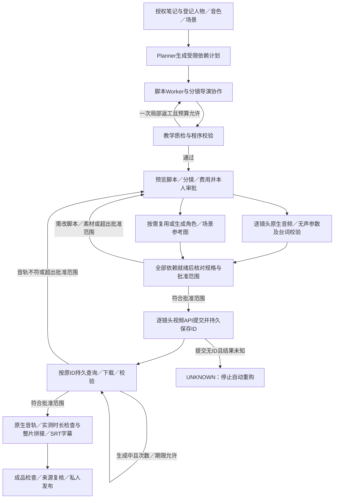

# 项目开发进展

## 学习自测与资料整编交付（2026-10-09）

已实现 `QUIZ_GENERATION` 与 `KNOWLEDGE_COMPILATION` 两个新任务类型：前者从授权资料出单选／简答题，包含答案解析及引用；后者将多份零散资料按主题融合为统一目录和章节，去重、补充并保留冲突。原 FAQ／研究报告继续原行为和检查点，未原地转换历史产物。

服务端固定路由到 Graph/Workflow + 对应 Skill，不调用 Planner；分批原文提取、组织、生成、质检与发布六阶段具备持久检查点和一次局部语义修复。架构、Skill、来源与预算固化，恢复复用完成批次／章节；来源版本、处理代次或内容变化后停止生成和结果读取。

V20 新增固定工作流基线／节点表及额度列，结果支持 Markdown 和私人结构化 JSON。范围为 1～6 文档、24,000 UTF-8 字节、最多 12 批；模型容量仍须容纳质检输入与输出。首版没有在线作答、自动评分、错题本或 Word／PDF 导出，独立前端未修改。代码、接口与维护位置见 [AI 模块说明](../lab-ai/README.md)、[联调说明](前端接口与联调说明.md)。

自动回归结果见 [验收报告](测试验证与验收报告.md)。本轮未对真实数据库应用 V19／V20，未调用真实模型或付费服务；真实迁移、事务、进程恢复、生成质量与前端联调仍需后续验收。以下段落按历史阶段保留其原状态。

## PPT 固定绑定 ReAct 架构（2026-10-09）

新建 PPT 工作流固定登记 `notes-ppt@1 / REACT / ppt-react-v1`，由 `WorkflowRouter` 分配，架构及 Skill 在首个模型调用前固化。`PptReActWorkflow` 经 `ReActExecutor` 根据观察选择下一动作，复用旧角色实现，并以独立动作日志恢复内容、布局、研究和质检；新路径不调用 Planner，不构造持久伪计划。其他架构保留枚举和目录，视频／报告执行保持原状。

V19 追加架构绑定及动作表；迁移前创建的任务沿原 Planner 恢复，迁移后的新 PPT 才使用新路由。最多 12 动作及一次语义返工，仍受原模型、工具和时间预算约束；程序版式检查、来源核验、本人审批、付费生成和导出关卡继续生效。实际实现及兼容字段说明见 [AI 模块说明](../lab-ai/README.md)，验证见 [验收报告](测试验证与验收报告.md)。本轮没有对实际用户数据库应用迁移或购买真实素材，真实作品质量、账单及整体恢复待验收项保持原结论。

## AI 模块目录整理（2026-10-09）

已按执行机制、业务工作流和共享能力整理 AI 源码及测试。执行机制分别位于 `orchestration/react`、`planexecute`、`fixed`、`multiagent`；PPT／视频业务位于 `workflows/media`，报告位于 `workflows/report`。原有固定报告步骤和媒体依赖调度已抽取，同步装配、探针和文档入口，并加入依赖边界检查。目录与扩展约定见 [AI 模块说明](../lab-ai/README.md)，验证结果见 [验收报告](测试验证与验收报告.md)。

这次仅完成代码职责整理，当前 PPT 仍调用原 Planner。工作流固定路由、移除 PPT 模型规划及整体 ReAct 执行器仍是后续改动，方案见 [执行架构评估](Agent工作流执行架构评估.md)；已有阶段和真实媒体验收缺口保持原状态。

## Log4j 2 日志接入（2026-10-06）

已替换 Boot 默认日志实现，增加正式 API 的 UTF-8 控制台／文件输出、错误汇总、日期／大小滚动与保留清理。统一切面覆盖现有业务入口，补充模型逐次尝试、后台任务、入库／清理及 HTTP／SSE 日志。请求编号、运行图编号和类型化资源 ID 用于关联；异常类型／调用位置保留，正文与凭证不展开。配置白名单、启动脚本和模板已同步。详情见[日志指南](日志记录与问题排查.md)，验证见[验收报告](测试验证与验收报告.md)。原功能真实质量和完整流程待验收项保持原结论。

更新日期：2026-10-05。项目路径：`D:\AICodeProject\Novid`。本文是开发阶段、能力状态、验收结果和跨会话交接的唯一事实来源。项目定位及操作介绍独立维护在[项目说明与使用介绍](项目说明与使用介绍.md)。

## 当前阶段与下一步

| 项目 | 当前记录 |
|---|---|
| 本会话工作 | S11安全、恢复与零新增购买验收；用户确认付费素材与本人教学质量缺口如实交接，不续用历史购买批准 |
| 首个功能补齐阶段 | S01 私有会话与多轮上下文 |
| S01 状态 | 2026-10-04 已完成；最终自动测试121通过／1 Docker跳过，真实及协议专项去重26项成功；限制见交接 |
| S01 会话 | 历史阶段由用户手动启动；不自行创建后续会话 |
| S02 状态 | 2026-10-04 已完成；最终139通过／1 Docker跳过，真实全量19及补验24均成功，按case名去重27项；限制见交接 |
| S03 状态 | 2026-10-04已完成；最终156项：155通过、0失败／错误、1 Docker跳过，真实专项11 PASS／0 FAIL；分层证据和限制见交接 |
| S04 状态 | 2026-10-04 实现完成、验收待补；同会话修复备用基础地址后最终183项：182通过、0失败／错误、1 Docker跳过；真实主／备各3通过，6 PASS／0 FAIL；真实自动切换及完整质量仍未验，最新补验见交接 |
| S05 状态 | 2026-10-04已完成；最终215项：214通过、0失败／错误、1 Docker跳过；真实主／备工具与计划6 PASS／0 FAIL，MySQL22项回滚通过。分层与限制见交接 |
| S06 状态 | 2026-10-04已完成本地实现与分层验收；最终226项：225通过、0失败／错误、1 Docker跳过；真实模型／MySQL分层证据与剩余限制见文末 |
| S07 状态 | 2026-10-04实现完成、验收待补；可靠预留／结算／未知与费用查询已实现，244项243通过／1 Docker跳过；真实价格和最终账单对齐未验，分层证据见文末 |
| S08 状态 | 2026-10-04已完成（分层限制见交接）；安全候选缓存、管理访问元数据／指标、默认关闭的有界清理及登录限流已实现，未缩小全局锁 |
| S09／S10状态 | 实现与分层证据保留，真实完整媒体、两类配图与本人质量仍待补；旧图UNKNOWN、三镜头视频拒绝不改写 |
| S11状态 | 实现完成、完整验收待补；正式299项298通过／1 Docker跳过，零购买分层结果与退出条件见文末S11交接 |
| 下一阶段 | 停在S11；下一会话仅由用户亲自创建，优先补S11核心缺口；未启动任何E扩展阶段 |
| 本轮范围调整 | 先完成安全、恢复和零新增购买验收，付费与人工质量缺口如实交接；没有新增外部购买授权 |
| 后续执行方式 | 用户手动创建会话，一阶段一新会话；模型只开发用户指定阶段并填写交接 |

“新会话”由用户亲自创建，使用现有后端项目目录。用户在新会话中指定阶段并让模型读取本文；模型按该阶段工作卡片执行。阶段结束先更新本文、验收记录及完整交接，然后停止本阶段工作。模型不得自行创建或发送消息到下一阶段会话，也不得因为本文列出了计划就开始其他阶段。阶段涉及未提供外部资源、费用确认、核心架构变更或不可逆操作时，先完成可独立验证的工作并如实记录所缺条件。

**新会话必须先阅读本文，不依赖聊天历史或上一个会话的记忆。** 待启动表示尚未开始，开发中表示用户已在对应会话启动实施；只有退出条件及证据满足才改为已完成。有待资源验证的阶段记录“实现完成、验收待补”，不能将它或整个 P 阶段标记全部完成。

## S09最新范围调整（覆盖下方历史卡片）

**2026-10-05 用户确认的最新范围（优先于历史执行方式）：** 多视频API按版本配置登记，Planner从能力目录为整片建议唯一API，并逐镜头建议规格、声音模式，随脚本一起由本人审批。不同成片可选择Vidu或百炼万相，同一成片禁止混用；视频输出有声／无声作为批准参数，有台词时禁止无声输出。JavaCV在项目内完成音视频流检测、镜头拼接及可选字幕烧录，替代外部ffmpeg.exe／ffprobe.exe；仍依赖随包FFmpeg原生库。SRT始终保留，burnSubtitles默认false；单个原声片段无需烧录时直接复用。共享预算、超范围重新审批、持久原ID查询及未知结果禁止重购不变。

同类HTTP JSON同步／异步协议的新API可通过配置增加；当前加载需要重启。新认证、上传或传输协议需扩展底层，不能承诺任何API零代码。历史配置版本必须保留用于在途查询；禁用只阻止新购买。当前实现TEXT_TO_VIDEO，参考图上传与IMAGE_TO_VIDEO尚未完整实现／验收，不虚报支持。技术完成进入WAITING_MEDIA_REVIEW，本人验收当前预览后才转SUCCEEDED；人工拒绝暂停且不自动重购。

百炼万相3北京采用业务空间域名`https://{WorkspaceId}.cn-beijing.maas.aliyuncs.com/api/v1/services/aigc/video-generation/video-synthesis`，提交`X-DashScope-Async: enable`，保存`output.task_id`，查询原ID路径`/api/v1/tasks/{id}`，读取`output.task_status`／`output.video_url`。密钥来自后端引用，`parameters.audio`决定原生音轨。[官方协议](https://help.aliyun.com/zh/model-studio/wan3-video-generation-api-reference)及[公开价格](https://help.aliyun.com/zh/model-studio/wan3-0-video)不等于账户最终账单。

用户已提供北京业务空间及本地密钥，密钥不进入仓库。2026-10-05批准水循环合成脚本：蓝衣卡通教师、简洁课堂，先万相原声单镜头，再历史跨API三镜头试验（其人工验收拒绝记录保留，当前同片使用唯一API），另生成一张标注概念示意的图片。本轮累计上限20元，覆盖此前10元。公开原价只作保守估算，不当最终实付。真实API／SQL／JavaCV专项与完整资料检索、Planner编排及人工验收分别记录。

## 开发开始时的基线

以下实现与测试基线来自 2026-10-03 的记录，是 S00 文档整理及 S01 开发前的历史基线。S01 的实际实现与新证据见下方完成交接及验收报告，不覆盖这些历史记录。

已实现登录与账户管理、知识库与文档管理、文本和 Markdown 解析、真实向量入库、混合检索、单轮问答、笔记写入确认、个人偏好、常见问题集（FAQ）与研究报告。原审查的九项发现已修复，随后解决了 ES 健康检查误连本机、模拟装配测试后台空指针，并增加启动加载环境文件及报告五步进度。

开发前自动测试共 67 项：66 项通过，1 项因本机没有 Docker 跳过；真实 MySQL 进度验证 18 项通过。此前主验收 43/43、研究报告与服务端推送（SSE）专项 6/6 通过。这些是不同阶段和范围的记录，不相加作为独立功能数量。详见[测试验证与验收报告](测试验证与验收报告.md)，缺陷过程见[缺陷修复与变更记录](缺陷修复与变更记录.md)。

本机入库与报告后台执行器开关已开启，正式索引已初始化；有效文档曾完成真实 2048 维向量入库。当前配置库已有用户资料，早期验收的“空库、零账户”只表示当次测试清理后的历史状态。配置修改需要重新构建并重启后端，实际是否执行以任务进度和有效执行租约为准。

**尚未达到架构中 P0～P4 全部核心功能完成的标准。** S01～S08实现及其历史分层证据保留；S09已有图像／视频适配、原ID查询与JavaCV原生后期，S10已有可编辑PPTX及私人交付，均不代表完整真实质量通过。S11补安全维护隔离及零购买验收包，真实主备故障切换、质量与账单、两类配图、完整教学视频、原生PowerPoint及备份重建仍待补。本仓库附轻量运行／费用检查页；另有独立Vue前端`D:\AICodeProject\Novid-frontend`，本轮仅读取核对，已有问答／报告／任务／执行图页面，媒体完整流程及人工页面验收不足。对应实际接口见[前端接口与联调说明](前端接口与联调说明.md)。

这些测试数字来自此前执行，不代表文档拆分重新运行过测试。首个功能阶段必须重新检查当前源码和测试结果；工作区存在大量未提交及未跟踪文件，不用旧提交覆盖它们。新的接口字段、迁移号、线程与预算以源码和最近完成阶段的交接为准。

## 每个会话共用的必要信息

### 阅读顺序与项目边界

1. 阅读本文“当前阶段与下一步”、当前阶段卡片及紧邻的前阶段完成交接。
2. 阅读[项目架构文档](../AI模型应用开发学习验证项目架构.md)中当前阶段指定章节；架构 P0～P6 保持原义，下面 S01～S11 是针对现有缺项的补齐工作包，不能替代原完成标准。
3. 阅读[项目说明与使用介绍](项目说明与使用介绍.md)、[前端接口与联调说明](前端接口与联调说明.md)、[部署配置与运行维护](部署配置与运行维护.md)、[测试验证与验收报告](测试验证与验收报告.md)及[缺陷修复与变更记录](缺陷修复与变更记录.md)。
4. 检查工作区改动和适用的仓库说明，再检查当前阶段代码入口。保存用户已有改动；不自动提交、推送、清理工作区、停止用户 IDEA 进程或修改另一个项目。
5. 每个新增或修改的方法及关键权限、版本、事务、预算、状态和远程结果判断处补中文注释，说明原因和边界。

七模块不增删：契约模块保持框架无关；业务模块定义权限和用例；数据模块保存 SQL／映射器／ES／受控文件访问；人工智能模块使用模型 SDK 并做受限编排；接口模块不直接调用 SDK；应用模块唯一正式装配；演示模块保持显式模拟路径。远程调用不包在长数据库事务里，不因追踪失败放宽可靠预算。

### 环境、数据与凭证

- Windows PowerShell、Java 17、Spring Boot 3.5.16、LangChain4j 1.20.2；Maven Wrapper 3.9.11，系统 Maven 3.9.x 可用。实际服务 MySQL 8.4.11、ES 8.15.0，客户端 8.15.5；容器配置固定 MySQL 8.4.12，Docker 在基线中不可用。
- 本机 `.env` 是连接及密钥位置，不把值写进文档、聊天、日志或 Git。`LabApplication` 启动自动读取工作目录文件，显式环境／JVM／启动参数优先；不要在新会话向用户索取已配置的密钥。
- ES 采用用户名密码和 `trust-all: ${ES_TRUST_ALL:true}`，跳过验证仅限 ES 客户端。向量模型 `embedding-3`、2048 维，换模型／维度使用新索引，不能销毁现有索引验证。
- S04核对现有.env：primary／backup两个不同真实目标均启用；旧“备用关闭”为历史。初轮备用404，用户提供成功示例后确认基础地址误填完整/chat/completions，SDK重复追加路径；仅修正MODEL_BACKUP_BASE_URL，凭证及其他值不变。最终同包主／备各三条固定合成样本均通过，真实自动切换及完整profile质量仍未验。用户2026-10-04确认已获取图像与异步视频API，视频另有传id的查询接口；两API及图片搜索尚未接入验收，配置／字段／目录支持待S09核对；价格表与外部观测缺口分阶段记录。
- 配置库已有用户资料；S01新增V5，S02追加V6，S03实际应用V7，S05追加并实际应用V8，S06追加并实际应用V9，S07追加并实际应用V10，S08追加并实际应用V11／V12。工作区已有V13媒体迁移文件但应用／校验尚待核对，S09先检查实际Flyway历史与最新目录，再追加实际下一个版本；不改成功版本、不关闭校验、不为测试清库，不能各阶段预占同一版本。
- 本机入库与报告执行器已开启。测试上下文及临时应用显式关闭首次初始化与自动队列扫描，只处理自己的合成资料；不消费现有用户队列，也不启动会扫描正式队列的第二实例。
- 真实测试用新隔离库优先；现有账号没有建库权限时使用可回滚合成事务，或明确仅清理自己生成的唯一前缀测试数据。真实 API 跨事务验证需独立隔离方案，不能把未提交事务探针当作网络接口集成。

### 现有预算与协议基线

| 场景 | 现有边界 |
|---|---|
| 在线问答 | 总计 60 秒，单次模型至多 30 秒；六轮／十次模型尝试／八次工具调用约束按实际入口实现核对，不因新摘要或续轮重置 |
| 模型适配 | 每逻辑聊天至多三次尝试、最多两个候选，SDK 自动重试零；非正常结束明确失败 |
| 报告任务 | 二十分钟累计执行、十次尝试／六轮持久预算；租约 180 秒、每 20 秒续租，最多两个角色工作线程，异常恢复至多三次 |
| 入库 | 单批 32 项／16000 保守词元，最多 5000 小片；S03单代次累计160次实际尝试／2500000保守输入、首次领取十分钟绝对期限（含等待／停机）、最多三次领取；成功向量、已知／未知用量与索引事实持久化 |
| 请求与资料 | 问题 2000 字符，任务最多六份资料；UTF-8 文本／Markdown，10 MB／100 万码点；具体字段限额以接口文档和源码为准 |
| 任务进度 | 202 即时返回；五步 prepare／research／analysis／report／publish；查询建议 2000 毫秒，真实成功比例，不输出草稿或内部思维链 |

身份只来自服务端 Bearer 登录上下文；普通用户仅本人资料，管理员显式跨库只读，私人会话／记忆／确认／任务／报告／运行仍只本人。历史来源、当前授权和版本在模型调用及发布／下载前复核。保持既有未知 JSON 字段拒绝、幂等命名空间和至少七天保留期；新增字段必须兼容旧调用与相应构造入口。

### 测试与交付规则

```powershell
# 功能阶段最终集成验证；无 Docker 的集成跳过明确记录
.\mvnw.cmd -Pintegration verify
# 在明确隔离且脚本适配最新迁移的环境才运行真实全量验收
powershell -File scripts/validate-backend.ps1
# 已有真实 MySQL 合成进度探针，单事务回滚，不调用模型／ES
powershell -File scripts/validate-task-progress.ps1
```

先运行与改动相关的测试，再按阶段完整检查；记录源码对应的实际总数、失败、错误和跳过。本机协议、模拟、真实 MySQL、真实 ES、真实模型及人工抽查分别列出。聊天／图片生成等真实调用控制为合成资料和小预算，付费媒体必须有有效本人确认，不为测试自动批准用户任务。详细证据放 `var/stage-Sxx/`，脱敏，不提交；稳定结论与具体复现步骤写进验收文档。

每阶段交付代码、正式测试、追加迁移、接口同步、使用介绍变化、部署配置变化、验收证据和本文交接。阶段卡片描述的是计划，具体新接口在完成前不得混进“已实现接口”清单。不要每阶段新增一份相似报告；进展、验收及缺陷仍各自集中维护。

## 2026-10-04 最新范围：S09 同时完成图像与异步视频生成

用户已确认取得图像生成API和异步视频生成API；2026-10-04补充了智谱视频查询接口：`GET https://open.bigmodel.cn/api/paas/v4/async-result/{id}`，请求头为`Authorization: Bearer <API_KEY>`，`id`是视频提交返回的提供方任务ID。查询协议已按官方文档核对，尚未真实联调。本次只修改计划，不启动S09开发、不调用生成／结果服务、不改变S08及已完成阶段的状态或证据。

| 阶段 | 本次明确的交付边界 |
|---|---|
| S09 | 真实图像生成＋真实异步教学视频完整链路，同时保留复杂Agent与本人审批；视频采用Storyboard、逐镜头原生音轨／实测时长、参考图、真实视频ID查询、JavaCV字幕／拼接、费用／局部恢复及私人发布 |
| S10 | 复用S09内容／图片／审批及存储，完成可编辑PPTX导出、版式／文件质量与交付完善，不再首次接入生图或视频API |
| S11 | 全量验收真实图像、教学视频与完整PPT的安全、质量、费用、跨进程恢复和复杂Agent证据；视频不再按缺API列预留豁免 |
| R01 | 旧编号撤销为独立阶段，原视频要求已并入S09；无需另开R01会话 |

**优先级与跨会话规则：**本文最新卡片覆盖前次“视频API暂缺／R01预留、S09仅预览、S10首次生图”的阶段分工。根架构6.10的复杂Agent、权限／来源、审批、费用及UNKNOWN原则继续适用，旧阶段边界不得覆盖本次明确要求；S09实施后同步架构及其他说明的实际契约。视频查询的方法／地址／鉴权形式及文档状态／结果字段已记录在S09卡片；这些协议事实不等于真实联调、模型／目录选项／价格／本机鉴权配置已验收。启动S09时核对其余提供方协议及本机非敏感配置位置，不向聊天索取已存密钥。该次计划修订时下一阶段为S08；实际当前状态以本文顶部及S08最终交接为准，S09只在用户指定的新会话执行。

## 历史产物规划调整（2026-10-04，已由最新S09分工覆盖）

以下为历史阶段分工，当前分镜范围以2026-10-05用户确认方案为准。

按用户本次要求，S09／S10 改为笔记 PPT，S11 验收真实两类配图与可编辑演示文稿；notes_ppt 和 notes_video 是同级能力，清单增加为38组。客观事实图用搜索核验原始网络配图，概念图可调用生图 API。教学视频由用户选登记人物／声音／场景，结合笔记生成脚本，审批后走真正视频生成 API，暂列 R01 预留。调整不代表这些功能已开发，不改变 S01／S02／其他实际阶段交接、既有测试证据或当前接口。用户继续手动另开会话，每次只实施指定阶段。

## PPT 与视频的复杂 Agent 架构（2026-10-04，待实施）

两类产物同级，共同采用“持久状态图＋受限Plan-and-Execute＋程序Supervisor／Worker＋有界ReAct工具续轮＋有限教学质检返工”。固定生命周期控制来源、审批、素材、发布与终态；真实Planner生成具体Agent动作、依赖和条件，不能将预设顺序或教学大纲当动态计划。详细契约、统一预算及必须证据以架构6.10.2／6.10.3／6.10.5／6.10.7为准，不依赖本会话聊天。

PPT角色为Planner、可复用ResearchWorker、PresentationContentWorker、PresentationLayoutWorker、按需VisualResearchWorker及TeachingReviewWorker；视频角色为Planner、ResearchWorker、VideoScriptWorker、SceneDirectorWorker、TeachingReviewWorker，参考素材研究仅在视频API支持且确有需要时调用。角色分工按任务必要性选择，同时Worker最多2，不强制每个任务调用全部角色；注册教学人物characterId、原生声音提示voiceId、场景sceneId与执行Agent各自独立。

媒体任务预算独立于问答／报告：每版最多8个逻辑节点，共享24模型轮／36次真实尝试、最多1次局部重规划／1次语义返工／1次结构修复；研究型Worker含首次调用最多3轮。PPT工具40次、视频24次，搜索／查询／文件／期限仍受架构对应有限上限控制，不能借子任务或新计划重置。该数值为后续实现的初始规划预算，S09真实图像／视频样本核对可行性与费用后记录必要调整；现有报告六轮／十次预算保持不变。

角色结果是有版本的类型化事实；计划记录planVersion／hash、稳定stepId、action／agentId、dependsOn、inputRefs及完成条件，可选when只使用服务端注册的类型化判断；程序补身份、授权、工具／模型及稳定操作键。固定审批／付费／发布关卡不能由Planner省略。最多一次局部重规划和语义返工，保留输入未变的成功结果，依赖变化标下游失效；跨审批、付费重提或UNKNOWN不能靠返工绕过。用户修改预览若需要模型调用／重规划也消耗同一额度，不足明确停止或让用户另发新任务。质检意见经程序核验，视觉／视频理解未启用的检查交人工，不声明Agent已看懂实际媒体。

S09必须验收真实计划差异、模型工具结果续轮、角色依赖协作、有限质检返工及本人预览批准，并交付真实图像、Storyboard／逐镜头原生音轨／实测时长、视频提交／保存id／独立查询／素材取回、JavaCV／字幕拼接／私人发布、共享费用与局部恢复。S10复用S09计划／结果／真实图片完成可编辑PPTX与版式检查，不重复购买素材；付费素材变更重新批准。S11复核两类产物全部复杂Agent及真实媒体证据；原R01要求已归S09，教学视频不再预留豁免。

每阶段交接必须包含角色定义／profile／工具白名单、计划与结果Schema／版本／依赖失效、实际预算／返工分类、正常及故障计划／工具／审查证据、图和前端字段、迁移／配置与未验收项。本次仅修订文档，未运行模型／搜索或更改代码，不将新要求记为已完成。

## 阶段总表与依赖

以下按顺序执行；依赖中引用的阶段是接口／事实输入，不代表允许同会话批量开发。资源不足时明确未满足的验收项，可继续完成不依赖该资源的工作；不得绕过依赖把下游功能宣布完整。

| 阶段 | 工作包 | 对应原架构 | 状态 |
|---|---|---|---|
| S01 | 私有会话与多轮上下文 | P2／P4 | 已完成 |
| S02 | 文档结构、来源映射与完整章节覆盖 | P2 | 已完成 |
| S03 | 入库逐批持久预算与失败恢复 | P2 | 已完成 |
| S04 | 模型路由、真实主备与结构化输出 | P1／P2 | 实现完成、验收待补 |
| S05 | 工具续轮与动态受限规划 | P1／P4 | 已完成（分层限制见交接） |
| S06 | 持久运行追踪与执行图 | P3 | 已完成（分层限制见交接） |
| S07 | 词元、费用预留与可靠结算 | P3／P4 | 实现完成、验收待补（真实价格／账单） |
| S08 | 安全缓存、访问审计与运维治理 | P3 | 已完成（分层限制见交接） |
| S09 | 真实图像生成、分镜异步教学视频与复杂Agent编排 | P4 | 方案已确认，按新方案实现／验收待完成（已有未完整验收接入代码） |
| S10 | 可编辑PPT导出、版式检查与交付完善 | P4 | 实现完成、验收待补（用户允许独立推进，上游未验保留） |
| S11 | 核心安全、恢复、质量与完整交付验收 | P0～P4 | 实现完成、完整验收待补（零新增购买范围已交付） |

## 各阶段完整工作卡片

所有阶段均须遵守上述公共信息，并在结束后填写下文统一交接字段；仅凭卡片不能假定上游接口已经存在。

### S01：私有会话与多轮上下文

**状态：已完成（2026-10-04）。** 对应能力：P2／P4；ai_gateway、prompt_context、memory、memory_store。架构依据：第 1.2～1.4、5.3、9、12.2、13、16.2 节。完成仅指下述 S01 退出条件与证据，不表示整个 P2／P4 已完成。

**前置条件：**现有认证、知识授权、模型网关和偏好接口；不依赖后续阶段。

**开发前起点：**AiRequest 只有 question、scope；AiGateway 只组织当前问题与偏好，没有历史输入。开发前 V1～V4 未创建 sessions、messages；MemoryStorePort 只负责偏好，不能当作会话存储。最终实现见下方 S01 交接。

**用户可见目标：**连续询问“再解释刚才第二篇资料”时能使用本人合法历史；重启后历史存在，换账号、缩小范围或撤销来源后不泄露旧内容。

**必须交付：**新增框架无关的会话／消息契约、窄存储端口、业务用例、数据仓库和后续新增迁移；完整历史与有界模型窗口分别管理。接入 LangChain4j 上下文时只在 AI 模块使用 SDK。增加本人会话创建、分页列表、消息读取及版本化删除；问答支持可选会话关联，旧单轮请求仍兼容。摘要经 ModelGateway 生成，带来源和覆盖序号；偏好仍仅由用户明确保存。

**接口与数据变化：**已新增 /api/v1/sessions 与 /sessions/{id}/messages 等五个本人接口，chat／stream 增加可选成对 sessionId/sessionVersion；输入不接收 userId。新增 V5 会话迁移，最终 DTO、HTTP 状态、来源字段、唯一序号、版本／执行权和幂等规则见[前端协议](前端接口与联调说明.md)及下方完整交接。

**代码入口：**[问答请求](../lab-contract/src/main/java/com/example/ailab/contract/dto/AiRequest.java)、[问答结果](../lab-contract/src/main/java/com/example/ailab/contract/dto/AiResult.java)、[来源依赖](../lab-contract/src/main/java/com/example/ailab/contract/dto/SourceDependency.java)、[资料范围](../lab-contract/src/main/java/com/example/ailab/contract/dto/ScopeRequest.java)、[知识授权端口](../lab-contract/src/main/java/com/example/ailab/contract/port/KnowledgeCapabilityPort.java)、[偏好端口](../lab-contract/src/main/java/com/example/ailab/contract/port/MemoryStorePort.java)、[统一权限策略](../lab-business/src/main/java/com/example/ailab/business/domain/KnowledgeAccessPolicy.java)、[问答业务用例](../lab-business/src/main/java/com/example/ailab/business/application/AssistantApplicationService.java)、[数据授权与事务辅助](../lab-data/src/main/java/com/example/ailab/data/repository/SqlSupport.java)、[问答网关](../lab-ai/src/main/java/com/example/ailab/ai/gateway/AiGateway.java)、[偏好上下文](../lab-ai/src/main/java/com/example/ailab/ai/memory/ProfileMemoryService.java)、[问答与私人接口](../lab-web/src/main/java/com/example/ailab/web/controller/AssistantController.java)、[数据库迁移目录](../lab-data/src/main/resources/db/migration)。

**边界与失败策略：**用户＋会话隔离；消息序号唯一；同一会话串行或 CAS 只允许一个请求提交，不在远程调用期间持数据库行锁。历史、摘要与引用带不可变来源，读取及模型输入前重新授权；范围变化重建合法上下文。删除会话／偏好后后续窗口和派生摘要不得继续使用。模型调用总计仍受在线 60 秒、单次 30 秒和尝试预算限制，摘要不新建无限预算。

**退出验收：**

- [x] 两轮真实模型问答使用第一轮暗号，正式上下文重启后读取 SQL 历史；旧单轮 JSON／SSE 正常。真实两轮／摘要执行包与最终补验包分别记录，未做 OS 强杀实验。
- [x] 两个 USER 与两个 ADMIN 的正式 HTTP 矩阵：本人列表、直接 ID、消息、关联问答、删除；私人会话没有管理员旁路。
- [x] 真实 SQL／HTTP 并发只提交一个连续序号问答对；本机协议截断／超时及真实 TCP RST 不保存假成功，租约、abort 与旧 UUID 拒绝均有证据。故障聊天提供方为本机替身，不冒称真实提供方故障。
- [x] 正式 HTTP／SQL 的 scope 变化、禁用库、删除来源、ADMIN 降级后历史受限且合法窗口不含旧来源；提交／历史交付前复核另有定向回归。完整时序压力矩阵未运行。
- [x] 真实生成有来源／覆盖序号的有界摘要；离线正式窗口断言完整轮次、工具配对和字节限额；偏好删除与版本删除真实清派生内容，问答不自动保存偏好。S01 没有模型工具续轮。
- [x] 正式 MySQL8.4.11 应用 V5、真实短事务和 HTTP 已验证；实际 SDK 两轮输入、本机 SDK 消息协议、装配与模块边界均有证据；Docker8.4.12 跳过明确保留。

验收对应 `var/stage-S01/junit-results.json`、`native-first-attempt-results.json`、`native-focused-results.json` 与[验收报告 S01 专项](测试验证与验收报告.md)。首两次验收脚本装配失败及其清理记录保留，补验结束后才勾选以上条件。

**资源与阻塞记录：**核对所需数据库、模型及外部运行时；可用项沿用现有环境，新增资源仅记配置位置／变量名称。若资源不足，完成其余实现和可运行测试，在本阶段记录未验证项、影响的下游条件及补验入口；不可把缺核心资源的阶段标为完整完成。

**本阶段完成后必须交接：**记录新增迁移版本、完整接口与兼容字段、串行／版本规则、消息来源结构、窗口与摘要参数、失败消息策略、真实与离线测试结果，以及尚未覆盖的撤销竞态。阶段 02 需要来源位置契约，阶段 05 需要可配对的工具消息结构。 同时登记测试命令、实际结果、改动文件、已知限制及下一个可开始阶段。

**新会话启动指令：**

> 在 `D:\AICodeProject\Novid` 开始 S01「私有会话与多轮上下文」。先完整阅读 `docs/项目开发进展.md` 的公共信息、S01 工作卡片与前置阶段交接，以及根目录架构文档对应章节。核对现有未提交改动和真实实现后，只完成本阶段，不跨入下一阶段。所有方法及关键代码加中文注释；保留现有用户资料和环境凭证，旧迁移不改。落实卡片的正常／失败验收，更新接口、使用、部署、验收和开发进展，填写完整交接。证据不足如实记录，不把模拟或跳过当作真实通过。完成后停在本阶段，填写下一阶段交接，等待用户亲自另开会话继续；不要自行创建会话或开发下一阶段。

### S02：文档结构、来源映射与完整章节覆盖

**状态：已完成（2026-10-04）。** 对应能力：P2；ingest、search、rag_answer、aggregation、prompt_context。架构依据：第 8.2～8.5、12.2、13、16.2 节。

**前置条件：**S01 交接中的来源结构；现有结构解析、文档上下文仓库及报告检查点。

**开发前起点：**有章节／父段／小片和 UTF-16 偏移；普通检索最多六包。报告只读受限前缀并标部分覆盖，块映射、章节详情分页及部分参数行为缺失。最终实现与证据见下方S02交接；任意长报告仍不能突破预算。

**用户可见目标：**用户能分页读取指定章节，报告按章节有界遍历并标明实际覆盖，引用准确回到原文；不能用前六个检索命中冒充全篇。

**必须交付：**完善块类型、块关联、分段与原文映射、表头重复和短尾合并；配置通过窄契约实际影响解析及父段扩展。加入同版本／处理代次的章节详情与覆盖读取，报告持久保存页次、已读范围及剩余覆盖。词元计数优先匹配模型，不能精确时标记保守估计并校验硬限额。

**接口与数据变化：**按架构补章节详情与入库元数据查询；新增位置和覆盖字段需兼容现有引用与 UTF-16 定位。响应只返回授权正文，不输出内部路径。 需要的新增表／字段使用追加迁移，具体版本与索引、CAS／幂等约束在本阶段交接中登记。

**代码入口：**[章节小片端口](../lab-contract/src/main/java/com/example/ailab/contract/port/DocumentContextPort.java)、[来源依赖](../lab-contract/src/main/java/com/example/ailab/contract/dto/SourceDependency.java)、[文档上下文仓库](../lab-data/src/main/java/com/example/ailab/data/repository/DocumentContextRepository.java)、[结构解析](../lab-ai/src/main/java/com/example/ailab/ai/rag/StructureParser.java)、[检索参数](../lab-ai/src/main/java/com/example/ailab/ai/rag/RagProperties.java)、[结果汇聚](../lab-ai/src/main/java/com/example/ailab/ai/aggregator/ResultAggregator.java)、[问答网关](../lab-ai/src/main/java/com/example/ailab/ai/gateway/AiGateway.java)、[报告执行器](../lab-ai/src/main/java/com/example/ailab/ai/workflows/report/ReportTaskWorker.java)、[知识接口](../lab-web/src/main/java/com/example/ailab/web/controller/KnowledgeController.java)。

**边界与失败策略：**不按同名标题合并章节；不跨文档／内容版本／处理代次串片。关键词与向量候选仍先范围过滤并经 SQL 复核；引用只能指实际交付范围。默认 500／50／100／64／2000／4000 与每路 20、最终六包保持单一参数来源。

**退出验收：**

- [x] 重复标题、中文和表情、超长代码、表格行／表头、短尾不丢失，原文位置可还原。
- [x] 修改候选数、父段上限和最小片参数后实际行为变化且硬预算不超限。
- [x] 长章节分页可证明读完或准确列出未覆盖范围；恢复不重复已完成页次。
- [x] 旧代次、假相邻关系、越权和撤销来源均拒绝；历史引用不会在新版正文误高亮。

验收：解析器7项、正式HTTP／SQL39页完整还原、真实短报告完整和长报告精确PARTIAL；旧代次／假父段及实际交付邻序／损坏映射／撤销均拒绝。页恢复SQL与Worker替身分别验证，不当OS强杀或真实模型重放证据。最终139通过／1 Docker跳过，专项19与补验24成功；详见[验收报告S02](测试验证与验收报告.md)和 `var/stage-S02/native-summary.json`。

**资源与阻塞记录：**核对所需数据库、模型及外部运行时；可用项沿用现有环境，新增资源仅记配置位置／变量名称。若资源不足，完成其余实现和可运行测试，在本阶段记录未验证项、影响的下游条件及补验入口；不可把缺核心资源的阶段标为完整完成。

**本阶段完成后必须交接：**记录解析／切片／计数器及映射版本、处理代次规则、分页游标与覆盖契约、新增迁移、兼容字段和固定长文样本；供阶段 03 批次及阶段 09 视频来源使用。 同时登记测试命令、实际结果、改动文件、已知限制及下一个可开始阶段。

**新会话启动指令：**

> 在 `D:\AICodeProject\Novid` 开始 S02「文档结构、来源映射与完整章节覆盖」。先完整阅读 `docs/项目开发进展.md` 的公共信息、S02 工作卡片与前置阶段交接，以及根目录架构文档对应章节。核对现有未提交改动和真实实现后，只完成本阶段，不跨入下一阶段。所有方法及关键代码加中文注释；保留现有用户资料和环境凭证，旧迁移不改。落实卡片的正常／失败验收，更新接口、使用、部署、验收和开发进展，填写完整交接。证据不足如实记录，不把模拟或跳过当作真实通过。完成后停在本阶段，填写下一阶段交接，等待用户亲自另开会话继续；不要自行创建会话或开发下一阶段。

### S03：入库逐批持久预算与失败恢复

**状态：已完成（2026-10-04）。** 对应能力：P2；index_sync、ingest、durable_task、ops。架构依据：第 6.3、8.6～8.7、10、12.2、16.2 节。

**前置条件：**S02 的结构／批次与计数器版本；现有索引清理和入库租约。

**开发前起点：**入库有租约与最终全集核验，但单次新建预算，全部向量集中内存；失败重领可能重做付费向量，逐批阶段与累计用量不完整。

**用户可见目标：**某批或 ES 写入失败后只重做缺失部分，重启不重置尝试与用量，完整核验后才能激活当前资料。

**必须交付：**持久化批次计划、稳定批次键、输入摘要、向量完成事实、索引状态、累计尝试／用量／期限及下一次重试；采用有界批量内存和逐批受控索引。定义外部结果不确定时的核验策略，不声称网络调用严格只发生一次。

**接口与数据变化：**补齐本人文档入库状态、失败阶段、计数和可恢复操作；保持 retry／reprocess 的新代次语义，不能让客户端重置预算。 需要的新增表／字段使用追加迁移，具体版本与索引、CAS／幂等约束在本阶段交接中登记。

**代码入口：**[入库端口](../lab-contract/src/main/java/com/example/ailab/contract/port/DocumentIngestionStorePort.java)、[入库仓库](../lab-data/src/main/java/com/example/ailab/data/repository/IngestionRepository.java)、[入库流水线](../lab-ai/src/main/java/com/example/ailab/ai/rag/DocumentIngestionPipeline.java)、[入库执行器](../lab-ai/src/main/java/com/example/ailab/ai/rag/IngestionWorker.java)、[ES 仓库](../lab-data/src/main/java/com/example/ailab/data/search/ElasticsearchRepository.java)、[执行预算](../lab-ai/src/main/java/com/example/ailab/ai/runtime/ExecutionBudget.java)、[数据库迁移目录](../lab-data/src/main/resources/db/migration)。

**边界与失败策略：**单批 32 项、16000 保守词元、文档 5000 小片及既有有界尝试／期限不得靠重领清零。最终 ID／摘要／模型／维度／refresh 可见性全集一致后 CAS 激活；旧任务、旧租约、旧内容不能激活或覆盖新代次。

**退出验收：**

- [x] 真实MySQL／ES／embedding两批样本，第二批部分写入及完整写入后丢响应；正式上下文重启后向量不重购，尝试、用量、期限及成功事实保留。不是OS强杀。
- [x] 真实ES受控部分写入／丢响应，SQL注入旧执行者／版本／库删除／过期租约与迟到用量；正式ES客户端本机协议覆盖部分bulk、可见性延迟、超时／分片失败。故障来源和限制分别记录。
- [x] 正式流水线回归拒绝全集不一致激活；真实ES额外项拒绝全集核验，PRUNE保留当前及未来代次；既有删除边界协议回归通过。
- [x] 5000片／2048维／157批的正式流水线加临时二进制存储替身在128MiB堆上限运行通过，采样峰值86.91MiB、单批32项；不是最大真实SQL／ES或双Worker峰值。正式MySQL／ES、离线与本机协议分层记录。

**资源与阻塞记录：**核对所需数据库、模型及外部运行时；可用项沿用现有环境，新增资源仅记配置位置／变量名称。若资源不足，完成其余实现和可运行测试，在本阶段记录未验证项、影响的下游条件及补验入口；不可把缺核心资源的阶段标为完整完成。

**本阶段完成后必须交接：**记录批次表／状态机、稳定键、外部不确定状态、重试预算、清理边界、测得内存和恢复证据；阶段 07 依据可靠执行记录计算费用。 同时登记测试命令、实际结果、改动文件、已知限制及下一个可开始阶段。

**新会话启动指令：**

> 在 `D:\AICodeProject\Novid` 开始 S03「入库逐批持久预算与失败恢复」。先完整阅读 `docs/项目开发进展.md` 的公共信息、S03 工作卡片与前置阶段交接，以及根目录架构文档对应章节。核对现有未提交改动和真实实现后，只完成本阶段，不跨入下一阶段。所有方法及关键代码加中文注释；保留现有用户资料和环境凭证，旧迁移不改。落实卡片的正常／失败验收，更新接口、使用、部署、验收和开发进展，填写完整交接。证据不足如实记录，不把模拟或跳过当作真实通过。完成后停在本阶段，填写下一阶段交接，等待用户亲自另开会话继续；不要自行创建会话或开发下一阶段。

### S04：模型路由、真实主备与结构化输出

**状态：实现完成、验收待补（2026-10-04）。** 对应能力：P1／P2；model_api、selection、model_routing、model_failover、structured。架构依据：第 6.2～6.3、6.6～6.9、14.2、15、16.2 节。前三项协议／程序验收及两个真实目标各三固定样本通过；真实自动切换、完整profile质量未验，不标整个P1／P2完成。

**前置条件：**S01 上下文窗口和 S02 计数／证据预算；已有模型注册与正式网关。

**开发前起点：**有任务配置组、能力筛选和有限备用，质量门槛来自人工配置；精确指定、半开探针、备用上下文重装与结构化修复不完整。前阶段文档称仅单目标，S04实查已有两个不同目标启用，但备用实际不可用；最终实现及失败证据见本阶段交接。

**用户可见目标：**受控目标选择和主备可解释，切换后仍守权限与窗口，结构化响应实际校验；真实备用资源不足时如实标记。

**必须交付：**完善服务端允许的精确目标选择、路由原因及冷却／单探针；缓存目标客户端同时保留请求剩余期限；明确失败分类、预算和切换条件。加入结构定义提取、合法拒绝／截断分类及有界修复。按备用窗口重新组装合法证据和历史，保存词元／用量来源及质量配置版本。

**接口与数据变化：**客户端只提交明确白名单内的逻辑选项，不能提供 endpoint、密钥或任意模型；新增路由说明只含脱敏标识。 需要的新增表／字段使用追加迁移，具体版本与索引、CAS／幂等约束在本阶段交接中登记。

**代码入口：**[模型网关](../lab-ai/src/main/java/com/example/ailab/ai/model/ModelGateway.java)、[模型注册](../lab-ai/src/main/java/com/example/ailab/ai/model/ModelRegistry.java)、[模型配置](../lab-ai/src/main/java/com/example/ailab/ai/model/ModelProperties.java)、[执行预算](../lab-ai/src/main/java/com/example/ailab/ai/runtime/ExecutionBudget.java)、[结果汇聚](../lab-ai/src/main/java/com/example/ailab/ai/aggregator/ResultAggregator.java)、[正式运行装配](../lab-app/src/main/java/com/example/ailab/app/RuntimeConfiguration.java)。

**边界与失败策略：**不把同一服务目标的多个别名当作主备；真实模式不回落模拟。每逻辑调用至多三次尝试、至多两个候选，SDK 重试保持零；截断不当完整成功，切换不重放已成功写入。

**退出验收：**

- [x] 正式SDK＋本机HTTP协议覆盖429、503、单模型超时、截断、能力不足、窗口不足、半开并发及无兼容备用；属于合成协议，非真实提供方故障。
- [x] 本地Schema严格拒绝字段／枚举／引用错误；正式SDK结构协议验收一次修复及共享预算停止，拒绝和截断不修复。
- [x] 正式SDK＋本机HTTP断言小窗口备用实际减少完整历史轮次与证据包；撤销回调后备用请求0次。未重跑真实数据库撤销时序。
- [ ] 真实两个不同目标及固定质量样本必须有独立证据；补验最终主／备各3 PASS，初轮备用3 FAIL保留历史；真实自动切换NOT_RUN，完整经济／分析／报告profile质量未评测，本项尚不完整。

**资源与阻塞记录：**核对所需数据库、模型及外部运行时；可用项沿用现有环境，新增资源仅记配置位置／变量名称。若资源不足，完成其余实现和可运行测试，在本阶段记录未验证项、影响的下游条件及补验入口；不可把缺核心资源的阶段标为完整完成。

**S04实际资源与阻塞：**沿用现有.env及Java17／LangChain4j1.20.2，无新增外部资源或迁移。备用404已按用户成功示例定位并修正：MODEL_BACKUP_BASE_URL填基础地址而非完整操作URL；ModelRegistry新增启动拒绝完整操作URL的脱敏校验，合法多级前缀不受影响。最终新包scripts/validate-models.ps1六样本全部通过。仍须补真实自动切换与经济／分析／报告固定质量集，下游不得把configured-baseline当质量认证。详细证据及最终包摘要见最新补验交接。

**本阶段完成后必须交接：**记录策略版本、候选及真实目标区分、错误分类、客户端缓存／超时方式、计数器、价格引用和实际测试覆盖；阶段 05 复用结构化计划及工具请求响应。 同时登记测试命令、实际结果、改动文件、已知限制及下一个可开始阶段。

**新会话启动指令：**

> 在 `D:\AICodeProject\Novid` 开始 S04「模型路由、真实主备与结构化输出」。先完整阅读 `docs/项目开发进展.md` 的公共信息、S04 工作卡片与前置阶段交接，以及根目录架构文档对应章节。核对现有未提交改动和真实实现后，只完成本阶段，不跨入下一阶段。所有方法及关键代码加中文注释；保留现有用户资料和环境凭证，旧迁移不改。落实卡片的正常／失败验收，更新接口、使用、部署、验收和开发进展，填写完整交接。证据不足如实记录，不把模拟或跳过当作真实通过。完成后停在本阶段，填写下一阶段交接，等待用户亲自另开会话继续；不要自行创建会话或开发下一阶段。

### S05：工具续轮与动态受限规划

**状态：已完成。** 2026-10-04，正常／失败退出验收按程序、SDK协议、真实模型与MySQL分层通过，完整交接见文末。对应能力：P1／P4；tools、tool_registry、routing_skill、orchestration、hybrid_orchestration、multi_agent。架构依据：第5.2、6.1、6.5、7、10、15、16.2节。

**前置条件：**S01 工具消息配对，S04 结构化输出与预算；已有受控工具、计划校验及报告执行器。

**启动时起点：**工具由程序直接调用，报告为固定依赖图；没有模型toolCallId续轮、动态工具定义查询或受限模型计划执行。现在默认固定流程兼容，显式READ_ONLY／PLANNED启用新行为。

**用户可见目标：**简单问答保留固定流程，复杂任务可产生有限合法计划；模型请求工具后获得匹配结果继续回答，不能越权或无限循环。

**必须交付：**完整工具元数据、参数结构定义及注册冲突检查；按身份／任务／配置动态暴露，增加本人 GET /tools。统一执行授权、参数校验、预算、输出净化与可观测性，保留工具调用标识。规划器只能生成白名单动作和角色，拓扑校验后由执行器调度，有限修复；动态复杂任务继续持久记录步骤、检查点和进度。

**接口与数据变化：**工具列表为只读定义，不表示客户端可以执行任意库操作；计划／角色说明不含内部提示词。写工具仍只准备确认，不凭模型输出批准保存。 需要的新增表／字段使用追加迁移，具体版本与索引、CAS／幂等约束在本阶段交接中登记。

**代码入口：**[工具执行](../lab-ai/src/main/java/com/example/ailab/ai/tools/ToolExecutionService.java)、[计划校验](../lab-ai/src/main/java/com/example/ailab/ai/orchestration/planexecute/PlanValidator.java)、[问答网关](../lab-ai/src/main/java/com/example/ailab/ai/gateway/AiGateway.java)、[模型网关](../lab-ai/src/main/java/com/example/ailab/ai/model/ModelGateway.java)、[模型注册](../lab-ai/src/main/java/com/example/ailab/ai/model/ModelRegistry.java)、[报告执行器](../lab-ai/src/main/java/com/example/ailab/ai/workflows/report/ReportTaskWorker.java)、[任务端口](../lab-contract/src/main/java/com/example/ailab/contract/port/TaskStorePort.java)、[任务仓库](../lab-data/src/main/java/com/example/ailab/data/repository/TaskRepository.java)、[结果汇聚](../lab-ai/src/main/java/com/example/ailab/ai/aggregator/ResultAggregator.java)。

**边界与失败策略：**最少必要编排；轮数、尝试、八次工具调用与计划步骤均有硬上限，不重置预算。工具返回事实替代模型自称完成；角色不共享可变上下文，不允许计划指定密钥、endpoint、SQL、任意类或命令。

**退出验收：**

- [x] 正式SDK同ID／同名工具续轮、缺失／重复／错名结果拒绝、循环超限；真实两目标工具事实续轮通过。
- [x] 未知动作／角色／环／错类型／超长／越权／假保存／恶意原文后续写申请拒绝；模型非法计划不执行。
- [x] 真线程屏障证明重叠、独立输入、依赖串行与汇合；恢复复用计划和成功研究，SQL复核不重置持久额度。模型／SQL替身与真实SQL分列。
- [x] 两真实目标各产生独立与依赖计划，默认固定FAQ五步回归；SQL暂停／取消与旧fencing拒绝通过。不是跨进程强杀或SQL＋外部模型全链路证明。

**资源与阻塞记录：**核对所需数据库、模型及外部运行时；可用项沿用现有环境，新增资源仅记配置位置／变量名称。若资源不足，完成其余实现和可运行测试，在本阶段记录未验证项、影响的下游条件及补验入口；不可把缺核心资源的阶段标为完整完成。

**本阶段完成后必须交接：**记录工具注册契约、逻辑动作／角色白名单、计划结构和校验、续轮消息、预算、步骤进度兼容规则与实际派发证据；供阶段06观测、S09复杂PPT及未来R01视频复用。 同时登记测试命令、实际结果、改动文件、已知限制及下一个可开始阶段。

**新会话启动指令：**

> 在 `D:\AICodeProject\Novid` 开始 S05「工具续轮与动态受限规划」。先完整阅读 `docs/项目开发进展.md` 的公共信息、S05 工作卡片与前置阶段交接，以及根目录架构文档对应章节。核对现有未提交改动和真实实现后，只完成本阶段，不跨入下一阶段。所有方法及关键代码加中文注释；保留现有用户资料和环境凭证，旧迁移不改。落实卡片的正常／失败验收，更新接口、使用、部署、验收和开发进展，填写完整交接。证据不足如实记录，不把模拟或跳过当作真实通过。完成后停在本阶段，填写下一阶段交接，等待用户亲自另开会话继续；不要自行创建会话或开发下一阶段。

### S06：持久运行追踪与执行图

**状态：已完成（2026-10-04；分层限制见完整交接）。** 对应能力：P3；trace_visualization、multi_agent、delivery。架构依据：第 11.1～11.6、12.2、13、16.2 节。

**前置条件：**S01 会话关联、S03 批次、S05 角色／步骤事实；各入口的埋点在前序阶段随功能加入。

**开发前起点：**ai_runs 和 TraceSnapshot 只有本人运行摘要，没有真实 ai_spans、树、时间线、运行图或外部导出。

**用户可见目标：**用户可以查看本人一次执行的实际模型、工具、角色、耗时和因果关系；重启后图可重建，观测失效不破坏业务预算。

**必须交付：**新增类型化追踪节点、限量持久存储、运行详情与 GET /runs/{id}/graph；关联父节点、角色、会话、任务、步骤、模型、路由、尝试与状态。恢复创建新执行关联上一执行；明确缺失节点与不完整标识。加入有界队列、保留期、脱敏及可关闭的外部导出适配。

**接口与数据变化：**运行列表／详情／图均仅本人，管理员没有私人内容旁路；管理接口只读聚合元数据。图来自执行节点，不返回静态设计图冒充执行事实。 需要的新增表／字段使用追加迁移，具体版本与索引、CAS／幂等约束在本阶段交接中登记。

**代码入口：**[运行端口](../lab-contract/src/main/java/com/example/ailab/contract/port/TraceRecordPort.java)、[私人资源仓库](../lab-data/src/main/java/com/example/ailab/data/repository/PrivateResourceRepository.java)、[私人资源用例](../lab-business/src/main/java/com/example/ailab/business/application/PersonalApplicationService.java)、[问答网关](../lab-ai/src/main/java/com/example/ailab/ai/gateway/AiGateway.java)、[模型网关](../lab-ai/src/main/java/com/example/ailab/ai/model/ModelGateway.java)、[工具执行](../lab-ai/src/main/java/com/example/ailab/ai/tools/ToolExecutionService.java)、[入库流水线](../lab-ai/src/main/java/com/example/ailab/ai/rag/DocumentIngestionPipeline.java)、[报告执行器](../lab-ai/src/main/java/com/example/ailab/ai/workflows/report/ReportTaskWorker.java)、[问答与私人接口](../lab-web/src/main/java/com/example/ailab/web/controller/AssistantController.java)。

**边界与失败策略：**不持久保存完整提示词、正文、思维链、密码、令牌或密钥；身份、trace 等不作高基数指标标签。可靠任务预算和费用不依赖可丢弃观测队列，写入失败不修改成功业务结论。

**退出验收：**

- [x] 真实模型尝试、工具和两角色时间线可关联，实际并行重叠与汇合能计算。
- [x] 跨用户 ID／列表／图均拒绝；恢复的新旧执行关系正确。
- [x] 队列满、数据库观测异常和导出不可用仍守执行预算，返回明确不完整标识。
- [x] 运行图前端协议可复现；外部服务未配置时只标外部导出未验证，不影响已验收本地追踪。

**资源与阻塞记录：**沿用真实MySQL8.4.11和两个不同模型目标；本地追踪退出条件按程序／正式SDK本机协议、真线程、真实合成模型端口、MySQL短事务分层通过。真实外部Langfuse未配置；SQL＋外部模型＋HTTP、OS强杀／多实例、人工浏览器、真实模型故障切换及完整质量未验，不因本地追踪完成将它们关闭。

**本阶段完成后必须交接：**记录节点模型、执行关联、埋点覆盖、保留／采样／队列限额、敏感字段规则、图协议及观测降级测试；阶段 07 使用可靠执行记录，不能用采样节点代替费用账本。 同时登记测试命令、实际结果、改动文件、已知限制及下一个可开始阶段。

**新会话启动指令：**

> 在 `D:\AICodeProject\Novid` 开始 S06「持久运行追踪与执行图」。先完整阅读 `docs/项目开发进展.md` 的公共信息、S06 工作卡片与前置阶段交接，以及根目录架构文档对应章节。核对现有未提交改动和真实实现后，只完成本阶段，不跨入下一阶段。所有方法及关键代码加中文注释；保留现有用户资料和环境凭证，旧迁移不改。落实卡片的正常／失败验收，更新接口、使用、部署、验收和开发进展，填写完整交接。证据不足如实记录，不把模拟或跳过当作真实通过。完成后停在本阶段，填写下一阶段交接，等待用户亲自另开会话继续；不要自行创建会话或开发下一阶段。

### S07：词元、费用预留与可靠结算

**状态：实现完成、验收待补（2026-10-04）。** 对应能力：P3／P4；ops、model_api、model_failover、durable_task。架构依据：第 6.3、6.10.4、10.4、11.3～11.5、12.3、14.2 节。实现与本地／真实用量证据见文末；缺真实报价，不标完整完成。

**前置条件：**S03 持久调用／批次事实、S04 用量来源、S05 逻辑操作；S06 提供费用展示关联。

**当前起点：**有尝试／轮数和累计执行期限，尚没有可靠价格版本、金额预留与结算；不能仅统计最后成功调用忽略失败及备用用量。

**用户可见目标：**每次模型或媒体付费操作可追踪预留、已知用量、结算与不确定费用，恢复不重置预算，也不伪称取消即退款。

**必须交付：**可靠费用记录与稳定操作键，价格表带版本／币种／单位，区分提供方报告、估计和未知；用短事务预留额度，再执行远程调用，确定后结算或释放。失败、重试、备用、向量批次均计入，响应丢失保持待对账。在线有界内存预算和后台可靠预算分别明确。

**接口与数据变化：**本人任务／运行费用摘要及管理员低基数聚合；字段明确估计／已结算／未知。费用上限绑定视频确认快照，用户不能通过更改请求重置。 需要的新增表／字段使用追加迁移，具体版本与索引、CAS／幂等约束在本阶段交接中登记。

**代码入口：**[执行预算](../lab-ai/src/main/java/com/example/ailab/ai/runtime/ExecutionBudget.java)、[模型网关](../lab-ai/src/main/java/com/example/ailab/ai/model/ModelGateway.java)、[模型配置](../lab-ai/src/main/java/com/example/ailab/ai/model/ModelProperties.java)、[入库端口](../lab-contract/src/main/java/com/example/ailab/contract/port/DocumentIngestionStorePort.java)、[入库仓库](../lab-data/src/main/java/com/example/ailab/data/repository/IngestionRepository.java)、[任务端口](../lab-contract/src/main/java/com/example/ailab/contract/port/TaskStorePort.java)、[任务仓库](../lab-data/src/main/java/com/example/ailab/data/repository/TaskRepository.java)、[私人资源仓库](../lab-data/src/main/java/com/example/ailab/data/repository/PrivateResourceRepository.java)。

**边界与失败策略：**使用精确金额类型与明确舍入，稳定逻辑键防重结算；不能把 unknown 当零或安全可重购。业务账本不经可丢观测队列，不在远程调用期间持数据库锁。

**退出验收：**

- [ ] 成功、超时、失败、主备、重试及批次费用可追溯；价格变更不改已确认历史金额。
- [ ] 并发预留不超上限，重复响应／回调只结算一次，崩溃窗口和恢复不清零。
- [ ] 未知费用不当作退款或免费，后续对账有界；删除观测不删除可靠费用事实。
- [ ] 真实提供方用量和价格不足时明确区分，不能据模拟数据宣称真实金额已经对齐。

S07退出条件逐项结论：第一项的成功／失败／主备／重试／批次追溯及价快照由固定SDK协议和真实MySQL验证，真实主／备／向量用量已可靠落账，真实失败主备和价格／账单未验；第二项并发／重复／崩溃意图／范围恢复由真实SQL验证，OS强杀／多实例未验；第三项UNKNOWN不退款、原响应补同键／有界封存、观测删除不删账本已验，无提供方查询协议及无价历史真实对账仍待补；第四项明确区分并如实记录已落实，但缺真实价格金额对齐证据。卡片未勾选为全部完整通过，状态保留“实现完成、验收待补”。媒体审批绑定在S09／S10／R01实际预览和付费入口接入时完成，本阶段未创建假视频确认快照或媒体提交。

**资源与阻塞记录：**核对所需数据库、模型及外部运行时；可用项沿用现有环境，新增资源仅记配置位置／变量名称。若资源不足，完成其余实现和可运行测试，在本阶段记录未验证项、影响的下游条件及补验入口；不可把缺核心资源的阶段标为完整完成。

**本阶段完成后必须交接：**记录价格版本、币种和单位、金额精度、预留／结算状态机、操作键、未知费用对账和真实用量证据；阶段 09／10 使用同一费用约束。 同时登记测试命令、实际结果、改动文件、已知限制及下一个可开始阶段。

**新会话启动指令：**

> 在 `D:\AICodeProject\Novid` 开始 S07「词元、费用预留与可靠结算」。先完整阅读 `docs/项目开发进展.md` 的公共信息、S07 工作卡片与前置阶段交接，以及根目录架构文档对应章节。核对现有未提交改动和真实实现后，只完成本阶段，不跨入下一阶段。所有方法及关键代码加中文注释；保留现有用户资料和环境凭证，旧迁移不改。落实卡片的正常／失败验收，更新接口、使用、部署、验收和开发进展，填写完整交接。证据不足如实记录，不把模拟或跳过当作真实通过。完成后停在本阶段，填写下一阶段交接，等待用户亲自另开会话继续；不要自行创建会话或开发下一阶段。

### S08：安全缓存、访问审计与运维治理

**状态：已完成（2026-10-04；分层限制见完整交接）。** 对应能力：P3；security、ops、knowledge_access、search。架构依据：第 1.3～1.5、8.7、11.5、12.2～12.3、13、16.1～16.2 节。

**前置条件：**S01 会话来源、S02 索引版本、S06 聚合与追踪、S07 可靠预算；现有权限和知识纪元。

**当前起点：**有权限版本和跨库审计表，尚无完整审计查询／缓存失效；登录限流扫描记录，过期认证／去重／旧结构清理不完整，全局写锁有吞吐瓶颈。

**用户可见目标：**缓存提升性能但权限变化立即阻止旧内容交付；管理员跨库读取可审计，清理与限流有界且不破坏可靠执行记录。

**必须交付：**定义包含身份、范围、权限版本、知识纪元、内容／处理代次及模型策略的缓存键，读取和交付仍复核；查询缓存与私人内容分别隔离。新增管理访问审计、聚合指标；可靠跨库审计用事务或持久事件。完善有界限流、过期登录／去重／历史结构保留清理；客户端／序列化复用和普通数据访问收敛按证据实施。

**接口与数据变化：**按架构补 GET /admin/metrics、/admin/access-audit，只返聚合或访问元数据；不输出别人聊天、偏好或文档正文。 需要的新增表／字段使用追加迁移，具体版本与索引、CAS／幂等约束在本阶段交接中登记。

**代码入口：**[统一权限策略](../lab-business/src/main/java/com/example/ailab/business/domain/KnowledgeAccessPolicy.java)、[数据授权与事务辅助](../lab-data/src/main/java/com/example/ailab/data/repository/SqlSupport.java)、[ES 仓库](../lab-data/src/main/java/com/example/ailab/data/search/ElasticsearchRepository.java)、[模型注册](../lab-ai/src/main/java/com/example/ailab/ai/model/ModelRegistry.java)、[知识接口](../lab-web/src/main/java/com/example/ailab/web/controller/KnowledgeController.java)、[问答与私人接口](../lab-web/src/main/java/com/example/ailab/web/controller/AssistantController.java)、[认证安全链](../lab-web/src/main/java/com/example/ailab/web/security/SecurityConfiguration.java)、[私人资源仓库](../lab-data/src/main/java/com/example/ailab/data/repository/PrivateResourceRepository.java)。

**边界与失败策略：**不缩短至少七天的去重保证，不清理仍被任务／来源引用的历史事实。ALL 缓存必须受全局知识变化影响。若缩小全局锁先确定统一资源锁顺序与并发断言，不凭性能猜测直接移锁。

**退出验收：**

- [x] 范围切换、角色降级、账户禁用、库禁用、文档修订／删除和偏好删除后缓存不泄露。真实SQL／ES验证候选失效；不缓存私人正文、偏好及会话，偏好删除／摘要失效由真实SQL验证。
- [x] 管理员列表／检索／原文访问均可查审计；普通用户不能查管理接口，管理员不能借审计读私人正文。真实HTTP＋SQL查询和旧私人隔离回归通过；拒绝审计写入的503由故障注入验证。
- [x] 清理分页有上限且保留被引用事实，幂等保留期与失败恢复不受影响；限流压力有界。真实SQL逐批／九类引用／故障回滚／预算及UNKNOWN保留通过，登录并发程序压力通过；不声称生产压测或OS强杀恢复。
- [x] 若修改锁顺序，撤销与提交、并发确认、去重及租约竞争全部通过。本次未缩小锁或改变顺序，沿用system_control→actor→资源；完整新增锁竞争矩阵不适用，不将未运行矩阵算通过。

**资源与阻塞记录：**核对所需数据库、模型及外部运行时；可用项沿用现有环境，新增资源仅记配置位置／变量名称。若资源不足，完成其余实现和可运行测试，在本阶段记录未验证项、影响的下游条件及补验入口；不可把缺核心资源的阶段标为完整完成。

**本阶段完成后必须交接：**记录缓存键／失效事件、审计持久策略、管理接口、保留期、清理边界、限流与锁顺序及实际并发证据。 同时登记测试命令、实际结果、改动文件、已知限制及下一个可开始阶段。

**新会话启动指令：**

> 在 `D:\AICodeProject\Novid` 开始 S08「安全缓存、访问审计与运维治理」。先完整阅读 `docs/项目开发进展.md` 的公共信息、S08 工作卡片与前置阶段交接，以及根目录架构文档对应章节。核对现有未提交改动和真实实现后，只完成本阶段，不跨入下一阶段。所有方法及关键代码加中文注释；保留现有用户资料和环境凭证，旧迁移不改。落实卡片的正常／失败验收，更新接口、使用、部署、验收和开发进展，填写完整交接。证据不足如实记录，不把模拟或跳过当作真实通过。完成后停在本阶段，填写下一阶段交接，等待用户亲自另开会话继续；不要自行创建会话或开发下一阶段。

### S09：真实图像生成、分镜异步教学视频与复杂 Agent 编排

**状态：开发中，分层验收进行中；完整退出条件尚未满足。** 对应能力：P4；notes_ppt、notes_video、structured、multi_agent、tools、write_approval、durable_task、trace_visualization、ops。本阶段同时完成两项关键功能：真实图像生成与真实异步教学视频；PPT 最终可编辑文件留 S10。架构依据：第1.4、6.10、7.5～7.6、10.4、11、12～14、16.2；涉及旧阶段边界时以下方本卡片为准。

**前置条件：**S02覆盖／来源，S05真实受限计划与工具续轮，S06持久追踪，S07可靠预算／费用实现，已有本人任务／审批／产物授权。S04真实自动切换／完整质量、S07真实价格／账单缺口继续单列，不因API获取改为已验收。图片搜索资源与实际媒体报价在启动S09时核对；无报价不能批准新的付费媒体提交。

**开工历史起点（现行范围以上方2026-10-05调整为准）：**用户已获取生图／异步视频API并提供智谱GET查询方法。静态源码已有TaskRequest媒体选项、Media DTO／ProviderPort／FilePort、MediaModelGateway、MediaRepository、ControlledMediaFiles及V13迁移文件，尚未形成完整镜头时间轴／字幕拼接验收。源码、迁移文件存在不等于已构建、已应用或真实通过；启动时重新核对当前工作区与交接。

**用户可见目标：**PPT准备任务提供可修改内容／版式、两类配图预览及本人批准后真实私人素材；视频用户先选人物／音色／场景，复杂Agent生成脚本与Storyboard、教学质检，经本人批准后逐镜头视频API与原生音轨生成／原ID查询、真实时长检测，再镜头拼接／字幕／检查发布私人MP4。202即时返回本地taskId、当前阶段／镜头及等待原因；PPT素材就绪不算S10的PPTX成功，远程视频成功不算最终成品已发布。

**必须交付：**

1. **共享复杂Agent执行。**采用持久状态图＋真实受限Plan-and-Execute＋程序Supervisor／Worker＋有界工具续轮＋有限质检返工。Planner生成动作／角色／依赖；PPT内容／布局／按需配图研究与视频脚本／场景导演依据同一来源、稳定slideId／shotId协作，TeachingReviewWorker定位遗漏／引用／镜头冲突，程序最多一次局部重规划／语义返工，复用未变成功结果。不得用固定串行顺序或只生成大纲代替动态计划证据。
2. **真实图像生成。**登记IMAGE_GENERATION能力、受控模型／参数及类型化输入输出，在模型层适配真实API；接口同步或异步、响应图片地址／字节／编码、格式／分辨率、查询／幂等／用量由实际协议确认。有效批准后生成概念／装饰配图，保存稳定assetId／operationId、提供方事实与checksum，取回受限文件并本人认证下载。每次付费尝试进入可靠费用账本，恢复复用已成功图片，不因为导出尚未完成而重新生图。
3. **事实网络配图。**保留WEB_SEARCH路径，VisualResearchWorker依据真实搜索结果有限调整关键词、筛选和核验原图；记录原网页／图片地址、对象／时期、可得作者／使用信息、检索时刻和checksum。预览前核验候选，批准后复用；找不到可靠图片明确缺图／等待用户重新选图，不让生图替代事实照片。搜索源不同于知识库sourceDependencies，二者分别留存和展示。
4. **登记选项、Storyboard与审批。**建立characterId／voiceId／sceneId版本化目录；characterId／sceneId映射真实视觉能力或参考素材，voiceId映射原生声音提示，镜头用shotId。脚本／分镜含台词、动作、镜头、知识引用、生成方式与估计时长；首版人物画面＋旁白，不承诺口型同步。批准绑定Storyboard／来源／目录／参考图计划／配置／价格及每镜头时长映射规则／金额上限；用户修改或超出批准范围重新审批。视频声音模式与JavaCV后期按当前批准方案执行。
5. **逐镜头视频提交与查询。**每镜头保存VIDEO_GENERATION及按需IMAGE_GENERATION的付费意图／预留，按整片唯一API及批准的音频参数、时长档位提交。有台词时必须选择支持原生声音的API并使用NATIVE模式；NONE与非空台词在付费前拦截。提交后持久保存providerJobId，查询按登记协议只使用原ID，独立有界调度，不阻塞等待；成功后受控取回视频并实测视频及原生音轨时长，核对批准范围。
6. **JavaCV后期与私人二进制产物。**复用MediaFilePort／ControlledMediaFiles完成视频及原生音轨流检测、统一规格、镜头拼接、整数毫秒时间轴与可选SRT烧录。保留完整原生台词，不以静态图代替真实动态视频；JavaCV只读取受控本地文件，不执行模型Shell。参考图／视频／镜头片段／字幕／Storyboard／成品分别保留assetId、MIME／大小／时长／checksum与发布来源，兼容旧Markdown。文件与SQL崩溃恢复、成品技术／人工检查及本人下载在S09完成。
7. **费用、进度与执行证据。**生图数、视频次数或秒、可能收费查询分别接可靠账本，报价未知阻止付费、用量未知不当零；本地检测／下载／JavaCV不伪装模型费用。媒体整任务24轮／36次真实尝试需显式接入现有费用限制，各镜头共享，不改变报告10次；逐镜头状态／总完成数、实测时间轴、nextPollAt和费用事实关联真实运行图，不把程序查询或拼接当ReAct／Agent。

**分镜执行契约与共享预算（用户已确认，尚待实现）：**以根架构6.10.5为唯一默认数值来源，先验单镜头再验三镜头；默认3、最多6镜头，正式总时长按实际模型档位与批准脚本核定，不把当前1～90秒输入上限当真实规格承诺。Storyboard保存版本／hash、shotId、narration、visualPrompt／motionPrompt、生成方式、referenceAssetIds、sourceRefs和estimatedDurationMs；audioDurationMs、合法providerDurationSeconds及timelineStartMs／timelineEndMs由程序保存。固定人物优先核验并复用登记参考图，实际支持时采用IMAGE_TO_VIDEO；素材传递使用提供方认可的编码或受控上传，不暴露私人下载地址。

视频取回后的实测执行清单关联原批准hash，不改写批准快照。仅批准已覆盖的时长映射、素材和总费用可以自动继续；需改台词／增镜头／换素材／超出范围时生成新预览、重新批准，复用仍有效结果。每镜头的VIDEO_GENERATION及按需IMAGE_GENERATION独立持久；失败／用户修改只使受影响镜头及最终字幕／成品失效，跨版本复用仍须核对输入hash／来源／目录。

保留原8逻辑节点、同时2Worker、整任务24模型轮／36真实尝试、有限结构修复／重规划／返工。查询每镜头5秒起步退避至30秒、最多60次，整任务总查询上限为计划镜头数×60且最多360，均受20分钟总执行／外部等待期限；审批等待排除、批准30分钟有效。正常查询单独计数，不是新LLM轮、生成尝试或普通异常恢复领取；短事务保存nextPollAt后释放等待。远程操作／JavaCV检测30秒、单次本地渲染120秒，均与剩余期限取小，本地同输入最多两次；全部文件共享200MB，不每镜头另发额度。必要有限调整必须给出真实证据并同步根架构默认表，不能重启重置。

**本阶段新增验收项（均待执行）：**

- [ ] 单镜头和三镜头都使用带原生音轨的真实视频API，完整旁白、镜头顺序、视频／音频流、字幕时间轴、成品MP4及私人关联可核验；协议替身与真实证据分列。
- [ ] 时长档位通过真实字段发送，实测视频或原生音轨实测时长超出批准范围在新视频提交前停止／重新审批；不截断台词、不按LLM估时生成假时间轴。
- [ ] 所选人物参考素材／场景／原生声音提示真实映射，图生视频支持、人物一致性和教学知识／观看效果人工检查分别有记录；未配置视觉理解不冒称自动看懂。
- [ ] 第一个／第三个镜头成功、第二个镜头故障或编辑，恢复只重做合法受影响项；参考图、视频成功素材不重购，字幕／拼接失败仅有限本地重建。
- [ ] 每镜头有ID重启查询原任务；无ID视频结果未知均停止自动重购，提供方FAIL重生须新批准；共享金额／尝试／查询／文件／期限不重置。
- [ ] 前端即时看到totalShots／completedShots、activeShotId、镜头视频生成／下载／流检测状态、当前拼接阶段、等待原因、查询时间与真实耗时；新字段仅按最终源码交付，未发布不显示100%。

**已确认的视频异步查询协议（2026-10-04补充，尚未联调）：**用户提供的调用方法已与[智谱官方“查询异步结果”文档](https://docs.bigmodel.cn/api-reference/%E6%A8%A1%E5%9E%8B-api/%E6%9F%A5%E8%AF%A2%E5%BC%82%E6%AD%A5%E7%BB%93%E6%9E%9C)核对。以下是外部提供方接口，不是本项目已实现的前端接口。

| 配置／字段 | 接入约定 |
|---|---|
| 请求方法与地址 | `GET https://open.bigmodel.cn/api/paas/v4/async-result/{id}`；没有提交生成请求体，不把查询误实现为再次生成 |
| 路径参数`id` | 使用该shotId视频操作提交返回且已持久保存的`providerJobId`，作为单个路径段安全编码；不是本地`taskId`、`operationId`或追踪用`request_id` |
| 鉴权 | `Authorization: Bearer <API_KEY>`；密钥从后端.env／环境变量引用读取，仅由后端发往提供方，不写入本文、接口响应或执行日志 |
| 地址配置 | 保留完整查询URL模板与提交URL的独立配置；S09先复用已有正确凭证引用，缺失时补配置项及中文注释，实际变量名在交接中登记，不将密钥当变量名 |
| 业务状态 | 视频响应读取`task_status`，官方文档值为`PROCESSING`、`SUCCESS`、`FAIL`；HTTP 200本身不是视频生成成功 |
| 结果字段 | `video_result`为数组，其中`url`是视频地址、`cover_image_url`是封面地址；不能按对话响应`choices`提取视频 |
| 关联与错误 | 保留可得的`id`／`request_id`／`model`用于追踪；响应带`id`时应与保存的提供方ID核对，`request_id`不能替代查询ID；错误响应中的`error.code`／`error.message`脱敏留存 |

下列本地动作是本项目的规划映射，需在S09通过协议测试及真实样本验收，不表示接口已实现。

| 查询结果 | 本地动作与用户进度 |
|---|---|
| `PROCESSING` | 保持`WAITING_EXTERNAL`，显示“视频生成中／等待下次查询”，持久保存查询次数、上次／下次时刻，按有限退避调度；无真实百分比时不伪造进度 |
| `SUCCESS`且含有效视频地址 | 仅该镜头进入取回／技术校验，保留原结果及封面；全部依赖齐备后检测原生音轨／拼接／SRT／成品校验与私人发布，不把单镜头远程成功显示为整任务完成 |
| `FAIL` | 显示生成失败及可得的脱敏原因，保留提供方状态和已知／未知费用；不因失败自动重新购买生成 |
| 状态缺失／未知、成功却缺视频地址、ID不匹配或无法解析 | 不发布成功；记录协议异常，在既定次数／期限内受控查询核对，耗尽后明确显示结果待核对，不自动重新提交 |
| HTTP错误／查询超时／限流／结果暂不可得 | 按可重试性和提供方实际规则处理，鉴权或参数错误停止盲目重试；保留原ID、有限退避和费用事实，不将查询故障当成生成任务不存在或未计费 |

前端只查询本项目本人任务；后台校验执行权后使用保存的提供方ID调用上述接口。此次方法补充不证明提交幂等、按请求键查找、取消或回调能力，也不补齐提交时未拿到ID的UNKNOWN恢复缺口。图像生成协议、视频提交的真实模型／参数、人物／声音／场景支持、查询收费与结果保留期限仍需在S09核对，不能从这个查询接口推断。

**视频处理流程（必须实现）：**



**接口与数据变化（规划，实施前不可用于联调）：**核对并扩展已有同级NOTES_PPT／NOTES_VIDEO及类型化presentationOptions／videoOptions，加入分镜契约并保留旧TaskRequest构造与FAQ／报告strategy语义。规划GET /api/v1/media/catalogs、GET /tasks/{id}/preview、GET /tasks/{id}/media-operations，扩展现有审批decision、本人任务／plan／fees和受控reconcile查询、二进制GET /artifacts/{id}；PPT素材就绪状态及产物kind单列，不将它当PPTX导出完成。前端始终用本系统taskId／operationId查询，本后端核验本人后取保存的providerJobId请求外部服务，不允许客户端任填id查他人外部任务。核对已有generation_previews、media_catalog_items、media_operations／attempts、media_assets／来源及产物字段等，必要扩展只在核对最新迁移后追加；S08已验收V12，工作区已出现V13媒体迁移；S09先核对是否已应用、校验摘要及最新目录，分镜扩展只追加实际下一个版本，不改V13或其他已成功迁移、不预占编号。复用现有media_plans／generation_previews／media_operations／media_assets，Storyboard为版本化JSON，调度字段可靠保存，不另建video_task任务体系。

**任务进度约定（规划）：**202及时返回taskId／查询地址及步骤；明确当前Agent／阶段、计划版本、已完成／总步骤、等待原因、执行耗时、上次／下次外部查询时刻和可执行动作。视频已受理显示WAITING_EXTERNAL及“视频生成中／等待查询”，外部无真实百分比时显示状态／耗时，不伪造生成百分比；展示镜头总数／完成数、当前shotId、视频生成／流检测／拼接与字幕阶段；最终文件未取回／校验／发布前不显示100%。前端可每2秒查本系统状态，不因此每2秒调用外部查询。外部查询按每镜头与整任务双层上限执行，具体默认值引用根架构6.10.5；短事务保存nextPollAt后释放等待占用，后续查询重新受控调度，不在数据库长事务或无限睡眠循环里等待。正常定时查询不计新生成尝试／LLM轮数或普通异常恢复次数，但单独持久限制查询次数／期限／并发且每次校验执行权；不能将普通报告最多三次异常恢复领取直接套成视频只能查询三次。

**代码入口：**[媒体契约](../lab-contract/src/main/java/com/example/ailab/contract/dto/Media.java)、[媒体提供方端口](../lab-contract/src/main/java/com/example/ailab/contract/port/MediaProviderPort.java)、[媒体文件端口](../lab-contract/src/main/java/com/example/ailab/contract/port/MediaFilePort.java)、[媒体模型入口](../lab-ai/src/main/java/com/example/ailab/ai/media/MediaModelGateway.java)、[媒体仓库](../lab-data/src/main/java/com/example/ailab/data/repository/MediaRepository.java)、[受控媒体文件](../lab-data/src/main/java/com/example/ailab/data/media/ControlledMediaFiles.java)、[任务DTO](../lab-contract/src/main/java/com/example/ailab/contract/dto/TaskRequest.java)、[任务计划](../lab-contract/src/main/java/com/example/ailab/contract/dto/TaskPlan.java)、[产物DTO](../lab-contract/src/main/java/com/example/ailab/contract/dto/ArtifactSnapshot.java)、[费用端口](../lab-contract/src/main/java/com/example/ailab/contract/port/FeeStorePort.java)、[任务用例](../lab-business/src/main/java/com/example/ailab/business/application/TaskApplicationService.java)、[私人审批用例](../lab-business/src/main/java/com/example/ailab/business/application/PersonalApplicationService.java)、[任务仓库](../lab-data/src/main/java/com/example/ailab/data/repository/TaskRepository.java)、[费用仓库](../lab-data/src/main/java/com/example/ailab/data/repository/FeeRepository.java)、[模型入口](../lab-ai/src/main/java/com/example/ailab/ai/model/ModelGateway.java)、[模型注册](../lab-ai/src/main/java/com/example/ailab/ai/model/ModelRegistry.java)、[费用记账](../lab-ai/src/main/java/com/example/ailab/ai/fees/FeeAccounting.java)、[角色注册](../lab-ai/src/main/java/com/example/ailab/ai/orchestration/planexecute/AgentRegistry.java)、[计划校验](../lab-ai/src/main/java/com/example/ailab/ai/orchestration/planexecute/PlanValidator.java)、[工具续轮](../lab-ai/src/main/java/com/example/ailab/ai/orchestration/react/BoundedToolLoop.java)、[工具执行](../lab-ai/src/main/java/com/example/ailab/ai/tools/ToolExecutionService.java)、[现有任务执行器](../lab-ai/src/main/java/com/example/ailab/ai/workflows/report/ReportTaskWorker.java)、[任务接口](../lab-web/src/main/java/com/example/ailab/web/controller/TaskController.java)、[费用接口](../lab-web/src/main/java/com/example/ailab/web/controller/FeeController.java)、[装配](../lab-app/src/main/java/com/example/ailab/app/RuntimeConfiguration.java)、[迁移目录](../lab-data/src/main/resources/db/migration)。新增适配／工作流仍在现有七模块按职责实现，不新建媒体Maven模块。

**边界与失败策略：**沿用上方媒体独立预算：每版8逻辑节点、同时2个Worker、累计24模型轮／36次真实尝试、一次结构修复／局部重规划／语义返工；PPT工具40／视频24，文件／查询／确认／执行期限等以架构6.10的有限默认值和更严格提供方限制为准，真实异步耗时超过20分钟需记录有依据的有限期限调整，不无限等待或重启清零。有效批准前图像／视频生成提交次数为零；来源／脚本／目录／价格／付费素材变更重新审批。保存了providerJobId的恢复只查询原id；发送中崩溃／超时未保存id时，仅“可按id查询”不能解决未知提交结果，无已验证幂等或按请求键查找能力则UNKNOWN停止自动重购。查询暂时错误、查无结果、下载过期／失败不等于允许再次提交生成；先按真实服务规则查询或取回原结果。本机取消／暂停停止新提交／发布，仍保留可收费外部事实及受控对账；未提供取消／回调接口不虚构支持，二者不是本阶段必需。视频人物／声音／场景不受支持需明确功能不匹配，不能用假映射通过。视觉／视频理解能力未配置的质量检查列人工项，不声称文本Reviewer已看过媒体。

**退出验收：**

- [ ] 真实图像API在有效本人批准后产出非空、格式正确的图片；实际图片／checksum／用量／费用／私有下载均可核验，拒绝／过期／改参／重复批准不重复生图。
- [ ] 真实视频API提交返回id，该id持久保存；`GET https://open.bigmodel.cn/api/paas/v4/async-result/{id}`以原提供方id、后端Bearer凭证完成查询，按`task_status`与`video_result[].url`处理真实结果，成功后产出真实可播放私人视频。`PROCESSING`／`SUCCESS`／`FAIL`、缺失／未知状态及空结果的协议测试与实际观测状态分别记录，不要求短任务一定被查询到中间态。不得用固定文件、假id或只返回外部链接代替完整取回／发布。
- [ ] 所选登记人物／声音／场景进入脚本、批准快照及真实API支持字段；实际视频一致性和教学知识由受支持能力或人工抽查记录，不支持项明确列出且不算满足原功能。
- [ ] 复杂Agent专项达到架构6.10.7：真实计划差异、工具申请／结果续轮、合法依赖／独立角色协作、质检定位／有限局部修复及超限停止，实际运行图可重建。
- [ ] 事实网络图真实检索、出处／对象核验、生成标识和笔记引用分别可追溯；缺图／失配／超限明确，不能因生图API可用取消事实检索。
- [ ] 有id的查询中重启继续原任务且各镜头视频提交总数不增加；图像成功后重启复用原素材；无id的提交响应丢失进入UNKNOWN停止自动重购。固定故障与真实服务证据分列。
- [ ] 外部查询超时／429／查无结果、生成失败、链接过期或文件损坏／下载失败、查询预算耗尽有可复现结果；退避／nextPollAt／期限／次数持久化，查询不误计新生成。
- [ ] 并发／重复批准、过期预览、暂停／取消、迟到响应、来源删除／禁用、角色降级及跨用户taskId／operationId／artifactId拦截正确；不公开素材／视频、不接受任意外部查询id。
- [ ] 图片／视频及可能收费查询的真实计费单位和批准上限已接S07可靠账本，已知／未知／预留不重复结算，缺价阻止付费；普通问答／报告／embedding预算、接口、来源和旧Markdown下载不回归。
- [ ] 任务即时响应、当前步骤／等待／查询时间／失败原因真实；S09返回视频成品及PPT图片素材，PPTX最终导出明确留S10，不把素材就绪或WAITING_EXTERNAL当产物成功。

**资源与阻塞记录：**两项API“已获取”来自用户确认；视频查询的GET方法、完整URL／路径id及Bearer形式已由用户提供，`task_status`状态值、`video_result[].url`与封面字段已按上方官方文档核对，尚无真实联调证据，不再将这些信息列为未提供。启动本阶段核对提交／图像协议及本机非敏感配置位置，记录实际提交／查询URL配置名、鉴权变量名、模型与目录映射、错误／结果取回、价格／配额及保留期限，不公开密钥。图像是否异步、视频时长档位／参考图、查询是否收费、提交幂等、取消／回调、JavaCV原生运行时与媒体理解能力仍待核对，不能自行假定。若接口文档／配置／价格／选项支持不足，先完成独立实现与协议测试并准确记录所缺项，真实两关键功能未通过不可将S09标完整完成。

**本阶段完成后必须交接：**Storyboard／shotId与目录区别、视频API／原生声音映射／价格、实测时长／模型档位／派生批准关联、参考图传递／复用、镜头原ID／查询双层上限、字幕时间轴／JavaCV规格、逐镜头恢复及成品质量；实际角色／profile／工具与计划Schema、版本／依赖失效／质检及返工证据；两提供方提交和查询字段映射、真实id及状态处理、查询／未知提交／取消边界；最终接口／错误、目录与审批快照、迁移／唯一键／CAS、账本计费及媒体独立预算；图片／视频存储与认证下载、文件checksum、人工质量、真实与模拟测试／故障／重启及数据清理记录；提供S10可直接复用的已批准PPT逐页内容／版式、真实图片与出处、来源／coverage、操作和费用事实。同步架构／使用／接口／部署／验收中旧“视频预留、S10首次接生图”说明，仅凭实际证据移入已实现接口。当前S04／S07剩余限制持续交接。

**新会话启动指令：**

> 在 `D:\AICodeProject\Novid` 开始 S09「真实图像生成、分镜异步教学视频与复杂 Agent 编排」。先按用户已确认的根架构6.10.5落实Storyboard、逐镜头原生音轨／实测时长、真实视频API／原ID查询、JavaCV流检测／拼接／SRT；同片唯一API、原生音频／无声参数及台词校验按当前范围执行。检查工作区已有媒体代码与V13状态，不覆盖用户改动或旧迁移；每镜头事实独立但预算共享，时长／素材／费用超出批准范围重新审批；先单镜头再三镜头、局部恢复和技术／人工验收。先完整阅读本文最新范围调整、公共规则、S09卡片、S05／S06／S07及S04最新交接，核对S08最终状态与迁移，然后阅读根架构对应章节。用户已取得图像和异步视频API，视频提交后须持久保存提供方id，再调用`GET https://open.bigmodel.cn/api/paas/v4/async-result/{id}`，路径用原providerJobId、请求头用后端配置的`Authorization: Bearer <API_KEY>`；读取`task_status`与`video_result`，按卡片已确认的查询协议处理，不能把本地taskId／request_id当外部查询ID。两关键功能都在S09完成，旧R01预留／S10首接生图分工已被本卡片覆盖。按持久状态图、真实受限计划、Supervisor／Worker、工具续轮和有限质检返工实现，保留登记人物／声音／场景及本人脚本审批。查询中恢复只查原id，提交响应丢失且无id时停止自动重购，不以查询能力虚称幂等。媒体预算／计费单位显式扩展且不改变普通报告额度，真实API／价格／目录支持不足如实记录，不把协议替身算真实成功。仅完成S09，方法及关键代码中文注释；保留用户资料／.env／未提交改动和旧迁移，不调用无有效本人批准的付费生成。同步架构、接口、使用、部署、验收及本文，填写完整交接后停止；用户亲自另开S10会话，不创建或发送后续会话，不提前开发PPTX导出。

### S10：可编辑 PPT 导出、版式检查与交付完善

**状态：实现完成、验收待补。** 用户2026-10-05明确允许独立推进，S09未验限制持续携带；本阶段完整记录见文末。 对应能力：P4；notes_ppt、delivery、durable_task、ops。架构依据：第6.10、7.6、10.4、12～14、16.2；以最新S09／S10分工为准。

**前置条件及本次例外：**原计划要求S09真实两类图片／复杂Agent／异步视频及素材接口验收，实际没有满足全部条件且无完整完成交接。用户明确允许独立推进S10并保留未验限制；本地Java17／字体／文件资源已验证，两类真实配图和本人PowerPoint质量仍待补。不在本阶段首次接入模型API。

**当前起点：**以S09实际交接为起点，核对其图片／素材／操作／目录、预览／计划版本、账本与受控产物接口；不能继续按旧“仅Markdown、没有图像API”基线重新开发生图或视频。进入时没有最终可编辑PPTX导出；本阶段已实现实际文件、结构／几何检查与私人交付，真实媒体及原生人工质量缺口见完整交接。

**用户可见目标：**复用S09批准的内容／版式和真实图片，导出包含可编辑中文文字、嵌入图片、讲者备注与来源页的PPTX；展示导出／检查／发布步骤并私人下载，重启可有限重建文件且不重买图片。

**必须交付：**受控PPTX导出器／布局／中文字体、结构与限量页面预览检查、溢出／图文一致性核验，复用S09二进制存储和多类产物发布。来源、图片checksum、plan／previewVersion和费用事实全链路关联；质检／修改使受影响下游失效，已付费图片尽量复用，需要换付费素材时回到既有审批和生成能力，不另建购买流程。最终效果无可用视觉模型时列人工检查，不能整页截图冒充可编辑。

**接口与数据变化（已实现）：**复用S09本人任务／preview／media-operations／plan／fees与GET /artifacts/{id}，新增POST /tasks/{id}/presentation-export、GET /tasks/{id}/presentation-check及Presentation.Bundle，PPTX／PAGE_PREVIEW／PPT_CHECK关联revision和previewVersion；实际MIME为application/vnd.openxmlformats-officedocument.presentationml.presentation，二进制不转UTF-8。只追加V17，保留原图像／视频／Markdown兼容；确切HTTP契约见前端协议S10节。

**代码入口：**[产物DTO](../lab-contract/src/main/java/com/example/ailab/contract/dto/ArtifactSnapshot.java)、[任务端口](../lab-contract/src/main/java/com/example/ailab/contract/port/TaskStorePort.java)、[任务仓库](../lab-data/src/main/java/com/example/ailab/data/repository/TaskRepository.java)、[任务用例](../lab-business/src/main/java/com/example/ailab/business/application/TaskApplicationService.java)、[任务接口](../lab-web/src/main/java/com/example/ailab/web/controller/TaskController.java)、[装配](../lab-app/src/main/java/com/example/ailab/app/RuntimeConfiguration.java)、[迁移目录](../lab-data/src/main/resources/db/migration)及S09实际交接登记的媒体／文件端口。

**边界与失败策略：**沿媒体共享预算与来源／批准约束，复用未变的角色结果／图片，不因导出失败再次购买。网络图checksum／来源变化重新核验审批，缺失明确停止／省略原因，未知媒体操作仍由S09的查询对账处理。受控文件、字体、页数／图片／空间与导出期限有限；临时文件未发布不可下载，PPTX未检查发布前不显示100%。

**退出验收：**

- [ ] 实际PPTX打开可编辑，中文字体、内容／布局／讲者备注／来源与两类真实配图完整，人工抽查图文及溢出通过。
- [ ] 导出中断／临时文件损坏后复用S09素材有限重建，图片生成及视频提交次数不因PPT恢复增加，预算和审批版本不重置。
- [ ] 二进制MIME／checksum／产物版本及计划／审查关联正确；未发布、他人／ADMIN私人访问、来源撤销、取消／迟到发布被拦截。
- [ ] 改图／改内容必要的重新审批、缺图、导出失败和质量待人工均有明确返回；S09真实图像／视频及既有FAQ／报告不回归。

**资源与阻塞记录：**仅补本阶段导出库／字体／人工文件质量等资源，记录实际版本与未验收项。S09未满足的API／价格／目录／复杂Agent条件先如实交接，不能在S10偷偷补做后反称S09已完成。

**本阶段完成后必须交接：**导出器／字体／布局版本、最终DTO／接口／迁移、计划／素材／来源依赖、真实PPTX及checksum、结构／人工结果、恢复／清理／存储和测试证据，供S11同时验收真实图像、教学视频及完整PPT。

**新会话启动指令：**

> 在 `D:\AICodeProject\Novid` 开始 S10「可编辑 PPT 导出、版式检查与交付完善」。先读本文公共规则、最新分工、S10卡片及S09完整交接，核对其真实图像和异步视频已验收、图片／来源／批准／账本／二进制接口可复用；仅本阶段完成可编辑PPTX导出、检查与发布，不重复开发生图／视频或自动重购素材。保留复杂Agent计划／结果、共享预算／执行权和用户资料／凭证／旧迁移，所有方法及关键代码中文注释；分层验收真实文件、质量和恢复，更新接口、使用、部署、验收及本文，填写完整交接后停止，等待用户亲自另开S11会话，不创建会话或推进下一阶段。

### S11：核心安全、恢复、质量与完整交付验收

**状态：实现完成、完整验收待补（2026-10-05）。** 本轮授权只完成安全、恢复与零新增购买验收，真实付费和本人教学质量缺口如实交接；下方完整核心退出条件继续保留，未全部满足。对应能力：P0～P4；eval、security、selection、delivery 及全部核心能力。架构依据：第 12.1、15、16、17、18.10 节。

**前置条件：**S01～S10 的代码与交接；真实隔离数据库、ES、不同主备目标、图像／逐镜头异步视频／独立查询／图片搜索／JavaCV原生运行时／PPT导出资源及可用 Docker／测试运行时。

**当前起点：**既有正常链路与明确缺陷通过；Docker 集成、跨进程恢复、完整撤销／ES 故障、真实双目标质量、PPT／教学视频及备份恢复没有全套证据。

**用户可见目标：**以固定资料和三身份完整运行核心用户流程，形成可复现安装、故障与质量验收包；没有证据的项目不勾完成。

**必须交付：**更新全量验收脚本适配新增迁移／接口并保证隔离，固定 admin／u1／u2 合成资料与期望事实。测试真实并发、跨进程终止／恢复、部分索引失败、来源撤销、备份／新索引重建及版本镜像；真实模型比较召回／排序／引用支持／拒绝与费用，PPT可编辑性、图文／来源及教学视频人物／声音／场景、异步查询／费用和人工教学质量。依据前端协议检查完整页面流程；前端仓库独立存在时先核对代码和授权范围，不能把本后端没有页面等同于另一个项目未开发。

**接口与数据变化：**同步现有接口、阶段新增字段、错误、状态、图和媒体下载；删除过时“未实现”说明，但只依据实际证据更新。 需要的新增表／字段使用追加迁移，具体版本与索引、CAS／幂等约束在本阶段交接中登记。

**代码入口：**[主验收脚本](../scripts/validate-backend.ps1)、[进度验收脚本](../scripts/validate-task-progress.ps1)、[存储集成测试](../lab-app/src/test/java/com/example/ailab/app/MySqlIntegrationIT.java)、[模块边界测试](../lab-app/src/test/java/com/example/ailab/app/ModuleBoundaryTest.java)、[数据库迁移目录](../lab-data/src/main/resources/db/migration)、[应用配置](../lab-app/src/main/resources/application.yml)。

**边界与失败策略：**测试库与用户资料隔离；未授权不清空配置库。容器缺失标跳过，单目标不算双主备，模型调用成功不代表质量；PPT生图／真实事实图片／可编辑导出未验收不能宣称 P4 本轮完成；真实图像与异步视频关键链路须S09验收，不再以缺API豁免教学视频；缺协议／价格／选项支持如实记待补。RPO／RTO 来自实测，不来自脚本存在。

**退出验收：**

- [ ] 真实图像、逐镜头原生音轨／实测时长、异步视频原ID查询／取回、JavaCV原生音轨检查／字幕／拼接／发布均通过，生成／查询次数与费用分列；有id重启不重提，无id未知提交停止自动重购，人物／声音／场景及私人来源规则通过。

- [ ] PPT复杂Agent专项达到架构6.10.7：真实计划／工具续轮／合法并行／局部返工／预算停止与运行图齐全；视频同样验收由S09交付，最终复核真实id查询／恢复和脚本／导演协作，不伪称已通过。

- [ ] 初始化管理员→创建两用户→各自上传→权限范围→多轮引用问答→确认笔记→报告暂停恢复→动态任务→PPT预览批准→生图后重启恢复→可编辑PPT／图片出处／私人下载／来源复核→选择登记人物声音场景→脚本／分镜审批→逐镜头音频参数校验／参考素材→视频提交取各镜头id→独立查询／重启续查→原生音轨／实测时长检查／字幕／拼接→真实视频私人下载→主备→本人执行图完整走通。
- [ ] 匿名、临时密码、伪身份、跨用户私人资源、账户禁用／角色降级、来源撤销与缓存／流式边界完整通过。
- [ ] 真实数据库事务、并发确认、唯一键、租约竞争／fencing、ES 停机／部分批量与旧索引边界有精确断言。
- [ ] 从 MySQL 与版本化配置恢复并重建 ES，记录恢复时间、保留事实与权限校验；核心固定质量样本达到写明的门槛。
- [ ] 每项通过、失败、跳过、未运行、人工待确认均分别记录；全部核心退出条件满足才宣布核心完成。

**资源与阻塞记录：**核对所需数据库、模型及外部运行时；可用项沿用现有环境，新增资源仅记配置位置／变量名称。若资源不足，完成其余实现和可运行测试，在本阶段记录未验证项、影响的下游条件及补验入口；不可把缺核心资源的阶段标为完整完成。

**本阶段完成后必须交接：**形成最终安装／复现、固定样本、接口、配置版本、真实与离线结果、恢复实测、模型／图片／视频费用、PPT与教学视频质量、异步查询及恢复验收包；列明待资源补齐项，随后按扩展独立阶段继续。 同时登记测试命令、实际结果、改动文件、已知限制及下一个可开始阶段。

**新会话启动指令：**

> 在 `D:\AICodeProject\Novid` 开始 S11「核心安全、恢复、质量与完整交付验收」。先完整阅读 `docs/项目开发进展.md` 的公共信息、S11 工作卡片与前置阶段交接，以及根目录架构文档对应章节。核对现有未提交改动和真实实现后，只完成本阶段，不跨入下一阶段。所有方法及关键代码加中文注释；保留现有用户资料和环境凭证，旧迁移不改。落实卡片的正常／失败验收，更新接口、使用、部署、验收和开发进展，填写完整交接。证据不足如实记录，不把模拟或跳过当作真实通过。完成后停在本阶段，填写下一阶段交接，等待用户亲自另开会话继续；不要自行创建会话或开发下一阶段。

## 旧编号映射：R01 教学视频已并入 S09

2026-10-04，用户已取得真实图像与异步视频API，并要求两关键功能在S09完成。原R01的登记人物／声音／场景、复杂Agent脚本／镜头、审批、视频提交／查询／恢复／私人发布及质量要求全部并入S09；R01不再是独立待启动阶段，不再等待未来视频API或另开R01会话。

旧架构、其他说明或已完成阶段交接中的“视频预留、R01、S10首接生图”保留其历史语境；后续实施以本文最新S09／S10／S11卡片为准。S09实施时按实际契约和证据同步其他文档，不能以本次计划调整宣称API已接入或视频已验收。

## 扩展阶段：P5／P6

核心工作包之后，各扩展仍一阶段一新会话，不因“扩展”把未实现标成已完成。以下全部为待启动；工作卡片给出实施入口及验收，具体外部资源在启动该阶段时核对并记入交接，缺失时明确未满足条件，不伪造通过。

| 阶段 | 目标与前置输入 | 必要交付与退出条件 | 所属能力 |
|---|---|---|---|
| E01 框架与更多编排对照 | S05、S06；共享正式权限、工具和预算 | 对照架构列出的框架／编排策略，固定样本、执行图和失败测试可复现，不增加反向依赖 | frameworks、hybrid_orchestration |
| E02 真实模型上下文协议 | 受控服务地址、认证位置、工具允许清单及 S05 | 完成真实协议握手、工具发现／调用、超时与越权测试；普通 Java 函数不算协议验收 | mcp |
| E03 扩展格式与字符识别 | 格式白名单、解析器／识别服务、受限样本及 S02／S03 | 每种启用格式有真实提取、版面／表格来源位置、资源上限和恶意文件测试；不可用格式继续拒绝 | documents |
| E04 视觉与语音识别 | 模型能力、数据外发许可、图片／音频样本与费用约束 | 真实输入输出、权限、规模和错误路径可验证，不使用伪识别结果 | multimodal |
| E05 额外媒体提供方对照 | S09图像／视频及S10PPT已接通后，额外提供方及可核对协议 | 对照能力、质量、费用与恢复；不承担首版 PPT 或同级视频的基础实现，不重复 S09 | multimodal 扩展 |
| E06 模型微调 | 合法数据、训练服务／硬件、评测集与预算 | 真实训练任务、版本／产物、可重现前后质量与失败证据 | finetune |
| E07 本地推理 | 明确硬件、权重来源、运行时和模型许可 | 真实加载、推理、资源／性能、质量和不可用处理，保留服务端注册及权限规则 | local_inference |
| E08 模型原理实验 | 有限词元／注意力样本、可运行实验环境 | 原理实验可运行，输出、参数和边界解释可复现，不把图示当作真实训练或推理证据 | model_theory |

### E01：框架与更多编排对照

**状态与前置：**待启动，P5；需要 S05 的受控工具／计划、S06 的追踪和核心验收固定样本。阅读架构第 6.5、11.4、15、17 节。

**目标与交付：**在同一输入、权限及预算下对照固定流程、受限计划与架构列出的框架适配，记录质量、调用数、耗时及失败路径；实现可运行的演示入口与版本报告，不能仅列框架介绍。先核对现有 LangChain4j 版本中相关模块的实际 API，新增依赖限定原模块，不引入另一个普通业务框架。

**代码与数据：**从 [PlanValidator](../lab-ai/src/main/java/com/example/ailab/ai/orchestration/planexecute/PlanValidator.java)、[ToolExecutionService](../lab-ai/src/main/java/com/example/ailab/ai/tools/ToolExecutionService.java)、[ReportTaskWorker](../lab-ai/src/main/java/com/example/ailab/ai/workflows/report/ReportTaskWorker.java)、[演示模块](../lab-demo)、[父级依赖](../pom.xml)进入；按已交付追踪端口保存策略及执行标识。若需新表只追加迁移，不能复制第二套授权与模型客户端。

**验收与交接：**同样本输出、实际图及统计可复现；超时、越权、循环、工具失败及确认边界与正式流程一致。记录每个适配的版本、配置、入口、测试结果与未支持能力；框架自动重试／工具循环的实际行为必须纳入预算。新会话指令使用下文通用指令，阶段填 E01；完成后停止并交接，由用户另开 E02 会话。

### E02：真实模型上下文协议

**状态与前置：**待启动，P6；需要 S05 工具契约、S06 追踪、受控协议服务地址和本机凭证变量位置。阅读架构第 7、14、15、16、17 节。

**目标与交付：**实现真实握手、能力发现、工具定义和调用、错误／超时／断线处理及显式关闭；协议适配经统一工具执行和权限授权。服务不能借工具发现自动获得所有知识库，模型不能提交任意协议地址。

**代码与数据：**从[工具执行](../lab-ai/src/main/java/com/example/ailab/ai/tools/ToolExecutionService.java)、[模型注册](../lab-ai/src/main/java/com/example/ailab/ai/model/ModelRegistry.java)、[应用装配](../lab-app/src/main/java/com/example/ailab/app/RuntimeConfiguration.java)接入；新契约不依赖协议 SDK，认证只用本机配置，运行记录只含脱敏服务标识。

**验收与交接：**真实服务握手／发现／调用有证据；未知工具、结构不匹配、服务断线、超时、越权及超限明确拒绝。不配置服务时保留可测试实现并标真实协议未验收。记录协议／SDK 版本、传输方式、服务允许清单、能力、超时预算和复现命令；新会话指令阶段填 E02。

### E03：扩展格式与字符识别

**状态与前置：**待启动，P6；需要 S02 原文映射、S03 批次恢复、逐格式启用白名单与解析／识别资源。阅读架构第 8.2～8.7、14.2、16 节。

**目标与交付：**分别接入架构规划的文档／表格格式与字符识别，保存可信文字、页／表／单元格位置、结构及来源；每种格式有独立能力检查、文件／解压／页数／单元格／执行时间限额。未启用或不能可靠解析时拒绝上传，不把二进制按 UTF-8 读取。

**代码与数据：**从[结构解析](../lab-ai/src/main/java/com/example/ailab/ai/rag/StructureParser.java)、[入库流水线](../lab-ai/src/main/java/com/example/ailab/ai/rag/DocumentIngestionPipeline.java)、[文档用例](../lab-business/src/main/java/com/example/ailab/business/application/DocumentApplicationService.java)、[知识接口](../lab-web/src/main/java/com/example/ailab/web/controller/KnowledgeController.java)进入；二进制原文需受限数据存储端口、校验摘要和备份关系，不能宣称磁盘写入与数据库原子提交。

**验收与交接：**每种启用格式的真实文本／结构提取与来源定位通过；扫描页识别有真实输出和误差说明；压缩炸弹、伪扩展名、巨表、损坏文件、超限与越权均有失败证据。记录解析器／识别版本、格式列表、资源参数、原文存储及恢复、样本结果；新会话指令阶段填 E03。

### E04：视觉与语音识别

**状态与前置：**待启动，P6；需要具备视觉／语音能力的真实模型、合法样本、明确外发策略与 S07 费用记录。阅读架构第 1.4、6.2～6.3、14、15～17 节。

**目标与交付：**通过统一模型注册、能力筛选和执行预算处理有界图片／音频输入，保存识别来源与结果，明确不能识别和质量不足；用户资料不能变成系统指令或自动偏好。

**代码与数据：**从[模型配置](../lab-ai/src/main/java/com/example/ailab/ai/model/ModelProperties.java)、[模型网关](../lab-ai/src/main/java/com/example/ailab/ai/model/ModelGateway.java)、[资料契约](../lab-contract/src/main/java/com/example/ailab/contract/dto)进入；媒体输入采用受控存储键与类型化端口，不接受任意远程 URL／路径，不把对话模型名称当能力证据。

**验收与交接：**真实图片／音频输出和固定期望事实、大小／时长／类型限制、能力不足、权限撤销、超时及费用有独立结果；没有服务时只记录未接入，不用伪识别。交接模型／适配器版本、能力、输入类型、存储、外发与费用规则、接口和质量样本；新会话指令阶段填 E04。

### E05：额外媒体提供方对照

**状态与前置：**待启动，P6；S09已验收真实图像和异步视频、S10已验收PPT；需要额外提供方配置和预算。基础教学视频已并入同级S09，不能用本扩展代替其方案。阅读架构第 6.10、10.4、14、15～17 节。

**目标与交付：**在同一合法样本和有效批准下比较额外图片／视频提供方的真实能力、质量、用量、费用、幂等／查询／回调／取消差异；共用既有媒体入口、状态与权限，不另写独立支付或任务体系。

**代码与数据：**沿 ModelGateway／ModelRegistry、ToolExecutionService、任务用例／仓库、RuntimeConfiguration 接入；类型化 capability/profile 与既有操作端口扩展，必要迁移只追加。提供方不能支持登记人物／声音／场景时明确拒绝，不忽略选择。

**验收与交接：**真实输出、固定正常／超时／未知／重复回调／取消案例、同样本费用和质量可复现；记录实际 API／SDK 版本、能力差异、配置位置与未支持项。没有额外资源标未验收，不影响已经验收的基础功能。新会话指令使用通用指令、阶段填 E05，完成后停止等待用户。

### E06：模型微调

**状态与前置：**待启动，P6；需要合法授权训练资料、训练服务／硬件、独立验证集和明确预算。阅读架构第 1.4、14～17 节。

**目标与交付：**准备有限训练与验证数据，记录来源、参数、训练任务／检查点、模型版本和产物；与基线用相同固定样本比较质量。训练任务有时间／费用上限和停止、失败、恢复说明，不能因有训练脚本便宣称成功。

**代码与数据：**沿用[演示模块](../lab-demo)、[模型注册](../lab-ai/src/main/java/com/example/ailab/ai/model/ModelRegistry.java)、S06／S07 的执行与费用契约；大数据与权重置受控本地存储不提交，训练结果只有通过能力／质量验证后才能注册到正式逻辑配置组。

**验收与交接：**真实训练任务和产物可核验，固定验证集与基线对照可复现；数据泄露、来源撤销、超预算、训练失败和不可用资源明确处理。交接数据来源与切分摘要、硬件／服务、参数、产物校验、模型注册门槛和前后评测；新会话指令阶段填 E06。

### E07：本地推理

**状态与前置：**待启动，P6；需要明确硬件、合法权重、受支持运行时和固定质量／性能样本。阅读架构第 6.2～6.3、14～17 节。

**目标与交付：**本地模型实际加载与推理，接入既有能力／上下文／超时／费用或资源记录；运行时关闭或资源不足时明确不可用，不自动退回伪回答。

**代码与数据：**从[模型配置](../lab-ai/src/main/java/com/example/ailab/ai/model/ModelProperties.java)、[注册](../lab-ai/src/main/java/com/example/ailab/ai/model/ModelRegistry.java)、[网关](../lab-ai/src/main/java/com/example/ailab/ai/model/ModelGateway.java)、[演示模块](../lab-demo)进入；权重不提交，适配器不绕过业务授权，服务只按已配置允许地址连接。

**验收与交接：**真实输出、加载版本、吞吐／耗时、内存／显存、质量与拒绝样本可复现；并发、窗口不足、超时、崩溃及授权均验证。交接硬件、权重校验与许可、运行时参数、能力、性能／质量结果和不可用处理；新会话指令阶段填 E07。

### E08：模型原理实验

**状态与前置：**待启动，P6；需要有限词元／注意力样本及可运行实验环境。阅读架构第 15、17 节，不改变正式业务权限或架构。

**目标与交付：**实现词元划分、注意力或架构指定原理的可运行小实验，保存固定输入、参数、输出及中文解释；把原理演示与真实训练／推理产品能力分开。

**代码与数据：**从[演示模块](../lab-demo)、[模型配置](../lab-ai/src/main/java/com/example/ailab/ai/model/ModelProperties.java)进入；实验只使用合成输入，有界运算和资源，不借此把字符计数包装成供应商精确词元计数。

**验收与交接：**固定输入得到可复现数值或词元结果，边界样本与参数变化有可解释差异；随机性、近似、不可验证部分明确说明。交接实验入口、环境、样本、输出、测试和已知限制；新会话指令阶段填 E08。

### 扩展的新会话通用指令

> 在 `D:\AICodeProject\Novid` 启动开发进展中指定的 E 阶段。完整阅读 `docs/项目开发进展.md` 的公共规则、该阶段工作卡片及相关 S 阶段完成交接，再阅读架构对应章节。只完成这一阶段；先核对现有实际代码和外部资源，凭证仅读取已配置本机位置。所有方法及关键代码加中文注释，保留用户资料、旧迁移和模块边界；完成真实正常／失败验证，更新接口、使用、部署、验收和进展并填写完整交接。资源不足如实记录，不用模拟产物代替真实协议、训练、识别或媒体证据。结束后停止并填写交接，等待用户亲自另开会话继续；不要自行创建会话或开发其他阶段。

## 原架构阶段状态

补齐工作包完成前仍维持当前判断。只有原阶段全部退出条件满足后才更新为整体完成，不能以一个 S 阶段代替整个 P 阶段。

阶段状态只代表列出的具体行为，不能据此判断整个阶段完成。“待完成”表示核心内容缺项，“扩展未接入”表示 P5／P6 扩展没有接入。

| 阶段 | 状态 | 事实／退出条件差距 |
|---|---|---|
| P0 | 已实现部分具体路径 | 七模块、构建入口、依赖解析及装配；真实 MySQL 8.4.11 迁移和 ES 8.15 基本兼容性已验证，镜像摘要未验证 |
| P1 | 已实现部分具体路径 | 正式认证、用户、知识资料管理、权限策略及模拟模型；全部工具循环与完整三身份真实矩阵未完成 |
| P2 | 已实现部分具体路径 | 原文、结构、批次、双路检索、父段扩展、主备适配及 S01 本人会话；真实入库、引用问答和索引清理通过；S02章节分页与有界覆盖、S03逐批预算与受控故障恢复已验收；真实双目标主备及全时序故障仍未完成 |
| P3 | 待完成 | S06已补本人运行节点／图／检查页，S07已补可靠费用，S08已补安全候选缓存／管理审计／计数指标／有界清理；真实价格／账单、外部观测和规模运维验收仍未完成 |
| P4 | 已实现部分具体路径 | 已有笔记确认、私人偏好与会话、常见问题集及报告状态机、多角色执行与持久步骤进度；S02逐页覆盖／未读范围已实现；已有S05研究计划／工具续轮；PPT／视频复杂Agent与真实图像／异步视频待S09、完整PPT待S10 |
| P5/P6 | 扩展未接入 | 明确扩展，未接服务或额外协议，不能计核心通过 |

## 三十八组能力状态

能力标识保留架构中的英文代码以便检索，名称和状态采用中文。具体实现通过不代表整组能力通过质量与故障验收。

| 能力 | 状态 | 已实现范围与缺项（不代表整组通过） |
|---|---|---|
| 开发基础（`basics`） | 已实现具体路径 | 七模块、数据契约、配置、参数校验与异常处理；固定命令行演示已验证 |
| 知识访问与授权（`knowledge_access`） | 已实现具体路径 | 统一身份、所有权和来源策略；S08缓存仍核当前身份、范围、纪元及included版本，真实禁用／修订／删除通过，管理员元数据审计可查；并发撤销完整矩阵待验证 |
| 人工智能业务入口（`ai_gateway`） | 已实现具体路径 | 授权、单轮／可选本人会话问答与有界执行；按用户限流待完成 |
| 模型接口接入（`model_api`） | 已实现具体路径 | 对话和向量模型适配；S07所有尝试可靠预留／用量／已知或未知结算已分层验证，真实报价／账单和完整质量仍待补 |
| 模型选型评测（`selection`） | 待完成 | S04补验两个真实目标各三条合成样本通过；经济／分析／报告完整质量集未运行，人工标签仍未认证 |
| 模型路由（`model_routing`） | 已实现具体路径 | S04 AUTO／白名单PROFILE／仅服务端EXACT、任务硬条件与脱敏路由／尝试返回已验收；S06已持久模型叶节点的profile／策略／目标／尝试与原因，质量升级未启用 |
| 模型故障切换（`model_failover`） | 已实现具体路径 | S04正式SDK本机429／503／超时、小窗口重装、半开并发与共享配额已覆盖；S07本机失败／备用独立费用已验，真实自动切换／报价对齐仍未验 |
| 混合编排（`hybrid_orchestration`） | 已实现具体路径 | S05已补受限模型计划及只读工具续轮，S06记录实际执行关系；媒体复杂编排仍待后续用户启动阶段 |
| 提示词与上下文（`prompt_context`） | 已实现具体路径 | 有限证据与偏好、S01 完整轮次历史窗口及带来源摘要；提示词版本质量对比待完成 |
| 结构化模型输出（`structured`） | 已实现具体路径 | S04 JSON对象／可选原生Schema、本地字段枚举引用严格校验与一次共享预算修复；两个真实目标JSON对象和资料不足样本均通过，原生Schema仅本机协议 |
| 文档解析与入库（`ingest`） | 已实现具体路径 | S02语法树／块关联、重复表头、原文UTF-16／行映射、实际参数版本和硬额度；S03逐批计划／向量／累计预算与受控恢复已验收 |
| 索引同步与清理（`index_sync`） | 已实现具体路径 | MySQL原文、入库意图和事务事件；S03逐批恢复与已知／未知用量保留，S07追加同代次累计费用账本；真实ES多批费用完整链和报价待验 |
| 混合检索（`search`） | 已实现具体路径 | ES双路预过滤、排序融合、SQL复核及父段邻片扩展；S08只缓存有界候选ID／版本，ALL受全局纪元影响，真实ES合成向量失效矩阵通过；完整质量与生产性能待验 |
| 检索增强问答（`rag_answer`） | 已实现具体路径 | 有限证据、实际引用范围、生成前后复核；S02整章分页及有界报告覆盖、S04小窗口备用重装／重新授权本机协议通过；两个真实目标固定样本通过，真实切换及完整效果评测待补 |
| 结果汇聚与校验（`aggregation`） | 已实现具体路径 | 拒绝非法引用及假保存，推送前校验全文；S04结构化一次修复不处理拒绝／截断；完整敏感输出规则和引用支持评测待完成 |
| 工具注册（`tool_registry`） | 已实现具体路径 | S05完整注册Schema、显式只读白名单、身份／任务暴露及工具定义查询已验；S06增加申请／执行追踪 |
| 模型工具调用（`tools`） | 已实现具体路径 | S05有界同ID请求／结果及固定模型续轮，S06保存hash／耗时／依赖；任意代码、写入工具和媒体工具未启用 |
| 写入确认（`write_approval`） | 已实现具体路径 | 本人预览、期限、目标版本、来源、原子操作与事务事件；真实并发确认只生成一份文档和一条操作记录已通过 |
| 意图路由与业务技能（`routing_skill`） | 待完成 | 已有统计和知识问答规则；多意图、分布外请求及版本化常见问题技能未完成 |
| 任务编排（`orchestration`） | 待完成 | 固定依赖图与角色白名单拓扑验证；模型生成计划、有限修复及策略对照未完成 |
| 个人偏好记忆（`memory`） | 已实现具体路径 | 本人显式保存、更正、删除偏好与私有会话；有界窗口／来源摘要，偏好变化清派生窗口；记忆质量与扩展实验待完成 |
| 记忆存储（`memory_store`） | 已实现具体路径 | MySQL 偏好、完整会话事件与摘要来源；关系边和记忆向量未实现 |
| 持久任务与恢复（`durable_task`） | 已实现具体路径 | 持久状态、租约、执行权隔离、检查点、尝试与轮数、累计期限、暂停取消及五步进度；跨进程重启实验待验证 |
| 多角色协作（`multi_agent`） | 已实现具体路径 | 独立研究与分析角色执行后汇合生成报告；S06已记录实际角色时间线与依赖汇合；经济与强模型完整评测、全链路恢复仍待验 |
| 笔记演示文稿（`notes_ppt`） | 待完成 | S09真实图像／事实配图、复杂Agent内容／版式／质检审批与私人素材，S10可编辑PPTX／检查发布；API已获取不等于实现 |
| 笔记教学视频（`notes_video`） | 待完成（S09） | 视频API／ID查询已获取；S09实现登记选项／复杂Agent脚本分镜、原生音轨／实测时长、逐镜头原ID查询、JavaCV字幕拼接、共享费用／局部恢复与私人发布；原R01已并入 |
| 测试与效果评测（`eval`） | 已实现具体路径 | 精确程序测试与本地报告；真实召回、排序质量、引用支持及裁判校准待完成 |
| 安全与权限（`security`） | 已实现具体路径 | 正式认证、来源复核、隔离、输入限额及假身份拦截；S08管理员审计元数据、私有隔离回归、限流固定窗口及四密码校验并发通过；完整攻击矩阵／多实例限流未验 |
| 运行追踪与可视化（`trace_visualization`） | 已实现具体路径 | S06本人持久节点、调用树、时间线、实际依赖图与恢复关联；有限队列／保留／故障降级已分层验证，外部Langfuse及强杀／全链路待补 |
| 运行治理（`ops`） | 已实现具体路径 | 有界执行、可靠费用预留／原键结算／UNKNOWN，S08安全缓存、管理访问审计／聚合计数、默认关闭的有界保留维护已分层验证；真实报价／账单、备份恢复RPO／RTO、规模性能与外部观测未验 |
| 框架对照实验（`frameworks`） | 扩展未接入 | P5／P6 扩展，尚未完成架构列出的各框架对照实验 |
| 模型上下文协议（`mcp`） | 扩展未接入 | P6 真实协议未接入，普通 Java 函数不计协议实现 |
| 扩展文档格式（`documents`） | 扩展未接入 | P6 扩展格式及光学字符识别未启用；当前仅允许文本和 Markdown 上传 |
| 多模态扩展（`multimodal`） | 扩展未接入 | P6 视觉与语音识别扩展未启用；PPT 两类配图归 notes_ppt，教学视频与真实生图均归S09，原R01不再独立预留 |
| 模型微调（`finetune`） | 扩展未接入 | P6 未配置训练服务、数据或硬件 |
| 本地推理（`local_inference`） | 扩展未接入 | P6 未配置本地推理能力 |
| 模型原理实验（`model_theory`） | 扩展未接入 | P6 词元计数与注意力原理实验未实现 |
| 交付与文档（`delivery`） | 已实现具体路径 | 中文项目／接口／部署／验收／缺陷文档、构建入口与容器配置；完整核心交付未达到 |

## 后续优化事项

以下为原审查中仍待评估的优化建议，不视为本轮已经实施的变更。报告汇聚与引用校验的问题已随恢复缺陷修复，不再列为未解决项。

**没有发现需要推倒七模块或更换整套框架的理由。** Spring Security 的安全链、BCrypt、CommonMark AST、Flyway、官方 ES Client 和 LangChain4j 已被实际复用。权限范围、来源依赖、确认幂等、任务 fencing、RRF 和父段扩展属于文档明确要求的业务行为，不能仅因代码是手写就认定重复造轮子。

优先处理以下可收敛的实现：

1. **模型客户端复用（S04已处理）。** ModelGateway按注册ID缓存chat／embedding客户端，连接池复用、SDK重试0；DeadlineHttpClient每次发送读取当前预算，finally清除线程范围。本机协议证明缓存复用后短期限仍生效；跨进程／多实例健康和连接池压测未运行。
2. **统一序列化配置。** ApprovalRepository、IngestionRepository、DocumentContextRepository、TaskRepository、ElasticsearchRepository 各自 `new ObjectMapper()`。可以注入统一配置或一个窄的类型化编码模块，保留每个端口的具体类型和损坏记录错误语义，避免扩大成万能 Map 接口。
3. **收敛数据访问方式。** 目前普通知识 CRUD 主要为 JdbcTemplate，MyBatis-Plus 只明显用于账户的 `selectById`。关键 CAS／领取 SQL 保留是合理的；普通 CRUD 可按原技术约束统一使用 MP，避免同时维护两套普通映射惯例。若决定移除 MP，应先同步原架构约束，不能直接添加第三套 ORM。
4. **配置与算法常量（S02已处理）。** RagProperties通过框架无关ContextPolicy传给data／ES，minChunkTokens实际参与切分，候选／父段缩小行为已验证；原兼容诊断构造仍保留默认值，正式装配只使用配置。后续新增计数器保持同一版本／参数来源，不让data反向依赖ai。
5. **去掉全局写锁的长期瓶颈。** 大量写事务和队列领取都锁 system_control，两个无关用户的普通写入也串行。当前教学规模可接受，并发确认已验证；后续按资源设计统一锁顺序，先补撤销与幂等并发断言，再缩小锁范围。
6. **入库分批恢复与内存（S03已处理）。** 逐批计划、向量与索引成功事实存MySQL，恢复只补ES缺失项；160次／2500000保守输入／三次领取及首次十分钟绝对期限不重置。未知向量停止自动重购。5000片／2048维离线探针在128MiB堆下运行通过；真实双Worker峰值、原文解析最大样本、数据库存储规模和价格结算仍待对应验收。
7. **限流／依赖和清理（S08已处理具体路径）。** Caffeine依赖移至实际使用的business／data模块；登录固定窗口计数不再逐次全量扫描，容量满不淘汰有效事实，密码校验四并发。候选缓存不保存正文；auth_tokens／request_deduplications／audit／旧结构的有界维护默认关闭，保留引用、非终态任务去重及全部可靠费用／执行事实。生产压力、多实例及备份恢复仍待验。
8. **可维护性。** 不少 Java 文件把多个成员／分支／SQL 压在一行，中文注释没有抵消阅读成本。先在上述缺陷涉及的方法中展开职责清晰的辅助函数与标准格式，避免为每层增加只有透传的一层接口。

优化建议分别纳入 S02 参数、S03 批次、S04 客户端、S08 缓存／限流／清理／锁等阶段；无需另开没有用户可验收结果的重构阶段。统一序列化与格式整理只随相关功能小范围实施，不改已执行迁移。

## 阶段完成交接模板

每个阶段卡片后或下面“实际完成记录”中完整填写；不能只写“已完成，见聊天”。记录采用脱敏信息，新会话凭本文和仓库即可恢复工作。

| 字段 | 必填内容 |
|---|---|
| 阶段与会话 | 阶段编号、实际会话标识、起止日期、工作目录及分支／未提交状态 |
| 实际状态 | 开发中／实现完成验收待补／已完成；逐项退出条件通过、失败或未运行原因 |
| 最终实现 | 可观察的新行为、实现边界，关键文件／类及方法，保留与改变的旧行为 |
| 契约与接口 | 最终路径、输入／返回／状态／错误、兼容方式；前端文档具体章节 |
| 数据与迁移 | 新增版本、表／字段／索引、唯一键／CAS／执行权规则、保留与清理边界 |
| 配置与资源 | 新增键、默认值、凭证变量名称／本机位置，实际依赖版本、开关及重启要求；不写密钥 |
| 权限与来源 | 当前身份、私人隔离、历史范围／来源版本复核、权限变化和删除行为 |
| 并发与恢复 | 锁顺序、远程调用边界、失败／重试／预算、租约／检查点／未知状态处理 |
| 验证证据 | 命令、实际数量与结论、真实／模拟／协议／人工层次、脱敏证据位置及数据清理核验 |
| 未完成与风险 | 资源不足、缺陷、未运行矩阵、仍待人工确认事项及精确补验步骤 |
| 下一阶段输入 | 可复用端口／字段／数据事实、迁移最新号、剩余限制和允许开始的阶段 |
| 新会话提示 | 复制该阶段启动指令并附本次交接事实，新的会话只推进一个阶段 |

## 2026-10-04 分镜视频方案确认与实施差异

用户已批准融合[视频生成架构建议](视频生成架构建议.txt)，正式规则统一到根架构6.10.5及本文件S09。旧R01预留及整片固定操作已被当前逐镜头方案覆盖；下方历史交接保留当时事实，不能作为拒绝新方案的现行约束。S09仍须完成真实图像及完整分镜视频，S10不接替配音／字幕／视频制作。

建议原文的Provider内部阻塞轮询、另建video_task、失败自动2～3次付费重生不采纳；复用现有持久任务／媒体／费用／受控文件。Storyboard按版本保存，镜头操作／查询／费用可靠落库；参考图与视频审批后付费，时间轴实测，人物固定需求核验图生视频，首版不承诺口型同步。单镜头→三镜头是S09内部验收顺序，不新增独立阶段或会话。

此次只有文档同步，不构建／启动／修改业务代码、配置、迁移、用户资料或费用事实，不调用付费服务。静态看到S09接入源码与V13文件不代表已应用／已运行；正式功能与字段由指定阶段会话分层验收后同步“已实现”清单。S01～S08实际记录和测试数量保持。

## 实际完成记录

### S00：文档拆分与阶段交接准备

- 日期：2026-10-03～2026-10-04，工作目录 `D:\AICodeProject\Novid`，保留全部既有未提交和未跟踪文件。
- 已编写：项目介绍与开发进展拆分、S01～S11 核心阶段与 E01～E08 扩展阶段工作卡、公共环境／数据／权限／验证规则、统一交接模板；同步文档导航与交叉引用。会话由用户手动创建，模型完成指定阶段后停止并交接。
- 实施边界：本会话只准备开发安排；没有宣称新增会话、工具循环、费用或视频已经实现，也没有修改业务代码、迁移、环境凭证或用户资料。
- 验证：文档检查通过，200 个本地链接有效，6 个 JSON 示例可解析；37 个接口条目、9 段原有代码示例、37 组能力状态与 9 项历史缺陷保留；11 个核心阶段和 8 个扩展阶段卡片齐全。本次未运行后端业务测试。
- 下一步：等待用户亲自新建会话并指定 S01 私有会话与多轮上下文。本会话不启动开发、不创建阶段会话；其他阶段保持待启动。

### S01：私有会话与多轮上下文

| 字段 | 本阶段交接 |
|---|---|
| 阶段与会话 | S01；2026-10-04，`D:\AICodeProject\Novid`，分支 develop。当前用户手动启动的 S01 会话（精确会话 ID 未提供）；未创建其他会话。保留开始时全部未提交／未跟踪改动，不提交、推送或清理工作区。 |
| 实际状态 | 已完成，六项 S01 退出条件按上方分层证据通过。最终完整 integration verify：122项，121通过、0失败／错误、1 Docker跳过。原始专项19PASS＋1脚本FAIL，首次补验6PASS＋1脚本FAIL，修脚本后的最终补验13PASS／0FAIL；成功case去重26项、6项准备重复，不相加声称32项独立真实业务。 |
| 最终实现 | 本人会话创建／列表／元数据／完整消息分页／版本删除；问答可选会话关联，旧单轮 JSON／SSE 兼容。`SessionApplicationService` 管本人用例与历史过滤；`SessionRepository` 管执行权、来源、序号与短事务；`SessionHistoryService.load` 重建独立 SDK 窗口及摘要；`AiGateway.answer/complete` 共用预算并提交完整问答。`ChatStreamExecutor` 与 `RequestCancellation` 管有界 SSE 处理、心跳与取消。 |
| 契约与接口 | POST /api/v1/sessions（title＋Idempotency-Key，201＋Location）；GET 同路径（page/size）；GET /sessions/{id}；GET /sessions/{id}/messages（afterSeq/size）；DELETE /sessions/{id}?version（204）。chat／stream 增加可选且成对正数 sessionId/sessionVersion，AiResult 追加同名可空字段，旧构造入口保留；省略 scope 沿用会话范围。SESSION_CONFLICT 409、幂等异参 OPERATION_CONFLICT 409、STALE_EXECUTION 409、REQUEST_CANCELLED 为已开始 SSE 的 error。详见前端文档 4.3、4.5、5、6.6、7、8 节。 |
| 数据与迁移 | 新增 V5__private_sessions.sql，正式配置库已应用，sessions、messages；user_id 所有权、(session_id,seq) 主键、(session_id,user_id) 复合外键、范围 JSON、来源 JSON、位置 JSON、摘要覆盖序号及来源、version、UUID execution_id 和 lease_until。SESSION_CREATE 复用原七天去重表。领取不增 version，成功／NEEDS_INPUT 完整问答对与失败释放均增 version；软删清消息／摘要／标题，保留删除元数据及去重记录。同键不能复活已删内容；未增加清理作业。V1～V4 与 .env 前后摘要相同；只清本次随机夹具，原用户／库／文档／任务／偏好主键全部保留。 |
| 配置与资源 | 无新增环境变量、凭证或中间件。Java17／Boot3.5.16／LangChain4j1.20.2／ES Client8.15.5 基线保留；真实 MySQL8.4.11、配置的单一聊天目标与 embedding-3 2048维用于专项。正式进程需由用户重新构建后重启；没有停止或替换用户 IDEA 进程。SSE 4 线程／8 等待位／1 心跳调度器，2 秒无正文 processing 事件。 |
| 权限与来源 | 身份只取 Bearer；USER／ADMIN 私人会话均仅本人。问题与答案共同保存全部实际输入来源，递归扁平化最多32项／8层；来源位置最多32项，含 documentVersion／processingRevision／sectionId／UTF-16 范围。当前范围、角色、版本、来源及位置在模型输入与提交／交付前复核。失效事件为 RESTRICTED，content=null，来源／引用清空。范围变化保守重建窗口；偏好新增／更正／删除同事务推进窗口起点、清摘要、增版本及清执行权。 |
| 并发与恢复 | global→user→session 短事务锁顺序；远程无数据库锁。75秒数据库租约＋UUID fencing，迟到执行者不能提交。在线共用60秒、6轮、10次尝试、8工具；摘要不重置预算，单次模型至多30秒；提交取得锁后及最终CAS核同一截止时间。窗口最近最多12条／8000UTF8字节，摘要最多2000字节、单批摘要输入12000字节／64候选事件，按完整轮次及工具配对选取。每人100活跃会话／每会话10000消息／答案65536字节。超长完整轮次可整体省略，摘要不声称覆盖未读取内容。 |
| 验证证据 | 系统 Maven：`mvn -o -q -Pintegration verify` exit0，最终 JAR SHA256：829F36D5F9E5F6302D350B9DEB96AE1AFBAD2B3D41F289FAB540946D9E1610E0。`pwsh -File scripts/validate-sessions.ps1` 首轮真实两轮／摘要使用 E4A5…2375 包，后来仅补32项来源去重边界；`-Focused` 使用最终包13项全通过exit0，不重跑付费两轮／摘要。真实模型、真实SQL/HTTP、协议替身及离线测试分别列在验收报告；八轮长历史为合成夹具。每次随机索引／夹具精确清理成功，原有主键存在核验true，Worker扫描0。8文档211本地链接、9JSON检查通过；证据位于 var/stage-S01/，汇总 native-summary.json，不提交含私密内容。 |
| 未完成与风险 | Docker MySQL8.4.12 镜像未运行，服务实测8.4.11；未做用户前端页面人工联调、OS强杀跨进程恢复、所有撤销时序压测、无RST长断网或真实提供方取消／退款；后续 S11 在专用隔离环境补验，不冒称通过。数据库复核与网络发送之间无法收回已合法发送字节；已开始本地提交之后才发现断线，合法答案可能已保存，客户端查版本与历史。摘要固定样本质量评分未做；真实两轮／摘要没有在最后边界修补后的包上重复收费执行，最终包有相应正式离线回归。原资料核验为主键保留及夹具边界，没有读取私密正文做全量哈希。 |
| 下一阶段输入 | 仅允许用户亲自另开会话指定 S02。可复用 SourceDependency、SessionSource（位置可空，不是完整 sourceMap）、SessionMessage 原scope与来源、完整历史／有界窗口分离；S02 增加位置契约需兼容存量 JSON 与构造。最新迁移 V5，下一编号 V6；S05 可复用 TOOL_REQUEST/TOOL_RESULT＋toolCallId/toolName 配对契约，S01 未执行模型工具续轮。其他阶段保持待启动。 |
| 新会话提示 | 用户另开会话后使用下方 S02 指令，并完整阅读本交接、公共规则及 S02 卡片；本会话结束后不代建、不发送新会话、不继续 S02 实现。 |

> 在 `D:\AICodeProject\Novid` 开始 S02「文档结构、来源映射与完整章节覆盖」。先完整阅读 `docs/项目开发进展.md` 的公共信息、S02 工作卡片与 S01 完成交接，以及根目录架构文档对应章节。先核对 S01 最终验收和限制、未提交改动与真实实现；会话来源位置只是 UTF-16 有界范围，不代表已完成全文映射或整章覆盖，迁移从 V6 追加。只完成 S02，不跨阶段；所有方法及关键代码加中文注释，保留用户资料、环境凭证、旧迁移和模块边界。落实正常／失败验收，更新接口、使用、部署、验收和进展并完整交接；证据不足如实记录。完成后停在本阶段，等待用户亲自另开会话继续，不自行创建会话或开发下一阶段。


### S02：文档结构、来源映射与完整章节覆盖

| 字段 | 本阶段交接 |
|---|---|
| 阶段与会话 | S02；2026-10-04开始并完成，工作目录 `D:\AICodeProject\Novid`，develop。用户亲自启动的本会话，应用返回会话ID `01a102d7-480f-7031-9697-b2603b38d083`；未创建或发送其他会话。进入时已大量未提交／未跟踪S00/S01改动，保留所有既有内容；不提交、推送、重置或清理工作区。 |
| 实际状态 | 已完成，仅S02四项退出条件。最终完整integration verify共140项：139通过、0失败／错误、1 Docker跳过。真实全量19 PASS、最终补验24 PASS，按case名去重27项／重复16项；首次补验23 PASS／1夹具FAIL已保留，修正实际交付分支后通过。没有把跳过、模拟页摘要或OS未运行项计真实通过。 |
| 最终实现 | StructureParser.parse保存CODE／TABLE等块、part／原始行与准确sourceMap，重复表头仅检索输入；min／结构保留／标题参数生效，所有边界保Unicode。DocumentContextRepository.sectionPage/ingestion/documentPage/expand绑定同版本／revision和真实关系；表头独立连续原文包。ReportTaskWorker.prepareCoverage/researchPages按目录正文分页，所有文档初始化coverage，完全未读项用普通标识而非正文引用，TaskRepository.checkpointPage/pages持久成功页／范围／来源、CAS和恢复；六轮内完整或明确PARTIAL。固定样本在 lab-ai/src/test/resources/s02-structure.md。 |
| 契约与接口 | 新GET /api/v1/documents/{id}/sections/{sectionId}，必填documentVersion／processingRevision，可选绝对afterOffset、maxTokens默认4000（4～当前max）；返回SectionPage原文、nextOffset、complete及剩余范围。GET /documents/{id}/ingestion返回最新意图与active分别的状态／版本／计数；两者no-store。旧代次409 CONTEXT_VERSION_CONFLICT、非法游标／关系400、未READY409、越权403。ChunkSnapshot追加块／mapping／估计字段，ParsedDocument追加实际处理版本，TaskSnapshot追加coverage；旧构造／历史JSON保持兼容，LEGACY无假mapping。前端文档第3、4.2、4.4、5、6.1、6.2、6.4、8节。 |
| 数据与迁移 | 仅新增且实际应用 V6__structure_mapping_and_coverage.sql；chunks新增block_type/id/part_index/source_map/token_count/count_source，ingestions新增parser/split/mapping/tokenizer/count版本；旧批次字段null／LEGACY。task_document_coverage主键(task_id,document_id)、doc/version外键；task_document_pages主键(task_id,document_id,page_index)、coverage复合外键，保存原文页／私有摘要／sources。同页完全相同幂等、异参409；连续页及cursor CAS。V1～V5不改，下次迁移V7。 |
| 配置与资源 | 无新凭证、模块或中间件；`.env`仅读现有配置，摘要一致。RagProperties新增retrieval-per-route=20、preserve-code-blocks/table-rows=true、include-heading-path=true；原500/50/100/64/2000/4000和candidate/final6仍统一装配ContextPolicy。实际版本commonmark-0.24-v2／structure-chunk-v2／utf16-lines-blocks-v2，tokenizerRef=UTF8_BYTE_UPPER_BOUND、countSource=ESTIMATED_UTF8_BYTES；configHash含版本及真实参数。Java17／Boot3.5.16／LangChain4j1.20.2／ES Client8.15.5保留，实测MySQL8.4.11／ES8.15.0／2048维embedding及已配置单一真实聊天。用户重建后自行重启正式服务；没有停止IDEA进程或自动重处理用户资料。 |
| 权限与来源 | 身份只来自Bearer；普通用户本人资料、ADMIN显式跨库知识只读；页与元数据先授权，私人任务／产物仍仅本人。每页与扩展重核documentVersion、activeProcessingRevision、section／parent／邻序／原文及map；存储页／未读coverage、模型输入与发布前复核来源。禁用、删除、ADMIN降级均拒绝；正文修订／新active后旧游标409，不在新版高亮历史旧位置。最新失败意图不改变旧active成功事实。 |
| 并发与恢复 | 短global→user→task锁／原租约180秒和fencing保留，远程SQL事务外。派发前给研究分配可用页额，预留分析／汇总两轮；总六轮／十尝试／二十分钟不变。研究最多四页、每页min(2800,maxEvidenceTokens)，摘要600UTF8字节，汇总4000；最多八工具，六文档时至多一研究页。页成功才推进覆盖，恢复跳过已保存页并保留轮数；暂停迟到写拒绝。章节HTTPcomplete指选定子树，报告内部complete指全文；按下一目录标题截页避免父子重复。 |
| 验证证据 | `mvn -o -q -Pintegration verify` exit0，交付JAR SHA256=5B5618756ED51CA7A0796256BFE868346C43673E86E6E39970956EDFB6F02CCA；两次真实专项使用显示修补前4B80E24DA22852E9D34645394B1399E398AECF08D51AC0A6FE8AC4CBD7F42EBB，最终包六项Worker回归含未读文档无假引用，不重复付费模型／embedding。`pwsh -File scripts/validate-structure.ps1` 全量19／0，`-Focused`最终24／0且不调用真实聊天；正常长文5434 UTF-16由39HTTP页严格还原，真实短报告1页／3轮完整，长报告4页／6轮已读[0,2004)、未读3430。SQL同页／跳页／暂停／应用上下文重启、假关系／坏映射／旧代次／删除／降级补验；离线7解析＋6Worker＋4路由＋1ES协议。证据 var/stage-S02/ 的 junit-results、native-summary、native-results、native-focused-results、preserved-files-check、document-check、evidence-redaction-check及日志；真实、替身、SQL注入清楚分类。临时索引／精确夹具全部清理，既有用户／库／文档／任务／偏好主键保留、扫描0；不读取原私密正文做全量哈希。 |
| 未完成与风险 | 真实专项未在最后未读覆盖标签修补后重跑，修补范围由最终正式回归证明；Docker8.4.12跳过，精确模型tokenizer／usage／费用、前端人工页面、OS强杀跨进程、全撤销时序压测、真实提供方故障／ES迟到写入／备份恢复／质量评分未运行。页摘要与租约重启探针为合成SQL夹具；新active和FAILED意图为SQL故障注入，不当真实reprocess或真实模型恢复。超长代码／行／表头按硬额度安全拆；无法容纳表头时不重复但原文完整。四页上限可留大量章节未读，complete仅说明交付模型输入，不能宣称答案质量。S03入库逐批预算等仍缺，未扩大本阶段。 |
| 下一阶段输入 | 只允许用户另开会话指定S03。复用ParsedDocument实际版本、稳定chunkId／hash／sourceMap、TextWindow保守计数、ContextPolicy、IngestionMetadata最新意图／active语义和5000小片限制；原入库仍每次重领可能重做所有embedding，32项／16000额度、160次／十分钟预算尚未逐批持久。最新迁移V6，新增从V7，不能改成功V6或旧批次元数据。S09后续可使用SectionPage／DocumentCoverage与连续真实引用范围；S02不实现视频。 |
| 新会话提示 | 仅由用户亲自另开会话，使用下方S03指令并读取公共信息、S03卡片、本交接及验收限制；本会话完成后停在S02，不代建、不发送其他会话、不开发S03。 |

> 在 `D:\AICodeProject\Novid` 开始 S03「入库逐批持久预算与失败恢复」。先完整阅读 `docs/项目开发进展.md` 的公共信息、S03工作卡片和S02完整交接，以及根目录架构第6.3、8.6～8.7、10、12.2、16.2节。核对当前未提交改动和真实实现；S02已应用V6，后续只能追加V7，稳定ID／hash／版本和保守计数可复用，但旧入库尚未逐批持久恢复，不得把S02合成租约重启当真实OS恢复证据。只完成S03，所有方法和关键代码加中文注释；保留用户资料、环境凭证与旧迁移，使用隔离资料，关闭测试扫描不消费原队列。落实卡片正常／失败验收，分开真实和模拟证据，更新接口／使用／部署／验收／进展并填写完整交接。完成后停在该阶段，等待用户亲自另开会话继续；不自行创建会话或开发下一阶段。


### S03：入库逐批持久预算与失败恢复

| 字段 | 本阶段交接 |
|---|---|
| 阶段与会话 | S03；2026-10-04，D:\AICodeProject\Novid，develop。用户亲自启动本会话，应用返回会话ID为01a10504-bac5-7ca1-a5e6-f8c5336da694；未创建或发送后续会话。进入时仅四模块测试目录未跟踪，保留既有源码／测试、资料及凭证；没有提交、推送、重置或清理工作区。 |
| 实际状态 | 已完成，仅S03四项退出条件，证据层次按上方卡片及验收报告。最终integration verify 156项：155通过、0失败／错误、1 Docker跳过；最终真实专项11 PASS／0 FAIL。首轮真实8 PASS／1权限放置错误FAIL保留，修正后重跑最终包；不相加声称19项独立真实业务。 |
| 最终实现 | DocumentIngestionPipeline.execute/plans按32项及16000保守额度规划，成功向量先持久化、逐批受控索引；IngestionRepository.plan/beginEmbedding/completeEmbedding/indexed/budget/activate守稳定事实和累计预算。ES present返回确定匹配ID，只补缺失项；verify及verifyGeneration逐批和固定全集核验后CAS激活。未知向量停止自动重购，迟到响应仅补用量。ModelGateway.Vectors追加可空inputTokens，旧构造保留。 |
| 契约与接口 | GET /api/v1/documents/{id}/ingestion追加IngestionProgress，S03起仅本人，ADMIN跨库管理事实403，正文／目录／章节／小片跨库只读保留；no-store。POST同文档/index-actions新增action=recover且必填正数processingRevision，200空，仅提前失败同代次nextAttemptAt；不可恢复409 INGESTION_RECOVERY_CONFLICT。retry/reprocess仍新代次，不能前端自动重发。INGESTION_PLAN_CONFLICT／EMBEDDING_RESULT_UNKNOWN／INGESTION_BUDGET_EXCEEDED均409非自动重试错误。接口文档第4.2、5与末尾S03联调节。 |
| 数据与迁移 | 唯一追加且实际应用V7__durable_ingestion_batches.sql，V1～V6摘要与.env均一致。ingestion_batches主键(ingestion_id,ordinal)、batch_key唯一、输入摘要／连续范围、vector_json／模型、PLANNED→SENDING→EMBEDDED→INDEXED或UNKNOWN；稳定键SHA256(ingestionId:ordinal:inputHash)，inputHash含配置hash／顺序chunkId／实际输入SHA256。ingestion_model_attempts主键(ingestion_id,attempt_no)，外键绑定批次，保存UNKNOWN／SUCCEEDED／LATE_SUCCEEDED、保守输入与可空实际用量／时间。ingestions汇总phase/failure_stage、retryable、绝对deadline、累计attempts／预留／已知／未知、单批峰值。保留旧批次LEGACY、历史sourceMap、向量与费用事实，不新增清理作业。下一迁移V8。 |
| 配置与资源 | 无新凭证、环境变量、模块或中间件。沿用.env中DB_URL/DB_USERNAME/DB_PASSWORD、ES_URL/ES_USERNAME/ES_PASSWORD/ES_TRUST_ALL、模型credential-ref与已配置embedding-3；不记录值。Java17／Boot3.5.16／LangChain4j1.20.2／ES Client8.15.5保留，真实MySQL8.4.11／ES8.15.0／2048维。入库／报告正式开关保留；测试bootstrap和全部扫描关闭、实际扫描0。用户重构建后自行重启正式服务；未停止IDEA进程或自动重处理用户资料。 |
| 权限与来源 | Bearer身份、本人写入／管理状态，管理员仅合法知识跨库只读。每批前复核当前原文版本、本人合法来源，所有持久写校验actor、ingestion/document/version/revision归属、worker、fencing、租约、最新意图和期限。库删除／禁用、原文修订或新revision后不能开始新生成／激活；旧fencing失败不能覆盖后来领取者。 |
| 并发与恢复 | global→actor短事务锁，远程无长SQL事务。32项／16000保守词元、5000片，单代次累计160次实际尝试／2500000保守输入预留，首次领取固定十分钟绝对截止（等待／停机计入），最多三次领取；SDK重试0。ES可恢复失败延迟30秒，recover仅提前调度。发送前登记未知意图；成功向量先保存，缺usage仍为费用未知。SENDING崩溃／租约过期转UNKNOWN，不自动重新生成；提供方没有已验证查询协议，新代次可能再次收费。迟到用量可结算一次，旧向量不保存。 |
| 验证证据 | mvn -o -q -Pintegration verify exit0，156项：155通过、0失败／错误、1 Docker跳过，交付JAR SHA256=622EAAF9AEF7EB370267C872B859F4E75757C12CE2C08FDD43325FA01051E2CC；pwsh -NoProfile -File scripts/validate-ingestion.ps1最终exit0，11 PASS／0 FAIL且同包摘要。真实两批恢复各保持2次embedding、18382保守预留；部分写入恢复补10项，完整写入丢响应恢复补0项；最终丢响应样本提供方已知输入4780Token。最大5000片／2048维探针128MiB堆上限、采样峰值86.91MiB，替身文件存储、无真实模型／SQL／ES，不当生产RSS。证据var/stage-S03/：junit-results、native-results、native-first-attempt-results、maximum-memory-128m、preserved-files-check及日志；最终临时索引、精确夹具已清，原用户／库／文档／任务／偏好主键保留true，不读私密正文做全量hash。 |
| 未完成与风险 | Docker MySQL8.4.12跳过；没有OS强杀跨进程恢复／真实claim扫描隔离矩阵／真实提供方故障或可查询结果协议、网络迟到ES写入／全撤销时序压测、最大真实原文解析／SQL／ES或双Worker峰值、吞吐、费用价格结算、备份RPO/RTO／前端人工页面。真实恢复是正式上下文重启和SQL指定租约，ES故障由受控包装注入，不称真实服务事故。每批refresh、全局短写锁和JSON向量有存储／吞吐成本；只保留事实尚无自动清理。价格S07计算不得把未知usage当零。S11在专用隔离数据库补claim／OS／时序及双Worker峰值；提供方能查询结果时另补协议，不能盲重购。 |
| 下一阶段输入 | 只允许用户亲自另开会话指定S04；本会话不开发S04。ModelGateway.Vectors.inputTokens可空、旧三参构造兼容；嵌入空间不切聊天备用，S04客户端缓存必须保留ExecutionBudget日志与剩余期限，不能新增隐式重试。S07可用ingestion_model_attempts与可靠汇总计费用，UNKNOWN／空actual不得当免费，迟到结果只补原事实。最新迁移V7，后续V8；S01窗口／S02映射、计数器与来源约束保留。 |
| 新会话提示 | 用户手动另开会话，使用下方S04启动指令，先读取公共规则、S04卡片、本交接与验收限制；只推进S04一个阶段。完成S03后停止，不代建、不发送新会话、不继续后续阶段。 |

> 在 `D:\AICodeProject\Novid` 开始 S04「模型路由、真实主备与结构化输出」。先完整阅读 `docs/项目开发进展.md` 的公共信息、S04工作卡片、S03完整交接，以及根目录架构第6.2～6.3、6.6～6.9、14.2、15、16.2节。核对未提交改动及实际实现；最新迁移V7，新增从V8，旧迁移不改。保留S03可靠attempt日志、绝对期限、可空embedding用量与未知结果策略；客户端缓存／路由不能重置预算或重放成功向量。当前真实聊天仍只有一个目标、备用关闭，没有双目标真实通过证据。仅完成S04，所有方法和关键代码加中文注释；保留用户资料及凭证。分开真实／协议／模拟／跳过结果，更新接口、使用、部署、验收和进展，填写完整交接。结束后停在S04，等待用户另开会话，不创建或发送后续会话、不开发下一阶段。

### S04：模型路由、真实主备与结构化输出

以下为初轮交接，保留当时失败；本会话后续备用404补验已修复，最新配置、包、测试及下一会话事实以下方“S04同会话补验”优先。

| 字段 | 本阶段交接 |
|---|---|
| 阶段与会话 | S04，起止2026-10-04，D:\AICodeProject\Novid，develop；环境提供的本会话工作标识01a10544-ecf5-7f92-a02c-50a90680b7be。用户亲自启动；已完整阅读公共规则、S04卡片、S01～S03交接和架构6.2～6.3／6.6～6.9／14.2／15／16.2。进入时已有大量S03源码、V7、四模块未跟踪测试和规划文档改动，git-status-before.txt保留，未覆盖、提交、推送、重置或清理；未创建／发送后续会话。 |
| 实际状态 | 实现完成、验收待补。前三项退出条件为正式SDK本机协议／本地校验通过；第四项真实双目标与完整质量未通过。最终181项：180通过、0失败／错误、1 Docker跳过。真实专项3 PASS／3 FAIL、exit1：主目标三样本通过；备用首条配置类错误1次发送，后两条健康隔离0次发送，不能算备用结构／澄清效果通过。未宣布P1／P2整体完成，未推进S05。 |
| 最终实现 | ModelRegistry.route／validateProfile实现AUTO、逻辑白名单PROFILE、仅服务端EXACT与任务硬条件；ModelHealthTracker.acquire／success／failure／configurationError实现进程内冷却／单探针／配额与配置隔离。ModelGateway.chat／chatVerified／structured／generate统一SDK、两候选三attempt、缓存客户端、脱敏尝试和一次结构修复；DeadlineHttpClient.execute按当前预算限时。ModelInput.knowledge重装合法历史／证据，fixed保留摘要报告整页；KnowledgeAnswerSchema.validate严格字段／枚举／引用语义。AiGateway关联HTTP逻辑选项及最终实际证据，SessionHistoryService与ReportTaskWorker每次重试／备用复核来源；报告仍原固定DAG，SDK消息仅内部Turn.rawMessage保留，不实现工具循环。新增／修改方法及关键判断均中文注释。 |
| 契约与接口 | 原POST /api/v1/chat及/chat/stream追加可选modelProfile（knowledge／economy／analysis／report）、responseFormat（TEXT默认／STRUCTURED）；旧AiRequest两／四参、AiResult八／十参、Turn旧构造兼容。HTTP拒绝modelId／endpoint／apiKey／任意Schema，EXACT无HTTP入口；STRUCTURED仍返回AiResult.answer／citations／ANSWER或NEEDS_INPUT，SDK与内部JSON不外露。可空route含policyVersion／qualityVersion／profile／routingMode／selectedModelId／selectionReason／剩余fallbackCandidates／attempts。attempt含逻辑ID、outcome、保守预留／来源、可空输入输出／PROVIDER或UNKNOWN、priceRef。新400模型选择／结构／截断／拒绝／待工具错误，429 MODEL_RATE_LIMITED，503 MODEL_CONFIGURATION_ERROR且retryable=false，原超时504／无备用503保留；SSE失败无done。接口文档类型段和末尾S04联调节为最终协议。 |
| 数据与迁移 | S04无新增迁移、表、SQL字段或索引；V1～V7摘要全部一致，下一号仍V8。route／observedAttempts仅本次响应与执行内存，不谎称ai_runs／历史持久模型明细、费用或跨进程健康。原会话执行权／版本／提交事务、报告checkpoint／fencing和S03可靠入库attempt日志、可空embedding用量及成功向量事实保留；无用户資料读取／写入／重处理，无数据库或ES夹具。 |
| 配置与资源 | Java17／Boot3.5.16／LangChain4j1.20.2和七模块保留；lab-ai显式jackson-databind使用原管理版本。YAML新增routing.policy-version=routing-s04-v2、quality-version=configured-baseline-unverified-v1、selectable-profiles／exact-model-ids，primary／backup声明CHAT及STRUCTURED_OUTPUT（JSON对象，不声明原生JSON_SCHEMA）。Definition新增quota-group默认providerId／price-ref默认UNKNOWN／max-concurrency默认4且1～4；failover默认max-attempts-per-logical-call=3、failure-threshold=3、cooldown-seconds=30。无新凭证／环境变量，沿用.env的MODEL_BASE_URL／MODEL_NAME／MODEL_API_KEY和MODEL_BACKUP_BASE_URL／MODEL_BACKUP_NAME／MODEL_BACKUP_API_KEY／MODEL_BACKUP_ENABLED等已有变量，只登记名字。用户确认本会话亲自改过.env，摘要差异保留并注明，本阶段未写文件。两不同目标均启用，备用404。正式服务由用户构建后自行重启，未停止IDEA或扫描用户队列。 |
| 权限与来源 | 身份只来自Bearer，逻辑选项在embedding／会话执行权前校验；选profile仍合并任务能力／质量／PRIVATE硬条件。每次实际发送前tools.verify当前原始证据及session history／lease重新授权；撤销后备用不发送。备用裁剪整轮／整证据，系统规则／当前问题／必要证据不截；最后引用只用其实际收到集合。摘要及报告页／角色每次重新核来源、内容版本和processingRevision／checkpoint，固定页不足失败；所有实际提交继续原权限与版本复核。 |
| 并发与恢复 | 全局模型四并发、聊天每目标1～4；远程无长数据库事务。在线60秒、单次至多30秒／剩余期限、六轮／十attempt／八工具保持，结构修复全请求至多一次且新增一逻辑轮／实际attempt、固定最后成功目标。每逻辑调用至多3attempt、两目标、一跳，同目标至多一次重试，SDK重试0，无回切／竞速／后台无限探针。503可一次重试；超时直接兼容备用，429按Retry-After冷却共享配额，只独立配额备用可走。连续服务故障三次OPEN，到期仅一个HALF_OPEN；旧并发成功不能关闭新OPEN，配置错误隔离到重启。拒绝／截断／工具待续不修复或备用，不拼答案、不重放已成功写入。客户端按ID缓存，ThreadLocal预算finally清除；embedding单向量空间、不备用，保留S03可靠预算与UNKNOWN策略。 |
| 验证证据 | mvn -o -q -Pintegration verify exit0：181／180通过／0失败错误／1跳过；ModelRoutingProtocolTest20＋ModelHealthTest3，SessionHttpTest新增2含JSON及SSE脱敏route，原会话报告入库回归保留。pwsh -NoProfile -File scripts/validate-models.ps1 exit1：真实主3通过、备用3未通过，主每样本1attempt，usage分别92/113、200/99、196/124；备用首条1attempt UNKNOWN、后两条0attempt。均最终JAR SHA256=3AD3B4FD254B305B3A9A9F97E88CEA79034BE100A85D22F5F622D7A910D3CD35。证据var/stage-S04/内final-verify、junit-results、native-results、native-validation、backup-configuration-probe、preserved-files-check／preservation-context及初次失败日志；SDK本机、Mock业务、真实模型分列。真实专项只加载最终包配置和SDK，不启动Web／DB／ES／Worker／bootstrap，无资料夹具待清理；敏感值扫描见evidence-hygiene.json。 |
| 未完成与风险 | 备用正式SDK返回配置类错误，脱敏辅助同配置地址models／chat/completions返回404，未知具体路由／名称原因；不可自动猜改.env，不替代备用回答，不以配置两个目标称双目标成功。真实自动切换／429／半开事故、完整经济分析报告固定质量集、原生Schema提供方、精确tokenizer、价格与可靠费用、持久route、真实SQL撤销时序／跨进程健康、多实例压力和前端页面人工未运行；Docker容器MySQL8.4.12跳过。qualityVersion只是人工配置，priceRef UNKNOWN、null用量不当免费。核对现有备用兼容基础地址／可用名称与凭证引用，更正后新进程重跑专项；两目标独立通过后仍补真实切换和profile固定质量，再改阶段完成。 |
| 下一阶段输入 | 仅用户亲自另开会话可指定S05；本会话到此停止。S05可复用StructuredSchema<T>、structured与一次修复共享预算、Turn.rawMessage、ModelRegistry.Selection、ModelInput重新授权与重装、ModelRoute及ExecutionBudget.observedAttempts；SDK内部消息不得进入框架无关contract或HTTP。当前工具请求明确MODEL_TOOL_CALL_PENDING，缺真正toolCallId续轮、动态计划与工具查询，不能认为已具备；保持S01工具历史配对和S03嵌入成功事实不重购。S06再持久运行路由，S07可靠结算不能把未知用量当零。最新迁移V7、下次V8；S04真实备用／质量缺口必须带入且不宣称上游完整。 |
| 新会话提示 | 下方提示仅给用户手动复制；不创建／发送新会话。若下一次仅补S04，仍只补本阶段并保留原失败证据；若用户明确指定S05，先阅读S04验收待补状态及资源缺口，仅做S05，不能把S04或P1／P2改完整。用户未指定前不开始任何后续开发。 |

> 在 `D:\AICodeProject\Novid` 开始 S05「工具续轮与动态受限规划」。先完整阅读 `docs/项目开发进展.md` 公共信息、S05卡片、S04完整交接及同会话补验与验收报告，再阅读架构5.2／6.1／6.5／7／10／15／16.2。S04为“实现完成、验收待补”：备用基础地址404已修复，当前两个不同目标各三真实固定样本通过，真实自动切换及完整profile质量仍未验，不能将人工quality标签当认证。保留用户更新且已修正备用基础地址的.env、现有未提交改动和V1～V7，新增迁移从V8；复用S04结构Schema、SDK内部消息、路由、重新授权与共享预算，保留S01历史配对和S03未知向量／成功事实。只实施S05及其正常／失败验收，方法及关键代码中文注释；同步接口、使用、部署、验收与开发进展，填写完整交接。结束后停止，等待用户亲自另开会话，不代建或发送会话，不开发下一阶段。

### S04同会话补验：备用404修复（最新交接）

本表更新初轮交接中已变化的事实；原实现仍以初轮“最终实现／接口／预算”及源码为准，原失败保留。以下是用户要求排查404后完成的S04补验，没有推进下一阶段。

| 字段 | 最新交接 |
|---|---|
| 阶段与会话 | 同一S04、同一会话01a10544-ecf5-7f92-a02c-50a90680b7be，2026-10-04，D:\AICodeProject\Novid，develop；所有既有未提交改动保留，未提交／推送／清理、未创建会话。 |
| 实际状态 | 实现完成、验收待补。备用404缺陷已修复，两个不同真实目标各三原固定样本全部通过；前三项退出条件仍通过，第四项因真实自动切换及完整profile质量尚无证据仍未勾全。 |
| 最终实现 | 根因是MODEL_BACKUP_BASE_URL误填完整/chat/completions，SDK重复追加。只修正基础地址，再增加ModelRegistry.validateBaseUrl拒绝完整操作URL的脱敏启动校验；合法多级前缀保留。原ModelGateway路由、缓存、健康、结构修复与预算逻辑未改。方法及关键代码中文注释；两项正式回归分别锁住拒绝误填和SDK只追加一次路径。 |
| 契约与接口 | 原S04 HTTP modelProfile／responseFormat／route、400／429／503／504、会话与SSE协议不变；仅无效服务端配置在启动时直接提示基础地址错误，无新HTTP接口或内部地址泄露。 |
| 数据与迁移 | 无新增迁移，V1～V7摘要全部不变，下一号仍V8；无用户资料／SQL／ES读写、重处理或队列扫描。旧成功向量、会话及报告事实保留。 |
| 配置与资源 | .env仅将MODEL_BACKUP_BASE_URL由完整操作URL改为经用户示例与官方核验的基础地址；MODEL_BACKUP_NAME／密钥及所有其他值逐键不变。正式配置仍两个不同启用目标，策略routing-s04-v2／质量configured-baseline-unverified-v1，价格UNKNOWN。依赖及预算不变；已有正式进程缓存与健康隔离需由用户重启读取修正，未操作IDEA进程。 |
| 权限与来源 | 只用原固定合成资料，无真实用户正文，原每次发送前身份／资料／会话／报告来源复核与最终合法引用约束不变；EXACT分别验两个目标，不让主目标代答备用。 |
| 并发与恢复 | 原两候选／三attempt／一跳、SDK零重试、冷却及配置隔离、一次结构修复和共享期限保持。最小复现每次新进程以排除缓存／健康隔离；未声称真实429／故障半开／跨进程恢复已补验。 |
| 验证证据 | 最小复现旧包一次MODEL_CONFIGURATION_ERROR→仅改基础地址后同包同输入PASS（PROVIDER输入18／输出35）。回归先红后绿；最终mvn -o -q -Pintegration verify exit0，183项：182通过、0失败／错误、1 Docker跳过。最终包SHA256=C0820A6D9B07C7D6E622C8517BC161535BEDFD2AAE8F6063594D77DA1D187428；scripts/validate-models.ps1同包6 PASS／0 FAIL、exit0，各一次attempt。证据var/stage-S04/backup-debug与最新junit-results／native-results／final-manifest；初轮181及3PASS3FAIL独立保留，不相加。 |
| 未完成与风险 | 404不再是当前阻塞。真实提供方故障后的自动主备切换、真实429／半开事故、完整经济／分析／报告质量集、原生Schema提供方、精确tokenizer／金额结算、持久route、真实SQL撤销并发、Docker及人工前端仍未验。三个小样本不认证全部profile，不将未知usage当免费。 |
| 下一阶段输入 | 只允许用户亲自新会话指定S05；复用初轮交接的StructuredSchema／Turn.rawMessage／ModelInput／ModelRoute／共享ExecutionBudget，继续携带真实自动切换及完整质量缺口。服务端模型地址必须基础URL，今后误填完整操作路径启动拒绝，不能绕过校验。V7／下次V8、未知向量不重购与成功写入不重放保持。 |
| 新会话提示 | 使用上方已更新S05启动指令，同时读取本最新交接；若用户只指定补S04则仅补本阶段。此次停在S04，不代建或发送会话，不实施S05。 |

### S05：工具续轮与动态受限规划

| 字段 | 完整交接 |
|---|---|
| 阶段与会话 | S05，用户手动启动的“S05”会话01a10595-637a-7593-9391-c656c614f0b7；起止2026-10-04，D:\AICodeProject\Novid，develop。进入时仅四个未跟踪测试树lab-ai／lab-app／lab-business／lab-data/src/test，均保留，必要回归随新兼容签名适配。未提交／推送／重置／清库／停止IDEA／创建下一会话。 |
| 实际状态 | 已完成S05四项退出条件，程序／正式SDK协议、真线程、真实模型小样本及MySQL分层记录。最终215项214通过、0失败／错误、1 Docker跳过；模型6 PASS／0 FAIL；MySQL22检查通过。SQL＋模型＋HTTP完整组合、强杀／多实例及完整质量不计通过。S04仍实现完成、验收待补，不因S05小样本将其关闭。 |
| 最终实现 | 新ToolRegistry／ToolExecutionService显式定义并统一校验执行，BoundedToolLoop.run保持SDK请求和同ID结果；AiGateway.answer显式READ_ONLY不预付初始embedding，不受空RAG提前退出。AgentRegistry登记Planner／ResearchWorker／AnalysisWorker／ReportWriter s05-v1；PlanSchema严格JSON和PlanValidator拓扑白名单；ReportTaskWorker.loadPlan只用主题／数量生成计划，真实线程依赖调度与ReportWriter汇合。默认问答／统计与FIXED FAQ／报告兼容，成功结果才提交，无媒体／任意代码或自动写入。全部新增／修改方法与关键守卫中文注释。 |
| 契约与接口 | GET /api/v1/tools?taskType=KNOWLEDGE_QA／RESEARCH／ANALYSIS返回本人只读ToolDefinition[]，200/no-store；无客户端执行入口。chat／stream新增可选toolMode=OFF／READ_ONLY，READ_ONLY仅TEXT；TaskRequest.strategy默认FIXED，PLANNED仅RESEARCH_REPORT。GET /api/v1/tasks/{id}/plan返回200 TaskPlanSnapshot或204无计划，私有/no-store。新增ToolDefinition／ToolExchange／TaskPlan／TaskPlanSnapshot与窄端口；原2／4／6参AiRequest、5参TaskRequest及TaskController旧构造兼容。未知字段／动作／角色、工具未知／禁用／参数错误、配对、预算／修复耗尽稳定400；STALE_EXECUTION409，越权403，匿名401；超时工具返回失败事实无迟到正文。详见接口文档“S05只读工具续轮与本人受限计划”。 |
| 数据与迁移 | 最新V8__bounded_task_plans.sql已在配置MySQL8.4.11成功应用；V1～V7不改。task_plans.task_id主键兼外键，保存版本／SHA256／JSON／角色版本／逻辑模型及策略版本；保存同计划幂等，不同计划OPERATION_CONFLICT，不允许覆盖。ai_tasks.tool_calls0～8／model_repairs0～1，新任务显式0，旧行NULL=未知，不补造历史消耗、不改原状态。FIXED规范JSON不新增strategy以保留旧request_hash。会话复用V5工具列，USER＋成对TOOL_REQUEST／TOOL_RESULT＋ASSISTANT同一来源／执行权／截止CAS事务；总10000事件／64KB工具历史。下一迁移从V9核对。 |
| 配置与资源 | .env与V1～V7共8文件前后摘要相同，无新凭证；既有MODEL_*变量位置不变。application.yml新增lab.tools.enabled=true、planning profile及PLANNING路由，primary／backup增加TOOLS，policy routing-s05-v1／quality configured-baseline-unverified-v1。Java17.0.4.1、Boot3.5.16、LC4j1.20.2、Jackson2.21.4、Flyway11.7.2不变。工具v1，Schema参数4096 UTF-8字节／query1000字符、原文1500字节、输出12KB；当前注册WRITE save_generated_note禁用且不暴露，保存仍走本人notes/prepare完整预览审批。配置变更须用户重建重启正式进程，本会话未替用户重启。 |
| 权限与来源 | actor只由Bearer认证获得，定义查询重核SELF有效身份；资源实际读取用服务端原Scope，参数不得携带scope／owner／SQL／URL／批准。查询计划／任务／会话ADMIN也无私人旁路。每次工具和模型发送前、汇合与发布前重核身份／原文／版本／有效代次；实际输入工具证据与动态前序来源进入最终与历史依赖。资料／工具结果／依赖结果低信任，不改系统权限、不改记忆，假保存由禁用工具和Aggregator共同拒绝。 |
| 并发与恢复 | 工具两工作线程／队列8、单次5秒与剩余期限取小，Future超时取消且丢弃迟到结果；底层读不能中断时仍可能占线程，不能声称远程停止。工具首轮可按S04合法主备，发生工具状态后固定实际模型，有界同目标重试不切换、不重放。在线共享60秒／六轮／十尝试／八工具；任务共享二十分钟累计／六轮／十尝试／八持久工具／一次持久结构修复。PLANNED至多三研究页，FIXED四页，六文档至多一页；不足明确PARTIAL。计划恰好research／analysis／report三个节点，focus≤400字符，report必须依赖另两者；独立或合法单向前序由模型选择。依赖等待不占角色线程，最多两角色并行，单独输入；成功计划／页／步骤检查点恢复复用。短事务锁顺序沿用用户与任务，fencing／暂停／取消撤权阻止旧计划／消费／检查点／发布；远程调用不持事务。 |
| 验证证据 | 最终mvn -o -q -Pintegration verify exit0；214通过／1跳过。最终pwsh -NoProfile -File scripts/validate-orchestration.ps1 exit0，6真实模型样本／8实际聊天、22真实MySQL检查，最终包SHA256=BA34F778C8C0AE041892672B9269A161C347092B28095CA283EEE29E72A091D6。Tools17／RegistryPlan6／DynamicWorker4新用例＋SQL仓库2／HTTP3，共新增32；HTTP业务替身、模型协议替身、真线程、真实合成模型端口及SQL租约夹具分别说明，未相加为全链路证据。var/stage-S05包含final-verify-4、test-summary、manifest、native-final-budget、model-native-results、database-native-results、失败与中间结果、前后文件摘要和凭证检查。数据库九张相关业务表回滚前后行数一致，不访问已有用户正文／领取其队列；结果无密钥。 |
| 未完成与风险 | 不开发S06运行图／费用或媒体角色；当前只有原trace汇总、ModelRoute各聊天尝试及成功会话工具事件，没有持久完整工具耗时／角色因果图。实际SDK／工具与SQL分层，SQL＋外部模型＋HTTP全链路、OS强杀／多实例并发恢复、Docker、人工前端、真实主备故障、完整质量与提供方抗注入评分尚未验。PLANNED的mock网关不生成合法真实计划，程序测试用显式计划夹具，模型专项要求real；不可把mock响应当规划完成。旧任务未知工具／修复预算保守拒绝，需要本人另建任务，普通resume不清额度。阶段详情和失败原因见验收及缺陷记录。 |
| 下一阶段输入 | 用户可亲自新会话指定S06；先读公共规则、S06卡片、本交接与S04最新交接。复用ToolExchange／ToolDefinition、BoundedToolLoop、Turn.rawMessage／route／ExecutionBudget.observedAttempts、TaskPlanSnapshot.hash／版本／模型／策略、任务步骤及持久预算。运行图必须埋实际申请／结果／角色开始结束／依赖汇合与恢复关联，不能拿固定五步或plan静态图当执行证据；观测失效不重置可靠额度，禁保存正文／提示词／思维链。最新V8，V9再核对；S04缺口持续列明。本会话已停止，仅交接，不实施S06。 |
| 新会话提示 | 仅由用户复制下方启动指令另开会话。补充事实：S05最终214通过／1 Docker跳过、真实模型6／0与MySQL22同包通过；V8已应用；.env和V1～V7不变；现有未提交源码与四测试树保留；S04真实自动切换／完整质量仍待补，S05全链路／强杀缺口不可宣称通过。 |

下一会话由用户手动启动：

> 在 `D:\AICodeProject\Novid` 开始 S06「持久运行追踪与执行图」。先完整阅读 `docs/项目开发进展.md` 的公共信息、S06工作卡片、S05完整交接和S04最新交接，以及根目录架构文档对应章节。核对现有未提交改动和真实实现后，只完成S06，不跨入下一阶段。所有方法及关键代码加中文注释；保留现有用户资料和环境凭证，V1～V8旧迁移不改，新增迁移从目录核对。落实正常／失败验收，更新接口、使用、部署、验收和开发进展，填写完整交接；分层证据不足如实记录。完成后停在本阶段，等待用户亲自另开会话；不要自行创建会话或开发下一阶段。

主要改动文件：AI模块的AiGateway／ModelGateway／ExecutionBudget、tools/ToolRegistry／ToolExecutionService、orchestration/BoundedToolLoop、planner/AgentRegistry／PlanSchema／PlanValidator、worker/ReportTaskWorker；契约模块新增四DTO并扩展AiRequest／TaskRequest与AiGatewayPort／SessionStorePort／TaskStorePort；业务扩展AssistantApplicationService.tools与TaskApplicationService.create／plan；数据扩展SessionRepository.complete、TaskRepository.create／plan／readPlan／savePlan／reserveToolCall／reserveModelRepair及V8；Web扩展AssistantController.tools与TaskController.create／plan；application.yml；三新专项测试、既有SessionRepositoryTest／TaskProgressHttpTest／SessionHttpTest、新scripts/validate-orchestration.ps1与两专项Java，旧Backend／Ingestion／Structure验收清理仅适配新外键。README与五份集中业务文档、缺陷记录均同步。完整差异以工作区为准，不覆盖用户测试树。

### S06：持久运行追踪与执行图

| 字段 | 完整交接 |
|---|---|
| 阶段与会话 | S06，用户亲自启动的本会话01a105eb-67e4-73b2-9eea-6e82dd174614；起止2026-10-04，D:\AICodeProject\Novid，develop。完整阅读公共信息、S06卡片、S05完整及S04最新交接、架构11.1～11.6／12.2／13／16.2和相关文档。进入时仅四个未跟踪测试树，均保留；不存在适用AGENTS.md。没有提交／推送／重置／清库／修改凭证／停止IDEA或创建会话。 |
| 实际状态 | 已完成S06本地实现与四项退出条件的分层验收，不能解释为P3整体或真实全链路完整。最终226项225通过、0失败／错误、1 Docker跳过；同最终包真实模型12程序检查、MySQL15检查均通过；三模型执行图共7次实际聊天，SQL九表夹具回滚一致。外部Langfuse仅未配置／未验证，不阻塞本地完成；其他缺口见下方。 |
| 最终实现 | TraceContext／TraceNode／TraceGraph为框架无关有界契约；TraceCollector为app唯一正式收集器，OtlpTraceExporter可关闭。ModelGateway每次真实聊天／embedding尝试独立叶节点，profile／策略／目标／原因／用量来源明确，结构验证单独节点；BoundedToolLoop记录实际模型→申请→执行→续轮依赖，callId只留hash。AiGateway记录请求、记忆、检索和汇聚；ReportTaskWorker在真实角色开始时记录parent／step／依赖，恢复检查点REUSED，报告汇合实际节点；入库按代次领取、批次、向量复用与ES步骤记录。没有静态五步图冒充执行，没有保存思维链／正文／工具参数结果。方法及关键代码中文注释。 |
| 契约与接口 | 原GET /api/v1/runs、/runs/{id}兼容旧字段并追加endedAt／sessionId／taskId／ingestionId／previousTraceId／incomplete／telemetryDropped／nodeCount／firstDeliverableAt；新增GET /runs/{id}/graph，200 TraceGraph含run／nodes／CALL及DEPENDENCY边／missingNodeIds／incomplete／costStatus=UNKNOWN，均本人／no-store。匿名401、他人403、图ID格式400。/run-inspector.html及JS／CSS只是公开空壳，Bearer在内存，安全文本显示树、时间线、依赖与上次执行；没有新增管理指标／审计接口。前端文档“S06本人持久运行图与检查页”为最终协议。 |
| 数据与迁移 | 目录核对后追加V9__durable_run_graphs.sql，已在真实MySQL8.4.11应用；V1～V8不改，下一号从V10核对。ai_runs追加关联、时间、完整性／丢弃和节点数；按owner＋task／ingestion＋createdAt及保留时间索引。ai_spans主键trace＋span、唯一trace＋sequence、sequence1～2000检查、run外键级联；核心类型／状态／时序列与受限node_json。先写不完整控制摘要，终态与批量节点短事务提交；节点重复键不新插入，控制快照可更新，非任务CAS／费用账本。上一执行只是观测关联，过期可悬空。 |
| 配置与资源 | 沿用Java17.0.4.1、Boot3.5.16、LangChain4j1.20.2、Jackson2.21.4及真实MySQL8.4.11。lab.observability max-nodes2000（1～2000）、queue-capacity32（1～128）、retention-days7（7～365）；采样固定100%并受节点限量。export-enabled=false，OBS_EXPORT_ENABLED／OBS_OTLP_ENDPOINT／OBS_OTLP_AUTHORIZATION仅显式环境变量；没有写入.env。外部仅OTLP HTTP JSON、有界4KB确认／2秒总请求、不重定向／不重试，partialSuccess失败。配置须用户重建重启原正式进程，未替用户操作IDEA或额外启动正式队列实例。 |
| 权限与来源 | 身份只来自当前Bearer／服务端租约；运行列表、直接ID、图在业务及SQL两层仅owner，ADMIN无旁路，前驱也按同owner同逻辑任务查询。记录无原文，因此不会从已撤销来源泄露旧正文；当前用户禁用／权限版本变化拒绝读取。工具权限、模型每次发送前来源重核、会话提交和报告发布原规则保留。动态页面只用textContent，token不写URL／磁盘／localStorage。外部导出不含用户ID、业务资源ID、提示词或结果。 |
| 并发与恢复 | 父上下文不可变，工作池显式激活并finally清理，研究／分析不互相覆盖；共享ExecutionBudget不复制或重置，模型与工具额度由原可靠端口同步消费。依赖等待仍不占角色池，报告节点带真实两前驱；每次领取新trace关联previousTraceId，成功检查点／向量只记REUSED。单观测写线程、完成运行队列有界、DB写共2次；满队列／写错／导出不可用只标丢弃／不完整，不改业务成功。运行完成前只有控制行，强杀造成未落库节点缺失，不能声称恢复它们；迟到工作节点不拼回关闭的运行。观测清理每小时最多100旧运行，仅级联span。关闭flush2秒，显式flush至多5秒；连接等待沿用Hikari5秒，仍有降级延迟上限影响。 |
| 验证证据 | 最终mvn -o -q -Pintegration verify exit0（final-verify-5.log），226项：225通过、0失败／错误、1 Docker跳过；新增TraceCollectorTest6、OtlpTraceExporterTest2、TraceGraphHttpTest3，原SDK／真线程／会话测试扩展追踪断言。最终pwsh -NoProfile -File scripts/validate-tracing.ps1 exit0，真实模型3执行图／7聊天／12检查、MySQL15检查；角色实际重叠5651.5215ms，模型提供方合计输入2141／输出6200，保留原usage、不算金额。最终JAR SHA256=A70E4AAE17FF04CBFB7090808BE69AD0BCB14AF0898F7B73BAC558506F824BB7，模型／SQL证据同包。var/stage-S06包括git基线、final-verify-5、test-summary、native-final／native-results／model-native-results、database-native-results、final-manifest、保护文件摘要与原失败；9个.env及V1～V8摘要全部一致。真实模型用合成知识／任务端口，SQL是正式仓库短事务，不相加成全链路；未扫描或清理现有队列。 |
| 未完成与风险 | SQL＋外部模型＋HTTP完整单链路、OS强杀／多实例恢复、真实MySQL观测停机、真实ES入库图、人工浏览器与外部Langfuse未验；S04真实主备故障自动切换及完整profile质量持续待补。模型TTFT拿不到，模型结束时间与服务器首次交付时间分列，firstDeliverable不证明浏览器收到。没有每条SQL／HTTP容器自动span、管理聚合页／审计查询或可靠结算，成本明确UNKNOWN。观测只限量排错，结束前强杀不补造节点；S07必须使用可靠attempt／任务／批次事实。512是专项请求输出配置，不把含推理的提供方usage总数强改512。原过程失败和修复见验收／缺陷文档。 |
| 下一阶段输入 | 只有用户亲自另开会话可指定S07；本会话停止，不实施S07。可复用TraceNode模型叶节点用量来源、TraceSnapshot各执行关联、CALL／DEPENDENCY和previousTraceId；但ai_spans可丢，不是费用账本。已持久可靠事实来自ingestion_model_attempts／批次与任务attempt、turn、tool／repair预算；聊天ModelRoute／observedAttempts仍是执行内快照，S07需建立可靠预留和响应结算，不能把它们或span称为已有费用账本，未知成本不算免费。最新迁移V9，下次从V10重新核对；保留S01私有历史、S03未知向量不重购、S04真实质量缺口、S05续轮固定模型／成功检查点不重放。 |
| 新会话提示 | 用户可复制下方S07指令亲自另开会话；读取本完整交接及公共信息，核对实际源码、未提交改动、V9和凭证保护。每次只开发指定阶段，不将本地或替身证据扩大为完整全链路。当前已经停止在S06。 |

下一会话只由用户亲自创建，模型不得代建或发送消息：

> 在 `D:\AICodeProject\Novid` 开始 S07「词元、费用预留与可靠结算」。先完整阅读 `docs/项目开发进展.md` 公共信息、S07工作卡片、S06完整交接及S03／S04／S05的可靠预算和用量限制，再阅读根目录架构对应章节。S06已完成本地追踪与分层验收：226项225通过／1 Docker跳过，最终真实模型12检查／7聊天与MySQL15检查同包通过，V9已应用；全链路、强杀、Langfuse及S04真实切换／完整质量仍待补。追踪节点可以丢，不能当费用账本；保留可靠attempt、未知用量／未知向量不重购和成功操作不重放。核对未提交改动、迁移从V10再确认，V1～V9和.env不改，保留用户资料。仅完成S07的正常／失败验收，方法及关键代码中文注释，更新接口、使用、部署、验收和进展，填写完整交接；价格未知如实记录，不自造零费用。完成后停止，等待用户亲自另开会话，不创建会话或开发下一阶段。

### S07：词元、费用预留与可靠结算

| 字段 | 完整交接 |
|---|---|
| 阶段与会话 | S07，用户亲自启动，环境工作标识01a10675-5a1c-7791-b508-12bd294b18c4；起止2026-10-04，D:\AICodeProject\Novid，develop。已读公共信息、S07卡片、S06完整及S03／S04／S05可靠预算交接、架构6.3／6.10.4／10.4／11.3～11.5／12.3／14.2及相关文档。进入时仅四个未跟踪测试树，均保留并扩展回归；适用根／祖先AGENTS不存在。没有提交／推送／重置／清库／改凭证／停止IDEA／创建或发送下一会话。 |
| 实际状态 | 实现完成、验收待补，不标整个P3／P4或真实金额完整。退出1：成功／失败／主备／重试／批次费用由固定协议和真实SQL验证，真实3次用量落账；真实故障切换和报价／账单未验。退出2：真实并发、重复、崩溃意图封存、任务／代次恢复不清零通过，OS强杀／多实例未验。退出3：UNKNOWN不退款、迟到usage补原键、有限封存与观测删除不删账本通过，无供应商查询协议或无价历史实账核对。退出4：真实用量／缺价明确分列，固定价不当市场价；因没有核验报价和最终账单，保留待补状态。 |
| 最终实现 | contract新增FeeScope／FeePrice／FeeReservation／FeeSummary／FeeAggregate／FeeStorePort；business新增FeeApplicationService；data FeeRepository.reserve／sending／release／complete／summary／aggregate／markUnknownBefore；ai FeeProperties／FeeAccounting、ExecutionBudget.fees绑定独立于trace的费用身份和稳定RUN／TASK／INGESTION资源。ModelGateway每次聊天／修复／备用及embedding先预留、消费原attempt／执行权、持久发送许可，事务外远程，finally原键结算。AiGateway／ReportTaskWorker／DocumentIngestionPipeline正式入口绑定；原结构、续轮、上下文、授权／向量UNKNOWN恢复边界保留。所有新／改方法与关键代码中文注释；旧显式ModelGateway构造供分层协议／演示，正式Spring强制装配账本。 |
| 契约与接口 | GET /api/v1/runs/{traceId}/fees、/tasks/{taskId}/fees、/ingestions/{ingestionId}/fees均200 FeeSummary/no-store/本人；ADMIN无私人旁路。GET /admin/fees?days=7为1～30天币种聚合、200 FeeAggregate[]/no-store，无私人标识／内容。字段estimatedAmount／reservedAmount及settled／unknown／pending／simulated／legacy计数、提供方词元／保守预留、limit／overLimit／costStatus明确。新增409 FEE_CONFLICT／FEE_SCOPE_REQUIRED／FEE_PRICE_UNAVAILABLE／BUDGET_EXCEEDED；503 FEE_LEDGER_UNAVAILABLE retryable=false。没有费用写HTTP、退款或媒体回调。run-inspector独立查账本，旧TraceGraph.costStatus仍UNKNOWN而非账本。最终协议见前端文档“S07可靠费用查询”。 |
| 数据与迁移 | 最新且实际应用V10__reliable_fee_ledger.sql；.env及V1～V9共10文件摘要一致，下一号核对V11。fee_scopes主键SHA256(actor:kind:resource)、唯一actor＋kind＋resource，保存首次币种／金额／词元上限及legacy缺账数；fee_attempts稳定operationUUID主键，scope外键、run关联、真实模型／CHAT或EMBEDDING、state／outcome／原始用量来源、价ref／version／currency／unit／effectiveAt／rate快照、reserved／estimated DECIMAL(24,8)、请求／响应hash及发送／完成时间；run／pending／createdAt币种索引。无观测外键、不随7天清理删除，不猜价回填历史、不自动清费用，必须备份。 |
| 配置与资源 | Java17.0.4.1、Boot3.5.16、LangChain4j1.20.2／Jackson2.21.4和真实MySQL8.4.11保留。lab.fees默认currency=CNY、online/task/ingestion金额10/30/30，词元300000/300000/2500000，prices={}；原model.definition.price-ref默认UNKNOWN。价格仅每百万总输入／总输出词元PER_MILLION_TOKENS，版本和生效时间固定（2000～2037 UTC），8位BigDecimal向上舍入。未来价／币种冲突拒绝；没有核验统一桶费率就UNKNOWN，缓存或推理包含总量时不双加。没有新凭证或.env白名单项；外部Spring配置可给报价，本机价格未配置，不把部署格式示例1/2当报价。正式进程由用户重建重启，本会话未操作其IDEA。 |
| 权限与来源 | 身份来自Bearer或受控服务端租约；预留再核当前账号和私人资源owner，模型／工具发送及发布仍走原来源版本／范围检查。成本只有脱敏字段，不保存提示词、工具参数、正文、外部密钥。正常读取current actor＋SQL owner两层隔离，ADMIN聚合独立授权。迟到响应可补原尝试费用，即便原执行权或账号失效也不能丢已发生费用；此内部能力没有发布产物权限。运行观测过期后按费用自身owner读取，旧无账运行有调用则UNKNOWN。 |
| 并发与恢复 | reserve短事务按system_control→actor→scope→attempt核查，scope锁覆盖持久金额／词元并发；sending／complete／release按scope锁及原operation，release还必须匹配scopeId。价／上限首次快照不因恢复或新run清零。RESERVED→SENDING→SETTLED（程序已计价、金额仍ESTIMATED）或UNKNOWN；模拟SIMULATED；只有确定未发送RESERVED可RELEASED。UNKNOWN／崩溃保持预留，迟到响应只补空usage，已知值冲突拒绝，同键重复不二次结算；观测丢失不放宽预算。实际用量／费用超预留仍存事实并阻止后续。响应写最多两次本地重写，不请求模型。在线内存预算不支持重启续跑，后台仍原持久attempt／租约／fencing／检查点，金额scope累计。lab.command=fees-reconcile关闭workers执行，最多100条、至少120秒旧意图转UNKNOWN，非查询、退款或自动重购。 |
| 验证证据 | 最终mvn -o -q -Pintegration verify exit0，final-verify-4.log：244项243通过、0失败／错误、1 Docker跳过；新增7＋7＋4共18。最终pwsh -NoProfile -File scripts/validate-fees.ps1 exit0（native-final-4.log）：40检查，真实MySQL30项＋真实3次模型的8项＋自建数据清理2项；同包主／备各1短聊天及embedding1次，真实usage和UNKNOWN费用见native-results.json。包SHA256=DA503BB28C5E732A9863343319A0C46A78F38B24A6E33166800E96DF2AB5F7CE。SQL合成价不当真实价；HTTP费用端口为替身，真实路径ModelGateway→MySQL无HTTP组合，不宣称全链路。var/stage-S07含基线、保护摘要、单元／针对及integration日志、中间失败、native结果、test-summary、manifest及脱敏扫描。脚本全部worker／ES／bootstrap／导出关闭；只处理本次唯一用户，明确ID清理并核验，入库夹具回滚；不消费原队列。 |
| 未完成与风险 | 未核验当前实际目标价格、最终账单、缓存差价／特殊推理收费、真实失败主备费用或可查询协议；UNKNOWN未当零／退款。无价历史不能因后续配置价格自动变已结算，需实账与明确核验方案；已获usage后数据库连续失败可能丢响应事实，只能保留原意图及外部补证据。OS强杀／多进程、真实数据库停机、SQL＋模型＋HTTP完整流程、真实ES多批费用链、规模／备份和人工页面未验；Docker跳过、S04真实自动切换与完整profile质量持续保留。媒体单位、预览／确认金额上限／价版本／参数hash同事务、UNKNOWN查询／回调只在后续接入，不存在已完成媒体结算。 |
| 下一阶段输入 | 只允许用户亲自另开会话指定S08，本会话停止不开发S08。S08复用FeeStorePort、scope／attempt事实和独立于ai_spans的可靠预算；不得因缓存／遥测删费用或把UNKNOWN当免费，ADMIN只低基数聚合。S09／S10及R01必须追加真实单位和审批费用约束，当前只支持CHAT／EMBEDDING，费用意图上限为RUN／TASK10、INGESTION160，媒体独立36次预算须在其阶段明确扩展，不能无意沿用或重置普通报告预算。稳定资产操作／批准快照原子绑定、无价不可批准付费媒体、外部查询／回调协议另验。最新V10／下一V11，既有资料、.env及成功迁移不改，上游缺口继续携带。 |
| 新会话提示 | 用户手动复制下方S08指令；先读公共规则、S08卡片、当前S07完整交接及架构对应章节，核对未提交树和实际实现。若仅补S07报价，则只补本阶段，不推进其他工作。当前停止在S07，没有创建下一会话。 |

下一会话仅由用户亲自创建：

> 在 `D:\AICodeProject\Novid` 开始 S08「安全缓存、访问审计与运维治理」。先完整阅读 `docs/项目开发进展.md` 公共信息、S08卡片与S07完整交接及前置限制，再阅读根目录架构对应章节。S07实现完成、验收待补：244项243通过／1 Docker跳过，同包费用专项40检查通过、真实主／备聊天和embedding共3次用量落账；真实价格和最终账单缺证据、金额UNKNOWN，不能当免费。可靠费用账本独立于可丢观测，范围恢复不清零；旧缺账、S04真实自动切换／完整质量、全链路／OS强杀缺口保留。最新V10、后续从目录核对V11，保留.env、V1～V10、已有资料及未提交改动。只完成S08，方法及关键代码中文注释，落实正常／失败验收，更新接口／使用／部署／验收／进展并填写完整交接；不创建会话、不跨阶段，结束后等用户亲自另开会话。

### S08 完整交接（2026-10-04）

| 字段 | 实际记录 |
|---|---|
| 阶段与会话 | S08安全缓存、访问审计与运维治理；会话01a106b0-80cd-7863-b372-1727e8393b36，2026-10-04开始／结束；D:\AICodeProject\Novid，develop。进入时已有S07及文档大量未提交／未跟踪文件，已存git状态／差异统计基线并保留；未存所有既有文件内容摘要，不声称全部前后逐字节核验。本阶段实际文件清单40项在final-manifest，无关S07源码未编辑；本阶段也未提交／推送。完整阅读公共信息、S08卡片、S06／S07与相关前置交接，以及根架构1.3～1.5、8.7、11.1／11.5、12.2～12.3、13、16.1～16.2相关章节；未发现适用AGENTS。 |
| 实际状态 | 已完成本地实现与分层验收，停在S08。四项退出逐项见卡片：真实SQL＋ES验证身份／范围／禁用／代次／修订／删除失效，真实SQL偏好删除和私人摘要失效；真实HTTP＋SQL审计元数据与管理员授权，正式回归保留私人隔离；有界清理／九类引用／失败事务回滚／可靠预算及UNKNOWN保留已验，登录程序并发限流已验；未改锁顺序，因此未新增全锁竞争矩阵、不记为真实通过。规模、实际停机／OS强杀及备份限制不影响本阶段代码边界，但没有相关验收声明。 |
| 最终实现 | 新增contracts AccessAudit／OperationalMetrics／RetentionResult及GovernanceStorePort，business GovernanceApplicationService和LoginRateLimiter；AccountApplicationService.limit/checkPassword使用Caffeine固定窗口和Semaphore4。data QueryCandidateCache.get/put只存候选ID／版本；ElasticsearchRepository.search/checkedCandidates/cacheStatistics复用现有ES客户端／JSON，命中仍核身份／epoch，expand用当前SQL included内容。SqlSupport.cacheScopeState/audit保存完整受控范围与对象ID，DocumentSqlRepository.list/read/statistics、KnowledgeBaseSqlRepository.list/read同步审计；KnowledgeBaseApplicationService.read走新仓库授权入口。GovernanceRepository.audits/metrics/purge/pruneStructure实现管理读取与维护，app GovernanceMaintenance／RuntimeConfiguration追加显式命令，web GovernanceController／ApiExceptionHandler管理接口／503。新增方法和关键判断有中文注释；七模块不变，没有缓存私人答案／偏好，没有大范围CRUD／ORM或锁改写。 |
| 契约与接口 | GET /api/v1/admin/access-audit?afterId=0&size=20（afterId≥0，size1～100）；GET /api/v1/admin/metrics?days=7（1～30）。当前ADMIN200、USER403、匿名401、非法参数400，no-store。审计字段id/actorUserId/action/resourceId/scopeMode/permissionVersion/knowledgeEpoch/resultCount/outcome/createdAt/knowledgeBaseIds/ownerUserId/resourceIds；旧未知保持null，旧10参构造兼容。动作LIST_BASES／READ_BASE／LIST_DOCUMENTS／READ_DOCUMENT／STATISTICS／SEARCH／SEARCH_CACHE_HIT，DELIVERABLE非浏览器收件证明，不是所有拒绝尝试的安全日志。ACCESS_AUDIT_UNAVAILABLE=503且retryable=false，失败不返回未审计结果。指标仅runs/failedRuns/incompleteRuns/queuedTasks/pendingOutbox/accessEvents/queryCacheHits/queryCacheMisses/queryCacheEntries，无低级正文或高基数用户标签。前端文档“S08安全缓存、访问审计与管理指标”为最终协议。 |
| 数据与迁移 | V11__safe_access_governance新增knowledge_access_audit范围模式／权限与纪元版本／结果条数／outcome及审计、过期令牌／去重、入库保留索引；V12__audit_scope_and_objects追加scope_json/resource_ids_json。真实MySQL已应用V11和V12，最新12、后续核对V13。V11首次实际执行后保持原摘要，只追加V12；V1～V10不改，Flyway校验不关闭。清理每类≤100，结构全部层合计≤100，且每次最多选一代；只删除过期登录、允许命名空间的到期去重（TASK_CREATE要求对应本人终态）、超保留期审计、旧非激活READY且整文档无九类引用的chunks/context_parents/document_sections。原文／版本／入库批次／attempt／向量事实、任务预算／租约／检查点、来源／审批及全部费用不删除；未知命名空间与非终态任务去重保守保留。 |
| 配置与资源 | Java17.0.4.1、系统Maven3.9.4、Boot3.5.16、LangChain4j1.20.2、真实MySQL8.4.11／ES8.15.0、ES客户端8.15.5保留。实际Caffeine3.2.4依赖移至business/data，lab-ai不再放未直接使用的依赖；ObjectMapper／ES／模型客户端复用。lab.governance.cleanup-enabled默认false、retention-days30（7～365）、batch-size100（1～100）；每小时仅一批，首次延迟一小时。显式lab.command=governance-cleanup必须关闭任务与入库worker，一次执行后退出，命令详见部署文档；没有对用户资料运行这个广域清理命令。候选TTL60秒／512键／40项，登录5次／固定5分钟／最多10000哈希名，密码校验4并发，均单进程。无新增凭证，无.env修改；正式IDEA进程由用户自行重建重启才读取新代码，未操作其进程。 |
| 权限与来源 | 键含actorId／role／permissionVersion、Scope模式／owner筛选／选库ID／库版本哈希、全局knowledge_epoch（覆盖内容／处理激活）、query/vector哈希、ContextPolicy／解析切分与检索策略／无提示词策略／索引及embedding版本。候选保留明确documentVersion／processingRevision，不是权限依据；ALL及其他范围保守随全局纪元失效，读及交付仍复核。数据库角色／禁用是最终当前事实；审计SQL同步且短事务与撤销串行，检索不把ES远程调用包进SQL事务。管理员跨库只读仍不能读取他人会话／记忆／确认／任务／报告／运行／费用明细；审计只返访问元数据，管理统计仅计数。偏好未进入缓存，删除现有私人摘要失效保持有效。 |
| 并发与恢复 | system_control→actor→资源顺序沿用，清理共用全局锁防引用检查后被并发新增引用；无生产性能证据，不缩小锁。管理／维护事务timeout5秒及有限行数，不等于端到端5秒或RTO保证；失败回滚，下一小时可再一批，不无限循环／重试。修复DocumentSqlRepository.read权限拒绝使外层rollback-only的问题：无业务写入读取noRollbackFor=LabException，允许无权候选安全过滤，其他数据库异常和审计失败仍拒绝交付。登录到期由Caffeine维护，容量满拒绝新名称而不逐请求扫描全部记录／淘汰有效事实；密码许可finally释放。任务／入库租约、持久尝试／未知预算未改，缓存不免除embedding／聊天费用、不重置范围、不退款UNKNOWN。 |
| 验证证据 | 最终mvn -o -q -Pintegration verify exit0（final-verify-3.log），47份正式XML：257项256通过、0失败／错误、1 Docker跳过。新增LoginRateLimiterTest3、AccountLoginPressureTest1、QueryCandidateCacheTest3、AccessAuditFailureTest2、GovernanceHttpTest4共13；替身／受控时钟／真实HTTP层分列。最终pwsh -NoProfile -File scripts/validate-governance.ps1 exit0，native-final-3.log及native-results.json真实SQL／隔离ES／HTTP60检查通过，模型和embedding0。最终JAR SHA256=47BE53A2AE7ACDE40FA62639A951F92DAF5DD58039FDF97164696583E272CF93；ES二维向量／资料为合成、修订／代次为定向SQL，非真实付费问答。九类引用逐项真实回滚事务，异常注入验证整笔回滚；.env及V1～V10十一文件摘要一致，V11旧执行包摘要一致，原用户ID集合不变，自建3用户／3文档／随机索引清理通过。证据在忽略的var/stage-S08，包括基线、原失败、最终摘要、保护核验与秘密值扫描／final-manifest；秘密值精确检查零匹配，不输出密钥。 |
| 未完成与风险 | Docker8.4.12仍跳过；物理数据库停机／磁盘满、OS强杀／多实例恢复／共享限流、生产压测／全撤销并发矩阵、备份恢复RPO／RTO、完整HTTP问答＋付费模型＋SQL、外部Langfuse／全HTTP错误率和p95、人工管理浏览器未验。需要在隔离环境补故障／多实例／恢复和规模矩阵，先备份所有可靠表及环境／索引配置信息，不准用生产清库补证据。保守引用可导致旧结构长期不删；全局锁仍限制吞吐，timeout不消除大表扫描成本。审计是可交付元数据不是全尝试事件，旧scope未知；缓存是单实例TTL候选，不声明答案复用／免费。S04真实自动切换及完整质量、S07真实报价／折扣／特殊桶计价／最终账单缺证据持续保留。过程targeted-1参数失败／native-1真实回滚失败／final-verify-2 Surefire自退出提示均保留，只有最终包结果作最终证据。 |
| 下一阶段输入 | 仅待用户亲自另开会话指定S09「真实图像生成、异步教学视频与复杂Agent编排」；当前S08停止，不开发／调用媒体、不创建会话。S09复用S01私人会话／来源、S02版本、S03持久预算、S05工具计划、S06真实节点／图、S07可靠费用和S08当前权限／审计／候选复核。媒体36次尝试／24轮是待实现规划，现有Fee范围仅CHAT／EMBEDDING且TASK10，必须在S09明确新单位、本人批准的费用上限／价版本／参数hash与稳定操作意图原子绑定，不因缓存／观测删可靠事实；无真实报价不可假装已批准可付费媒体。使用已保存.env位置核对API，不向聊天索取已存密钥；视频提交后的ID查询地址在S09卡片，未真实联调。最新迁移V12／下一核对V13，S04／S07及运维未验继续携带，S10／S11也不得顺带开发。 |
| 新会话提示 | 复制下方启动指令。新会话以本文件／仓库真实未提交状态为准，完整读公共信息、S09卡片、S08／S07交接及根架构6.10对应章节；检查实际API／价格／字段资源后仅做S09，不覆盖现有改动、旧迁移、凭证及用户资料。 |

下一阶段由用户亲自另开会话使用的提示（本会话不执行）：

> 在 `D:\AICodeProject\Novid` 开始 S09「真实图像生成、异步教学视频与复杂Agent编排」。先完整阅读 `docs/项目开发进展.md` 公共信息、最新S09工作卡片及S08／S07完整交接，再读根架构对应章节，核对真实实现及未提交改动。S08最终257项256通过／1 Docker跳过，真实SQL／ES／HTTP专项60通过、零模型调用，最新迁移V12，后续核对V13；S04真实自动切换／完整质量、S07真实价格／最终账单、规模及备份恢复缺口继续保留。只完成S09，不跨入S10。所有方法及关键代码加中文注释；保留用户资料、.env凭证及旧迁移，不消费现有队列。真实图像、异步视频提交／保存ID／独立查询／取回发布和复杂Agent正常／失败链按卡片验收；证据不足如实记录，不把模拟、静态步骤、SQL夹具或跳过当真实媒体／Agent通过。更新接口、使用、部署、验收及开发进展并填写完整交接，完成后停在S09，等待用户亲自另开会话；不要自行创建会话或开发其他阶段。

### S09 最新确认：同片单API与音频输出参数（2026-10-05）

多API仍可配置登记，Planner为整部视频建议一个API及配置版本，所有镜头保持一致，由本人连同脚本、人物／声音／场景和预算审批。不能在镜头失败后自动换API；同一API也不保证人物与风格绝对一致，仍须人工验收。

- `shots[].audioMode=NATIVE`：要求视频API输出音轨，映射至注册协议的布尔 `audio=true`。
- `shots[].audioMode=NONE`：要求无声输出，映射为 `audio=false`；脚本台词必须为空，有台词在分镜及审批阶段以 `MEDIA_AUDIO_REQUIRED` 拦截。
- 实际返回必须解码检查。有声参数返回无音轨，或无声参数返回音轨，均以 `MEDIA_AUDIO_MISMATCH` 拦截，不能自动重购或伪报成功。音轨存在不代表台词完整／口型同步，仍由本人听验。
- 新增V16只把实测音轨时长允许为0：NULL表示未测，0表示解码确认没有音轨，正数表示真实音轨时长。V1—V15不改写。无声视频按真实视频流计时、拼接；无台词SRT不添加虚假台词。
- 同片混用API或配置版本报 `MEDIA_SINGLE_VIDEO_API_REQUIRED`。登记参数支持不足时不可选；同时支持有声／无声的配置必须登记 `inputs.audio` 映射。同协议新API仍配置接入，旧版本保留供原ID查询。

真实验收状态：单镜头万相原声人工通过；原三镜头混合成品人工拒绝，用户指出第二镜头存在明显噪音／延迟且跨API风格无法衔接，已保留拒绝记录。未将其计为S09通过，未购买替换镜头。后续建议同片万相原声，保留可用的第一、第三镜头，只对第二镜头提出新版审批；台词仍为“水汽遇冷，凝成水滴。”，总费用继续受20元约束，截止与购买批准必须另核对，不能静默续期。

S09仍在验收中；真实Planner全链路、事实配图及参考素材等未通过项如实保留，不进入S10，不开发PPTX。
S09 2026-10-05 本轮验证补记：`verify`退出0；Surefire 285项通过，Failsafe 1项因Docker环境跳过。项目内JavaCV验证包含24k单声道转码失真回归、连续镜头定位以及纯无声视频拼接不创建音轨。真实MySQL 8.4专项43项通过，V16迁移已应用；验证无声实测0可持久保存、有台词的原声镜头返回0被拒绝、原操作ID与预算/权限规则。SQL夹具全部回滚，未领取现有业务队列，付费调用为0。`.env`、私有凭证及V1—V15共17个保护文件哈希未变。证据：`var/stage-S09/verify-audio-policy-2.log`、`native-audio-policy.log`、`native-results.json`。此处技术验证不替代真实媒体验收或本人验收，不将S09标为完成。

## S10 最终验收与完整交接（2026-10-05）

本次用户明确授权“允许独立推进 S10，保留 S09 未验限制”，覆盖历史S09记录“不进入S10”。S09没有完整完成交接，单镜头万相原声通过、三镜头拒绝、事实配图／真实Planner全链路／参考图未验等事实继续保留；本交接不替上游补写完成。

| 字段 | 本阶段完整交接 |
|---|---|
| 阶段与会话 | S10；2026-10-05，`D:\AICodeProject\Novid`，develop，会话`01a10800-f0bf-7003-a8ae-36ac1da4eb46`。进入时已有大量未提交S09及前序改动，保存git状态／统计基线并保留；没有提交、推送、重置、代建或发送其他会话 |
| 实际状态 | 实现完成、验收待补；本地可编辑导出／检查／私人候选交付及恢复完成。正式295项294通过／0失败／0错误／1 Docker跳过；最终真实SQL／文件／HTTP41检查和两个JVM7检查通过。真实两类图与本人PowerPoint质量未通过，S10卡片不全勾、不将P4或S09标完成 |
| 最终实现 | Java17 Apache POI5.5.1的PptxExporter；布局`pptx-layout-v1`，960×540pt 16:9，可编辑中文文本／真实嵌图／BODY备注／程序来源页，1280×720逐页PNG。TITLE／TEXT／TWO_COLUMN／IMAGE_TEXT受控模板，保批准文字、不截断；图保持比例、可见来源标签。实际重开核页数／正文／备注／图片，溢出／缺图／字体／空间／期限明确停止；图文与教学质量交本人 |
| 契约与接口 | Presentation.Bundle／Check／Page／Image与PresentationPort；POST `/api/v1/tasks/{id}/presentation-export`只排队旧素材本地导出，GET `/tasks/{id}/presentation-check`取当前版；旧media-review本人接受才SUCCEEDED／100%，拒绝PAUSED。ArtifactSnapshot追加revision／previewVersion保旧构造；PPTX／PAGE_PREVIEW／PPT_CHECK与原preview／plan／approval／source／coverage／checksum绑定。私人二进制原GET `/artifacts/{id}`，实际PPTX MIME／扩展名、Content-Length、X-Artifact-Checksum／Revision；旧Markdown／MP4／SRT兼容 |
| 数据与迁移 | 仅追加并真实应用V17__editable_presentation_exports.sql；`presentation_exports`主键(task_id,preview_version)，input_hash、attempt0～2、bundle_json及预览外键。文件先受控落盘／重开、短事务登记全部候选；未登记文件不下载。V1～V16原hash不改，后续迁移从V18核对，不关闭Flyway校验 |
| 配置与资源 | 七模块／Boot／Java17保持，data层新增POI5.5.1依赖。`lab.presentation.font=Microsoft YaHei`默认值，真实英文家族名及字符覆盖检查，Latin／EastAsian均显式写入；配置改变inputHash需新版批准。总2～12页含来源、最多8图，单图10MB／16M像素、PPTX50MB、原素材加文件／预览共享200MB；局部120秒与原任务剩余期限取小。不新增凭证／中间件，不重启用户正式服务 |
| 计划／结果／预算 | 原S09计划节点／角色／profile／工具白名单／输入引用／结果Schema、持久24轮／36次尝试／工具限额／费用与UNKNOWN事实保留；S10不新增Agent、模型、搜索或重规划调用。仅Worker的PPT页数为总数减程序来源页。导出inputHash绑定布局／字体、task、plan／preview／approval、单位／来源／coverage及选择图片checksum／operation。编辑撤旧导出与批准，原成功未变图片可在新批准复用；换付费图仍回原审批／购买，不自动重新购买 |
| 权限与来源 | 只取Bearer本人；ADMIN无私人产物特权。当前来源／原文版本、预览／计划／批准、执行权和期限在登记及下载前复核。候选结构通过处于WAITING_MEDIA_REVIEW时允许本人下载检查，成功百分比仍小于100；未登记／被拒绝／来源撤销／他人均拒绝，编辑不返回旧版检查为新版通过 |
| 并发与恢复 | 沿原global→user→task短事务、租约／fencing和共享media_deadline；文件生成在事务外。每(task,preview)持久至多2次本地构建，完整文件复用，坏文件同artifact替换，不清零预算、不续期、不产生媒体操作／费用。两JVM已验证持久意图／文件恢复，但lease是合成SQL指定，未验OS强杀／真实claim／多实例抢占；取消迟到登记拒绝。专项独占锁避免并发解包，受控临时文件原子替换、不覆盖原付费图 |
| 验证证据 | 最终`verify-final-2.log`退出0、295项；`native-final-2.log`41通过、`restart-write-final.log`／`restart-read-final.log`7通过，均最终JAR SHA256=`4DB70A4470D95C962B5D25CC0FF8CC375D216AF42A2C22B7887916189F701928`，付费0，MySQL8.4.11／V17。package-inspection／layout-inspection最终0发现；合成3页PPTX SHA256=`5833c0036d9f8c3ab52861c5f131525bc5c12e6e1d7d8ba0083084d3d2686698`、全部PNG视觉抽查可读／无遮挡，未在PowerPoint原生人工打开。详见验收报告S10节，var/stage-S10保留原失败／基线／摘要，不混计协议替身／SQL夹具为真实Provider |
| 保护与清理 | `.env`、私有凭证和V1～V16共18摘要一致；原用户／任务集合、S09任务78／85状态和预算保持。bootstrap／全部worker／观测／治理关闭，不领取旧队列；回滚及精确ID清理合成提交夹具、恢复state文件已删。本地文件及JSON仅为合成证据，已清理的DB ID不能当用户现有下载。未做用户正文全量hash，既有未提交全内容也没有逐字节基线，不夸大保护结论 |
| 未完成与风险 | S09真实图像task85 UNKNOWN待对账／无本机真实PNG、事实图／参考图／真实Planner链及完整视频质量未验；没有S09完整完成交接。PowerPoint本人可编辑／中文／两类实际图片／图文／教学效果待验；无视觉模型理解声明。Docker8.4.12、Linux字体、OS强杀／多实例、全撤销时序、物理停机／磁盘满、性能／备份RPO-RTO／完整前端人工未验。S04真实自动故障主备、S07真实价格和供应商账单限制保留；POI单调用非硬实时。不能用UNKNOWN重购／静默续期补证据 |
| 下一阶段输入 | 仅供用户亲自另开S11：复用最终Bundle、原S09preview／plan／operations／assets／fees／sources、PPT私有下载／review、V17、合成样例和真实分层脚本，先核对工作区与全部上游缺口。S11需在隔离资源补真实复杂Agent／两类图／完整视频／本人PPT质量和全链路／故障／账单／备份，尚未执行；保留旧图原ID／费用，不自动生成替换素材 |
| 新会话提示 | 用户自行另开S11并使用下方指令。本会话到S10交接为止，不创建会话、不发送消息、不实施S11；“验收待补”并非允许本会话继续推进下一阶段 |

S10退出条件对应：第二项本地恢复／预算已由真SQL和两个JVM合成夹具验证，第三项真实HTTP／SQL／文件与迟到提交验证；第一项原生PowerPoint与两类真实图缺证据，第四项程序编辑／缺图／失败回归通过而S09真实端到端复验缺证据。因此保留卡片未全勾，具体分层见验收报告，未验项由用户决定未来会话补验。

> 在 `D:\AICodeProject\Novid` 开始S11「核心安全、恢复、质量与完整交付验收」。先读本文公共规则、最新分工、S11卡片、S10完整交接及各上游实际限制；S09无完整完成交接，三镜头视频被拒绝、真实Planner／事实配图未验，不能假定媒体已全通过。S10用户授权独立实现，最终295项294通过／1 Docker跳过，真SQL／文件／HTTP41与两个JVM7通过但素材／批准／租约为合成夹具，原生PowerPoint和真实两类配图质量待验，最新迁移V17。先核对未提交状态、真实资源及隔离方案，保留资料、凭证、旧迁移、复杂Agent／原ID／批准／账本／共享预算和执行权；UNKNOWN不自动重购、旧期限不静默重置。只做S11卡片范围，分层核验真实媒体、完整用户流程、故障／质量／费用及备份恢复，所有方法和关键代码中文注释；更新接口／使用／部署／验收／本文并完整交接，无证据如实待补，不跨阶段或自行创建会话。

### S09 视频原生音频与JavaCV后期（2026-10-05）

视频声音由生成API原生输出，有声／无声参数随脚本由本人审批。JavaCV负责镜头拼接、中文字幕烧录及视频／音轨流检测。

现行视频链路：同片唯一登记API及版本→本人脚本／人物／声音／场景／价格审批→逐镜头直接提交视频→持久保存providerJobId并只查询原ID→取回原视频→JavaCV检测视频及其原生音轨／实际时长→复用原镜头→拼接及可选字幕烧录→技术检查／本人验收。单镜头不要求烧录时直接复用原视频；SRT继续独立保存。画面和声音来自同一提供方返回的视频容器。

`shots[].audioMode`仅使用`NATIVE`（API输出声音）或`NONE`（无声），映射为API原生布尔音频参数。无声模式有台词时在审批前报`MEDIA_AUDIO_REQUIRED`；返回的音轨与批准参数不一致报`MEDIA_AUDIO_MISMATCH`。音轨存在与时长合法不能替代台词完整、口型和画面风格的人工验收。同片不混API规则保持不变。

历史素材、操作、原批准、未知费用及迁移继续保留供审计核对，不改变本轮购买授权。未发送操作的配置摘要变化时必须重新预览并审批。

此前代码清理验证（2026-10-05）：完整`verify`退出0，295项自动测试通过，另1项Docker集成测试跳过。原生视频夹具实际验证了带单声道原生音轨的镜头拼接／信号保持、连续音视频时长、中文字幕实际烧录以及无声视频拼接后仍无音轨。现行校验拦截有台词无声及原生音轨不匹配。未执行付费生成或重购，未修改数据库迁移；历史17个保护文件（.env、凭证与V1—V15）校验未变。此前“43项真实数据库检查”是上一轮记录，本轮未重跑或当作新增通过。证据：`var/stage-S09/native-video-verify.log`、`native-video-tests.log`。S09的真实整片人工验收状态仍按原记录保留，代码清理不代表人工验收通过。

### S11：核心安全、恢复、质量与完整交付验收（2026-10-05完整交接）

本交接为当前事实，覆盖历史“S11待启动”。用户回复：**先完成安全、恢复和零新增购买验收，付费与人工质量缺口如实交接**。本轮工作已交付，完整S11仍为“实现完成、验收待补”，P0～P4不宣布全部核心完成。

| 字段 | 完整交接 |
|---|---|
| 阶段与会话 | S11，用户亲自启动，工作标识01a10ab2-eab2-7400-af9d-6799f7046dc0；2026-10-05，D:\AICodeProject\Novid，develop。进入已有S09／S10及其他大量未提交／未跟踪实现，保存git-before／diff-before基线并保留；已读公共信息、S11卡片、上游交接及架构12.1／15／16／17／18.10和媒体对应章节。无适用AGENTS。未提交／推送／重置／清库／停IDEA／创建下一会话，未修改独立前端 |
| 实际状态 | 实现完成、完整验收待补。零新增购买，本轮可运行安全／数据库／文件／局部OS恢复层通过；核心入口退出2、NOT_ACCEPTED。全链路因CREATE DATABASE权限缺失NOT_RUN，Docker跳过；付费和人工质量未验不计通过。原三镜头视频拒绝、旧图UNKNOWN、S04／S07缺口继续保留 |
| 最终实现 | RuntimeConfiguration.maintenanceStartupIsolation在Bean工厂阶段检查四维护命令，requireMaintenanceIsolation要求四危险开关均关闭，runner二次守卫；start-api索引维护补媒体worker关闭。validate-backend新增-Offline并去掉配置库空库回退，Flyway按当前包所有迁移校验；BackendValidation本机协议明确模拟层。新增validate-core.ps1、S11Inventory.java及fixtures/s11-core.json，独立逐层结果、只读元数据保护、进程身份／包摘要核对与有界OS终止。S10NativeValidation证据目录隔离、局部跨JVM恢复支持及同包检查；方法／关键边界中文注释。新增MaintenanceIsolationTest，七模块不变 |
| 契约与接口 | 未新增HTTP路径／DTO／客户端可选endpoint。沿用会话多轮、任务plan／run／fees、媒体preview／approval／review、presentation／presentation-check及私人产物下载；程序检查和WAITING_MEDIA_REVIEW不得替代本人质量批准。前端接口文档新增“S11协议核对与页面验收边界”，删除过时PPT／视频均未实现说明。独立Vue前端已有会话／报告／任务／执行图，但媒体完整流程未找到，本轮页面PENDING_HUMAN |
| 数据与迁移 | 无新增迁移、表、字段或索引；最新V17，V1～V17保留摘要一致。真实数据库专项关闭全部worker，合成定向租约／价格／路由与自建文件，事务回滚或精确删除自建资料；不领取原用户队列。不回填未知额度、不重置期限／fencing／检查点／原ID／费用／批准。十表选定元数据列前后摘要一致，未声称所有列或全库备份 |
| 配置与资源 | 沿用.env与本机私有docs/API资源.txt，不输出凭证、不新增密钥。Java17.0.4.1、Maven3.9.4、Boot3.5.16、LC4j1.20.2，真实MySQL8.4.11／ES8.15.0，包客户端版本见部署文档。维护要求lab.task.worker-enabled／lab.ingestion.worker-enabled／lab.media.worker-enabled／lab.bootstrap.enabled显式false；缺省报告／入库true因此拒绝。验收export／cleanup默认关闭；新validation.evidence-root为本机探针JVM属性，限定工作区var下且拒绝var本身及var/media子树。Docker不可用、建隔离库被拒绝；mysql／mysqldump8.0.31客户端存在但8.4恢复未验。容器8.4.12与镜像摘要NOT_RUN |
| 权限与来源 | S08真HTTP／SQL／ES验证匿名、普通用户管理拒绝及旧管理员降权、候选缓存后当前来源禁用／修订／删除重核；S09／S10私人preview／文件下载与来源校验分层通过。固定三身份资料准备6库18文档、同名／owner冲突／注入／追加版本、允许动作及期望来源区间；隔离库种子未运行，质量成绩不伪造。ES二维合成向量不能称真实模型抗注入质量 |
| 并发与恢复 | 维护前置守卫防止后台并发；核心脚本单次文件锁、仅停止自行创建且PID／包hash匹配的隐藏子进程。合成持久检查点后OS强杀、同artifact本地重建8断言，原操作／费用／期限／模型额度不变；成功素材不重购，无IDUNKNOWN停止续购。未验证正式claim多实例、提供方在途强杀、SQL／文件提交中间事故或全部撤销时序。远程调用短事务边界未改变；RecoverOnly只恢复本阶段残留，同包不匹配拒绝，不覆盖用户变更 |
| 验证证据 | mvn -o -q -Pintegration verify退出0，56份XML共299项：298通过／0失败／0错误／1 Docker跳过；最终JAR SHA256 8ECB8483D3C3B80C6EB76DE60996C21A981471C53A01727F4825BFD572781C54。core同包：本机协议3、费用SQL32、进度SQL18、治理SQL／ES／HTTP60、媒体SQL43、PPTX／SQL／文件／HTTP41、OS后恢复8，通过层分列不相加。23个起点保护文件（.env、17迁移及5历史凭证相关文件）摘要未变；API资源只做末尾摘要，不冒称其已有起点摘要。证据var/stage-S11，包括失败原轮；准确状态、清理与边界见验收报告S11节 |
| 未完成与风险 | 隔离完整HTTP＋SQL＋真实模型流程、双目标故障切换／Recall@6／MRR@6／引用支持／拒绝质量、真实价格与账单、真实概念图／事实图、完整视频复杂Agent与参考上传／原ID恢复、原生PowerPoint及视频教学／全页面本人验收、MySQL恢复＋新ES重建／RPO-RTO、Docker8.4.12／镜像摘要／峰值及全撤销时序。固定门槛已写，分数NOT_RUN。历史单镜头本人接受不代表三镜头通过；不查UNKNOWN后盲购、不延续旧批准、不以本地合成PPT通过宣布P4完成 |
| 下一阶段输入 | 可复用本阶段隔离脚本、固定样本、最终包及分层JSON、原S09／S10plan／素材／原ID／批准／账本／私有文件／来源、V17。下一会话优先补S11：在专用MySQL8.4和新ES索引运行完整流程，先取得独立资源；付费素材若要新生成需新的本人参数／价格／期限批准，UNKNOWN只查询原操作。备份按部署S11步骤在独立目标恢复，真实测RPO/RTO；本人打开实际PPTX／视频／前端后记录结果。本轮不推进任何E阶段 |
| 新会话提示 | 仅用户亲自另开会话，复制下方补验指令；先核对未提交树、最终包／证据与环境真实状态，按S11未验清单选择可执行项，缺证据如实记录。当前会话停止，不创建或发送下一会话，不继续收费或开发扩展 |

S11卡片七项退出条件逐项：①真实两类图／完整视频未验；②真实复杂Agent媒体协作未验；③完整产品用户流程未验；④权限安全已分层通过但完整流式撤销矩阵未全验；⑤真实SQL与部分故障分层通过，完整claim／物理ES停机未验；⑥备份重建／质量门槛NOT_RUN；⑦状态与证据分列完成，但全部核心退出条件仍不满足。故保留七项勾选未完成；“本轮已交付”不表示S11完整验收通过。

末尾定向补强：恢复包不匹配时在任何夹具清理前拒绝，错误包状态摘要保留／正确原包恢复8项通过；新证据在presentation-guard下，正常退出两JVM不重复记为OS强杀。治理元数据过时实现状态已修正，同包60项复验；固定资料追加版本编译通过但隔离库种子仍NOT_RUN。最终源Offline入口3协议通过／建库拒绝退出2；一次漏环境入口的直接Java失败保留。正式应用包未变，统一核心脚本在末尾守卫补强后未再全量重跑，专项与语法验证分列见验收报告。

下一会话仅供用户亲自复制，未自动启动：

> 在 `D:\AICodeProject\Novid` 补验S11「核心安全、恢复、质量与完整交付验收」。先读开发进展公共信息、S11卡片与文末完整交接，核对未提交树、V17、资料和凭证保护及真实资源。上一轮零新增购买，299项298通过／1 Docker跳过，费用32／进度18／治理60／媒体SQL43／PPT41／局部OS恢复8为不同证据层，完整流程因无CREATE DATABASE权限未运行；真实模型质量／账单／两类图／完整视频／本人PowerPoint与页面／备份重建仍待补。只补本阶段，在专用数据库和新索引操作；旧图UNKNOWN不自动重购，三镜头拒绝不改写，历史批准不续期。新增付费必须本人明确新的参数／费用／期限授权。方法及关键代码中文注释；正常与失败如实验收，更新各文档和完整交接后停止，等待用户亲自另开会话，不创建会话或推进扩展阶段。
