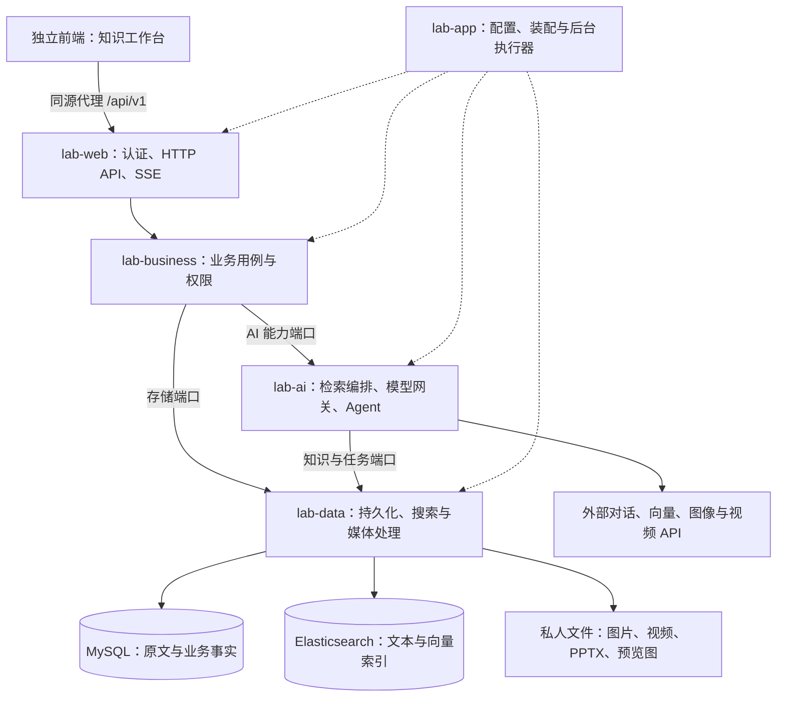

# 项目说明与使用介绍

## 学习自测与资料整编（2026-10-09）

新增两个独立入口：**学习自测**从授权文档提取知识点，生成单选／简答题、参考答案、解析及来源；**资料整编**将多份资料按主题去重、归类、融合为带目录和引用的统一文档，保留相互补充及冲突的观点。新入口分别使用 `QUIZ_GENERATION`、`KNOWLEDGE_COMPILATION`，原 FAQ／研究报告及历史任务继续保留原行为。

服务端按工作流固定分配执行架构：PPT 使用 ReAct，这两个新入口使用固定 Graph/Workflow + Skill。程序依次执行“准备 → 分批提取 → 组织 → 生成 → 质检 → 发布”，不调用 Planner。最多进行一次局部语义修复；已完成的提取批次和章节可在任务恢复时复用。

首版每次选择 1～6 份已完成入库的文档，完整读取本次选中文档，原文合计不超过 24,000 UTF-8 字节且最多 12 批。超限拒绝执行，不把部分阅读标为完成；原文完整读取不代表所有知识点都已提取或通过人工教学质量验收。模型上下文和输出额度仍需容纳实际输入与结果，超过模型容量时失败，不静默截断。

产物为私人 Markdown 下载及结构化 JSON；自测答案和解析集中放在题目之后。不包含在线作答、自动评分、错题本、Word／PDF 导出，也不自动改写知识库原文。独立前端项目本轮未修改，新功能先通过后端 API 使用，参数和结果见 [接口说明](前端接口与联调说明.md)。

更新日期：2026-10-09

Novid 是一个多用户个人知识库与 AI 助手项目。用户可以上传资料、围绕资料进行带引用的问答、保存生成笔记、生成学习自测题和统一整理文档，也可以通过预览和审批流程制作笔记 PPT 或教学视频。原常见问题集与研究报告保持兼容。

本文面向第一次接触项目的使用者和开发者，介绍项目做什么、系统如何组成、数据如何流转，以及如何启动和使用。详细接口、运维参数和测试结果分别在文末的专题文档中维护。

## 1. 项目概览

项目围绕“资料 → 理解 → 整理 → 成果”组织功能：

- **资料管理**：按知识库管理个人文本和 Markdown，保留原文、版本、章节和处理状态。
- **知识问答**：从授权资料中检索证据，结合会话上下文生成回答，提供引用和原文定位。
- **学习与整理**：从文档生成带答案、解析和来源的自测题，将多份资料归类融合为统一文档；兼容原 FAQ／研究报告，区分读取覆盖与生成质量。
- **媒体制作**：将笔记转为可编辑 PPTX 或分镜视频，生成前查看内容和费用，生成后检查成品。
- **运行管理**：查看本人运行过程、模型调用和费用；管理员管理账户、查看访问审计与汇总指标。

本仓库主要承载 Java 后端、命令行演示和配套文档。完整产品前端是独立的 `Novid-frontend` 工程，本机位于 `D:/AICodeProject/Novid-frontend`。后端另附轻量运行检查页 `/run-inspector.html`。

知识问答采用 **RAG（检索增强生成）**：先查自己的资料，再让模型根据证据回答。**Agent 编排**用于把研究、分析、写作或媒体制作拆为有明确输入、输出和预算的步骤。

## 2. 项目架构

### 2.1 整体组成

后端采用 **Maven 多模块的单应用架构**。正式 HTTP 接口和后台执行器由 `lab-app` 统一启动，各模块通过契约与端口协作。下图表示运行时协作关系；编译依赖通过 `lab-contract` 中的接口隔离。



三个主要存储各有职责：

| 存储 | 保存内容 | 在系统中的作用 |
|---|---|---|
| MySQL | 账户、权限、原文与版本、章节与切片、入库向量与批次、会话、任务、审批、来源、费用和产物登记 | 业务事实和最终授权的依据 |
| Elasticsearch | 用于检索的小片文本、向量及过滤字段 | 提供关键词和语义召回，检索结果仍须回到 MySQL 复核 |
| 私人文件目录 | 图片、原始镜头、视频、SRT 字幕、PPTX 和页面检查 PNG | 保存媒体文件，通过已登记产物的认证接口下载 |

### 2.2 后端模块职责

| 模块 | 核心职责 |
|---|---|
| `lab-contract` | 纯 Java 的数据契约、身份上下文、知识范围和业务端口，不依赖 Spring、ORM 或模型 SDK |
| `lab-business` | 账户、知识资料、会话、审批、任务、媒体、费用与治理用例，统一执行权限规则 |
| `lab-data` | MyBatis Mapper、数据库事务与迁移、ES 访问、候选缓存、文件存取、PPTX 导出和视频后期 |
| `lab-ai` | AI 业务入口、文档解析与入库、RAG、会话窗口、模型路由、只读工具、任务与媒体编排、结果校验 |
| `lab-web` | Bearer 认证、请求校验、控制器、错误响应、SSE 和认证下载 |
| `lab-app` | 正式启动入口 `LabApplication`、环境加载、组件装配、日志、追踪和维护入口 |
| `lab-demo` | 使用固定输入和 Mock 模型的命令行演示，无需数据库 |

`lab-business` 通过端口使用能力，不直接依赖 `lab-ai` 或 `lab-data` 的实现。SQL、持久对象与 ES 客户端集中在数据模块；LangChain4j SDK 集中在 AI 模块。ArchUnit 测试检查这些依赖边界。普通模块输出库 JAR，`lab-app` 和 `lab-demo` 输出可执行 JAR。

### 2.3 代码与配置入口

| 位置 | 阅读用途 |
|---|---|
| 根目录 `pom.xml` | 模块组成、Java 版本和公共依赖版本 |
| `lab-app/src/main/resources/application.yml` | 数据源、模型、检索、任务、媒体、费用和运行参数 |
| `.env.example` | 本地连接、模型凭证和常用开关的填写模板 |
| `lab-web/src/main/java/com/example/ailab/web/controller` | HTTP 接口入口 |
| `lab-ai/src/main/java/com/example/ailab/ai` | 模型网关、RAG、会话与 Agent 编排实现 |
| `lab-data/src/main/resources/db/migration` | Flyway 数据库迁移 |
| `scripts` | 启动、索引初始化、维护与专项验证脚本 |
| `docs` | 使用、联调、部署、测试和开发文档 |

## 3. 技术栈

下表描述仓库当前采用的技术，版本以构建配置为准。

| 领域 | 技术 | 用途 |
|---|---|---|
| 后端语言与构建 | Java 17、Maven 多模块、Maven Wrapper | 编译、依赖管理与打包 |
| 应用框架 | Spring Boot 3.5.16、Spring MVC | 应用装配、REST API 和后台组件 |
| 认证与校验 | Spring Security、BCrypt、Jakarta Validation | 登录令牌、密码哈希和请求校验 |
| 模型接入 | LangChain4j 1.20.2、OpenAI 兼容对话协议、向量模型适配 | 对话、结构化输出、工具调用与 Embedding |
| 数据存储 | MySQL 8.4、MyBatis-Plus 3.5.17、MyBatis Mapper、Flyway | 持久化、显式 SQL、短事务和结构升级 |
| 搜索与缓存 | Elasticsearch 8.15、Java/REST 客户端 8.15.5、Caffeine | BM25、向量 kNN、检索候选短时缓存 |
| 文档解析 | CommonMark 0.24.0 | Markdown 语法树、章节与结构化切片 |
| PPT 制作 | Apache POI 5.5.1、Java 字体与图形能力 | 可编辑 PPTX、讲者备注、来源页与检查 PNG |
| 视频后期 | JavaCV 1.5.14、FFmpeg 原生库 | 音视频流检测、时长测量、镜头拼接与可选字幕烧录 |
| 接口与诊断 | springdoc/OpenAPI、SSE、Actuator、Log4j 2、Micrometer、可选 OTLP 导出 | 接口描述、进度推送、健康检查、日志和运行追踪 |
| 后端验证 | JUnit 5、Spring Boot Test、ArchUnit、Testcontainers | 业务、HTTP、架构边界和存储集成验证 |
| 独立前端 | Vue 3、TypeScript、Vite、Pinia、Vue Router、Element Plus | 页面、状态、路由与交互 |
| 前端内容与验证 | Markdown-it、DOMPurify、Zod、Vitest、Playwright | Markdown 展示、内容净化、数据校验和自动验证 |

Compose 提供本地 MySQL 与 ES 服务。外部模型、图像和视频服务需要自行配置；前端只访问后端，数据库与模型密钥保留在服务端。

## 4. 功能介绍

### 4.1 账户、角色与资料范围

管理员负责创建普通账户、启停账户和调整角色。普通用户首次使用临时密码登录后需要先修改密码，再重新登录。后端采用 Bearer Token，数据库保存令牌哈希；退出、改密、禁用或角色变化会撤销相关登录。

知识访问有三种范围：`SELF`（本人）、`SELECTED`（指定知识库）、`ALL`（管理员显式跨库读取）。默认是本人范围。普通用户只能选择本人合法知识库；管理员跨库权限用于读取有效知识资料，修改仍限资料所有者。

会话、个人偏好、审批、任务、产物和运行详情均按本人隔离。管理员可查看审计与聚合指标，不能借角色读取他人的私人会话或成果。

### 4.2 知识库与文档

用户可以创建、编辑、启停或删除本人知识库，上传、修订或删除文档，查看原文、章节、切片及入库进度。

当前支持 **UTF-8 TXT、MD 和 Markdown**，不直接解析 PDF、Word 或扫描图片。单文件上限 10 MB，正文不超过 100 万 Unicode 码点，处理结果最多 5000 个小片。原文及历史内容版本保存在 MySQL；内容版本和技术处理代次分别记录，便于判断“内容改了”还是“使用新配置重新索引”。

上传成功只表示文档已接收。后台完成解析、向量化、索引与校验并激活代次后，资料才能用于检索。最新处理状态可通过入库详情查看。

### 4.3 引用问答与多轮会话

问答支持单轮 JSON 响应和 SSE 交互，也可以绑定私人会话连续提问。会话保存完整历史，模型使用最近完整轮次与有界摘要；较长历史不会全部进入每次请求。

回答附带证据引用，可追溯到文档版本、命中片段和原文位置。引用来源失效后，相关历史会受限，模型不能继续使用已撤销的内容。统计类请求使用程序查询结果，资料不足时返回需要补充输入的状态。

调用者可以选择服务端开放的模型逻辑选项，使用结构化回答，或显式开启只读工具续轮。工具支持授权知识检索、原文读取和统计；工具次数、时间及模型轮次均有上限。

### 4.4 AI 笔记与个人偏好

AI 笔记采用“准备 → 查看预览 → 本人批准 → 保存”的流程。预览绑定目标知识库、完整正文和来源；批准时再次核对权限、版本和有效期，并在同一数据库事务中保存笔记及来源关系。

用户可以主动创建、更正或删除个人偏好，例如回答语言或表达习惯。资料内容和模型推断不会自动转成长期偏好。偏好变更会重置相关会话派生窗口。

### 4.5 FAQ 与研究报告

用户选择主题和 1～6 篇合法文档，创建 `FAQ` 或 `RESEARCH_REPORT` 后台任务。任务返回排队状态和查询入口，可查看步骤、心跳、执行耗时并暂停、恢复或取消。

报告由研究、分析和写作角色协作完成。默认使用固定工作流；研究报告可以显式选择 `PLANNED`，由模型提出受限依赖计划，再由程序校验和执行。

长文研究按章节分页读取，保存已读页的摘要与覆盖事实。受预算限制时，报告标记部分覆盖并列出未读范围。任务完成后使用产物 ID 下载报告。

### 4.6 笔记 PPT 与教学视频

两类媒体任务均使用 `PLANNED` 策略，有计划、内容预览、费用审批、素材执行和本人验收环节。接口与执行链路已实现，完整真实素材、Planner 全链路及成品质量仍有待验证项；实际可用能力取决于部署配置与已核验的提供方能力。

| 功能 | 处理过程 | 输出与检查 |
|---|---|---|
| 笔记 PPT（`NOTES_PPT`） | 根据笔记规划内容、布局和配图，批准后获取素材并本地导出 | 中文正文和讲者备注可编辑的 PPTX、来源页、逐页 PNG；总页数 2～12，含来源页，最多 8 张图 |
| 教学视频（`NOTES_VIDEO`） | 选择登记人物、声音和场景，规划脚本与分镜，整片使用同一登记视频 API 及版本生成镜头 | 视频、独立 SRT 字幕、镜头与音轨时长事实；最多 6 个镜头，字幕烧录可选 |

概念配图可以使用生成图；事实人物、事件或设备图片需要可靠出处核验，缺图时明确停止。视频声音由生成 API 原生输出：`NATIVE` 表示有声，`NONE` 表示无声；有台词时必须使用有声模式。JavaCV 检测实际音轨与时长，并进行拼接和字幕处理。

技术检查通过后进入 `WAITING_MEDIA_REVIEW`，本人可以下载候选并实际检查。接受后任务成功，拒绝后暂停。技术通过不能替代中文排版、画面、声音和教学内容的人工检查，也不承诺跨镜头人物完全一致、逐字字幕或口型同步。

### 4.7 运行、费用与管理诊断

本人运行检查可查看检索、工具、模型尝试、汇聚和任务步骤组成的运行图。费用按运行、任务和入库代次分别查询，模型请求发送前预留额度，响应后登记提供方用量和可计算金额。

没有核验价格、响应未知或历史缺账时显示 `UNKNOWN`，已知部分为 0 不代表整次调用免费。暂停、取消或网络断线也不表示外部生成已取消或退款。

管理员可查询跨库访问审计和无内容的汇总指标。日志支持通过请求 ID、运行 ID、任务 ID 或入库 ID 关联排查。

## 5. 数据链路与实现机制

### 5.1 文档入库：从上传到可检索

```text
上传文件 → 认证与格式检查 → MySQL 保存原文、版本、入库意图和 Outbox
        → 后台领取入库任务 → 解析章节与结构块 → 生成父段和小片
        → 分批调用向量模型 → MySQL 保存向量与批次事实
        → 写入 Elasticsearch → 核验完整性与搜索可见性 → 激活处理代次
```

Markdown 使用 CommonMark AST 识别标题、正文、代码和表格。小片用于召回，父段提供完整上下文；标题路径、原文 offset、行号和来源映射用于定位引用。表格分组时可以重复真实表头，并保留其原始来源位置。原文 offset 使用 Java UTF-16 索引。

向量批次和成功结果先持久保存，再写 ES。ES 部分写入或响应丢失后，恢复时核对已有索引并补缺失项，复用已保存向量。只有固定版本与处理代次的全部结果核验通过，才能激活。

### 5.2 知识问答：从问题到可追溯答案

```text
问题、会话和知识范围 → 当前身份与范围授权 → 问题向量化
                  → ES 的 BM25 与 kNN 双路召回 → RRF 排名融合
                  → MySQL 复核权限、内容版本、激活代次与来源
                  → 扩展父段或邻片 → 组装证据、合法历史和偏好
                  → 模型回答／有界只读工具续轮 → 引用与来源再校验
                  → 返回答案、引用和运行信息，提交会话历史
```

BM25 负责关键词匹配，kNN 负责语义相近内容，RRF 按两路排名融合结果。默认每路最多召回 20 个候选，最终最多 6 个证据包，证据总量不超过 4000 个保守词元。当前词元额度使用 UTF-8 字节上界估算，供应商返回的真实用量单独记录。

ES 在召回前过滤资料范围，MySQL 在生成前和交付前复核当前事实。Caffeine 只短时缓存候选及版本信息，正文与答案仍实时授权。资料删除、版本变化或权限撤销后，缓存不能继续交付失效内容。

SSE 先发送处理进度和心跳；完整回答通过汇聚及来源检查后，才发送正文、引用和完成事件。因此页面会先显示处理中，再展示经过校验的答案。

### 5.3 后台报告：从任务到成果

```text
创建任务 → MySQL 队列登记 → Worker 领取租约 → 固定或校验后的计划
        → 研究／分析角色独立执行 → 持久保存成功页与步骤检查点
        → 写作角色汇总 → 来源与覆盖检查 → 登记产物 → 本人认证下载
```

研究与分析在依赖允许时最多两个角色并行，各自使用独立上下文。研究按页保存已读范围，写作阶段汇总已有证据与覆盖说明。

队列以 MySQL 持久保存，执行权通过租约、续租和 fencing（执行代次校验）控制，过期执行者不能提交结果。恢复沿用成功检查点和累计预算，不因重启或恢复清零。默认报告预算为累计 20 分钟、6 轮和 10 次模型尝试。

### 5.4 媒体生成：从预览到本人验收

```text
笔记与主题 → 受限计划 → 脚本／页面／分镜预览 → 本人审批当前版本与费用
          → 保存批准、费用预留和操作意图 → 调用图像／视频能力
          → 保存素材、提供方任务 ID 与执行事实
          → PPTX 导出或视频检测／拼接／字幕 → 登记私人候选
          → 本人检查接受或拒绝 → 发布成果或暂停
```

预览修改后形成新版本，相关旧批准失效。成功且输入未变的素材可以复用；已提交的视频保存 `providerJobId`，恢复时继续查询原任务。提交结果未知且没有任务 ID 时停止自动重新购买，保留待核对状态。

数据库保存业务意图与登记事实，文件目录保存媒体二进制，两者通过版本、输入摘要和文件校验和关联。只有经过检查并登记的产物才能通过认证接口读取。

### 5.5 贯穿链路的技术约束

| 机制 | 解决的问题 |
|---|---|
| 身份上下文、资料范围、权限版本和来源依赖 | 防止越权访问，以及撤销后的旧结果继续交付 |
| `Idempotency-Key` 与请求去重 | 同一次上传或任务创建重试时复用既有事实 |
| MySQL 短事务与 Outbox | 原文、版本和后续处理意图一致落库，远程调用放在事务外 |
| 内容版本、处理代次、租约与检查点 | 避免旧执行覆盖新内容，支持受限恢复 |
| 模型注册与逻辑 profile | 统一选择能力、上下文、凭证及主备目标 |
| 结构化输出校验、结果汇聚和工具边界 | 检查模型结果格式、引用和执行范围 |
| 持久预算与费用预留 | 防止重试、恢复或未知结果绕过次数、期限及费用上限 |

对话、摘要、报告、规划和向量调用统一经过 `ModelGateway`。程序控制主备切换、超时与尝试次数，关闭 SDK 自动重试；真实模式失败不会静默切成 Mock。

## 6. 部署与启动

### 6.1 准备环境

后端需要 Java 17、Maven 3.9.x 或项目自带 Wrapper、MySQL 8.4；引用问答与文档索引还需要 Elasticsearch 8.15、可用的对话模型和向量模型。媒体功能另需已配置的图像／视频服务、价格及能力映射、中文字体和匹配平台的原生媒体库。

以下命令在后端项目根目录执行。首次配置时复制环境模板，并填写本项目专用的连接与凭证：

```powershell
Copy-Item .env.example .env
```

已有 `.env` 时直接编辑原文件。值按模板注释填写，不加引号或行内注释；不要将凭证提交到仓库。

| 配置组 | 关键配置 |
|---|---|
| 数据库 | `DB_URL`、`DB_USERNAME`、`DB_PASSWORD` |
| 本地容器 | `MYSQL_ROOT_PASSWORD`、`MYSQL_PASSWORD` |
| 首次管理员 | `BOOTSTRAP_ENABLED`、`BOOTSTRAP_USERNAME`、`BOOTSTRAP_PASSWORD` |
| 搜索与入库 | `SEARCH_ENABLED`、`INGESTION_WORKER_ENABLED`、`ES_URL`、`ES_INDEX` |
| 对话模型 | `MODEL_MODE`、`MODEL_EXTERNAL_DATA_ALLOWED`、`MODEL_BASE_URL`、`MODEL_PRIMARY_NAME`、`MODEL_API_KEY` |
| 备用模型 | `MODEL_BACKUP_ENABLED`、`MODEL_BACKUP_BASE_URL`、`MODEL_BACKUP_NAME`、`MODEL_BACKUP_API_KEY` |
| 向量模型 | `EMBEDDING_ENABLED`、`EMBEDDING_MODEL_NAME`、`EMBEDDING_DIMENSIONS`，可另配向量地址与凭证 |
| 任务与日志 | `TASK_WORKER_ENABLED`、`PORT`、`LOG_PATH` |

媒体开关、执行器、提供方协议、价格和字体等高级配置在 `application.yml` 的 `lab.media` 下维护，完整配置方式见[部署配置与运行维护](部署配置与运行维护.md)。

模板默认使用 Mock。要处理真实资料，应设置 `MODEL_MODE=real`、`MODEL_EXTERNAL_DATA_ALLOWED=true` 并填写真实服务。向量模型名称、维度和 ES 索引配置必须一致；更换向量模型时使用新索引。模型基础地址不附加 `/chat/completions` 或 `/embeddings`。只有一个对话目标时关闭备用模型。

### 6.2 构建与启动后端

1. **准备存储。** 可以连接已有的项目专用服务，或填写容器密码后启动本地依赖：

   ```powershell
   docker compose up -d
   ```

2. **构建。** 编译、验证并生成可执行包：

   ```powershell
   .\mvnw.cmd verify
   ```

   使用已安装 Maven 时可运行 `mvn verify`。

3. **首次初始化管理员。** 仅在系统还没有用户时设置 `BOOTSTRAP_ENABLED=true`，填写管理员名称和强密码，然后启动：

   ```powershell
   powershell -File scripts/start-api.ps1
   ```

   默认 API 地址为 `http://localhost:8080/api/v1`，健康检查为 `http://localhost:8080/actuator/health`。首次初始化成功后将 `BOOTSTRAP_ENABLED=false`；后续启动不重复创建管理员。

4. **初始化检索索引。** 核对 ES 地址、索引、向量模型和维度后执行：

   ```powershell
   powershell -File scripts/init-index.ps1
   ```

   该入口保留已有索引，并关闭维护进程的后台扫描及管理员初始化。随后设置 `SEARCH_ENABLED=true`、`INGESTION_WORKER_ENABLED=true`，重启 API；需要报告时开启 `TASK_WORKER_ENABLED=true`。

`LabApplication` 自动读取工作目录下的 `.env`。IDEA 启动时将工作目录设为项目根目录；也可直接执行 `java -jar lab-app/target/lab-app-0.1.0-SNAPSHOT.jar`。显式环境变量、JVM 参数和启动参数优先于 `.env`，修改配置后重启生效。Flyway 在启动时升级数据库结构，已执行的迁移文件应保持原样。

### 6.3 启动独立前端

在 `Novid-frontend` 工程目录中，准备 Node.js 24（至少 24.12.0，小于 25）和 pnpm 11.19.0，然后执行：

```powershell
pnpm install --frozen-lockfile
pnpm dev
```

开发页面默认是 `http://127.0.0.1:5173`，通过同源代理访问 `http://localhost:8080`。后端地址变化时在前端环境配置中设置 `API_PROXY_TARGET`。登录账户由后端管理员提供。

### 6.4 只体验命令行演示

完成构建后，可运行无需数据库的 Mock 演示：

```powershell
java -jar lab-demo/target/lab-demo-0.1.0-SNAPSHOT.jar
```

演示使用固定输入，展示解析和模型主备处理，不会调用付费模型。演示成功只说明模拟链路运行正常。

## 7. 日常使用

### 7.1 从资料到问答

1. 使用管理员提供的账户登录；首次登录按提示修改临时密码，再重新登录。
2. 创建本人知识库，上传 UTF-8 TXT 或 Markdown 文件。
3. 查看文档处理状态，等待 `READY`。上传返回 `202` 表示已接收，尚未完成索引。
4. 在问答页选择知识范围，提出与资料有关的问题。需要连续追问时创建或选择本人会话。
5. 查看答案引用，打开原文核对。没有证据时，调整问题、选择正确范围或等待索引完成。
6. 需要保存笔记时，选择本人目标知识库，检查完整预览并明确批准。准备成功不等于已保存。

例如：上传一份 Markdown 学习笔记，等待入库完成后询问“这份笔记的三个核心概念是什么？请给出引用”，再在同一会话追问“第二个概念适合怎样讲给初学者？”；最后将整理结果预览并保存为新笔记。

### 7.2 生成 FAQ 或研究报告

1. 选择主题、任务类型、资料范围和 1～6 篇文档。
2. 提交一次任务，记录返回的任务 ID，按响应建议间隔查询；默认建议每 2 秒查询一次。
3. 查看实际步骤、心跳与覆盖信息。暂停、恢复或取消使用明确的任务操作，关闭页面不会取消后台任务。
4. 成功后使用返回的 **产物 ID** 下载；任务 ID 用于查进度。部分覆盖报告应同时阅读未覆盖说明。

### 7.3 制作 PPT 或视频

1. 选择合法笔记及主题，设置 PPT 页数／配图或视频人物／声音／场景／镜头规格和费用上限。
2. 等待预览，检查内容、引用、布局或脚本分镜。修改后核对新的预览版本。
3. 确认当前价格与费用范围，再批准生成；能力或价格尚未核验时按提示停止。
4. 查看素材和处理进度。遇到未知提交或待核对状态，先核对原操作，不反复创建或重新购买。
5. 进入本人检查状态后，下载 PPTX／页面预览或播放视频。实际检查排版、图片、备注、台词、声音及教学内容，再接受或拒绝。

### 7.4 API 调用者须知

接口统一以 `/api/v1` 为前缀，登录后使用 `Authorization: Bearer <token>`。常用入口如下：

| 目的 | 接口 |
|---|---|
| 登录与查询本人 | `POST /auth/login`、`GET /auth/me` |
| 知识库管理与文档上传 | `/knowledge-bases`、`POST /documents` |
| 入库进度与处理操作 | `GET /documents/{id}/ingestion`、`POST /documents/{id}/index-actions` |
| 单轮或 SSE 问答 | `POST /chat`、`POST /chat/stream` |
| 会话与历史 | `/sessions`、`GET /sessions/{id}/messages` |
| 笔记预览与批准 | `POST /notes/prepare`、`GET /approvals/{id}`、`POST /approvals/{id}/decision` |
| 任务与产物 | `POST /tasks`、`GET /tasks/{id}`、`POST /tasks/{id}/actions`、`GET /artifacts/{id}` |
| 媒体预览与检查 | `GET /tasks/{id}/preview`、`GET /tasks/{id}/presentation-check`、`POST /tasks/{id}/media-review` |
| 运行与费用 | `GET /runs/{id}/graph`、`GET /runs/{id}/fees`、`GET /tasks/{id}/fees`、`GET /ingestions/{id}/fees` |

上传使用 multipart 的 `file` 和 `knowledgeBaseId`；上传与创建任务必须携带 `Idempotency-Key`。绑定会话时同时提交 `sessionId` 和 `sessionVersion`，版本冲突后先读取最新事实。私人文件也通过 Bearer 认证下载，令牌不放在 URL 中。完整请求字段与响应示例见[前端接口与联调说明](前端接口与联调说明.md)。

## 8. 常见情况与使用限制

| 情况 | 含义与处理方式 |
|---|---|
| 上传后一直是 `RECEIVED` | 检查搜索、向量模型、索引初始化与入库执行器是否就绪 |
| 返回 `SEARCH_UNAVAILABLE` | 搜索未启用或当前不可用；资料管理成功不代表 RAG 已可用 |
| 回答为 `NEEDS_INPUT` | 当前范围缺少足够证据或需要澄清，补充资料或调整问题 |
| 会话历史显示 `RESTRICTED` | 来源、版本或权限已变化，旧正文不再可读 |
| 任务排队但未开始 | 查看执行器开关、租约与进度提示 |
| 报告显示 `PARTIAL` | 在预算内只完成部分阅读，按覆盖说明判断适用范围 |
| 媒体处于 `WAITING_MEDIA_REVIEW` | 候选已可检查，仍等待本人验收 |
| 操作处于 `NEEDS_RECONCILIATION` 或费用为 `UNKNOWN` | 外部执行或金额尚未确认，保留原事实与预留，先核对再操作 |
| 下载被拒绝 | 检查登录、本人所有权、产物状态和来源是否仍可读 |
| 需要定位问题 | 保存响应头 `X-Request-Id` 及相关任务／入库编号，查询日志和运行图 |

媒体真实成品质量、事实图片核验、主备模型质量、真实价格与最终账单核对、完整备份恢复和性能仍有待验证项。本文描述实现方式和操作入口，具体环境的验证结论以[测试验证与验收报告](temp/测试验证与验收报告.md)为准。

日志目录由 `LOG_PATH` 控制；使用环境模板时为 `./var/logs`，未设置时当前应用配置默认 `./logs`。退出或切换账户后应清理前端私人缓存；长期保存的引用和成果也可能因来源或权限变化而失效。

## 9. 延伸阅读

| 文档 | 适合查阅的内容 |
|---|---|
| [项目架构文档](../AI模型应用开发学习验证项目架构.md) | 详细设计、模块边界与技术方案 |
| [前端接口与联调说明](前端接口与联调说明.md) | 请求、响应、权限、轮询、推送和下载协议 |
| [部署配置与运行维护](部署配置与运行维护.md) | 完整环境参数、模型接入、索引维护、恢复和保留策略 |
| [日志记录与问题排查](日志记录与问题排查.md) | 日志配置、保留规则与问题定位 |
| [测试验证与验收报告](temp/测试验证与验收报告.md) | 实际验证结果与未覆盖项 |
| [项目开发进展](temp/项目开发进展.md) | 开发计划、当前工作与交接记录 |
| [缺陷修复与变更记录](temp/缺陷修复与变更记录.md) | 已知问题、修复及变更依据 |
